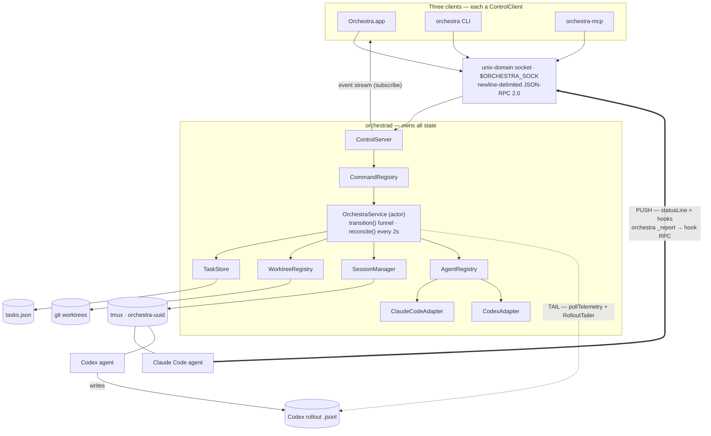

# Orchestra

A local-only, single-user **native macOS app that orchestrates many coding agents across repos from
one Kanban board.** You spawn an agent onto a card, it runs autonomously in its own git worktree and
tmux session, reports its live state back to the board, and you move it Plan → Implementation → Review
→ Done as the work progresses.


The real work lives in a background daemon — **`orchestrad`**, a launchd LaunchAgent — that owns the
tasks, git worktrees, and tmux agent sessions and keeps running whether or not the app window is open.
Three thin clients drive it over one local unix-socket / JSON-RPC control plane: the **SwiftUI app**,
the **`orchestra` CLI**, and an **MCP bridge** (so other agents can orchestrate Orchestra too).

> **New here?** Read the [**Reference Manual**](docs/index.md) — a chapter-by-chapter book covering
> every feature, the architecture, the full command surface, the design decisions, and the roadmap.

---

## Talk to the board in plain English

An agent can drive Orchestra with exactly the commands you have — through the MCP bridge or the CLI,
which are the same `CommandRegistry` behind different doors. So you don't have to fan work out
yourself: you can **ask an agent to do it**, in plain English, and watch the board fill itself in.


<sub>A real run, sped up ~4×. Captured from a live board by <code>scripts/docs-shots.sh</code> — the cards, worktrees, context-%, and diffstats are genuine agent telemetry, not a mock-up.</sub>

Above: one orchestrator card is told *"split the rate-limiting work into three PRs and fan them out."*
It calls the ordinary `spawn` command three times — three children appear on the board, each cut into
its own git worktree, each reporting its own live context-% and diffstat — then `wait`s on them and
wakes as each one concludes. Nothing about that card is special: it is a normal agent session holding
the same commands you have. The machinery underneath is
[one delivery seam](docs/04-cards-worktrees-sessions.md#the-orchestration-seam-handoff--fork--fan-out--send--wait),
which `handoff`, `fork`, `fan-out`, `send`, and `wait` all compose from.

## …or never touch the mouse

The board is completely keyboard-driven, built around a *focus-is-the-mode* model so it never
intercepts keys meant for the live agent terminal:


`hjkl` moves the selection and `⌃hjkl` moves focus between panes; `f` throws link-hints over every card;
`/` searches, `:` opens a command palette that can run any action, and `?` shows the keymap.

## What it does

- **One board, many agents.** Each card is one autonomous agent session — pick its backend at spawn
  (**Claude Code** or **Codex**). Spawn it with a prompt; it works on its own; you watch and steer from
  the inspector's embedded terminal.
- **Isolation by default.** Every worktree card gets a dedicated git worktree (`repo` + `branch` →
  `~/.orchestra/worktrees/<repo>/<branch>`), so parallel agents never collide on the working tree.
- **Four card modes.** **Worktree** (isolated git branch), **Borrowed/Freeform** (run in any existing
  directory you point at), **Scratch** (a fresh throwaway dir Orchestra makes and deletes), and a
  **Read-only** access mode that lets an agent read/search/`git` but physically cannot write.
- **Live state, never screen-scraped.** Cards show context-window %, current activity, model, and
  status — sourced per agent through a normalized telemetry seam: Claude Code **pushes** via a hooks
  channel, while Codex is **tailed** from its rollout JSONL by the daemon. Never screen-scraped.
- **See the diff on the board.** Each git card shows a live `+N −M / k files` diffstat in its footer,
  and the inspector has a read-only **Diff** view (difftastic-rendered when `difft` is installed, git's
  colored diff otherwise; a working / branch baseline toggle) — so you can review an agent's changes
  without leaving Orchestra for Zed.
- **Crash & reboot recovery.** The daemon tracks each agent's native session id and eagerly resumes
  sessions after a crash or reboot; unrecoverable cards surface a Recovery panel. Even a finished card
  isn't terminal — **Reopen** a Done card and the daemon recreates its worktree and resumes the agent.
- **Agents orchestrate agents.** A card can **hand off** to a clean-context resume, **fork** a slice into
  a new card, **fan out** across many, or **send** into another card's durable inbox — and an orchestrator
  card can `wait` on its children and wake as each concludes. All four compose from one live-delivery seam
  (F1 resume · F2 wake · F3 inbox), driven from the CLI or MCP (the app surfaces the inbox as an editor —
  list/reorder/edit/append/remove — while handoff/fork/fan-out are agent/CLI moves). A card can also
  **re-seat itself onto a different model in place** — `handoff <ref> "<summary>" --model <id>` keeps the
  card, worktree, and context and comes back on the stronger model, so an agent that finds its task too
  hard escalates itself instead of spawning a successor
  ([the `--model` re-seat](docs/05-command-reference.md#the---model-re-seat)).
- **Agents know their phase.** At session start each agent is handed a one-line orientation — its board
  column (Plan/Implementation/Review), whether it's read-only, and its own card id — read live from the
  board and delivered over the same hook channel for both Claude and Codex. It starts on that footing
  without being told and is nudged to move itself as the work changes phase, so the column stays honest.
- **Three control surfaces, one state.** Anything you can do in the app you can do from the `orchestra`
  CLI or an MCP tool, because all three speak to the same `CommandRegistry`.
- **Local or a remote Linux box.** Run the board against this Mac, or point it at a remote Linux
  `orchestrad` over an app-managed SSH tunnel — the work box does the work (agents, worktrees, tmux) while
  the Mac just renders. The wire protocol is unchanged (the daemon grows no network listener; reachability
  is pure SSH forwarding), the client auto-reconnects across tunnel blips, and a Connections settings pane
  picks the active daemon. The daemon, CLI, and MCP bridge cross-compile to a static Linux binary.
- **Fully keyboard-driven.** The board is completely navigable by keyboard with a vim-flavored scheme —
  bare `hjkl` moves the selection, `⌃hjkl` moves focus spatially between panes, `g`+letter jumps to a
  region, single-key verbs act on the selected card, `/` searches, `f` link-hints jump to any card, a `:`
  command palette runs any action, `?` shows help, and `⌘N`/`⌘T`/`⌘W` are the standard accelerators — built
  around a *focus-is-the-mode* model so it never intercepts keys meant for the live agent terminal.


Selecting a card opens the inspector: the agent's live terminal (a real tmux attach, not a scrape), its
telemetry, and a read-only **Diff** view of everything it has changed — so you can review an agent's
work without leaving the board.

## Architecture at a glance



The app, the CLI, and the MCP bridge are all `ControlClient`s speaking the same JSON-RPC over the
same user-only socket, so what the three can do can never drift — the CLI's verbs and the MCP tool
list are generated from one `CommandRegistry`. The agents report back by *different* mechanisms, and
that asymmetry is deliberate: Claude Code **pushes** (its statusLine and hooks shell out to
`orchestra _report`, which sends one typed `hook` RPC back over the same socket), while Codex is
**tailed** (it pushes nothing; the daemon polls its rollout JSONL). Both land as the same normalized
telemetry, so nothing downstream branches on the agent. Terminals never cross this plane — SwiftTerm
attaches to tmux directly.

- **`OrchestraCore`** — the shared library: all business logic (`OrchestraService`, `TaskStore`,
  `WorktreeManager`, `SessionManager`, `AgentRegistry`/`ClaudeCodeAdapter` + `CodexAdapter`, `PathResolver`,
  `CommandRegistry`, the control server/client). Fully unit-tested.
- **`orchestrad`** — the background daemon (launchd LaunchAgent). Owns all state; recovers sessions.
- **`orchestra`** — the CLI client (also hosts the hidden `_report` status-channel helper).
- **`orchestra-mcp`** — the MCP stdio bridge (official `modelcontextprotocol/swift-sdk`; one tool per
  command, generated from the same `CommandRegistry`).
- **`App/`** — the SwiftUI app (built separately; needs SwiftTerm + an app bundle).

See [Architecture](docs/02-architecture.md) for the full data-flow walkthrough.

## Quick start

```sh
scripts/build.sh        # swift build  (core + daemon + CLI + MCP)
scripts/test.sh         # swift test   (adds the swift-testing search paths for CLT)
scripts/build-app.sh    # build & install Orchestra.app  (needs full Xcode + SwiftTerm)
```

The core, daemon, and CLI are **dependency-free** — only `orchestra-mcp` pulls a dependency (the MCP
swift-sdk), so the **first** `swift build` needs network to resolve it; after `Package.resolved` is
populated, builds are offline again. See [Building & operations](docs/08-building-operations.md) for
the toolchain notes, dev scripts, macOS permissions, and troubleshooting.

A two-minute taste of the CLI:

```sh
orchestra spawn --prompt "Add rate limiting to the API" --repo ~/Documents/Projects/api --branch feat/ratelimit
orchestra list
orchestra send <ref> "use a token bucket, 100 req/min"
orchestra move <ref> --col review
orchestra archive <ref>
```

The full verb list lives in the [Command reference](docs/05-command-reference.md).

## Documentation

| Doc | What's in it |
|-----|--------------|
| [Reference Manual index](docs/index.md) | Table of contents for the whole book |
| [Concepts](docs/01-concepts.md) | Cards, columns, the lifecycle, the four card modes |
| [Architecture](docs/02-architecture.md) | Daemon, control plane, the three clients, the report channel |
| [Data model](docs/03-data-model.md) | `Task` schema, persistence, config, paths, errors, events |
| [Cards, worktrees & sessions](docs/04-cards-worktrees-sessions.md) | Worktree/tmux/adapter internals, the read-only barrier, recovery |
| [Command reference](docs/05-command-reference.md) | Every command (CLI = MCP = app), the RPC wire protocol |
| [CLI & MCP](docs/06-clients-cli-mcp.md) | Using the CLI and the MCP bridge; the hooks channel |
| [App UI](docs/07-app-ui.md) | Board, cards, spawn sheet, inspector, terminals, settings |
| [Building & operations](docs/08-building-operations.md) | Build/test/run, dev loop, macOS perms, troubleshooting |
| [Design decisions](docs/09-design-decisions.md) | The principles behind the system, and the shipped PR history |
| [Roadmap](docs/10-roadmap.md) | The nine extensibility axes and open design questions |
| [Doc automation](docs/11-doc-automation.md) | How this README + manual stay in sync with `main` |

The full layered design vault lives under [`notes/designs/`](notes/designs/) and the shipped-PR plans
under [`notes/plans/`](notes/plans/); the manual links into them throughout.

## Keeping the docs current

This README and the manual are **auto-maintained.** A git hook on `main` runs Claude Code headlessly
whenever you commit a new plan or code change and commits the refreshed docs as a separate
`docs: …` commit. Install it once with:

```sh
scripts/install-doc-hooks.sh
```

See [Doc automation](docs/11-doc-automation.md) for exactly what triggers it, the recursion guard, and
how to pause or uninstall it.

## Status

Backend (core + control plane + daemon + CLI + MCP) is the primary build target here and is fully
unit-tested. The SwiftUI app sources match the Orchestra UI prototype; building the `.app` bundle
requires Xcode + SwiftTerm. Current version: see [`Version.swift`](Sources/OrchestraCore/Version.swift).
