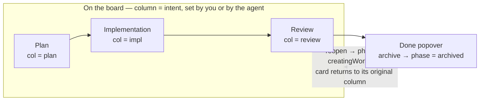
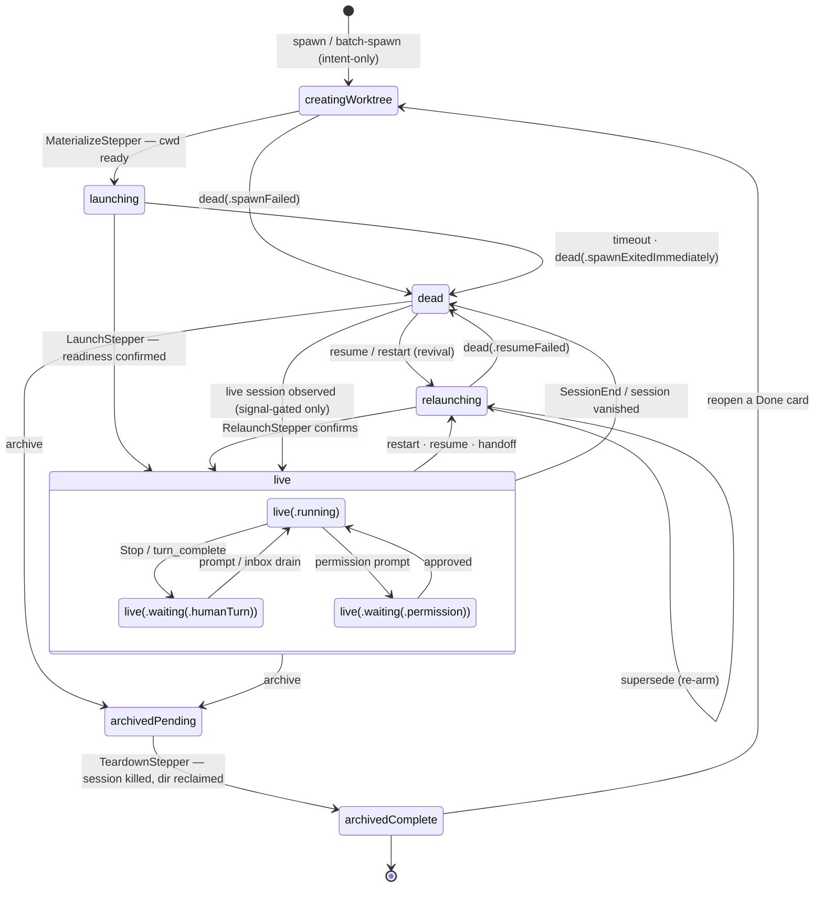

# 1. Concepts

This chapter defines the vocabulary the rest of the manual relies on: what Orchestra is, what a *card*
is, the columns and lifecycle a card moves through, and the four *modes* a card can run in.

## What Orchestra is

Orchestra is a **local-only, single-user, native macOS app for orchestrating many coding agents at
once.** Instead of babysitting one agent in one terminal, you run a *board* of them — each agent works
autonomously in its own isolated directory while you supervise from a Kanban view, stepping in only
when a card needs steering or review.

It is deliberately **local-only**: there is no server, no account, no network service. Everything runs
on your Mac. The only network access in the whole system is the first `swift build` resolving the MCP
SDK dependency; after that the core, daemon, and CLI are fully offline.

Three facts define the shape of the product:

- **The agent is the unit of work.** One card = one autonomous agent session.
- **The daemon is the source of truth.** A background process (`orchestrad`) owns the tasks, worktrees,
  and sessions and keeps running with the app closed. The app is just one of three windows onto it.
- **State is pushed, not polled.** The agent reports its own context-window usage, current activity,
  and status back to the board through a hook channel, so the board reflects reality in near real time.

The authoritative high-fidelity UI is the **Orchestra** prototype on Claude Design; the app's visual
language (light/linear, radial wallpaper, hairline borders, mono accents) matches it pixel-for-pixel.

## Cards

A **card** is a [`Task`](03-data-model.md) — an autonomous, persistent agent session occupying one row
of the board. Each card tracks a single agent's work and carries everything needed to display, drive,
resume, and clean up that work:

- a **title** (derived from the first prompt) and a live **description** (pushed by the agent),
- the **directory** the agent runs in (`cwd`) and how that directory came to be (`origin`),
- the **agent** and **model** running it,
- its **column** (board intent) and its **phase** (machine state — see below),
- and its session identity (`agentSessionId`, plus superseded ids) for resume and transcript search.

Each card maps to exactly one **tmux session** named `orchestra-<uuid>`, and (for worktree cards) to
exactly one **git worktree**. A card is referenced by a short id (the first 6 characters of its UUID),
its full UUID, or an `orchestra://task/<shortId>-<slug>` URI — any of which the CLI, MCP, and deep
links accept. See [Cards, worktrees & sessions](04-cards-worktrees-sessions.md) for the mapping.

## Columns and the lifecycle

The board has **three columns**, which are the lifecycle stages of a card:

| Column | Display name | Meaning |
|--------|--------------|---------|
| `plan` | Plan | Early/exploratory work — the agent is figuring out what to do. |
| `impl` | Implementation | Active work — the agent is building. |
| `review` | Review | The work is ready to be reviewed (by you, or later by an automated review phase). |

There is deliberately **no `done` column.** Finishing a card archives it: its phase becomes `archived`
and it leaves the board into the **Done popover** (an archive list). This keeps the board to the three
*active* stages and avoids a perpetually-growing fourth column. Archiving is **not terminal**, though —
a Done card can be **reopened** from the popover: the daemon recreates its worktree and resumes the
agent, bringing the card back onto the board in its original column
([`reopen`](04-cards-worktrees-sessions.md#recovery-resume-and-restart)).

### Two axes: the column is intent, the phase is machine state

A card has **two independent state axes**, and conflating them is precisely the mistake the
[lifecycle-convergence redesign](02-architecture.md#the-convergence-model) exists to prevent.

The **column** is *intent* — which lane a human (or the agent itself) has put the work in. You move a
card by dragging it or with `orchestra move <ref> --col …`:

The **phase** (`Task.phase`) is *machine* state — where the card's session actually is. It is one
persisted variable with exactly one writer, `OrchestraService.transition()`, which validates every
edge against the machine below, bumps a `sessionEpoch` on each (re)launch so stale signals from a
superseded session are harmless, and fires the terminal `Conclusion` exactly once:

Neither axis constrains the other: a `live(.running)` card can sit in Plan, and a `dead` card can sit
in Review. Verbs only persist *intent* and return — a 2-second `reconcile()` tick then drives each
transitional card one edge onward, so a daemon crash and a clean boot converge through the same code
path. Note that `dead → live` is the one **signal-gated** edge (no verb may drive it; only observing
a live session can), and that archiving is not terminal — `reopen` sends an archived card back to
`creatingWorktree`.

The signals that drive the phase come from the agent itself over the report channel: a prompt
submission moves it to `running`, a `Stop`/`Notification` hook to `waiting`, a `SessionEnd` can take
it to `dead`. See [Architecture](02-architecture.md#the-report-channel) for how those arrive, and
[Recovery, resume and restart](04-cards-worktrees-sessions.md#recovery-resume-and-restart) for what
happens when one goes wrong.

An agent also **learns its own column at session start.** A SessionStart hook hands each Orchestra-spawned
agent a one-line orientation naming its column (Plan/Implementation/Review), its access mode (read-write vs
read-only), and its own card id — read **live** from the board, so a reopened or dragged card reflects its
*current* lane rather than where it was launched. The agent is told to start on that footing without waiting
to be asked, and nudged to **move itself** (`move <thisCard> --col …`) as the work crosses a phase boundary,
so the column keeps reflecting reality. This is a suggestion, not a leash. See
[the hooks channel](06-clients-cli-mcp.md#the-hooks--_report-channel) for the mechanism and
[Design decisions](09-design-decisions.md#shipped-feature-history) for the rationale.

## The four card modes

A card's **origin** records how its working directory was created, and its **access** records whether
the agent may write. Together these give four practical modes:

| Mode | `origin` | `access` | Directory | Orchestra cleans it up? |
|------|----------|----------|-----------|-------------------------|
| **Worktree** (default) | `worktree` | `readWrite` | A dedicated git worktree at `~/.orchestra/worktrees/<repo>/<branch>` | Yes — removed on archive (kept if dirty). |
| **Borrowed / Freeform** | `borrowed` | `readWrite` | Any existing directory you point at | No — never deletes a borrowed dir. |
| **Scratch** | `scratch` | `readWrite` | A fresh throwaway dir at `~/.orchestra/scratch/<id>` | Yes — `rm -rf` unconditionally on archive. |
| **Read-only** | any | `readOnly` | As above, but writes are blocked | Per the origin above. |

- **Worktree cards** are the default and the workflow's backbone. The repo must be on the allowlist;
  Orchestra cuts an isolated worktree so parallel agents never share a working tree. These are the
  cards that live in the Plan/Implementation/Review columns.
- **Borrowed (freeform) cards** run an agent directly in a directory you already have — no worktree, no
  allowlist gate (the OS sandbox is the boundary). They live in a separate **freeform region** docked
  below the columns, not in the workflow lanes.
- **Scratch cards** are for throwaway experiments: Orchestra makes a clean directory, and deletes it
  outright when you archive the card (a double-gated `rm -rf` that only fires for scratch origins under
  the scratch root).
- **Read-only** is an *access mode* layered on any origin: the agent gets edit tools removed, a
  kernel-level write-block on its directory, and a semantic "deny any mutation" policy. It can read,
  search, and run read-only `git`, but it cannot change anything. See
  [the read-only barrier](04-cards-worktrees-sessions.md#the-read-only-barrier).

The governing principle is **ownership**: *Orchestra deletes only what it made.* Worktrees and scratch
dirs it created are cleaned on archive; borrowed directories are left untouched. This is covered in
[Design decisions](09-design-decisions.md#ownership-orchestra-deletes-only-what-it-made).

## The three control surfaces

Everything Orchestra can do is exposed identically through three clients, because all three call the
same [`CommandRegistry`](05-command-reference.md):

- the **SwiftUI app** — the board, inspector, and embedded terminals;
- the **`orchestra` CLI** — scripting and quick actions from a shell;
- the **MCP bridge** — so another agent (e.g. a Claude Code session) can orchestrate the board itself.

This "one state, three surfaces" property is a core design commitment, not an accident — see
[Architecture](02-architecture.md). The next chapter explains how the surfaces, the daemon, and the
agents fit together.
