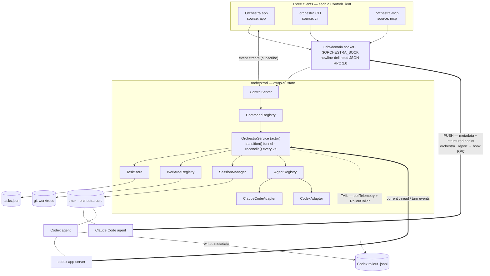
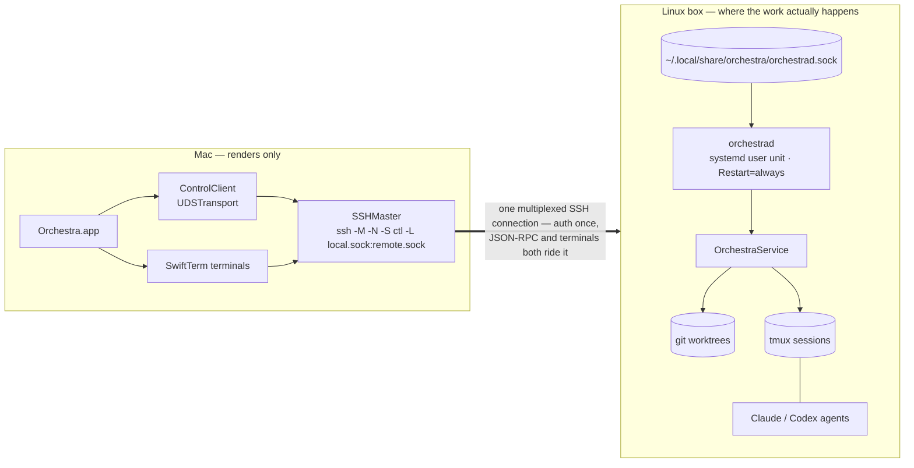

# 2. Architecture

Orchestra is a **single coordinator with thin clients**. One background daemon owns all state; the app,
the CLI, and the MCP bridge are interchangeable front-ends that talk to it over a local socket. This
chapter walks the pieces and traces a command end to end.

Two details in that picture are load-bearing. First, the three clients are *interchangeable* because
they are the same `ControlClient` against the same `CommandRegistry` — the CLI's verbs and the MCP
tool list are generated from one vocabulary, so they cannot drift apart. Second, the two agents
report metadata by **different mechanisms**, captured by `AgentCapabilities.telemetry`: Claude Code is
`hooksPush` (thick arrow — its statusLine and hooks shell out to `orchestra _report`, which sends one
typed `hook` RPC back over the same socket), while Codex is `fileTail` (dotted arrow — the daemon's
2-second `pollTelemetry` tick tails its rollout JSONL via `RolloutTailer`). Those paths report context,
model, and display detail; they do not decide Codex session identity or live turn status.

Provider observation is a separate seam. Claude's structured hooks carry the current session and prompt
identity; a global `claude agents --json` snapshot repairs a hook-silent Ctrl-C left locally running, and
also carries a card left `unavailable` by a daemon restart (Claude has no snapshot-on-bind) to `waiting`
once the provider confirms it idle. Codex's launch-local app-server owns both its thread identity and
runtime state — it needs no such snapshot, since its attach response restores state directly. An unbound
observer reads the app-server's loaded threads and accepts only one exact-cwd, launch-scoped root,
non-ephemeral candidate; otherwise it waits for a matching `thread/started`. Once bound,
`thread/resume` reconciles the snapshot and
seeds the current turn fence when its snapshot is active; pushed turn/thread updates maintain it. The
coordinator also retains that fence across Codex's idle-before-completed notification order. Both adapters
emit normalized `AgentSignal`s into the same reducer, so no downstream consumer branches on the provider.
Terminal bytes never cross this plane — SwiftTerm attaches to tmux directly.

## The daemon (`orchestrad`)

`orchestrad` is a **launchd LaunchAgent** (`com.orchestra.daemon`, installed at
`~/Library/LaunchAgents/com.orchestra.daemon.plist`) configured `KeepAlive=true`, `RunAtLoad=true`,
`ProcessType=Background`. It runs continuously, independent of whether any app window is open, and is
restarted automatically by launchd if it ever exits. The daemon also builds and runs on **Linux**, where
a systemd **user** unit (`Restart=always` + `enable-linger`) plays launchd's keep-alive role — the
deployment target for the [Mac ↔ remote-Linux-daemon](08-building-operations.md#deploying-orchestrad-to-a-remote-linux-box)
topology; the run loop itself is platform-neutral.

On startup the daemon (`Sources/orchestrad/main.swift`):

1. **Loads config** from `~/Library/Application Support/Orchestra/config.json`.
2. **Starts the `ControlServer`** on its unix-domain socket. (The daemon renders **no** hook files — each
   adapter renders its own in `prepareToLaunch`, per launch, so a new session always reflects the current
   binary path + statusLine config. See [the hooks channel](06-clients-cli-mcp.md#the-hooks--_report-channel).)
3. **Runs boot recovery** asynchronously without blocking startup, in order: sweeps orphaned scratch
   dirs, a one-time worktree-marker migration, then **`reconcilePhasesAtBoot()`** — re-derives every
   card's session state from its *persisted* `phase` alone, folding what used to be a separate
   `recoverSessions` sweep (see [the Convergence model](#the-convergence-model)) — then an orphan-borrow
   sweep, the watch-registry reload, remote-watch rebuild, and merge-request re-nudge rearm.
4. **Starts a 2-second poll loop** that calls **`reconcile()`** — the per-tick driver that steps every
   transitional card one edge closer to its target phase, enforces launch/relaunch timeouts, sweeps
   orphaned tmux sessions, and (as a safety net) flips a `.live` card to `dead` if its session vanished
   without a `SessionEnd` hook (see [the Convergence model](#the-convergence-model)) — and, alongside it,
   drives [`pollTelemetry`](04-cards-worktrees-sessions.md#the-codex-adapter), the rollout-tail tick that
   refreshes metadata for `fileTail` agents (Codex). Turn state comes from structured provider events,
   never this polling loop.
5. **Installs a `SIGTERM` flush handler** (launchd/systemd send `SIGTERM` before `SIGKILL` on a clean
   stop/restart) that flushes any debounced `tasks.json` write, then parks on `dispatchMain()`.

### Actor hygiene, the snapshot cache, and telemetry debounce

The daemon is a **single `OrchestraService` actor** — one serialized owner of all mutable state, no
per-card executors. That design is only responsive if the actor doesn't block on IO on its hot paths, so
the blocking git, tmux-listing, exec, telemetry, and launch-prep operations are hopped **off the actor**
onto a background queue via one primitive, `offActor { … }` (a `nonisolated` GCD/continuation bridge).
`exec`, git diff/notes/tree probes, `pollTelemetry`'s rollout resolution, the every-tick
`sessions.list()`, `prepareToLaunch`'s `~/.claude.json` read-merge, the scratch sweep, `spawnBranches`'
`git for-each-ref`, the shell-window listing, and the remaining on-actor `gitRemotes`/parent-classification
call sites all run off-actor and bounded by the `controlTimeout`/`sessionLaunchTimeout` config knobs, so a
slow git repo or a hung tmux call **never freezes RPC servicing** on those paths — a concurrent
`list`/`spawn` stays prompt. Read-only git helpers are `nonisolated` and their `git remote` lookup is
memoized per repo, invalidated on `.git/config` mtime. (Some interactive shell-control, capture, and
directory-listing paths still do synchronous IO on the actor — out of this pass's scope.)

Two caches keep hot paths cheap without changing observable behavior:

- **Observed-session cache.** Each 2-second `reconcile()` tick captures every live card's tmux window
  state off-actor into an in-memory cache. `boardSnapshot` — served on every client (re)connect — reads
  that cache instead of shelling `tmux` per card, so a reconnect costs **zero** tmux subprocesses. The
  cache is evicted on teardown and on any shell open/close so user-driven changes are never hidden; a
  cache miss or an entry older than the card's current session falls back to a live read, so nothing is
  ever mis-shown. Session state is at most one tick (~2s) stale and self-heals via live events.
- **Telemetry-persist debounce.** High-frequency telemetry deltas (context %, status) update the card in
  memory and bump the board `rev` **synchronously** — the event stream a client sees is unchanged — but
  their `tasks.json` write is **coalesced**, so a chatty agent no longer thrashes the file. Any
  non-telemetry mutation (or the `SIGTERM` flush) forces a synchronous write, so a clean restart loses
  nothing; only a hard crash can drop the last few seconds of (reconstructable) telemetry.

### Why a daemon, and why tmux

The daemon owns state so that **agents keep running with the app closed** and survive app restarts. Its
ground truth is deliberately *federated* rather than held in memory:

- **`tasks.json`** holds card metadata,
- **`tmux ls`** is the authority on liveness,
- **git** is the authority on the worktree.

Because liveness comes from tmux and not from in-memory bookkeeping, the daemon can crash and restart
(or the machine can reboot) and still correctly reconstruct which agents are alive and which need
reviving. tmux also gives each agent a real PTY that the app and CLI attach to directly.

## The Convergence model

Every card's lifecycle is **one persisted variable** — `Task.phase` — with **one writer**. This is the
*lifecycle-convergence* redesign (the rationale is narrated in
[design decisions](09-design-decisions.md#the-phase-funnel-one-writer-epochs-and-capability-gated-readiness));
this section is the as-shipped daemon-side picture, agent-agnostic throughout (nothing here branches on
`claude-code` vs `codex`).

### The `transition()` funnel — the sole writer

`OrchestraService.transition(_:to:observedEpoch:mutate:)` (`OrchestraService+Lifecycle.swift`) is the only
code that ever writes `Task.phase`. Every mover — a verb's intent, a liveness signal, `markDead`, a
reconciler step — routes through it, which in one call:

1. validates the edge against the pure `isLegalEdge(from:to:viaSignal:)` machine (an edge outside the legal
   set is `.rejected`, the stored phase untouched; a same-phase call is a `.noop` — except the
   `relaunching → relaunching` supersede self-edge, which re-arms a fresh generation instead of being
   swallowed);
2. stamps `phaseChangedAt` when the lifecycle phase or live `TurnStatus` changes and, on a
   (re)launch-bound entry, bumps `sessionEpoch` — all inside **one** `store.update` patch that also
   applies the caller's `mutate` closure, so companion field writes
   (`archived = true`, a cleared `agentSessionId`, a `deadReason`, a folded `pendingSeed`) land atomically
   with the phase;
3. fires the terminal `Conclusion` exactly once, on entry into a terminal phase from a non-terminal one —
   `wait` resolves off this, never off `git`;
4. retires any old per-session runtime handle before a replacement session can install its own.

### `sessionEpoch` — making stale signals harmless

`sessionEpoch` is a monotonic per-card generation the funnel bumps on every (re)launch entry, stamped into
the launched session as the **`ORCH_EPOCH`** env var (`withEpoch` — agent-agnostic, rides every launch call
site's `-e` env) and read back out-of-band via `SessionManaging.stampedEpoch(name:)`. A liveness signal (a
late hook, a poll) carries the epoch it observed; the funnel drops any signal whose epoch no longer matches
the card's *current* `sessionEpoch`. That fence is what lets both the reconciler and the funnel treat a
session from a torn-down or superseded generation as harmless noise instead of something that has to be
raced against.

### The reconciler — driving cards through their transitional phases

The daemon's 2-second poll calls `OrchestraService.reconcile()` every tick (`OrchestraService+Reconcile.swift`).
For each card in a **transitional** phase (`creatingWorktree` / `launching` / `relaunching` /
`archivedPending`) it dispatches one **`PhaseStepper`** (`PhaseStepper.swift`) — a stateless, idempotent
driver keyed by `Phase.Kind` that holds no per-card state of its own, so re-running a step after a crash is
exactly as safe as running it the first time:

| Stepper | Drives | Advances to |
|---|---|---|
| `MaterializeStepper` | `.creatingWorktree` | `.launching` (worktree cut/adopted, lineage recorded) or `.dead(.spawnFailed)` |
| `LaunchStepper` | `.launching` | `.live` once the agent confirms readiness |
| `RelaunchStepper` | `.relaunching` | `.live` (re-materializing a missing worktree first) or `.dead(.resumeFailed)` |
| `TeardownStepper` | `.archivedPending` | `.archivedComplete` (kill the session, release a borrow, reclaim the run dir by origin, cancel debounces/watches, nudge children) |

Each tick also, for `.launching`/`.relaunching` cards:

- checks `phaseChangedAt` against `config.sessionLaunchTimeout` and marks a card that never confirmed
  `dead` rather than re-stepping it forever (checked *before* stepping, so a doomed launch is never driven
  past its deadline);
- backs a failing step off with a capped exponential delay (2s, 4s, 8s, … capped at 64s) so a
  persistently-failing step never hot-loops the actor;
- adopts a card whose session is *already* alive **at the matching epoch** straight to `.live` (the session
  came up before a crash cut the phase write) — an older-epoch session is never adopted; only the
  stepper's own kill-then-relaunch reclaims that identity.

After the per-card pass, the tick sweeps orphaned `orchestra-<uuid>` tmux sessions (no card, or an archived
one) — but only after a *fresh*, off-actor liveness probe taken at sweep time, never off the tick's initial
snapshot, so a session that already died in between is never double-killed and one that's still
legitimately alive is never torn down early.

### Boot: crash-equivalence

`reconcilePhasesAtBoot()` runs once, in its own boot task fired detached from the poll loop's task (so a
slow revival never blocks the daemon coming up) — the two aren't sequenced against each other, though the
poll loop's own 2 s pre-tick sleep means boot recovery typically completes before the first `reconcile()`
tick. It re-derives every card's session state
from its **persisted phase alone** — a daemon-only crash and a full machine reboot converge through the
same code path; there is no separate "was the daemon actually down" branch. A `.live` card whose session
survived is adopted only on epoch-identity match; otherwise (or if the session is gone entirely) it is
routed through the funnel to `.relaunching` — or marked `dead(.rebootUnrevived)` if it has neither a
resumable transcript nor a never-prompted (provisional) blank-restart path. Transitional cards are left
as-is for the steady-state `reconcile()` tick to pick up (steps are guarded so nothing double-drives a card
already mid-step). If `tasks.json` itself is unparseable, `TaskStore` side-lines it to a timestamped
`.corrupt-<ISO8601>` backup and boots an empty board; boot then flips the `WorktreeRegistry` into
**conservative mode**, which suppresses every reclaim (worktree removal, scratch `rm -rf`) until ownership
can be positively re-established. Nothing in-process clears it — conservative mode holds for that daemon's
entire run; only a fresh daemon start against a clean store comes up un-conservative.

### Verbs are intent-only

The seven `Convergence`-kind verbs — `spawn`, `batch-spawn`, `archive`, `reopen`, `resume`, `restart`,
`handoff` (see [the verb taxonomy](05-command-reference.md#verb-kinds-and-the-phase-gate)) — each persist a
target phase through `transition()` and return immediately; none of them awaits a worktree checkout, an
agent bring-up, or a teardown duty before its RPC returns. The reconciler's steppers do that work off the
request path, so a client sees its card converge live (via `taskUpserted` events) rather than blocking the
original call on it.

## The control plane

Clients reach the daemon over a **unix-domain socket** (`~/Library/Application Support/Orchestra/
orchestrad.sock`, overridable with `$ORCHESTRA_SOCK`) speaking **newline-delimited JSON-RPC 2.0**.

- **Request:** `{jsonrpc:"2.0", id?, method, params?, source?}`. A missing `id` makes it a
  notification (no response). `source` (`app`/`cli`/`mcp`/`agent`) attributes the call in the activity
  feed.
- **Response:** `{jsonrpc:"2.0", id, result?, error?}` with error codes `-32700` (parse), `-32601`
  (method not found), `-32000` (internal).
- **Server→client notification:** `{jsonrpc:"2.0", method:"event", params:<EventEnvelope>}` — pushed to
  any client that called `subscribe`. `EventEnvelope{rev, event}` wraps every notification with the
  board's monotonic `rev` at emit time (`TaskStore.currentRev`, bumped once per mutation in its single
  `persist()` funnel and persisted alongside the tasks — see [the data model](03-data-model.md)); a
  client can compare consecutive `rev`s to detect a missed event. `BoardSnapshot` — the one round trip a
  (re)connecting client takes — carries the same `rev`, so it can tell whether anything landed between
  the snapshot and its first live event. Using that cursor to detect a gap and resync is client-side work
  that lands in a later stage; Stage 1 only stamps and carries `rev`. `rev` is monotonic but **sparse** —
  not every bump carries a client event (an event-less mutation whose rev is absorbed by a following emit,
  or an ephemeral event that shares the prior task-state rev) — so the later gap-detector must treat
  `rev ≤ lastSeen` as already-applied and resync only on positive evidence of a missed event, never on a
  bare forward gap.

The socket is created user-only (mode `0600`), and every accepted/connected file descriptor has
`SO_NOSIGPIPE` set (on Linux the equivalent guard is a per-`send` `MSG_NOSIGNAL` flag — see the ported
`UDSSocket`). That last detail is load-bearing: when an agent archives *its own* card, killing
the tmux session also kills the MCP client whose socket the request arrived on; the daemon's reply
write then hits a closed peer. Without `SO_NOSIGPIPE` that raised `SIGPIPE` and killed the daemon (and
launchd relaunched it, surfacing a spurious "orchestrad crashed" popup). With it, the write returns
`EPIPE`, the dead connection is dropped cleanly, and the daemon lives. See
[Troubleshooting](08-building-operations.md#troubleshooting). (Self-close has a *separate*, client-side
SIGPIPE twin: the agent's `orchestra _report` helper writing to its now-dead stdout pipe — handled with
crash-safe POSIX stdio + a process-wide `SIGPIPE` ignore; see
[the report channel](06-clients-cli-mcp.md#the-hooks--_report-channel).)

### The client transport seam and reconnect

On the client side, `ControlClient` no longer holds a raw fd directly — it owns a **`Transport`** (a
small `open`/`write`/`readLine`/`close` protocol), with `UDSTransport` the one concrete impl today (the
current AF_UNIX behavior, extracted behind the seam). A future WebSocket/tailnet transport plugs in here
without touching the client. On a dropped link the client no longer dies: it tears down, backs off
(exponential, ~250 ms → 5 s cap with jitter), reconnects with a **fresh** transport, and **re-issues the
subscription**, so a transient blip doesn't sever the event stream. It exposes an observable
**`ConnectionState`** (`connecting | live | retrying | down`) the app binds to for its status chip.

This seam is also what lets a client target a daemon that isn't on this Mac. The app can run its board
against a **remote Linux `orchestrad`** over an app-managed SSH tunnel: the wire protocol is unchanged
(the daemon grows *no* network listener), reachability is pure SSH forwarding, and the forwarded local
socket is just another path the `UDSTransport` opens.

The work box does the work — worktrees, tmux, agents all live there — and the Mac is just a renderer.
The app owns a single multiplexed master `ssh` (`SSHMaster` / `RemoteCommands.sshMasterArgs`) that
forwards the remote daemon's unix socket to a local path, and the terminals ride that *same*
connection (`ssh -tt … tmux attach`), so no PTY bytes cross the JSON-RPC plane and you authenticate
once. Because reachability is pure forwarding, the daemon's attack surface stays what it always was:
a `0600` unix socket. See [Connections](07-app-ui.md#onboarding-settings-recovery-and-popovers) in the
app chapter and [deploying to a Linux box](08-building-operations.md#deploying-orchestrad-to-a-remote-linux-box)
for the static-musl cross-build.

Two more resilience details round out the transport seam:

- **Per-RPC deadline.** Every `call()` attaches a `callTimeout` (default 15 s) to its pending
  continuation; on expiry only that call fails with a timeout error, not the whole connection — a single
  slow RPC (a laggy tunnel hop, a momentarily busy daemon) doesn't take the client down with it.
- **Ping keepalive.** While `state == .live`, a background loop issues a `version` probe (itself bound
  by `callTimeout`) every `pingInterval` (default 20 s). Its job is to catch a **dead-but-open** tunnel —
  a socket or SSH channel that never EOFs and never replies, which the read loop alone can't see. A
  failed probe flips `ConnectionState` to `.retrying` and `shutdown()`s the transport, waking the reader
  into the same reconnect path a dropped link takes.

A second, unrelated reconnect policy governs the two **terminal** hosts — mac's `AgentTerminalView` (a
local `tmux attach` subprocess via SwiftTerm) and iOS's `IOSTerminalView` (a remote SSH-driven attach) —
which now share `TerminalReconnectPolicy` (`Sources/OrchestraKit/TerminalReconnectPolicy.swift`) rather
than each rolling its own backoff. Attempt `n` waits `min(8, 2^(n-1))` seconds, up to a `maxReconnects`
budget (default 5, so the schedule is `[1, 2, 4, 8, 8]`) before the host gives up and surfaces a
manual-retry affordance. The policy itself is pure math; each host owns its own timer, pending-reconnect
flag, and live-gate. On mac, the attempt counter resets to zero only when a reattach *survives* a
5-second stabilize window (a failed `tmux attach` exits almost instantly, so staying up that long is the
success signal) or when the attach target changes outright (`resetForNewTarget()`, which also bumps a
generation counter that invalidates any backoff already queued against the old target) — never merely on
attach start. That keeps a persistently-flapping tmux session bounded by the same five-attempt budget
instead of getting a fresh count on every retry.

### Request flow, server-side

`ControlServer` accepts each connection and serves it on its own GCD queue. For each line it decodes an
`RPCRequest` and dispatches:

1. **Built-in methods** handled inline: `ping`, `version`, `subscribe`, `getConfig`, `setConfig`,
   `models`, `agents`, `archivedList`, `openInZed`, `openInObsidian`, `report`, and the app-only `diffText`/`diffStat`/`listDocuments`/`readDocument`
   (the [code-review diff](05-command-reference.md#server-only-built-in-methods), axis 7).
2. **Registry commands** looked up in the `CommandRegistry` and run via `registry.dispatch(command, service,
   params, source)` — the single chokepoint that, for any non-`Query` verb naming a target card, checks the
   card's current `Phase.Kind` against the verb's `phaseGate` (see [the verb
   taxonomy](05-command-reference.md#verb-kinds-and-the-phase-gate)) before calling `command.run` against
   the `OrchestraService` actor; a gated-out call never reaches its handler.

Responses and events are written through a **non-blocking per-connection queue**; a broken write marks
the connection dead exactly once. A bounded **200-item ring buffer** holds recent events so that a
newly-subscribing client (e.g. the app reconnecting) can replay the recent activity feed under a single
lock that also serializes live fan-out — preventing duplicate or reordered delivery. Both the replayed
and the live-fanned-out notifications are `EventEnvelope`s; replayed items are stamped `rev: 0` (a
deliberate placeholder — the ring only ever replays already-stale activity, never the live board state a
`rev`-based gap check would care about).

## The three clients

All three are `ControlClient`s differing only in their `source` tag and how they present results:

- **App** (`source: .app`) — connects on launch, subscribes to the event stream, and renders the board
  reactively. Terminals are *not* proxied through the daemon: SwiftTerm attaches to tmux **directly**
  over the tmux socket. The control plane carries commands, state, and events — never PTY bytes. Against
  a remote connection the same terminals `ssh` into the box's tmux over the *shared* SSH control socket,
  so no bytes flow through the JSON-RPC plane there either.
- **CLI** (`source: .cli`) — `orchestra <verb> …` parses argv, calls the matching command, prints the
  result. A few verbs (`shell`, `inspect`) fetch session handles and then `exec` `tmux attach`
  in-process. See [CLI & MCP](06-clients-cli-mcp.md).
- **MCP bridge** (`source: .mcp`) — `orchestra-mcp` is a stdio MCP server that generates **one tool per
  `CommandRegistry` command** (name = command name, description = summary, input schema = the command's
  param schema) and relays each tool call to the daemon. This is how another agent orchestrates the
  board.

Because the CLI and MCP both generate their surface from the same registry, the three clients can never
drift apart on *what* commands exist — only on presentation.

The module layering enforces this split at the link level: **`OrchestraKit` is Foundation-only and
SwiftUI-free** (it cross-compiles for the Linux daemon), **`OrchestraUI` is the SwiftUI layer** (mac +
iOS only), and the daemon/CLI/MCP link **only Kit** — so SwiftUI is never compiled for Linux and shared
model/contract types stay usable on every target.

Every human-facing surface — the mac app and the iOS app (not the MCP bridge, which relays raw task JSON
to another agent, not rendered status) and `orchestra list`'s CLI pill — renders a card's status through
one shared, pure contract: `displayState(phase:connection:) -> DisplayState`
(`Sources/OrchestraKit/DisplayState.swift`), returning
`{statusKey, label, validActions: Set<Verb>, isBusy, isStale}`. No surface hand-rolls its own status text
or action list — the board cell, card detail/inspector, and recovery views on both mac and iOS all read
from it: `label` comes from `Phase.displayKey → PhaseDisplayKey.label` (the one place the phase-to-text
vocabulary lives), the app's color comes from `Theme.statusColor(statusKey)`, and `validActions` is built
by looping `CommandCatalog.all` for schemas whose `phaseGate` admits the phase's `Phase.Kind` — never a
hand-copied per-surface table, so a verb's gate can't quietly drift from what the UI offers. A
disconnected link (`connection != .live`) empties `validActions` of every daemon verb and sets `isStale`.
That includes `.openInObsidian`: opening a card's documents is **not** a local file op but a daemon RPC
(`BoardStore.openInObsidian → client.call`, which reaches `Launcher.openInObsidian` to open Obsidian on
the *host*),
so it is gated inside the live link like every other action and additionally requires a materialized
worktree cwd (a being-born or spawn-failed card has none).
`dead(.spawnFailed)` — like every other dead reason — maps through `Phase.displayKey` to the `.dead` key
and renders **Dead**, never a stale "Creating…"; only `.archived` reads as `.done` ("Done").

## Provider observation and metadata channel

The fourth participant is the **agent itself**. Its two data planes remain deliberately separate:
`StatusReport` carries session identity and display metadata, while a live card's `AgentState` is reduced
only from provider-normalized `AgentSignal`s. Lifecycle is still `Task.phase`; entering `live` starts with
an `unavailable` turn status until current provider evidence arrives. A launch argument, seed, inbox
message, activity string, or process being alive cannot manufacture `running` or `waiting`.

Each adapter supplies its native launch configuration — Claude through a managed `--settings` file and
Codex through a per-launch profile file (`-p`) — without replacing Codex's normal home, authentication,
plugins, or state. Claude's `statusLine` and structured hooks call the thin edge helper,
`orchestra _report --event <kind> --agent <id>`, which sends a typed `hook` RPC over the control socket.
The adapter separates metadata from a current-session observation before it reaches the provider-neutral
reducer. Hook responses carry SessionStart orientation only:

| Claude event | `_report --event` | What it updates on the card |
|--------------|-------------------|------------------------------|
| statusLine refresh | `statusline` | `ctxPct`, model id + display, session id, session name |
| `SessionStart` | `session` | session id, transcript path, session source (clear/resume/startup/compact); also injects the card's live column/mode/self-id **orientation** as `additionalContext` |
| `UserPromptSubmit` | `prompt` | prompt text → auto-title; identified top-level turn start when its id is distinct |
| `MessageDisplay` | `messagedisplay` | exact main-turn activity; reactivates the same prompt or establishes a distinct queued turn when no turn is active |
| `Pre/PostToolUse` | `pretool` / `posttool` | activity detail; main `PreToolUse` carries the same turn-activity evidence |
| `PermissionRequest` / known input tool | `permission` / `pretool` | current provider `humanNeed`, tagged `.permission`, `.input`, or `.unspecified` |
| resolution event | tool hook | clears provider human need only within the current correlated turn |
| `Stop` | `stop` | exact current top-level turn completion |
| `SessionEnd` | `sessionend` | exit reason → may drive the card to `dead(_)` via the `transition()` funnel |

Claude accepts only prompt/session-correlated observations: delayed observations and subagent activity
cannot change the main turn, while subagent permission/input hooks still roll up to the card's aggregate
human need. A missing terminal identity fails closed to `unavailable`, and an older event is ignored.
Because Claude emits no terminal hook on Ctrl-C, and has no snapshot-on-bind after a daemon restart, one
global non-overlapping snapshot — firing almost immediately after boot, then every ten seconds — runs
while an eligible Claude card remains `running` or `unavailable`. It can apply only an exact-session,
unchanged-status, unchanged-generation `running`/`unavailable` → `waiting`; it never creates
`running`/`unavailable`, changes `humanNeed`, or repairs `waiting`.

Codex uses the hook channel for SessionStart orientation, while its turn state and provider-human need come
only from a launch-local app-server observer. The rollout tail is metadata only: it discovers the session
and reports context, model, and coarse activity text.

`humanNeed` describes the provider's current request and is not itself a second phase. The separate,
durable `pendingQuestion` records a task-authored question. `Task.requiresHuman` is their pure OR, so an
ordinary `waiting` turn is not a Needs You reason. `pendingQuestion` clears only when a positively
identified **distinct** next turn starts, including `running → running`; reconnecting the same session,
provider resolution, opening the harness, sending a message, resolving a native prompt, and inbox delivery
leave it alone.

This is a **two-way** channel. Agent → Orchestra carries metadata and provider observations; Orchestra →
agent carries authored launch or handoff context and SessionStart orientation in `additionalContext`.

Normal inbox delivery is a separate per-live-session path. `send` first persists a local row, then a sender
uses the provider handle held only in `CardRuntime`. Claude's endpoint and token are ephemeral hook metadata;
Claude Stop remains status-only. Codex's app-server observer remains the status authority while a separate
sender peer submits `turn/start`. On provider acceptance the row becomes `handedOff`; that means the harness
accepted the request, not that a model read or acted on it. The sender never emits status, and it does not
wait for `running`, `waiting`, `unavailable`, attention, `pendingQuestion`, or `wait`. See
[the hooks channel](06-clients-cli-mcp.md#the-hooks--_report-channel).

Two robustness rules matter:

- **Bounded sends.** The statusLine report is a ~50 ms synchronous call cancelled on the next tick, so
  a slow daemon never stalls the agent's status bar; hooks get a ~2 s budget. The helper always prints
  the status line to stdout *before* attempting the network send.
- **Monotonic metadata seq guard.** Snapshot metadata reports carry a sequence number; the daemon drops
  or coalesces stale ones so a slow `ctxPct` can't land after a fresher value. Turn/human-need signals use
  provider event order plus Card epoch and provider-session identity instead.
- **Field-delta writes, not whole-object replace.** `report()`'s persisted write goes through
  `Task.applyReportFields(from:changedFrom:)`, which overlays only the telemetry fields `report()` owns
  (session ids, `desc`, `title`/`titleSource`/`lastSessionName`/`awaitingFirstPrompt`, `ctxPct`, model)
  onto the task currently in the store. That list is a **whitelist**: a field report() mutates but does
  not name here is silently discarded on the way to disk, so every new report-owned field must be added
  to it. Live `AgentState` and dead metadata are *not* overlaid here — normalized signals and lifecycle
  evidence flow through the `transition()` funnel.
  Being on the list is **not** enough to be written, though: `report()` reads the card, suspends, and
  writes back, so the overlay applies a field only when the report actually *changed* it
  (`changedFrom` is the snapshot it started from). Without that second test, an owned field with a
  second writer — `set-title` renaming a card, a `restart` re-arming `awaitingFirstPrompt` — would be
  restored to the stale value report happened to read, silently and with no self-heal. So every other
  field, and every unchanged owned field, is left exactly as a concurrent RPC left it.

`tmux capture-pane` remains a bounded terminal-render fallback; it is never a status authority.

## Tracing a command end to end

Spawning a card from the CLI:

1. `orchestra spawn --prompt "…" --repo … --branch …` builds an `RPCRequest{method:"spawn", …,
   source:"cli"}` and writes it to the socket.
2. `ControlServer` decodes it, finds `spawn` in the registry, and calls
   `OrchestraService.spawn(input, source:.cli)`.
3. `OrchestraService.spawn` is **intent-only**: it resolves and allowlists the repo, persists the new
   `Task` at `phase = .creatingWorktree` (the cwd path is computed, but no worktree is cut yet) via the
   `transition()` funnel + `TaskStore`, emits a `taskUpserted` event plus a `spawned` activity item, and
   **returns immediately**. The reconciler then converges the card: `MaterializeStepper` asks
   `WorktreeRegistry` to cut/join the worktree (`→ .launching`), and `LaunchStepper` derives the launch
   flavor, builds the argv, and asks `SessionManager` to create the tmux session; on the readiness signal
   (or the N-tick fallback) the card reaches `.live`.
4. `ControlServer` returns the new task to the CLI and fans the events out to every subscriber — so the
   app's board updates live, even though the spawn came from the CLI.
5. The agent starts. Its SessionStart/statusLine path supplies metadata and orientation; Claude then
   supplies current-session observations through structured hooks, while Codex's app-server observer
   reconciles the current thread and receives turn updates.

The next chapters detail each collaborator: the [data model](03-data-model.md) the service mutates, and
the [worktree/session/adapter internals](04-cards-worktrees-sessions.md) it drives.
