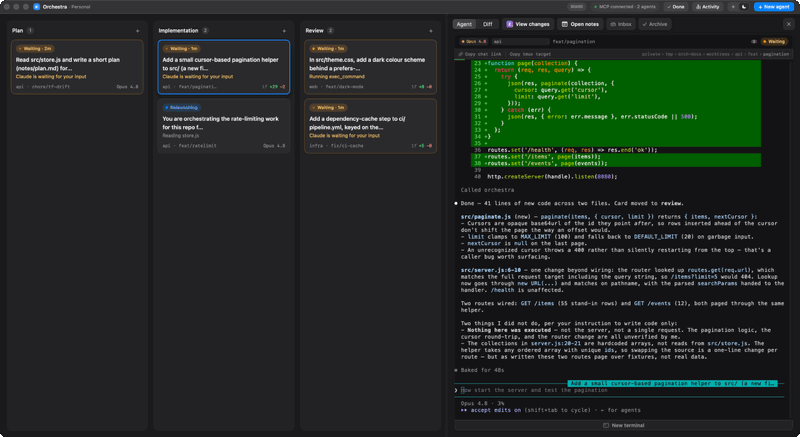

# 6. CLI & MCP

The [command reference](05-command-reference.md) lists *what* commands exist; this chapter covers the
two non-GUI clients that expose them — the `orchestra` CLI and the `orchestra-mcp` bridge — plus the
daemon lifecycle commands and the hooks / `_report` channel.

## The `orchestra` CLI

`orchestra <verb> [args]` connects to the daemon socket (`$ORCHESTRA_SOCK` overrides the default),
calls the matching command, and prints the result. A few verbs are handled before any daemon contact:
`help`/`-h`, `version`, `_report` (the hidden hooks helper), and `daemon` (lifecycle).

### Flags

The parser accepts `--key value`, bare `--flag` booleans, positionals, and `--` to end flag parsing.
Common usage:

```sh
# spawn a worktree card
orchestra spawn --prompt "Add rate limiting" --repo ~/Documents/Projects/api --branch feat/ratelimit --col impl

# spawn a freeform (borrowed) card in an existing dir, read-only
orchestra spawn --prompt "Audit the auth flow" --cwd ~/Documents/Projects/api --read-only

# spawn a throwaway scratch card
orchestra spawn --prompt "Prototype a CSV parser" --scratch

# fork: a new card seeded with the parent's slice (PR D3)
orchestra spawn --prompt "Explore the caching angle" --repo ~/Documents/Projects/api --branch feat/cache --seed "context from the parent card…"

orchestra list                       # all cards
orchestra list --col review          # one column
orchestra status <ref>               # JSON status for one card
orchestra send <ref> "use a token bucket"
orchestra inbox <ref>                # list a card's queued inbox messages (also inbox-edit/-remove/-reorder)
orchestra wait <ref> <ref> …          # block until one watched card concludes, print it, exit
orchestra handoff <ref> "handoff summary…"   # clean-context resume of THIS card, seeded (F1)
orchestra handoff <ref> "summary…" --model claude-fable-5   # …and RE-SEAT it onto a stronger model
orchestra trust <path>               # grant a human's write-trust for a dir (interactive only)
orchestra move <ref> --col review
orchestra exec <ref> "swift build" --timeout 300
orchestra sessions <ref> --json      # debug handles
orchestra restart <ref> [--model <id>]   # blank fresh session, same worktree (--model re-seats it)
orchestra resume <ref> [--model <id>]    # re-attempt resuming the card's session (--model re-seats it)
orchestra archive <ref>
orchestra ping
```

`orchestra shell <ref>` and `orchestra inspect <ref>` are special: they fetch the card's session
handles, close the client, and then `tmux attach` **in-process** so your terminal lands directly in the
card's shell (or a read-only agent, for `inspect`). `batch-spawn` reads a JSON array on stdin (or one
prompt per line with `--repo`/`--branch`).

`orchestra wait <ref…>` is how an orchestrator agent drives the reactive fan-out. It blocks until one of
the watched cards concludes, prints that conclusion, and **exits** — which, for a card launched by
Orchestra, is the wake: Claude's `nativeReinvoke` `wakeTransport` re-invokes the caller in-session when its
background `orchestra wait` process ends, so the orchestrator wakes, reads the durable inbox, and re-issues
`orchestra wait` on the cards that remain. It reads `$ORCHESTRA_TASK_ID` (set at launch) as the `watcher`,
so conclusions coalesce into the caller's own inbox. (See
[merge-watch / `wait`](05-command-reference.md#notes-on-key-commands) and
[chapter 9](09-design-decisions.md#shipped-feature-history).)

`--model <id>` on `restart` / `handoff` / `resume` **re-seats the card onto another model in place** — the
[`--model` re-seat](05-command-reference.md#the---model-re-seat). It is declared on those three schemas in
the [command catalog](05-command-reference.md#registry-commands), so it is a real MCP tool argument too (the
tool schemas are generated from the catalog — see [tool generation](#the-mcp-bridge)), not a CLI-only flag;
the CLI side is the hand-wired half, and it rejects `--model` written with **no value** rather than let the
flag parse as a boolean and silently relaunch on the old model. The id must belong to the card's **own**
agent's catalog; anything else is refused with `invalidParams` before the card is touched.

`orchestra trust <path>` is the **interactive-only** grant surface (PR T2). Because trust is a human
decision, the verb gates on `isatty(STDIN)`: at a real terminal it prints a `[y/N]` confirmation and,
only on `y`/`yes`, calls the daemon `trust` command; run non-interactively (a pipe, a script, another
agent's shell) it **refuses** — printing actionable help that names the path and points back at running
`orchestra trust` in a terminal, then exits non-zero. There is deliberately **no `--trust` flag**: a
directory can only be trusted by a human answering, never by a switch an agent could pass. (See
[the `trust` command](05-command-reference.md#notes-on-key-commands).)

### Daemon lifecycle

`orchestra daemon …` manages the LaunchAgent:

- install/start the `com.orchestra.daemon` LaunchAgent (renders the plist to
  `~/Library/LaunchAgents/com.orchestra.daemon.plist`, `KeepAlive=true`, `RunAtLoad=true`),
- stop/status it.

The app does the same thing from its onboarding screen ("Install & Start") and the offline banner.

## The MCP bridge

`orchestra-mcp` is a **stdio MCP server** built on the official `modelcontextprotocol/swift-sdk`. It
exists so that another agent — typically a Claude Code session — can orchestrate the Orchestra board as
a set of tools.



<sub>A real run, sped up ~4×.</sub>

This is what that buys, and it is the whole argument for the bridge: the card above was told, in plain
English, to *"split the rate-limiting work into three PRs and fan them out."* It calls `spawn` three
times and then `wait`s — and the board fills itself in. Whether it reaches those commands as MCP tools
or through the `orchestra` CLI is an implementation detail of the agent's toolset: both doors open onto
the one `CommandRegistry`, which is exactly why an agent driving Orchestra is indistinguishable from you
driving it. The delivery machinery underneath is
[the orchestration seam](04-cards-worktrees-sessions.md#the-orchestration-seam-handoff--fork--fan-out--send--wait).

- **Tool generation.** On `ListTools`, it maps every `CommandRegistry` command to an MCP `Tool` whose
  name is the command name, description is the command summary, and input schema is the command's own
  JSON-Schema params. There is no hand-maintained tool list — add a command to the registry and the MCP
  surface grows with it.
- **Relay.** On `CallTool`, it opens a `ControlClient(source:.mcp)` to the daemon socket
  (`$ORCHESTRA_SOCK` or default), forwards the call, and returns the daemon's result as text content.
  RPC errors come back as MCP `isError` results.
- **The `trust` tool is the one human-gated special-case** (PR T2). Before relaying it, the bridge calls
  `server.requestElicitation(...)` back over its **persistent MCP session** to the agent's *own* client
  — so a **human** at that client approves or declines the write-trust request. It forwards the `trust`
  call to the daemon **only on `.accept`**; a decline/cancel returns an `isError` without ever recording.
  `requestElicitation` throws if the client never advertised the MCP `elicitation` capability — and both
  v1 targets (Claude Code, Codex) do, so there is deliberately **no fallback** (the agent can only
  *trigger* the grant; a human answers). This is the MCP surface of the [`trust`
  command](05-command-reference.md#notes-on-key-commands); every other tool is a plain relay.

Register it with your MCP host (e.g. Claude Code) as a stdio server running the `orchestra-mcp` binary;
it logs readiness (and the socket path) to stderr.

> Today, the server-only built-ins (`models`, `agents`, `archivedList`, `openInZed`, `getConfig`, …) are *not*
> in the registry, so they aren't exposed as MCP tools yet. Folding the CLI and these built-ins onto the
> registry as the single source is [Roadmap axis 3](10-roadmap.md)'s foundational refactor.

## The hooks / `_report` channel

Hooks are a **first-class, core-owned channel** — the primary bidirectional path between core and a
running agent. Core owns the *protocol* (a `HookEvent` vocabulary + a `HookResponse`, dispatched once in
the daemon); each adapter owns only the *format* at the edge (`parse` telemetry in, `encode` a response
out, `sessionSource` normalize, and render its own hook file). The organizing rule is **convert at the
edge, dispatch in core** — raw agent JSON never crosses the wire.

**Rendering (per launch, by the adapter).** Each adapter renders its own hook file in `prepareToLaunch`
(the daemon renders nothing) from a bundled template — `claude-hooks.json` for Claude's managed
`--settings` file, `codex-hooks.json` for Codex's `$CODEX_HOME/hooks.json` — substituting
`__ORCHESTRA_BIN__` for the live `orchestra` path and `__AGENT_ID__` for the card's agent id. The command
carries a baked `--agent <id>` so the client can resolve its adapter with no env var:

```jsonc
{
  "statusLine": { "type": "command", "command": "<orchestra> _report --event statusline --agent claude-code" },
  "hooks": {
    "SessionStart":      [{ "hooks": [{ "command": "<orchestra> _report --event session --agent claude-code"      }] }],
    "UserPromptSubmit":  [{ "hooks": [{ "command": "<orchestra> _report --event prompt --agent claude-code"       }] }],
    "PreToolUse":        [{ "matcher": "*", "hooks": [{ "command": "<orchestra> _report --event pretool --agent claude-code"  }] }],
    "PostToolUse":       [{ "matcher": "*", "hooks": [{ "command": "<orchestra> _report --event posttool --agent claude-code" }] }],
    "Notification":      [{ "hooks": [{ "command": "<orchestra> _report --event notification --agent claude-code" }] }],
    "Stop":              [{ "hooks": [{ "command": "<orchestra> _report --event stop --agent claude-code"         }] }],
    "SessionEnd":        [{ "hooks": [{ "command": "<orchestra> _report --event sessionend --agent claude-code"   }] }]
  }
}
```

The `--event` strings **are** the `HookEvent` raw values (Core), so the template, client, and daemon
share one vocabulary. `Notification`/`Stop` and `PreToolUse`/`PostToolUse` each get a distinct event —
so nothing downstream ever sniffs the raw `hook_event_name`. Codex wires only `SessionStart → --event
session` (its telemetry is the daemon-side rollout tail; its `parse` returns `nil` for this push, so the
event is orientation-only). A card that also needs per-card settings (read-only enforcement — see [the
read-only barrier](04-cards-worktrees-sessions.md#the-read-only-barrier)) does **not** get a second
`--settings`; `SettingsComposer` deep-merges those overlays *onto* this base into one file (Claude applies
multiple `--settings` last-file-wins, so a second file would silently drop the statusLine + hooks).

**`orchestra _report`** (in `ReportHelper.swift`) is the thin edge client these callbacks invoke:

1. **Render + print the status line first** — unbuffered — so a slow daemon never stalls the status bar.
2. **Resolve this card's adapter** from `--agent` (`AgentRegistry`), guarding on `$ORCHESTRA_TASK_ID`
   (set by `SessionManager` at launch) and a known `HookEvent` — a plain `claude` you run does nothing.
3. **Convert at the edge:** `adapter.parse` turns the raw payload into a `StatusReport` (and, for
   `session`, `adapter.sessionSource` extracts the `SessionSource`). The raw payload dies here.
4. **Send one typed `hook` RPC** — `{ref, event, report?, source?}` — under a tight budget (~50 ms
   statusline fire-and-forget, ~2 s otherwise). The daemon's `OrchestraService.handleHook` dispatches
   **both directions and is adapter-free**: it applies the `report` to the store (send), and for
   `session` composes the live orientation ([SessionBrief](04-cards-worktrees-sessions.md), skipped on a
   `compact` source) or for `stop` drains the [durable inbox](03-data-model.md#the-inbox-store-f3) (F3)
   into a neutral `HookResponse`.
5. **Encode the response to stdout:** if the daemon returns a `HookResponse`, `adapter.encode` wraps it
   in the agent's native envelope — `hookSpecificOutput.additionalContext` for orientation, or
   `{"decision":"block","reason":<payload>}` for the Stop-hook continuation — and the client prints it.
   The drain payload (`StopDrain`) leads with a channel-neutral **provenance header** — telling the model
   these are real instructions queued via Orchestra, not hook noise to distrust — followed by the messages
   `[k/N]`-numbered when batched; only the *whole messages that fit* the 10 000-char budget are delivered
   and drained, with overflow left queued for the next turn-end. A per-card **consecutive-inject loop
   guard** (`OrchestraService.drainForStop`, cap 25, reset by a genuine `UserPromptSubmit`) breaks a
   runaway Stop→inject→Stop cycle.

This single `hook` RPC replaced the former `report`/`drain`/`sessionBrief` methods. Because the daemon
resolves the card's adapter from the persisted `agentId`, there is no agent identity on the wire beyond
the shared `HookEvent`, and no `if agentId` anywhere in the dispatch.

**Crash-safe, best-effort stdio.** `_report` is contractually best-effort — it always exits 0 and never
fails the agent. Its statusLine + hook output goes to a stdout pipe that Claude captures, and that pipe
breaks the instant a **self-close** (`archive`) kills the card's tmux session — often right while the
helper is mid-write. `FileHandle`'s read/write would raise an *uncatchable* ObjC
`NSFileHandleOperationException` on the resulting `EPIPE` (Swift `try?` can't catch it → `terminate()` →
`SIGABRT` → an "orchestra quit unexpectedly" popup), and a raw `write(2)` would instead die with signal 13.
So `ReportHelper` does its own POSIX `read`/`write` that swallow `EPIPE`/any error, paired with a
process-wide `signal(SIGPIPE, SIG_IGN)` in `main.swift` (set before any I/O, so it also protects e.g.
`orchestra list | head`). This is the client-side twin of the daemon's per-socket `SO_NOSIGPIPE` fix
([architecture](02-architecture.md#the-control-plane), [Troubleshooting](08-building-operations.md#troubleshooting)) —
a *separate* bug: that one is the daemon's reply write to a dead peer, this one is the helper's own stdout.
Regression test: `Tests/IntegrationTests/ReportHelperPipeTests.swift`.

**Codex gets a parity SessionStart hook.** Codex ships a Claude-parity SessionStart hook whose stdout
`additionalContext` is folded into the session, so the same orientation (step 5) reaches a Codex card too.
Each Codex card's `prepareToLaunch` renders the bundled `codex-hooks.json` (SessionStart →
`_report --event session --agent codex`) and installs it into the pinned `$CODEX_HOME/hooks.json`,
**never clobbering a foreign user `hooks.json`** (`CodexHooks.installIfSafe` writes only when the
destination is absent or already Orchestra's, identified by the broadened `_report --event` marker — any
Orchestra event, so a stranded install from an earlier build, e.g. the retired `--event orient` hook, is
recognized as ours and replaced, while a genuinely foreign file is left untouched).
Codex's `parse` returns `nil` for this push (its telemetry is the
[daemon-side rollout tail](04-cards-worktrees-sessions.md#the-codex-adapter)), so the `session` event is
**orientation-only** — the daemon returns the same brief, and the edge encodes it identically to Claude.

The raw→`StatusReport` conversion is **not** `ReportHelper`'s own. This `_report` process *is* the Claude
**`hooksPush` transport**, so it wraps the event as a `RawTelemetry.hooksPush(kind:payload:)` and hands it
to the adapter's `ClaudeCodeAdapter.parse(_:)` — the parse is **agent-dependent**, so it belongs to the
adapter, not the CLI. This is the transport/parse boundary PR A2 established (relocating the former
`ReportHelper.map`/`toolDesc` verbatim into the adapter, keeping Claude telemetry byte-identical). The
daemon-side **rollout-tail** transport for another agent — Codex — has since landed (PR B2): its
`RolloutTailer` + `OrchestraService.pollTelemetry()` call the *same* `adapter.parse` seam from a file tail
instead of a push endpoint (see [the Codex adapter](04-cards-worktrees-sessions.md#the-codex-adapter)). See
[the adapter's telemetry parse](04-cards-worktrees-sessions.md#the-claude-code-adapter) and the
agent-provider interface contract.

On the daemon side, `OrchestraService+Report.swift` merges the report's **event half** (applied
unconditionally and ordered — e.g. `SessionEnd`→`dead`, session-id rollover into `priorSessionIds`,
prompt text → auto-title + `running`) and its seq-gated **snapshot half** (`ctxPct`, `desc`, model,
status), emitting a `taskUpserted` event and an activity entry only when something actually changed.

This same channel now carries the **first realized Orchestra → agent direction**: the F3 Stop-drain
(step 4 above) injects the durable inbox back into the agent at its turn-end. The **F1 resume seed** (PR C3)
adds a second injection path — an authored handoff/fork context folded with that same inbox, delivered as a
resumed session's opening positional turn (argv, not this settings channel) — now callable end-to-end via
the [`handoff` command](05-command-reference.md#notes-on-key-commands) (PR D1). The **new-card** counterpart
has since landed too (PR D3): a defaulted `SpawnInput.seed` on `spawn`/`batch-spawn` folds authored context
ahead of a fresh card's prompt, completing the handoff/fork/fan-out delivery the
[roadmap](10-roadmap.md) called for. The **SessionStart orientation** (step 5) is a further Orchestra→agent
path — but unlike the seeds it rides the hook's `additionalContext` envelope rather than an opening turn, and
its brief is byte-identical across Claude and Codex ([chapter 9](09-design-decisions.md#shipped-feature-history)).
