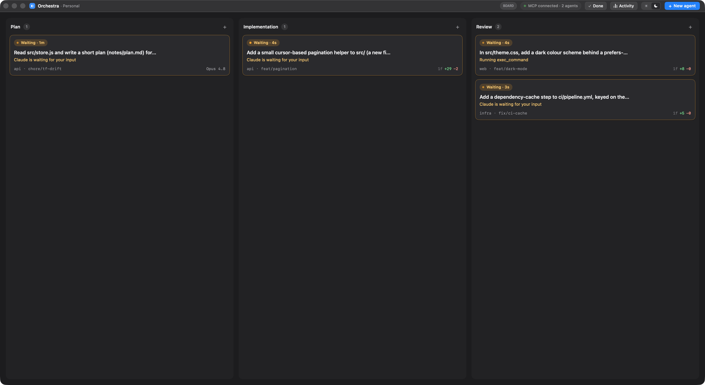
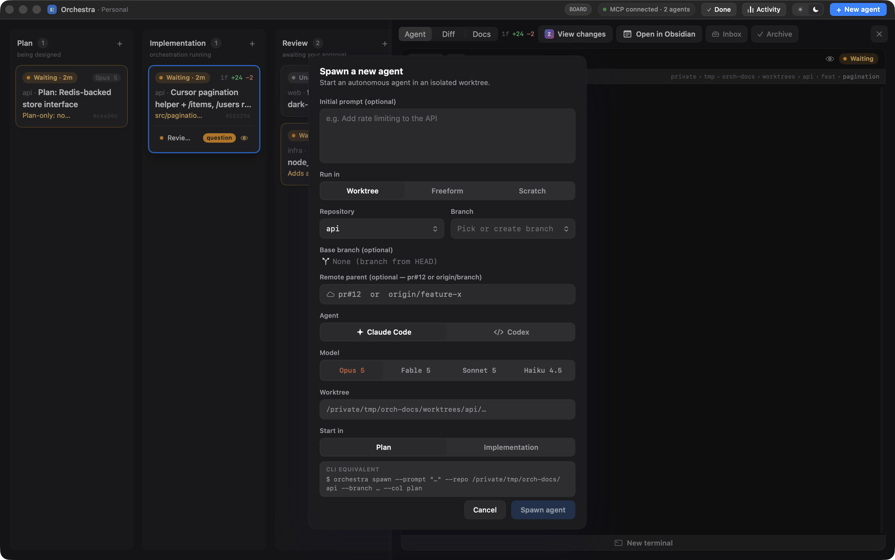
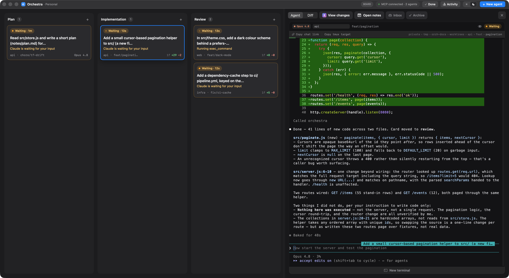
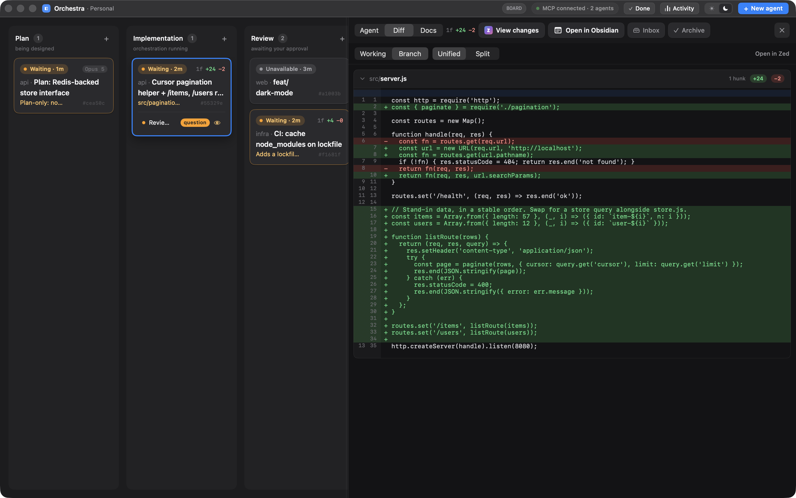
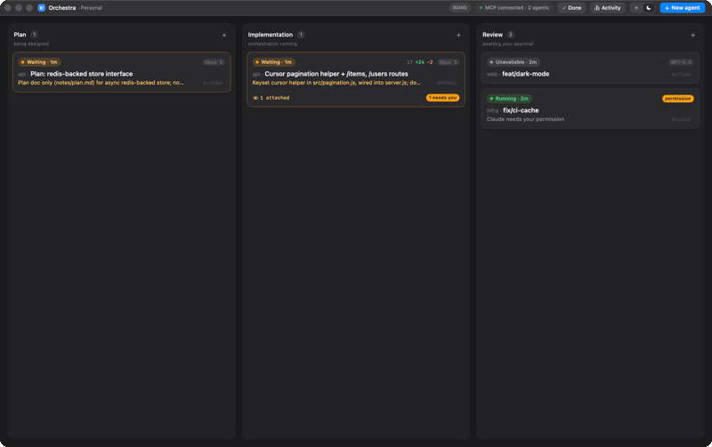
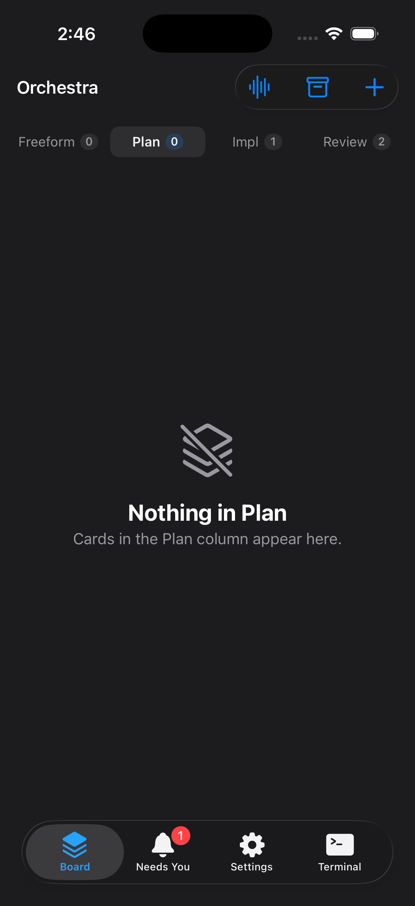

# 7. App UI

The SwiftUI app (under `App/`) is one of the three clients onto the daemon — the visual one. It renders
the board reactively from the daemon's event stream and embeds live terminals via SwiftTerm. This
chapter tours its surfaces. The app's visual language matches the **Orchestra** prototype on Claude
Design (light/linear: radial wallpaper, hairline borders, mono accents).

> The app is built separately from the package (it needs full Xcode + SwiftTerm); see
> [Building & operations](08-building-operations.md). The backend builds and tests without it.

> **About the screenshots in this chapter.** They are captured from a real, isolated Orchestra stack
> running real agents on throwaway repos (`scripts/docs-shots.sh`) — the context-%, activity lines, and
> diffstats you see are genuine telemetry, not mock-ups. Re-run that script to regenerate them after a
> UI change; see [Doc automation](11-doc-automation.md).

## The board



`BoardView` lays out **three equal-width columns** — Plan · Implementation · Review — each scrolling its
own cards (the board itself doesn't scroll), with a minimum column width of ~210 pt. Each column header
shows its label, a count chip, and a **+** button to spawn a card directly into that column; an empty
column shows a "No agents here" placeholder.

**The columns are self-similar across zoom levels.** At the top level they read as **macro-phases** —
carried by a header subtitle: Plan *being designed*, Implementation *orchestration running*, Review
*awaiting your approval* — and hold only **root cards** (see [Hierarchy](#hierarchy-roots-peek-and-drill)):
one card per root branch plus standalone cards, with every descendant embedded behind its root. Drilling
into a root re-scopes the same three columns to that root's subtree, where they read at card scale again
(the subtitles drop). The scope is pure app-local view state; the daemon knows nothing about it.

**Drag-and-drop** moves cards between columns: a card is `.draggable` by its UUID, columns are
`.dropDestination`s that highlight when targeted, and a drop calls `move(id, to:)`.

Batch fan-out — spawning **many** cards at once (one card per prompt line, each on a suffixed
`<branch>-<n>`) — is reachable from the CLI and MCP over the
[`batch-spawn`](05-command-reference.md#registry-commands) command. There is **no board Fan-out button**:
it was removed (along with the per-card Handoff and Fork buttons) so batch-spawn stays an agent/CLI move
and the board chrome stays minimal (see
[chapter 9](09-design-decisions.md#shipped-feature-history)).

### The freeform region

Below the columns sits the **Freeform region** — a full-width, collapsible, resizable **dock** for
non-worktree cards (`.borrowed` / `.scratch`), which live outside the Plan/Impl/Review workflow. Cards
wrap in an adaptive grid (270–360 pt columns) that reflows with the window. Its ribbon header doubles as
a drag handle (drag up to grow), and its height persists across launches. It lives *inside* the board
view so the inspector overlay renders on top of it.

### Hierarchy: roots, peek, and drill

Related cards group under one root, derived — never stored — from two relations the cards already carry:

- **Lineage** (the citizenship axis): a worktree card's `parentBranch` resolves to the live card owning
  that branch (`BoardTree.lineageParent` → `parentCard`, same repo, any column). This links a PR card to
  the orchestrator that spawned it.
- **Attachment**: a `.readOnly` card hangs off a target — a **worktree** reviewer (spawned with
  `base: <branch>`) off the card on that branch; a **branchless** `.borrowed` reviewer off the `.worktree`
  card whose directory it borrowed (a `cwd` match; a `.scratch` card's unique dir never matches).

The **unified subordinate hop** is `hierarchyParent = attachTarget ?? lineageParent`; climbing it reaches
the **root** (`hierarchyRoot`). A card with no links is its own root. A malformed lineage (a cycle) has no
real root, so the climb returns nil and the members render as ordinary citizens — the board is never
stranded on a cycle.

**Top level shows roots only.** `BoardUX.isEmbedded` (a desktop projection over `visibleTasks` — the one
set the columns, freeform dock, `hjkl`/go-to/carry navigation, and link-hints all read, so a hidden card
leaves render and navigation together) embeds a card when it is a **non-root descendant of the current
scope**: at the top level, everything whose lineage parent isn't nil. Read-only attached reviewers are a
special case — they **always** embed (behind their target, in every scope), so a reviewer is never a
column card even when its target is the scope. Read-write PR children embed too, but as **lineage
descendants**, not reviewers.

**Peek — select a root to reveal its subordinates as inline rows.** When a root (or any descendant) is
selected, the card expands its `peekRows` inside its own frame, replacing the L4 summary: **lineage
children first, then attached reviewers**, each a five-zone row — a status **dot** (the child's own phase)
· **title** · **note/desc** (dim, truncates first) · **action slot** (that row's own attention label if
it needs you, else a compact diffstat — attention outranks the diff because the row's job is
actionability) · **chip slot** (a stage-tinted column chip — plan/impl/review — for a lineage child;
the **eye** for an attached reviewer, which has no workflow column, tinted per *that* agent). Selecting a child that itself has subordinates expands them one
level deeper (indented); the reveal follows the selection's ancestry, so a deep grandchild's whole path
opens. Clicking a row selects that card, opening its inspector/terminal; the row stays visible while
selected, so Esc out of its terminal lands back on the row rather than into the void.

The row is **one compact fixed-height line** — nothing wraps or stretches vertically — and it degrades by
measured width so a narrow column stays legible. As the row narrows the loss order is: the note/desc drops,
then the diffstat sheds its file count (`+N −M` — how big — outlives `Nf`), then the stage chip collapses
from its word (`PLAN`/`IMPL`/`REVIEW`) to a single letter (`P`/`I`/`R`), then the diffstat drops entirely.
The **title** (truncated to its first words) and the **chip** are never lost. The own-attention alert sits
at the top of this keep-order — shown at every width, ahead of the diffstat: a row that needs you must say
so even when there's no room left to say how big its diff is.

**Drill — enter a root to re-scope the board to its subtree.** A **breadcrumb** (`‹ All projects /
<root>`, each ancestor a click to re-scope) and a **banner** sit above the columns; the banner is the
root's own status pill + identity + note/desc + ref + its **own** attention chip + its **own**
live-children segment bar (no subtree rollup, and no rollup chip either — the descendants are the board
below and report their own state, so aggregating them here would double-count what you are already
looking at). The banner **is** the root card
laid flat: clicking the box selects the root and opens its agent (the same select-and-open a column card's
click runs — the root left the columns to become the banner, so this is how you reach it), and while that
selection is on the root the box wears the **accent border** a selected card wears, so "you're looking at
the parent" reads at a glance. Its hosted reviewer rows sit below the box and keep their own clicks. The
columns now hold the
root's direct children; drilling is recursive for deeper subtrees, and drag-drop plus the freeform dock
work within scope unchanged (both already read `visibleTasks`). The scope re-resolves by the root's
`(repo, branch)` after every board change, so it survives the root card being succeeded (planning card →
orchestrator) and clears to the top level when the branch loses its owner.

**A visible mouse path in.** Because the drill is otherwise keyboard-only (`→`), a root that has a subtree
carries pointer affordances into it, all routing through the exact re-scope `→` runs (each selects the
root first, so the mouse path lands in the same place the keyboard one does). A **`drill ›` tile** — a
sibling of the L4 segment squares, a chevron pointing into them — leads the segment bar (faint at rest so
it's found without hover, fuller with the pointer on the card); it sits at the *leading* edge so the L4
trailing edge stays clear for the descendants-attention chip. Its tooltip names the key
(`Drill into subtree — →`). Selecting the root swaps the L4 summary for the inline peek rows, so the tile
gives way to a **`drill into subtree ›` header** at the head of those rows — the same affordance, kept
visible in the expanded state. And **double-clicking the root card** drills too (the folder-open idiom —
single click still selects and enters the terminal). All are gated on the card actually having a lineage
child, so nothing appears where drilling would no-op.

**Keyboard is three-level.** `j`/`k` are the card axis — card-to-card, treating an expanded card and its
rows as one unit (a selection on a row steps off the row's visible root). `↑`/`↓` are the row axis, walking
the peek rows inside the selected card. `→`/`←` are the **scope axis**: `→` drills into the selected root's
subtree (no-op unless it has a lineage child), `←` pops out one level; all four arrows are board-context
only, so a focused terminal keeps them for the pty. `Return`/`i` act on whichever row or card is focused.

**Fail-safes.** A card with no derivable links renders as an ordinary citizen. During a `/` **search** an
embedded card is never promoted to a standalone card; instead the match surfaces **in place** — its root
auto-reveals the path to it (over the full subtree, so deep matches are found), the hit joins the `n`/`N`
cycle ordered right after its root, and non-matches dim. The iPhone companion consumes the same shared
derivation and `expandedRows` seam but owns its presentation — see [The iPhone companion](#the-iphone-companion)
for how roots, peek, and drill land in the phone's navigation.

## Cards

`CardView` is four lines, each rendered only when it has content, all flush left:

- **L1 — the status strip.** The **status pill** (tinted wash, state word, **time-in-state**, and a
  **breathing dot** for active statuses) reports the card's OWN lifecycle. The age is time *in this
  state* — it comes from `phaseChangedAt`, not from when the card was last touched, so "Waiting ·
  10h" keeps counting while telemetry ticks underneath it. A `TimelineView` refreshes it every
  second for live cards and every minute otherwise; running cards also get a 2 px **shimmer bar**
  sweeping across the top. Right-aligned on the same line is the **quiet cluster** — the facts you'd
  act on from the board, in priority order: the **branch diffstat** (`Nf +N −M`, muted green
  insertions / red deletions; axis 7), the **treeStat glyph** in a single slot (`↓N` behind the
  parent or a restack arrow, both muted blue because the card's own agent will reconcile them; a
  grey clock while a merge-request waits on the parent card; the red warning triangle only when
  nobody ever answered it), and the **model** as a dim pill. Those glyph colours say *who* the state
  waits on — blue for "this card's own agent will handle it", grey for "the parent card owes it",
  and a warning only when nobody answered at all — which is why none of them is amber: on the desktop
  board, saturated amber means "needs you" and nothing else (see [Attention](#attention-the-scan-rule)).
  The glyph lives in `TreeBadge`, shared
  with the desktop [inspector header](#the-inspector) so the two can't drift, and hover names the
  parent branch. Absence is information: no glyph means nothing to say. (The iPhone client renders its
  own views for these — the L1 amber chip, the L4 subtree line, the eye — over the *same* base-store
  helpers; see [The iPhone companion](#the-iphone-companion).)
- **Own attention replaces the quiet cluster.** When the card itself needs the human, a solid amber
  **attention chip** takes the cluster's slot outright — top reason plus a `+N` for any others — at
  *every* squish rung. A card that needs you says so before it says how big its diff is, and the chip
  never truncates or wraps, so it survives the narrowest column.
- **Squish is an ordered drop, not truncation.** When a card runs short of width, `CardL1Layout`
  decides what goes and in what order — **model → treeStat glyph → the pill's state word → the
  diffstat** — and `CardView` hands those rungs to `ViewThatFits`, which picks the first that fits.
  The pill never wraps, and its dot and time-in-state never drop: fully squished, L1 is "● 47m",
  with the state still legible in the dot's colour. The size of a change outlives the label naming
  the agent that made it. An attention chip is outside the ladder entirely — it is the one thing on
  the strip that holds its width at every rung.
- **L2 — identity, uncontested.** The card's title on its own line (up to 2 lines), so nothing
  competes with the name for width. A muted **source prefix** precedes it only when the board is
  ambiguous — i.e. holds more than one repo — naming a worktree card's repo; single-repo boards
  show no prefix at all. A freeform card carries no repo and is never prefixed: its directory, like
  the other per-card facts this anatomy moves off the board, lives in the inspector.
- **L3 — context.** `note ?? desc`: the durable authored note when one is set, else the live agent
  blurb, on one truncating line. The **card reference** (`#<shortId>`) sits at this line's right
  end — or at the identity line's end when there's no context — and copies the self-identifying
  `orchestra://task/<shortId>` URI when clicked; `y i` copies the same value for the selected card.
  It is a watermark at rest and lights up when the pointer is anywhere on the card. The context
  truncates before the ref gives up any room.
- **L4 — the subtree line.** When a card has subordinates and isn't expanded, a divider and a summary
  of everything below it: **stage-coloured segments** (one square per live lineage child, coloured by
  its column — planning purple, implementing blue, in-review teal — so the bar reads left-to-right as
  progression; merged-green and dashed not-started slots appear once the daemon's child-progress
  counters land) followed by the **attached-agents eye** (`👁 N`), tinted by a **three-tier** roll-up:
  **amber** when a reviewer needs the human now, which dominates; else **green** when any reviewer is
  active or being born (an active reviewer keeps the eye green even beside one that has concluded — a
  finished reviewer is *idle*, not attention); else **grey** when every attached reviewer has finished
  its turn. Labelled "N attached" when it's alone on the line. The eye's amber is the *same fact* as
  the chips: it reads the attention fold, so a reviewer that asked a question or is nearly out of
  context ambers it too, not only one that is blocked or dead.
  A faint **`drill ›` tile** — a sibling of the segment squares — leads the bar on a root that has a
  subtree (see [Hierarchy](#hierarchy-roots-peek-and-drill)), which is what keeps the trailing edge clear
  for the **descendants-only attention chip** ("2 need you") pinned there — how many cards *below* this
  one need the human, self excluded. Attention splits by subject: own reasons on L1, everything
  subordinate here, so position alone says whether to look at the card or into its tree.
  Selecting the card replaces this whole summary
  with the subordinates as inline peek rows (which carry their own `drill into subtree ›` header), which
  is how they're reached.
- **Selection** draws an accent border + green shadow; waiting cards get an amber hairline; dead cards
  dim to 72% opacity. Tapping a card selects it and opens the inspector. During a `/` search, cards that
  don't match dim to 32%; during `f` [link-hint mode](#keyboard-navigation) each card wears a home-row
  label badge.

Colors come from the theme's **semantic palette** — green (running), amber (waiting), gray (done), red
(dead) — used consistently for dots, text, and tints.

### Attention: the scan rule

**Soft tinted = state. SOLID amber = needs you.** Nothing else on a board card is a saturated fill, so
scanning for solid amber is a reliable way to find the work that is actually blocked on you — that
property is the whole point, and it only holds because every other signal stays muted (the treeStat
glyphs above are muted blue or grey precisely so they can't be mistaken for it).

A card emits an attention reason **only when a human action is required** for work to proceed, or to
stop waste — never merely because something is interesting or in progress. The rows, their priority,
and why the set is closed live in
[Design decisions § The attention system](09-design-decisions.md#the-attention-system).

The same fold renders at four places, differing only in *subject*:

| Surface | Subject | Shows |
|---|---|---|
| **L1 chip** | the card itself | top reason + `+N`, replacing the quiet cluster |
| **L4 chip** | descendants only (self excluded) | "N need you" |
| **Peek-row action slot** | that row's card | its top reason, else a compact diffstat |
| **Drill banner** | the scoped root itself | its own chip only, never a rollup |

The **eye** is the same fact at a different granularity — per agent on a peek row, rolled up on L4 — so
an amber eye and an amber chip can never disagree. On L4 that means a blocked reviewer is reported
twice on one line, by the eye's tint and inside the chip's count: deliberate, because the eye says
*which kind* of subordinate needs you and the chip says *how many* — the tint is not itself a solid
amber chip, so the scan rule is unaffected. **Absence is information**: a quiet card renders no chip at
all, which is why there is no empty or "OK" state to read past.

One consequence of scoping the stall clock to the card and its reviewers (and not its descendants) is
that amber can **move** as a tree winds down: a root already quiet past the threshold ambers first, and
once its children have been quiet that long too the amber settles onto them while the root switches to
the rollup. Both readings are true when they appear — the root really had been silent that long — but
it's worth knowing the amber relocating downward is the system converging, not flickering.

Anything time-derived here (a card stalls by going *quiet* past a threshold) needs a clock, not a
daemon message — so each card, and the drill header, runs **one** `TimelineView` above all of its
surfaces. A per-line schedule would let L1 read "stalled 13m" while the same card's subtree count still
claimed nobody needed you.

## The spawn sheet



`SpawnSheet` is the modal that creates a card. It has **three modes** (a chip toggle): **Worktree**,
**Freeform**, **Scratch**.

- **Initial prompt** — an optional multiline field. It no longer names the card: a worktree card is
  titled by its **branch**, a read-only freeform card by its target (`👁 <target>`), and only a freeform
  card with no target falls back to the prompt's first line (then to its directory). Rename any card with
  `set-title` — see [card naming](09-design-decisions.md#card-naming-the-title-is-the-ssot).
- **Worktree mode** — a **repository** combo box (fuzzy-searchable, populated by scanning `reposRoot`
  for `.git` dirs, ordered by newest local commit so the repo list matches the branch list's recency —
  `RepoScanner.orderByMostRecentCommit`, the one discovery seam both the macOS sheet and the iOS picker
  share; repos with no readable commit sort last by name), a **branch** combo box (existing branches
  sorted by recency, or type a new name to create one), a read-only **worktree path preview**, and a
  **Start-in** segmented control (Plan / Implementation).
- **Freeform mode** — an `NSOpenPanel` directory picker plus a **read-only** toggle. On every directory
  change the sheet queries the [`trustState`](05-command-reference.md#registry-commands) command (PR D3);
  when the chosen dir is **untrusted** it **forces the read-only toggle on and shows an amber notice**
  (trust · read-only · cancel) — so an agent can't be spawned with write access into a dir no human has
  granted. Granting stays the human-only [`trust`](05-command-reference.md#registry-commands) act.
- **Scratch mode** — just informational text (Orchestra makes and later `rm -rf`s the dir).
- **Agent selector** — a segmented control (**Claude Code** / **Codex**, each an adapter's icon + name)
  that appears only when the daemon's [`agents`](05-command-reference.md#server-only-built-in-methods) RPC
  returns more than one wired-up adapter. Picking an agent **re-scopes the Model selector** below it to
  that agent's catalog and resets the model to the agent's default (the configured default when it belongs
  to this agent, else its first model). Defaults to `config.defaultAgentId`. This is what makes Codex
  startable from the app — see [Agent adapters](04-cards-worktrees-sessions.md#agent-adapters).
- **Model selector** — a button row of the *selected agent's* `AgentModel`s, brand-colored (claude → burnt
  orange, gpt → teal, gemini → blue).
- **CLI preview** — a live display of the equivalent `orchestra spawn …` command, reinforcing that the
  GUI and CLI are the same surface. It gains `--agent <id>` only when a **non-default** agent is picked,
  keeping the common Claude preview clean.

Spawning shows a toast on success or failure and closes the sheet on success.

## The inspector



Selecting a card opens the **inspector**, a resizable right-hand sidebar (default 392 pt, width
persisted; drag the left edge to resize). A **live** card shows the agent chrome; a **dead** card shows
the [Recovery panel](#recovery-panel) instead.

The **header bar** leads with an **Agent | Diff | Docs** segmented toggle (axis 7) that swaps the inspector
body between the agent terminal, the read-only in-app [Diff view](#the-in-app-diff-view), and the
[Document reader](#the-document-reader). Immediately right
of that toggle sits the card's **branch diffstat** (`7f +214 −38`, in the board card's quiet-cluster colors), then
come **View changes** (opens the worktree in Zed with a branch-vs-base diff), **Open in Obsidian** (`note.text`),
an **Inbox** editor, **Archive** (non-dead cards only), and a **close** (X). The stat stays outside the
segmented control so its semantic green/red survives the control tint, and it measures the card's *default*
baseline (parent-relative when stacked, else branch-relative); switching the [Diff view](#the-in-app-diff-view)'s
own picker to **Working** can legitimately show a different range in the body below, with the tooltip
naming the baseline.

That row is over-subscribed at the default 392 pt inspector width, so it **degrades** rather than
truncating captions into unreadable stubs (`ViewThatFits`, widest variant first): everything spelled out
when the inspector is dragged wide; at 392 the button captions drop to icons alone, tooltips keeping the
words, with tighter gutters; at the 320 pt drag minimum the diffstat yields. Nothing ever clips off the
trailing edge.

The terminal header keeps the card's **tree state** directly after the branch name — the same
[tree badge](#cards) the board card shows, with hover text naming the parent branch. It is absent when the
card is in sync or has no parent. The header has enough room for this compact status now that the diffstat
lives in the shared row; a long repository name yields before the branch or status glyph does.

The **iPhone** card detail carries both facts in its own language: a diffstat chip and the same tree
badge in the pinned header's chip row, beside the mode and model chips, in the board cell's `+N −M Nf`
ordering. That row degrades the same way — a big stat next to a long model name would otherwise wrap the
mode chip onto two lines and push the context gauge's percentage off the trailing edge — so the chip
sheds its file count first and hides last, leaving its neighbours intact.

**Open in Obsidian** opens the card's **working directory** as an **Obsidian vault** — the host's
`~/.claude/open-obsidian-vault.sh` recipe, wired through the
[`openInObsidian` verb](05-command-reference.md#server-only-built-in-methods) on the existing `openInZed`
plumbing. It seeds one tab per document the card **changed or created**, capped at 15. It deliberately
does not seed every document in the workspace, which would flood Obsidian with every markdown file in
the repo. The vault is the whole directory, so the rest stays one click away in the file tree. The tab
set comes from the same list the [Document reader](#the-document-reader) shows, so the two surfaces
always agree. It is also bound to the bare
[`o` keyboard shortcut](#keyboard-navigation) on the selected card. The per-card **Inbox** button
(`tray.full`, hidden for a `dead` card) is now the sole live-delivery card action — the earlier
Send/Handoff/Fork buttons were removed in favor of it plus the natural-language → MCP delegation path
(see [chapter 9](09-design-decisions.md#shipped-feature-history)):

- **Inbox** — opens a popover editor over the card's durable [inbox](03-data-model.md#the-inbox-store-f3)
  (F3). It lists the queued messages (header `Inbox — N queued`), and per row lets you **reorder** (up/down
  chevrons → `inbox-reorder`), **edit** the text inline (tap → commit → `inbox-edit`), and **delete**
  (→ `inbox-remove`), with an **append** field at the bottom (→ `send`). Every op round-trips to the daemon
  over the [`inbox*` commands](05-command-reference.md#registry-commands) and reloads; the list loads fresh
  each time the popover opens. Desktop and iOS show immutable `From …` provenance above every editable
  body — Human, the sending Card title plus short id, Orchestra, or the legacy Unknown fallback — including
  while the desktop editor is open; editing changes the body, not its source. This is human-facing metadata;
  the model delivery string uses its own operator-relayed header. Messages are delivered at the agent's next
  turn-end.

**Handoff**, **Fork**, and board **Fan-out** are no longer buttons — those moves are driven by talking to
the agent (which calls the `handoff` / `spawn` / `batch-spawn` MCP tools), where an exploratory fork now
defaults to a lightweight read-only freeform card in the same directory
(`Sources/OrchestraCore/Resources/delegation-{skill,agents}.md`). This is the *agent-buttons
simplification* — see [chapter 9](09-design-decisions.md#shipped-feature-history).

### The in-app diff view



With the header's **Diff** mode selected, the body switches from the agent terminal to `DiffInspectorView`
(axis 7 — code review on the board): a **read-only**, colored, monospaced render of the card's changes, so
a quick review doesn't need "View changes → Zed". It has a **baseline toggle** — **Working** (vs `HEAD`) ·
**Branch** (vs the default-branch merge-base, the default) · **Parent** (shown only once the card carries a
`parentBranch`, for stacked cards) — and reloads on card selection and on baseline change. The diff text is
fetched from the daemon's app-only [`diffText`](05-command-reference.md#server-only-built-in-methods)
endpoint (difftastic-rendered when `difft` is installed, git's colored diff otherwise) and drawn by a small
SGR→`AttributedString` parser (`ANSIText`) in a selectable scroll view; an **Open in Zed** button opens the
full changes, and a huge diff is capped daemon-side. A non-git (`.scratch`/`.borrowed`) or zero-change card
shows an empty state rather than a fabricated diff. Editing stays Zed's job (an explicit non-goal).

The **agent chrome** stacks, top to bottom:

1. a **context bar** — a 2 px fill showing `ctxPct`, green→amber→red;
2. a **terminal header** of chips — model (colored dot), repo/borrowed dir, the branch and its
   [tree badge](#cards), the read-only eye badge, the shared-worktree badge, the status pill, and
   an **Inspect** button (opens a read-only shell agent in the worktree);
3. a **breadcrumb strip** — "Copy chat link" (the short `orchestra://task/<shortId>` URI), "Copy tmux
   target", and a clickable path breadcrumb;
4. the **agent terminal** (SwiftTerm);
5. a **shell panel** — either the shell tabs, or a "New terminal" button when none are open.
### The document reader

The **Docs** tab reads the markdown documents in a card's working directory, and lets you comment on a
passage without leaving the board.

**What it lists.** A document is any `.md` or `.markdown` file in the card's working directory.
Discovery is a filesystem walk, not a git query, so a gitignored `notes/` directory lists exactly like a
tracked `docs/` one. The walk skips hidden entries (`.git`, `.build`) and prunes `node_modules`, `build`,
`dist`, `target`, `vendor`, `Pods`, and `DerivedData` at the directory level. It stops at 500 documents.

Documents belong to the **working directory**, not to the card — the same rule the diff follows. Two
cards on one directory list the same documents. A freeform or scratch card has documents like a
worktree card does.

**What it leads with.** The picker shows the documents this card changed or created, under a
**Changed by this card** heading. **Show all N documents** reveals the rest. Two rules keep that from
hiding things:

- The filter always searches every document, touched or not.
- If no document has a status, the reader lists everything. A directory that is not a git repository
  has no changed set, so a focus section there would be empty.

A document gets an `A` badge when git does not track it, or when the branch added it. It gets an `M`
badge when the branch modified it. Most documents carry no badge, because git has nothing to say about
a file that is committed and unchanged. That is correct, not missing data.

**How it reads.** The page takes its colors from the app's theme, so a document matches the inspector
around it in both appearances. The text column stops at a reading measure and centers itself, because
prose set across a very wide inspector is hard to track from one line to the next. Tables, fenced code,
and display math are exempt and scroll inside their own box. The page itself never scrolls sideways.

**How you comment.** Selecting text does NOT create a comment. It offers one: a **Comment** button
appears beside the selection, and the comment exists once you click it or press **⌘⇧M**. Press Escape,
scroll, or select something else, and the offer goes away with nothing created. People drag through
text constantly while reading, so a reader that turned every selection into a card would be unusable.

On the Mac you drag through any range. On the phone you tap a block, which arms the same offer — a tap
is easy to make by accident, and the phone's rail is a sheet that would otherwise rise over the
document to greet it.

Take the offer and a card appears in the rail beside the document, ready to type into. On the phone the
rail is a sheet you can keep reading behind.

A comment belongs to a **reading pass**. Anchor as many passages as you want, write them in any order,
and then either send one card at a time or send the whole pass as one message. Cards sit in document
order, so the rail reads top to bottom the way the document does. Clicking a card scrolls to its
passage, and scrolling the document brings that passage's card into view.

Sent comments collapse into a single **N sent** row at the bottom of the rail, which expands. They stay
in the pass rather than disappearing, because the pass is a record of what you said — but a long review
otherwise ends as a rail of dimmed cards, with the ones you are still writing pushed off the bottom.
Their passages stay tinted in the document either way. Dismiss one with the `×` on its card.

The pass ends when you open another document — an anchor belongs to the document it came from. It is
deliberately not durable, the same rule documents themselves follow. On the phone, dismissing the sheet
only HIDES the pass: a swipe down is far too cheap a gesture to destroy something you have written, and
a bar at the bottom of the document brings it back.

If the agent rewrites a passage you anchored, its card is marked **text moved**. The comment survives
and can still be sent, because its quote froze when you selected. Only the tint is gone.

One comment becomes ONE message in the card's inbox, addressed to the agent that owns the document:

```
Comment on `docs/design.md:42-46` § Design › Level contract

> | L1 containers | What actually runs? | processes / artifacts |

Should this say "processes only"? An artifact isn't a running thing.
```

Sending a whole pass produces the same format repeated, under a count, with the entries in document
order. So what an agent has to read never changes with the number of comments, and a pass of exactly
one comment is that single message with nothing added.

The quote freezes when you select, not when you send, so it stays a valid anchor after the line numbers
shift. Live refresh pauses only while a comment is half-written — that is the case where text must not
move under you mid-sentence. An anchor you have not written against yet does not hold the document
still, because watching the agent work is the point of the reader.

**What a drag highlights.** Exactly the range you dragged through, tinted in place, and it stays tinted
for as long as its comment exists. A selection that crosses several blocks tints the tail of the first,
all of the middle ones, and the head of the last. The passage whose card is focused is tinted more
strongly than the others.

An anchored passage has its own color, and it is never the selection color. The two mean different
things — a selection is live and goes away, an anchor persists and belongs to a comment — so they must
not look the same. The rail matches it: a card's quote bar and its focus ring use the anchor color,
while the Send button keeps the accent, because that is an action rather than an anchor.

The tint survives a refresh. Each anchored passage remembers the content of the block it sits in, so an
agent that inserts a paragraph above your passage does not move your highlight off it. If the agent
rewrites the passage ITSELF, the highlight drops rather than tinting words you never picked. The block
flashes as changed instead, which is the honest answer.

**What the comment quotes.** The exact words you selected, whenever Swift can prove they are really in
the file at those lines. It compares the words of your selection against the words of the source, so
markdown markers do not defeat the match: `**poll**, not` in the file matches the `poll, not` you saw.
A link matches on its label.

The line range itself is coarser, and deliberately so. It narrows past the block only when the selected
text appears exactly once in the block's markdown and the block has no raw HTML and no entities.
Falling back to the whole block is common and expected. It is also the right failure — a coarse anchor
is visibly coarse, and a confidently wrong line is not.

**How it stays fresh.** The reader asks. While it is on screen it re-checks the open document every
couple of seconds and the document list every thirty, and each question carries a validator so an
unchanged answer sends nothing back. Blocks whose content moved flash for about a second — a change
cue, not a diff. A document the agent CREATES appears on the slower clock; opening the picker asks for
the list immediately.

The reader is read-only. The agent edits; you comment. A comment carries no instruction line, because
the author decides whether to answer, to edit, or both.


## Terminals and shell tabs

`AgentTerminalView` is an `NSViewRepresentable` wrapping SwiftTerm that **attaches to tmux directly**
(no daemon byte-proxying). It prefers a Nerd Font (for powerline/git glyphs), applies the app theme to
SwiftTerm's colors (including OSC 10/11 so TUIs like Claude Code detect the theme), forces a UTF-8
locale and `TERM=xterm-256color`, and attaches via the grouped **view session** so opening a shell
never yanks the agent terminal.

**The pointer belongs to tmux, for every agent.** tmux holds the scrollback, so only tmux can anchor a
selection or a scroll position to the TEXT: presses, drags, and the wheel all go to the same owner.
Wheel events are forwarded on the alternate screen and fall back to SwiftTerm's native scrollback
otherwise. A drag therefore selects in tmux copy mode. The view overrides `mouseDragged` to send
the drag motion itself — SwiftTerm withholds it for the tracking mode tmux requests, which left tmux
seeing a press and a release but never a drag — and drag-end keeps tmux's default copy-and-cancel, so the
pane always returns to live. The app registers its own **OSC 52** handler
(`TerminalClipboardOSC`) over SwiftTerm's: a copy still reaches the pasteboard, and a clipboard *query*
is never answered, so a program in a terminal cannot read the user's clipboard by printing an escape
sequence.

The terminal's child process is chosen by a **`TerminalHost`**: `.local` runs `tmux -L <socket> attach`
directly, while `.remote(controlPath, sshTarget)` — used when the active connection is a remote box —
`ssh`es into the box's tmux over the *shared* SSH control socket (`ssh -S <ctrl> -tt … tmux -L <remote
socket> attach`), so it rides the same multiplexed master the JSON-RPC transport uses and re-authenticates
nowhere.

`ShellTabsView` is the ribbon of `shell-N` tabs (each re-keyed to its own tmux window), with **+** to
open a new shell and a chevron to collapse. The shell panel height is drag-resizable (the ribbon is the
handle) and persisted.

**Cross-surface shell set.** A card's shell windows live in one shared tmux session, so the desktop and
the phone show the **same set** of shells. The daemon broadcasts the window set (`Event.shellsChanged`,
emitted by `openShell`/`closeShell`/`inspect`), and `BoardModel` reconciles it live into `shellWindows`
— a shell opened on one surface appears on the other. Windows stay **per-owner** (the desktop's
anonymous `shell-N` vs a phone's deterministic `phone-<client>`): each surface attaches its own grouped
view session, so PTY sizes stay independent and the two never fight one shell's stdin. Owner is derived
from the window name (`ShellOwner`); a surface live-attaches only the shells it owns and shows a
foreign shell (the other surface's) as a listed, owner-tagged tab it can see and close but not drive.

### Transcript image previews

When an agent runs [`publish-image`](05-command-reference.md#registry-commands), the reference it prints
into the transcript is an **OSC 8 hyperlink** carrying nothing but a UUID. The embedded tmux config
advertises `hyperlinks` in `terminal-features` so the escape survives tmux and reaches the client intact;
the client resolves that UUID through the app-only [`media`](05-command-reference.md#server-only-built-in-methods)
call. Because the link is opaque, activating it can never open an arbitrary agent path — the worst a
stale reference can do is fail to resolve, which surfaces as "Image preview expired".

**Activating the link differs by input model.** On the Mac it is a ⌘-click (with a visible-URL fallback),
which is what SwiftTerm's `.alwaysWithModifier` highlight mode expects. A touchscreen has neither a hover
nor a modifier key, and SwiftTerm's own iOS tap can't bridge the gap: its first tap on an unfocused
terminal only raises the keyboard (the link is never checked), and even once focused its link gate needs
the hover-highlight a finger can't produce. So the iOS terminal installs its **own** tap recogniser that
hit-tests the tapped cell's stored OSC 8 payload and, when it is an Orchestra media link, routes straight
to the preview — pre-empting SwiftTerm's tap (and, in the armed takeover, its mouse-event forwarding) so
the tap opens the image instead of typing into the agent. A tap anywhere else falls through untouched, so
keyboard focus, scrolling, and TUI mouse still behave exactly as before. The cell-and-payload math lives
in `OrchestraKit` (`TerminalGridGeometry`, `TranscriptImageLink.referenceID(fromHyperlinkPayload:)`) so it
is covered by the fast unit tier rather than only on a simulator, and the whole path stays app-side — the
vendored SwiftTerm is an upstream pin, not a fork. The terminal also switches to `.always` highlighting so
the marker is visibly underlined as a "this is tappable" affordance.

**Both clients hand the image to QuickLook** — `QLPreviewPanel` on the Mac, `QLPreviewController` on the
phone — so zoom, pan, share, Open-with, full screen, and Esc-to-dismiss are the system's rather than ours,
and a published image behaves like every other image on the device. The Mac panel deliberately stays up
while you scroll — it's a viewer to read the transcript alongside, not a popover tethered to one line —
and closes on Esc or when you switch cards. Where it opens is QuickLook's own business: a preview panel
has no placement API (`sourceFrameOnScreenFor` is a zoom-animation origin, not a position, and `setFrame`
is overwritten by QuickLook's layout as it opens), and QuickLook remembers where you drag it.

QuickLook previews a *file*, so both clients stage the daemon's bytes on disk — and the staged file is
named from the reference's **caption**, which is why the caption is a validated slug: the human sees that
name in QuickLook's title bar, the Save dialog, and (on iOS, verified) the `suggestedName` that rides
along on the pasteboard when they Copy. Uniqueness comes from a UUID *directory* rather than a UUID
filename, so two images sharing a caption can't collide while the visible name stays real.

The two differ only in how long a staged file must live, and the difference is entirely about who else
might hold it. **iOS** deletes on dismiss: QuickLook is in-process and hands off to no one, so nothing has
to outlive the preview — and iOS purging tmp when the app isn't running covers the crash case dismiss
can't. **macOS** can't do that, because `Open with` (and a drag out of the panel) gives the file to
*another application* that may still be reading it. So the Mac keeps a write-only spool in its temporary
directory, swept at two coarse boundaries — the whole spool at launch, a card's subdirectory when that
card is archived — rather than by an eviction policy. Nothing is ever read back from it, so there is no
cache to preserve; and deleting a file another app already has open is safe regardless, since unlink keeps
the inode alive for its open descriptors.

## Keyboard navigation



The board is **fully keyboard-navigable** with a vim-flavored scheme built for a vim user — bare-key
selection (`hjkl` card-to-card, `↑`/`↓` to step into a selected card's [peek
rows](#hierarchy-roots-peek-and-drill), and `→`/`←` to drill into / out of a root's subtree), spatial
pane focus, `g`-go-to sequences, single-key verbs, `/` search, `f`
link-hints, a `:` command palette, and standard `⌘` accelerators — designed so it never fights the live
agent terminals the inspector embeds. Everything below flows from resolving one tension — the inspector embeds live SwiftTerm
terminals, so vim's `hjkl` collide head-on with terminal input, where every keystroke must reach the
agent/shell untouched — through three design rules: *focus is the mode*, *edge-aware pane interception*,
and *`Esc` is sacred to the terminal*.

**Focus is the mode.** There is no global NORMAL/INSERT toggle to track — the active **context** is
derived on every keystroke from the window's first responder + model state, one of four: **Board** (a card
has focus — bare keys navigate and act), **Terminal** (a SwiftTerm view has focus — everything reaches the
agent/shell untouched), **Field** (a text input has focus — you type; only `⌃j`/`⌃k` move a form/dropdown),
and **Overlay** (a sheet/popover is up — `Esc` closes it). A small **context chip** in the toolbar
(`ContextChip`: `BOARD` / `INSPECTOR` / `TERMINAL` / `SHELL`, with an amber dot when a terminal owns the
keyboard) answers "am I about to type into the agent?" at a glance. This is rock-solid where tmux's
`ps`-guessing seamless-nav plugins are fragile, because Orchestra *owns* the focus state — it knows
exactly when a SwiftTerm view holds the keyboard, so it never has to guess what's running in a pane.

**Edge-aware pane interception, and `Esc` stays the terminal's.** `⌃h`/`⌃j`/`⌃k`/`⌃l` are intercepted for
pane movement **only when a real neighbor pane exists in that direction**; otherwise the literal control
code passes straight through to the pty. So a focused terminal keeps `⌃l` (clear-screen, nothing to its
right), `⌃k` (kill-line, it's the topmost sub-pane), and `⌃j` (newline, bottom-most) — the **only**
control key it genuinely gives up is `⌃h`, since the board is always to its left (and shells receive real
Backspace as `0x7f`, not `⌃h`). That spatial eject is deliberate, because **`Esc` is sacred to the
terminal**: it is never the ejector — it always reaches the agent, which vim, fzf, and Claude Code all
need — so ejection is spatial (`⌃h`, "the board is to the left"), never `Esc`.

**Architecture.** The decision logic is **pure and unit-tested** in `OrchestraCore/Keyboard/`:
`KeyChord` / `KeyContext` / `KeyIntent` value types, `KeyMap.intent(for:in:awaitingGoTo:)` (the chord →
intent dispatch table), and `BoardNavigator` (selection movement over `[Task]`, e.g. `left`/`right` to the
same-row card in the adjacent column). The app installs **one** `NSEvent` keyDown local monitor —
`KeyboardController` (mirroring the shared scroll monitor in `AgentTerminalView`) — which derives the
context, builds a `KeyChord`, asks `KeyMap`, and executes the resulting `KeyIntent` against `BoardModel`
(the model gains `focusZone`, `inspectorMode`, `searchQuery`, `showHelp`, `requestInboxOpen`,
`showPalette`/`paletteQuery`/`paletteIndex`, and `hintActive`/`hintLabels` state plus
`selectMove`/`carrySelected`/`goTo`/`closeFrontmost`, the `searchMatchIds` filter, `resizeFocusedPane`,
`toggleCollapseFocused`, and the palette/hint helpers). A consumed key is swallowed (the monitor
returns `nil`); everything else passes through to SwiftTerm / fields / SwiftUI untouched. `FocusBridge`
performs the AppKit first-responder moves (including agent↔shell and shell-tab hops, keyed off each
terminal's `termWindow` tag), and the `g`-go-to and `y`-yank prefixes are small pending-state
machines in the controller (kept out of the pure `KeyMap`).

The pure logic is unit-tested (`swift test`), but the App-side wiring — the `NSEvent` monitor, focus
moves, and overlays — isn't a SwiftPM target, so it's verified **end-to-end** by
[`scripts/orch-key-demo.sh`](08-building-operations.md#development-scripts): it launches an isolated
instance seeded with a mock multi-card board (`ORCH_SHOW=demo`, no daemon) and posts **real synthetic
keystrokes** straight to its PID (`CGEvent.postToPid`, never foregrounding it), screenshotting each step —
so `hjkl` selection, `g`-go-to, `f` link-hints, the `:` palette, `/` search, and `?` help are all proven
to fire from actual key events, not just from the unit tests.

The shipped bindings:

| Keys | Action |
|---|---|
| `h` `j` `k` `l` | Move the **selection** within the focused pane (columns ↔, cards ↕) — which opens the inspector for that card and auto-scrolls the column to keep it centered (a `ScrollViewReader` in `BoardView`) |
| `↑` / `↓` | Walk the **peek rows** inside the selected card (its subordinates); clamped at both ends, never crossing cards |
| `→` / `←` | **Drill** into the selected root's subtree / pop out one scope level (the scope axis; board context only, so a terminal keeps the arrows) |
| `g g` / `G` | First / last card in the column |
| `⌃o` / `⌃i` | Previous / next visited card (browser-style history); works from the board or a terminal and preserves that mode |
| `Enter` | Move keyboard focus **into** the inspector (the selection already opened it) |
| `i` | **Insert** — jump focus straight into the agent terminal to type |
| `Esc` | Close / clear the frontmost thing |
| `⌃h` `⌃j` `⌃k` `⌃l` | Move **focus between panes**, spatially and **edge-aware** — `⌃l` board → agent terminal, `⌃h` terminal → board (the eject), `⌃j` columns → freeform dock; a direction with **no neighbor passes straight through** to the pty (so `⌃l` in a terminal stays clear-screen, and `⌃h` is the only control key a focused terminal gives up) |
| `⌃j` `⌃k` / `⌃h` `⌃l` *(in the inspector)* | **Inside the inspector:** `⌃j`/`⌃k` swap the **agent terminal ↔ shell panel**; on a focused shell, `⌃h`/`⌃l` **switch shell tabs** (edge-aware — `⌃h` on the first tab ejects to the board) |
| `g` then `p`/`i`/`r`/`f`/`a`/`d`/`s` | Go to Plan / Implementation / Review / Freeform / Activity / Done / Settings |
| `c` | New card (opens the spawn sheet) |
| `H` / `L` | **Carry** the selected card one column left / right (shift = grab the card) |
| `a` · `o` · `O` · `d` · `I` · `t` | Archive · open the card's **notes** (Obsidian vault) · View changes in Zed · toggle Agent/Diff view · open the inbox editor · new shell tab |
| `y c` / `y t` / `y p` / `y i` | Copy chat link / tmux target / cwd path / card reference |
| `/` · `n` / `N` | **Search / filter cards** — opens the `SearchBar` (matches title / branch / repo); typing dims non-matches and jumps to the first hit, `Enter` commits back to the board where `n`/`N` cycle matches, `Esc` clears |
| `f` | **Link-hints** — overlay a short home-row label on every visible card; type the label to jump to it (`Esc` aborts) |
| `:` | **Command palette** (`CommandPalette`) — a fuzzy list of every board action with its shortcut shown inline (so it teaches the keymap); `⌃j`/`⌃k` move the highlight, `Enter` runs, `Esc` closes |
| `⌃⇧h` `⌃⇧j` `⌃⇧k` `⌃⇧l` | **Resize the focused pane's edge** — inspector width (`⌃⇧h`/`⌃⇧l`), freeform-dock / shell-panel height (`⌃⇧k`/`⌃⇧j`); writes the same `@AppStorage` the drag handles use |
| `z` | **Collapse / expand** the focused collapsible region (shell panel when a terminal is focused, else the freeform dock) |
| `?` | Help overlay — `KeyboardHelpView`, a reference card grouped by surface (Navigate / Go to & find / Act / Panes & layout / Standard) |
| `⌘N` / `⌘T` / `⌘W` | New card / new shell / close-frontmost — the standard macOS accelerators (also on the menu bar via the scene's `.commands`). Because terminals ignore `⌘` these work **even while a terminal is focused**; `⌘W` peels the most-transient thing first (open modal → focused shell tab → inspector → otherwise **archive the selected card**), mirroring the progressive `Esc` |

The verbs act on the **selected** card, so `a`/`o`/`O`/`d`/`I` archive, open its notes, view its changes,
toggle, or edit the inbox of the card you've navigated to. (`o` → notes and `O` → Zed were swapped from the
first cut once `n`/`N` were claimed by search.) Beyond `?`, the search bar, command palette, and help overlay all count as an
`Overlay` context (so `Esc` / click-away closes them through `BoardModel.closeFrontmost()`); the `f` hint
overlay is a transient capture handled directly by the controller.

The follow-up batch (merge `d16e3dc`) filled in everything the first core-nav slice deferred: `/` search
+ `n`/`N`, shell-tab switching + agent↔shell focus, combo-box `⌃j`/`⌃k` in the spawn sheet, `⌃⇧hjkl`
resize + `z` collapse, `f` link-hints, and the `:` command palette.

**Still deferred (intentionally** — see the plan's *Deferred* list and the design's Phase 2): `x`
multi-select (extend the selection with `⇧J`/`⇧K`, then a verb acts on the whole set) and the which-key
popup after a paused `g` / `:`. User-remappable bindings remain an open question for a later pass.

## Onboarding, settings, recovery, and popovers

- **Onboarding** (`OnboardingView`) — shown on first run when the daemon isn't installed: a welcome
  screen with an "Install & Start" button (which installs the LaunchAgent and connects) and "Quit".
  Once installed, the app marks itself onboarded and never shows it again; a returning user whose daemon
  is down sees an offline banner offering a one-click restart instead.
- **Settings** — a two-tab `TabView`: **General** (`SettingsView`) and **Connections**
  (`ConnectionsSettingsView`). **General** has three sections, auto-saved (debounced 500 ms): **Paths**
  (repos root, worktrees root), **Agent** (default model, an allowlist text area for extra directories,
  and an opt-in toggle to install missing Orchestra MCP entries plus user-scoped CLI/MCP command shims),
  and **Status line** (mode: passthrough / Orchestra default / custom, with a command field for custom).
- **Connections** (`ConnectionsSettingsView`) — pick which daemon the board runs against: the built-in
  **This Mac** (local) connection plus any saved **remote** Linux boxes. Each row has a radio to make it
  active (`switchConnection`), and remotes an edit/delete pair; **Add remote…** opens a `ConnectionEditor`
  form (name, `user@host` SSH target, optional identity file, remote socket path, remote tmux socket). A
  live **status chip** (Connected / Connecting… / Reconnecting… / Disconnected, driven by
  `BoardModel.connectionState`) sits above a Connect/Disconnect toggle. Switching to a remote spins the
  app-managed [SSH tunnel](#connection-persistence-and-sandboxing) and re-points the board at its
  forwarded socket; key-based SSH auth to the host is a prerequisite (a Tailscale hostname works). The
  connection list is the client-side `ConnectionStore`, persisted per-Mac in `UserDefaults` (choosing
  *which* daemon is a client concern, never the daemon's own config) — the `Connection` model lives in the
  shared core so the planned [phone client](10-roadmap.md#the-nine-axes) reuses it.
- **Recovery panel** (`RecoveryView`) — fills the inspector for a `dead` card. It explains *why* (per
  `DeadReason`), surfaces the **preserved work** (repo/branch/path with View-changes / Reveal-in-Finder
  / Copy-path), shows the **original prompt** under an "Originally asked:" heading — with a **Copy prompt**
  affordance that grabs `task.initialPrompt` verbatim (always persisted, so it survives even a dead card)
  and flashes a "Copied" checkmark for ~1.2 s, mirroring the sibling Copy-path chrome and the
  `BreadcrumbStrip`'s copied feedback — and offers **Start new session** (`restart`), **Archive**,
  and — when a session id exists — **Try resume** (`resume`).
- **Activity popover** (`ActivityPopover`) — a **Live** tab (the streamed activity feed, each row
  colored by source and clickable to select its card) and a **CLI** tab (a quick reference of the
  `orchestra` verbs).
- **Done popover** (`DonePopover`) — the archived cards, each with copy-chat-link / copy-branch chips;
  clicking a row selects that archived card. Each row also carries an accent-pill **Reopen** button
  (`arrow.uturn.left`): it calls `BoardModel.reopen(_:)` → the [`reopen` RPC](05-command-reference.md#registry-commands),
  which recreates the card's worktree and resumes its agent; the card then jumps back onto the board, is
  selected (opening the live inspector), and the popover closes. (There is no "Zed" action on an archived
  row — archiving removed the worktree, so there are no changes to open until it is reopened.)

### Notifications

Orchestra raises a macOS notification only when an agent needs *your* attention, on a **three-trigger
attention model** — each trigger independently configured, surfaced as a pane in **Settings** (the
General tab's Notifications section) and backed by `NotificationPrefs` + `AgentNotifier`:

| Trigger | Raised on | Default scope | Default sound |
|---|---|---|---|
| 🔐 **Permission** | the agent is blocked on tool approval | **Always** — you're blocking it | Hero |
| 🙋 **Needs you** | the agent genuinely ended its turn and is waiting on you | **Background only** — most frequent, so don't nag while you're watching | Submarine |
| 💀 **Died** | the card's session died | **Always** — rare but important | Basso |

Each trigger carries a **scope dial** ({`off` · `background` · `always`}) and a per-trigger **system
sound** (Default / None / one of the 14 built-in macOS sounds), the sound set directly on the
notification's `content.sound` so there is no separate audio player. The firing rule is
`fire = scope == .always || (scope == .background && !isActive)` — so `.off` never fires, and
`.background` stays quiet while Orchestra is foregrounded. A `willPresent` handler returns
`[.banner, .sound]` so an `Always` alert still surfaces (with its configured sound, or silently when the
sound pref is None) in the foreground, which macOS would otherwise suppress.

The load-bearing subtlety is **background-wait suppression.** A card flips to `.waiting` — and would thus
alert — every time the agent ends a turn, *including* when it merely yielded to await auto-resuming
background work (a `run_in_background` shell, a background subagent, a `/loop` wake); the user isn't
needed there, so an alert would be pure noise. The Claude adapter suppresses it: a `Stop` hook whose
payload carries a **non-empty `background_tasks` or `session_crons` array** means the agent paused on work
that will auto-resume it, so the adapter returns `nil` and the card **stays `.running`** — no `.waiting`
flip, no false "Needs you" alert. When the background work finishes and the agent's next genuine `Stop`
arrives with both arrays empty, the card flips to `.waiting` + *Needs you* as normal. This suppression is
Claude-adapter behavior (see [chapter 4](04-cards-worktrees-sessions.md#agent-adapters)). **Codex**
degrades gracefully: it only ever reaches *Needs you* / *Died* (it has no permission hook and no
background-task introspection), and its *Needs you* needs no suppression, since a Codex turn resolves its
background shells and subagents within the turn itself.

## The iPhone companion



`App-iOS/` is a second, smaller client onto the *same* daemon — the board in your pocket. It is not a
separate system: it speaks the identical JSON-RPC control plane (reaching a remote daemon over SSH, or,
in development, the Mac's socket directly), so the cards, columns, and telemetry are the same state the
desktop shows. The screenshot above is the iPhone app driven against the very same isolated daemon that
produced the other images in this chapter. Where the desktop puts meaning in a hover tooltip the phone
has nowhere to put one, so glyph-only indicators — the [tree badge](#cards) on its board cells and in
its card-detail header, for one — carry the same wording in an **accessibility label** instead, which is
what VoiceOver reads and what a long-press surfaces.

**Hierarchy on the phone.** The phone renders the same [roots, peek, and drill](#hierarchy-roots-peek-and-drill)
surfaces as the desktop, over the *same* base-store derivations (`isEmbedded`, `subordinates`,
`ownAttention`, `StageSegment`) — only the presentation is the phone's. The top-level pager holds **root
cards only**: `IOSBoardModel` overrides `isEmbedded` with the same three rungs the desktop uses, so a
non-root descendant embeds behind its root rather than appearing twice. **Peek** is **tap-toggled** (not
selection-driven — a tap on a card pushes its full-screen detail, so peek needs its own control): a
disclosure toggle rides the card's top-trailing corner, above the move-gesture overlay so its tap wins,
and reveals the card's direct subordinates — lineage children first, then attached reviewers — as rows
*below* the card; the expand set is **reaped** on both the live-event path and a wholesale reconnect so a
departed card can't leave a stale open row. **Drill** is **in-place re-scope** (the idiom that fits the
pager: one shared `drillScope` field the columns already read, where a pushed second board would fight
itself): an accent **`→` button** on any card with a subtree enters it, a **breadcrumb** (`‹ All projects
/ …`) plus a flattened **root banner** appear above the pager, and the pager re-homes to the root's direct
children. Up-navigation reuses the one generic rule — the detail-header `attachedTarget ?? parentCard`
chip. Each card also carries the **L1 own-attention chip**, the **L4 subtree line** (stage-coloured
segments from the `TreeStat` counters, the eye, and the descendants-only attention chip), and the eye —
all tinted from the attention fold, so an amber chip and an amber eye are one fact.

**Needs You.** The [Needs You](#attention-the-scan-rule) tab is fed by the **one** attention fold —
`ownAttention`, the same definition the card chips use — so a card appears there exactly when it needs a
human, and each row lists the card's own reasons with their labels; the most-blocked reason drives the
row's colour and its primary action (Approve/Deny, a quick reply, Recover, or Open). Because membership is
that single contract, a card that is merely idle between turns no longer sits in the queue — it surfaces
only once it declares a question, requests a merge a human must grant, or goes quiescent past the stall
threshold.

**Documents.** The phone's **Docs** tab runs the same
[document reader](#the-document-reader) the desktop inspector uses — one bundled renderer, one document
list, one comment format. Only the selection gesture differs: the phone taps a block, because a drag
gesture cannot pick an arbitrary range on a touch screen without fighting the scroller. The reader
disables the system text-selection gestures for that reason.

**Agent-terminal takeover.** A tmux **window has exactly one size at a time** — grouped sessions give each
client its own current-window *selection* but never an independent per-window *size* — so a narrow phone
and a wide desktop can't both attach to the agent window without one thrashing the other's size-sensitive
TUI. That constraint forces the phone's terminal UX. Casual use never attaches: the Agent tab reads via a
non-attaching `capture-pane` render, and the Terminal tab is a one-shot **block REPL** (type a command,
get a copyable output block, no PTY and no sizing concern at all). *Live* control is instead an explicit,
exclusive **Take Over Agent Terminal** action — it acquires a short-lived daemon-authoritative ownership
lease, the desktop unmounts its agent terminal and shows a "Taken over by phone" placeholder, and only
then does the phone attach to the real TUI (reflowing to phone size is intentional, because only one
surface owns the one window at a time); **Return to Desktop** or the desktop's **Retake** flips ownership
back. An opt-in live phone shell runs in its **own** phone-owned `shell-` window whose size is independent
of the desktop's windows, so it never disturbs them.

## Theme

`Theme.swift` holds the design tokens: three **accent** choices (blue/purple/graphite), two
**densities** (comfortable/compact), light/dark palettes for every surface (window, toolbar, card,
terminal, fields, chips, columns), and the **semantic** status colors. A toolbar toggle switches
light/dark and the whole theme recomputes. Fonts are system UI + monospaced; a `.surface(...)` modifier
reproduces the prototype's hairline-bordered, rounded-fill rendering exactly.

## Connection, persistence, and sandboxing

`BoardModel` is the app's view-model. It connects a `ControlClient(source:.app)` to the **active
connection's** socket, subscribes once per connection to the event stream (re-subscribing on reconnect,
since the stream ends when the daemon restarts), and applies `taskUpserted`/`taskRemoved`/`activity`
events to its published state. `refresh()` pulls `list` + `archivedList` + `getConfig` + `models`. UI
preferences (accent, density, dark mode, inspector width, shell/freeform panel heights, onboarded flag)
persist via `@AppStorage`.

**Connections and the SSH tunnel.** The active target is resolved through a `ConnectionController`:
`.local` returns `Config.socketPath` with no SSH, while `.remote` hands off to an `SSHMaster` that spawns
one **multiplexed master `ssh`** (`ssh -M -S <ctrl> -N -L <local.sock>:<remoteSocketPath> …`, key-only
`BatchMode=yes`), forwarding the box's daemon socket to a short local socket the transport then opens.
The argv itself is built by the pure, unit-tested `RemoteCommands` in the shared core; the app owns only
the process. `SSHMaster` cleans up any stale control/forwarded sockets before spawning, waits (bounded)
for the local socket to appear, keeps every path under the ~104-byte `sun_path` cap, and — because it
holds the `Process` in the foreground — gets an exit callback: an unexpected master death trips the
client's reconnect (respawn master → re-point the client at the new socket). `activate(_:)` rebuilds the
`ControlClient` per connection (a fresh transport each time) and preserves the local onboarding /
daemon-install flow; `switchConnection(_:)` persists the choice and re-points the board.

The app runs under the **default macOS App Sandbox** with an empty entitlements file and **Hardened
Runtime** on. It registers the `orchestra://` URL scheme so deep links (and Raycast/CLI-printed refs)
select the matching card. The embedded `orchestrad` binary ships at
`Orchestra.app/Contents/Resources/bin/orchestrad`.
