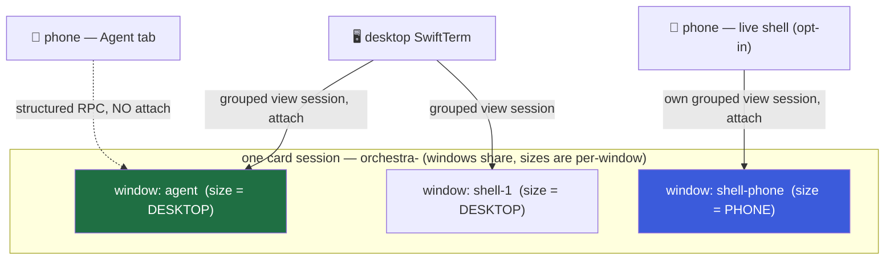

# Phone Agent & Terminal UX (and the shared-tmux sizing problem)

> A design pass over two intertwined phone problems the mobile spec left open:
> **(1)** a raw tmux is not a phone-native surface — what should the phone's Agent and Terminal
> tabs actually *be*? and **(2)** the desktop and the phone would attach to the **same** tmux, and
> tmux sizes a window to its clients, so a narrow phone attaching **thrashes the desktop agent's
> size-sensitive TUI**. Both problems have the *same* root fix, which is the nice part.
>
> Scope: a design note, not code. Extends [[phone-client/01-design]] (which built the
> Transport/reconnect/SSH-PTY seams) and refines §3 of the
> [mobile spec](docs/superpowers/specs/2026-07-01-mobile-orchestra-design.md).

## TL;DR — the recommendation

1. **The phone never attaches a live PTY to the agent window.** The **Agent tab** is a *structured,
   RPC-rendered* view of the session (conversation + tool calls + gates), not a SwiftTerm attach to
   `orchestra-<id>:agent`. This is both the phone-native answer to Problem 1 **and** the complete fix
   for Problem 2 — the size-sensitive agent TUI simply has no phone client on it, ever, so it cannot
   be resized by the phone.
2. **The Terminal tab is a secondary escape hatch, reimagined as a block REPL.** The common case
   ("run `git status`", "`npm test`", "tail the log once") is a **one-shot RPC exec → copyable output
   block** — no PTY, no tmux, no sizing concern at all. A live interactive shell ("Attach shell") is
   an opt-in deeper mode.
3. **When a live shell *is* attached, it runs in a phone-owned window** (its own `shell-N` +
   grouped view session), sized to the phone. Per-window sizes are **independent** (verified below),
   so the desktop's agent/shell windows keep their sizes. **No `embedded.conf` change is needed** for
   the primary path.

Everything below is the reasoning, the verified tmux behavior, and the failure modes.

---

## Problem 2 first — because it constrains Problem 1

The sizing constraint is the load-bearing fact, so establish it before designing the UI.

### The one rule that decides everything

> **In tmux a *window* has exactly one size at a time.** A window is a single grid of cells. When two
> clients display the same window at different sizes, tmux must *pick one* size (per `window-size`);
> it cannot render one window at two sizes. Grouped sessions (`new-session -t`) give each client an
> independent **current-window selection** — but **not** an independent **per-window size**.

Corollary: **the only way for the phone and the desktop to have independent sizes is for them to be
looking at *different windows*.** No amount of session-grouping, `aggressive-resize`, or `window-size`
tuning escapes this, because they all only choose *which* client's size a shared window takes — they
never give a shared window two sizes.

### What the code already does (and why it's relevant)

Orchestra already exploits grouped sessions. `SessionManager.viewSession(base, window)` names a
throwaway grouped session `<base>__<window>`; `AgentTerminalView.attachScript()` does:

```sh
tmux -L <sock> new-session -d -s <base>__<window> -t <base>   # grouped: shares base's window list
tmux -L <sock> select-window -t <base>__<window>:<window>     # but its OWN current window
exec  tmux -L <sock> attach -t <base>__<window>
```

Why: *"tmux keeps every client of a single session on the same active window, so attaching them all to
`session` would make opening a shell yank the agent terminal onto the shell window."* (comment in
`AgentTerminalView.swift`). So on the **desktop**, the agent terminal and each shell are separate
SwiftTerm clients, each on its own grouped view session, each pinned to a different window. They don't
fight because **they're on different windows** — which, per the rule above, is exactly why each keeps
its own size.

`embedded.conf` sets the sizing policy:

```
setw -g window-size latest       # follow the most-recently-active client
setw -g aggressive-resize on
```

### Verified tmux behavior (tmux 3.7, this machine)

I ran controlled experiments on a scratch tmux server with `embedded.conf`'s sizing options. Results:

| # | Test | Result | Conclusion |
|---|------|--------|------------|
| A | `new-session -t base` twice → group `base`; `list-windows` on each | both grouped sessions list the *same* windows | grouped sessions **share the window list** ✓ |
| B | `resize-window base:agent -x200 -y50`, `resize-window base:shell-1 -x80 -y40` | agent stays `200×50` while shell-1 is `80×40`, **simultaneously** | **per-window sizes are independent** ✓ (the linchpin) |
| C | `man tmux` wording for the two knobs | quoted below | policy for a *shared* window |

`man tmux` (3.7), verbatim:

- **`window-size latest`** — *"tmux uses the size of the client that had the most recent activity."*
  (Others: `largest` = largest attached session, `smallest` = smallest, `manual` = fixed via
  `resize-window`/`default-size`.)
- **`aggressive-resize on`** — *"tmux will resize the window to the size of the smallest or largest
  session … **for which it is the current window**, rather than the session to which it is attached.
  … good for full-screen programs which support SIGWINCH and **poor for interactive programs such as
  shells**."*

Two consequences that shape the design:

1. **`window-size latest` is a trap for any window the phone shares with the desktop.** The moment the
   phone becomes the most-recently-active client on that window, the window snaps to phone width and
   the desktop's Claude/Codex TUI reflows/redraws. This is Problem 2, precisely, and it is *worse*
   than the `smallest` default the task assumed — with `latest` it thrashes back and forth as focus
   alternates.
2. **`aggressive-resize on` is a gift — it scopes a client's influence to the window it is *currently
   looking at*.** A phone attached to a grouped session whose *current window* is a shell does **not**
   resize the agent window, because the agent window is not that client's current window. So as long
   as the phone's current window is never the agent window, `aggressive-resize` keeps the agent TUI
   safe *even if the phone is attached to the same session group*. Belt to the "different window"
   suspenders.

### Weighing the options the task listed

| Option | Verdict | Why |
|--------|---------|-----|
| `aggressive-resize` + `window-size` tuning **on a shared window** | ✗ insufficient alone | A shared window still has one size; these only choose *whose*. `latest` thrashes; `smallest` shrinks the desktop; `largest` clips the phone. |
| **Session groups** (`new-session -t`) | ✓ necessary, ✗ not sufficient by itself | Give independent *current-window*, so the phone can sit on a *different* window from the desktop. But two grouped sessions on the *same* window still share that window's one size. |
| **Dedicated phone-sized session/window** (phone on its own window) | ✓ **the answer** | Different window ⇒ independent size (Test B). Composes with the existing `viewSession` machinery. |
| Read-only mirror of the agent window | ~ partial | Removes *interactive* resize pressure but a live attach still counts as a client and still sizes the window; only a non-attaching capture (RPC text) is truly free. → folds into "structured Agent view". |
| Detach / freeze the desktop while the phone is attached | ✗ hostile | The desktop is the user's primary surface; a phone glance must never blank or reflow it. Rejected. |
| **Phone never shares the agent's own tmux window** | ✓✓ **recommended** | The clean generalization: the phone's *reading* of the agent is structured RPC (no client at all), and the phone's *shell*, when used, is a phone-owned window. The agent TUI never has a phone client. |

### The recommendation (Problem 2)

- **Agent window: zero phone clients, ever.** The phone reads the agent session as *structured data*
  over the existing control RPC (see Problem 1) — it does **not** `attach` the `agent` window. So the
  size-sensitive TUI has only the desktop client and keeps its width. This is the single most
  important decision in this note.
- **Live phone shell: a phone-owned window.** When the user explicitly attaches a live shell, the
  phone creates/reuses **its own** `shell-N` window (via the existing `newShellWindow` +
  `viewSession` path) and attaches at phone size. Test B guarantees the desktop's `agent`/`shell-*`
  windows are unaffected. Torn down on tab-close/disconnect exactly like `closeShellWindow` (which
  already kills the grouped view session first to avoid leaking the shared window).
- **No `embedded.conf` change for the primary path.** `window-size latest` + `aggressive-resize on`
  stay as-is — they exist for the desktop's SwiftTerm↔CLI interop, and `aggressive-resize` gives the
  bonus per-window isolation above. We deliberately do **not** flip the global to `largest`/`manual`,
  because that would degrade the desktop's own multi-client behavior.

**Escape hatch — if the phone ever truly must watch the *live agent TUI*** (not the structured view —
e.g. debugging a rendering glitch): make it an explicit, opt-in "mirror agent terminal (live)" action
and protect the agent window one of three ways, in order of preference:
1. the desktop is usually detached from that card when you're steering from your phone anyway → no
   conflict;
2. temporarily pin the agent window with a **per-window** `setw -t <agent-window> window-size manual`
   + `resize-window` to the desktop's last size, so the phone client gets a clipped/scrolled view but
   the TUI never reflows (restore on detach);
3. accept the reflow (user opted in). Default remains: **don't** — the structured view is the answer
   99% of the time.

### Failure modes to design against

- **Orphaned phone shell windows.** A phone that drops without a clean close leaves its `shell-N`
  window alive. Grouped *view sessions* are already reaped by `SessionManager.kill`, but the phone's
  *window* would persist. Mitigation: name phone-created shells distinctly (e.g. a `phone-` prefix or
  a per-window flag) and reap on reconnect if no phone client is attached, or give them a TTL. Note in
  the contract layer.
- **Reconnect churn.** On the flaky mobile link, `ControlClient` reconnects (per phone-client L1).
  The Terminal attach must be **idempotent** — reuse the phone's existing shell window/view session if
  alive, never spawn a fresh one per reconnect (same reuse the desktop already does).
- **Codex Sixel width.** Codex emits Sixel images sized to the window; in the structured Agent view
  they're rendered as native images at the phone's width (good). Only the live-mirror escape hatch
  would inherit the desktop window's Sixel geometry — another reason it's opt-in.
- **`aggressive-resize` "poor for shells".** True in general, but our phone shell is its *own* window
  with a *single* client, so there's no competing client to churn against — the caveat doesn't bite.



---

## Problem 1 — what the phone's Agent and Terminal tabs should be

The sizing analysis already forced the headline: the phone reads the agent **structurally**, and the
raw shell is a secondary escape hatch. Now the UX.

### When does a phone user need the raw shell at all?

Rarely. The phone's job is **check and steer** ([[phone-client/01-design]]): *is the agent stuck, what
did it do, approve this, nudge it, glance at the diff.* That is entirely served by structured surfaces
(Agent, Needs-You, Diff). The raw shell is for the **manual escape hatch**: run a one-off command in
the worktree, inspect a file, kill a runaway process, re-run a test. That's real but occasional. So:

> **The Terminal tab is NOT first-class on the phone. The Agent tab is the primary surface; Terminal
> is a secondary escape hatch.** (The mobile spec lists them as peer tabs; this note demotes Terminal
> in prominence, not in existence.)

### The Agent tab — structured, not a PTY

The current spec says *"Agent — the live agent session … **SSH PTY** per phone-client."* **Change
that.** On the phone the Agent tab is a **native, structured render** of the session, reflowing to the
phone's width like any SwiftUI list — never a fixed-width TUI shrunk onto a 390pt screen. It is fed by
control RPC, not a byte stream:

- **Reading** — a conversation/tool-call timeline: user prompts, assistant text, tool calls
  (collapsed → tap to expand), diffs/file-writes as native blocks, the context-window ring, the status
  pill. Source: the adapter's session state that already drives the board (status, `ctxPct`, `desc`,
  `waitReason`) plus the provider transcript (Claude Code's JSONL; Codex's session file) surfaced over
  RPC. A pragmatic **interim** is a periodic `capture-pane` text render (already available via
  `SessionManager.capture`) shown read-only — ugly but zero-attach and correct on sizing; the target
  is the structured timeline.
- **Steering** — a "Message the agent" bar → a discrete `send`/`send-keys` RPC (the daemon already
  exposes this; `SessionManager.sendKeys`). No live attach, so **no resize pressure** from typing.
- **Gates** — surfaced as structured actions, not TUI keystrokes:
  - **Claude Code** has the permission hook → an approve/deny gate becomes a first-class
    **Needs-You** row with Approve/Deny buttons (already in the mobile design). The phone never has to
    "press 2 in the TUI".
  - **Codex** has **no permission hook** and different session semantics. Its interactive prompts
    (trust, y/n, a menu selection) can't always be pre-structured. Handle them as **discrete key
    sends** — render the prompt from the captured pane and offer the choices as buttons that send the
    corresponding key (`y`, `1`, arrows+Enter) over `send-keys`. Still no attach, still no resize.
    Where Codex genuinely needs live navigation, it falls through to the shell escape hatch's live
    mode (opt-in, phone-owned window).

This single decision (structured, not PTY) is what makes the Agent tab both phone-native *and*
Problem-2-safe.

### The Terminal tab — a block REPL, with an opt-in live mode

Reimagine the raw shell around the two things a phone user actually does:

**Default mode — one-shot exec blocks (no PTY, no tmux, no sizing).** A prominent "Run a command…"
field. Submitting runs the command in the worktree via a control RPC (the daemon already has an
`exec`/`shell` control surface) and appends a **block**: the command line + its output, rendered as a
native, selectable, **tap-to-copy** unit — a notebook-of-blocks / REPL. This covers `git status`,
`npm test`, `cat`, `ls`, `rg`, one-shot `tail`. It is the most phone-native shell there is: no
keyboard-accessory gymnastics, no fixed-width reflow, copy is a long-press, and sizing is a non-issue
because nothing attaches.

**Opt-in mode — "Attach shell" (live PTY).** For genuinely interactive needs (a REPL, `tail -f`, an
editor, a curses tool), an explicit toggle attaches a live SwiftTerm-iOS PTY to a **phone-owned shell
window** (Problem 2 §recommendation). This is the only place the phone runs a real terminal, and it's
where the reinterpreted terminal affordances live.

### Fate of each desktop terminal affordance on the phone

| Desktop affordance | Phone | Rationale |
|--------------------|-------|-----------|
| Full key-accessory bar (esc / ctrl / arrows / tab / ⌥) | **Cut → minimal contextual bar** (esc · ctrl-as-sticky-modifier · tab · ↑↓), live mode only | The block REPL needs none of it; the live mode needs only the few keys a soft keyboard lacks. Drop ⌥ and ←→ to a "more" affordance. |
| Multiple `shell-N` tabs | **Single shell** by default; list/switch on demand | Multi-shell is desktop power-use; a phone wants one escape hatch. The daemon still supports N; the phone just doesn't lead with tabs. |
| Mouse-wheel scrollback (copy-mode forwarding) | **Native touch scroll** | Blocks scroll like any list; live mode scrolls a captured buffer. tmux copy-mode is hostile to touch — don't expose it. |
| Fiddly text selection | **Tap / long-press-to-copy blocks** | Selection of fixed-width TUI text is miserable on touch; block-granular copy is the native idiom. |
| Tiny fixed-width text | **Dynamic Type-aware**; **landscape = "real terminal" mode** | Portrait = command + recent output, reflow-tolerant. Landscape unlocks width/columns for the live mode — the closest thing to the desktop feel. |
| Raw char-by-char command input | **Send-a-line field** (block REPL) / soft keyboard (live mode) | Sending whole lines over RPC beats PTY-keystroking a narrow window and needs no attach. |

### Division of responsibility on a small screen

- **Agent (primary, ~90% of phone use):** what the agent is doing, its conversation & tool calls, the
  steer bar, and the approve/deny gates. Structured, reflows, no attach.
- **Terminal (secondary escape hatch):** the manual worktree shell. Default = block REPL (no PTY);
  opt-in = a live phone-owned shell. This is where the reinterpreted key bar / single shell / landscape
  live.
- **Needs-You** already carries the *urgent* interactions (permission, blocked, review) out of both
  tabs and into a badged queue, which is why the Agent tab can stay read-mostly.

---

## Decisions made

| Decision | Why | Rejected |
|----------|-----|----------|
| Phone Agent tab = **structured RPC render**, not an SSH PTY to the agent window | Phone-native (reflows) **and** the complete Problem-2 fix (no phone client on the size-sensitive TUI) | Attach a live PTY to `agent` (spec's current wording) — thrashes the desktop TUI |
| Phone never attaches a client to the **agent window** | A window has one size; the only safe move is "no phone client on it" | Rely on `window-size`/`aggressive-resize` to reconcile two sizes on one window — impossible |
| Live phone shell runs in a **phone-owned window** (own grouped view session), phone-sized | Per-window sizes are independent (verified Test B); reuses existing `viewSession`/`newShellWindow`/`closeShellWindow` | A dedicated phone *session* that mirrors the agent window; detaching/freezing the desktop |
| Terminal tab = **secondary escape hatch**, default **block REPL** (one-shot RPC exec) | The common case is "run a command, read output" — needs no PTY, no tmux, no sizing | Terminal as a first-class peer of Agent; a full raw-tmux mirror |
| Keep `embedded.conf` (`window-size latest` + `aggressive-resize on`) unchanged for the primary path | Serves desktop SwiftTerm↔CLI interop; `aggressive-resize` gives bonus per-window isolation | Flip the global to `largest`/`manual` and degrade desktop multi-client behavior |
| Codex gates = **discrete key-sends from a captured prompt**; Claude gates = **structured Needs-You** | Codex has no permission hook / different session semantics; don't design only for Claude | A single Claude-shaped permission UI; forcing Codex users into a live TUI attach |

## Open questions — need a call

- **Structured transcript vs. capture fallback for the Agent tab.** Target is a parsed
  conversation/tool-call timeline from the provider transcript (Claude JSONL / Codex session file)
  over RPC. Is a read-only `capture-pane` render an acceptable **v1** while the structured feed is
  built, or should v1 wait for the structured feed? (Recommend: ship capture-fallback v1, evolve to
  structured — it's already Problem-2-safe.)
- **Phone-owned shell lifecycle.** Prefix/flag phone shells and reap on reconnect-with-no-client, or a
  TTL? (Recommend: a `phone-`-scoped window name + reap-on-reconnect, specified at the contract layer.)
- **Does the phone need the live-agent-TUI mirror at all in v1?** Recommend **no** — ship structured
  Agent + block-REPL Terminal + opt-in live *shell*; add the live *agent* mirror only if a real need
  appears.

## Traceability

| Concern | Addressed by |
|---------|--------------|
| Problem 1 — raw tmux isn't phone-native | Structured Agent tab; Terminal demoted to a block-REPL escape hatch; affordance-fate table |
| Problem 1 — Claude *and* Codex | Claude gates → Needs-You; Codex gates → discrete key-sends; live-shell fallback for Codex TUI nav |
| Problem 2 — shared-tmux sizing chaos | Phone never attaches the agent window (structured RPC); live shell = phone-owned window; verified per-window independence |
| Keep the agent TUI safe from resize thrash | No phone client on the agent window + `aggressive-resize` scoping; opt-in mirror is pinned/`manual` |
| Reuse, no daemon change | Existing `viewSession`/`sendKeys`/`capture`/`exec` RPC + SSH-forwarded transport (phone-client L1) |
