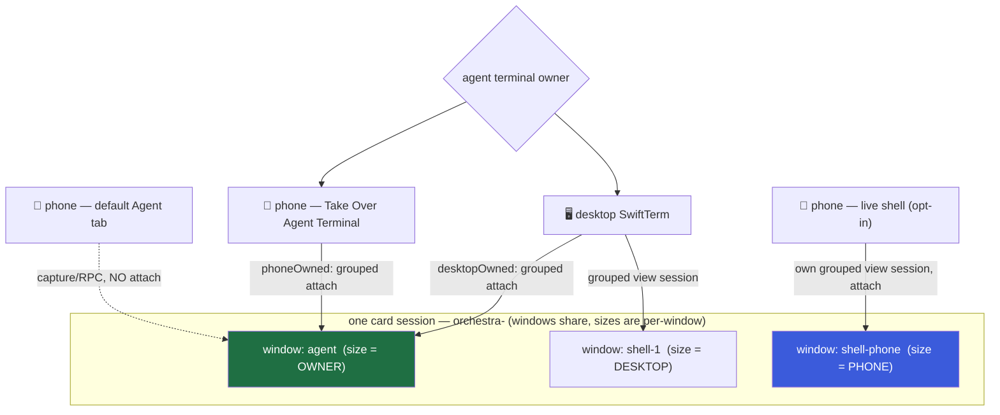

# Phone Agent & Terminal UX (capture by default, exclusive takeover for live control)

> A design pass over two intertwined phone problems the mobile spec left open:
> **(1)** a raw tmux is not a phone-native surface — what should the phone's Agent and Terminal
> tabs actually *be*? and **(2)** the desktop and the phone would attach to the **same** tmux, and
> tmux sizes a window to its clients, so a narrow phone attaching **thrashes the desktop agent's
> size-sensitive TUI**.
>
> The answer is **mode-based**: casual phone use reads through non-attaching capture/structured UI,
> while real live control uses an explicit **Take Over Agent Terminal** transition. During takeover
> the phone may attach to the real agent TUI, but only after Orchestra makes ownership exclusive and
> the desktop unmounts its terminal.
>
> Scope: a design note, not code. Extends [[phone-client/01-design]] (which built the
> Transport/reconnect/SSH-PTY seams) and refines §3 of the
> [mobile spec](docs/superpowers/specs/2026-07-01-mobile-orchestra-design.md).

## TL;DR — the recommendation

1. **Default Agent tab: do not attach; read via capture now, structure later.** The everyday phone
   surface should still be a native Agent view: `capture-pane` text in v1, then a structured
   transcript/control timeline when that product work exists. This keeps casual checking safe and
   avoids committing v1 to a provider-neutral RPC renderer.
2. **Live Agent control: explicit exclusive takeover.** If Allen is moving from desktop to phone and
   wants the *real* Claude/Codex TUI, the phone can tap **Take Over Agent Terminal**. Orchestra grants
   a short-lived ownership lease, the desktop unmounts its agent terminal and shows a "Taken over by
   phone" placeholder, and the phone attaches to `orchestra-<id>:agent`. Reflow is expected because
   only one surface owns the terminal at a time. This is much easier than full structured RPC.
3. **The Terminal tab is a secondary escape hatch, reimagined as a block REPL.** The common case
   ("run `git status`", "`npm test`", "tail the log once") is a **one-shot RPC exec → copyable output
   block** — no PTY, no tmux, no sizing concern at all. A live interactive shell ("Attach shell") is
   an opt-in deeper mode.
4. **When a live shell *is* attached, it runs in a phone-owned window** (its own `shell-N` +
   grouped view session), sized to the phone. Per-window sizes are **independent** (verified below),
   so the desktop's agent/shell windows keep their sizes. **No `embedded.conf` change is needed** for
   the primary path.

Everything below is the reasoning, the verified tmux behavior, and the failure modes.

---

## Problem 2 first — because it constrains Problem 1

The sizing constraint is the load-bearing fact, so establish it before designing the UI.

### The one rule that decides everything

> **In tmux a *window* has exactly one size at a time.** A window is a single grid of cells. When two
> clients display the same window at different sizes, tmux must *pick one* size (per `window-size`);
> it cannot render one window at two sizes. Grouped sessions (`new-session -t`) give each client an
> independent **current-window selection** — but **not** an independent **per-window size**.

Corollary: **there are only two safe patterns.** If the desktop and phone are active at the same time,
they must look at *different windows* so their sizes are independent. If the phone must control the
real `agent` window, the product must make that control **exclusive**: desktop detaches/unmounts,
phone owns the one size, and reflow is intentional rather than accidental. No amount of
session-grouping, `aggressive-resize`, or `window-size` tuning gives one shared window two sizes.

### What the code already does (and why it's relevant)

Orchestra already exploits grouped sessions. `SessionManager.viewSession(base, window)` names a
throwaway grouped session `<base>__<window>`; `AgentTerminalView.attachScript()` does:

```sh
tmux -L <sock> new-session -d -s <base>__<window> -t <base>   # grouped: shares base's window list
tmux -L <sock> select-window -t <base>__<window>:<window>     # but its OWN current window
exec  tmux -L <sock> attach -t <base>__<window>
```

Why: *"tmux keeps every client of a single session on the same active window, so attaching them all to
`session` would make opening a shell yank the agent terminal onto the shell window."* (comment in
`AgentTerminalView.swift`). So on the **desktop**, the agent terminal and each shell are separate
SwiftTerm clients, each on its own grouped view session, each pinned to a different window. They don't
fight because **they're on different windows** — which, per the rule above, is exactly why each keeps
its own size.

`embedded.conf` sets the sizing policy:

```
setw -g window-size latest       # follow the most-recently-active client
setw -g aggressive-resize on
```

### Verified tmux behavior (tmux 3.7, this machine)

I ran controlled experiments on a scratch tmux server with `embedded.conf`'s sizing options. Results:

| # | Test | Result | Conclusion |
|---|------|--------|------------|
| A | `new-session -t base` twice → group `base`; `list-windows` on each | both grouped sessions list the *same* windows | grouped sessions **share the window list** ✓ |
| B | `resize-window base:agent -x200 -y50`, `resize-window base:shell-1 -x80 -y40` | agent stays `200×50` while shell-1 is `80×40`, **simultaneously** | **per-window sizes are independent** ✓ (the linchpin) |
| C | `man tmux` wording for the two knobs | quoted below | policy for a *shared* window |

`man tmux` (3.7), verbatim:

- **`window-size latest`** — *"tmux uses the size of the client that had the most recent activity."*
  (Others: `largest` = largest attached session, `smallest` = smallest, `manual` = fixed via
  `resize-window`/`default-size`.)
- **`aggressive-resize on`** — *"tmux will resize the window to the size of the smallest or largest
  session … **for which it is the current window**, rather than the session to which it is attached.
  … good for full-screen programs which support SIGWINCH and **poor for interactive programs such as
  shells**."*

Two consequences that shape the design:

1. **`window-size latest` is a trap for any window the phone shares with the desktop.** The moment the
   phone becomes the most-recently-active client on that window, the window snaps to phone width and
   the desktop's Claude/Codex TUI reflows/redraws. This is Problem 2, precisely, and it is *worse*
   than the `smallest` default the task assumed — with `latest` it thrashes back and forth as focus
   alternates.
2. **`aggressive-resize on` is a gift — it scopes a client's influence to the window it is *currently
   looking at*.** A phone attached to a grouped session whose *current window* is a shell does **not**
   resize the agent window, because the agent window is not that client's current window. So as long
   as the phone's current window is never the agent window, `aggressive-resize` keeps the agent TUI
   safe *even if the phone is attached to the same session group*. Belt to the "different window"
   suspenders.

### Weighing the options the task listed

| Option | Verdict | Why |
|--------|---------|-----|
| `aggressive-resize` + `window-size` tuning **on a shared window** | ✗ insufficient alone | A shared window still has one size; these only choose *whose*. `latest` thrashes; `smallest` shrinks the desktop; `largest` clips the phone. |
| **Session groups** (`new-session -t`) | ✓ necessary, ✗ not sufficient by itself | Give independent *current-window*, so the phone can sit on a *different* window from the desktop. But two grouped sessions on the *same* window still share that window's one size. |
| **Dedicated phone-sized session/window** (phone on its own window) | ✓ **the answer** | Different window ⇒ independent size (Test B). Composes with the existing `viewSession` machinery. |
| Read-only mirror of the agent window | ~ partial | Removes *interactive* resize pressure but a live attach still counts as a client and still sizes the window; only a non-attaching capture/RPC render is truly free. → folds into the default Agent view. |
| Detach / freeze the desktop while the phone is attached | ~ viable when explicit | Hostile as an automatic phone glance, but acceptable as an explicit **Take Over** transition if Allen is not using desktop and phone at the same time. |
| **Exclusive Take Over Agent Terminal** | ✓✓ **recommended v1 live-control path** | For live control, forbid simultaneity instead of building a provider-neutral renderer. The phone may attach to the real `agent` window only after acquiring ownership; the desktop placeholder offers Retake. |
| **Phone never concurrently shares the agent's tmux window** | ✓✓ **invariant** | More accurate than a blanket attach ban: casual reading is non-attaching; live takeover attaches, but only after the desktop client has been removed from that window. |

### The recommendation (Problem 2)

- **Agent window: zero concurrent desktop+phone clients.** The default phone Agent view reads via
  non-attaching capture/RPC (see Problem 1). When the user explicitly takes over, the desktop agent
  terminal must unmount before the phone attaches. This preserves the hard tmux invariant: a shared
  window has one size, so the product must avoid two active clients with different sizes.
- **Live Agent takeover: server-authoritative ownership.** The hard part is not `tmux attach`; the
  existing `AgentTerminalView`/`viewSession` path already has that primitive. The hard part is making
  the daemon the authority for "who owns this agent terminal right now" so the desktop does not
  instantly reattach and resize-fight the phone. Treat ownership as ephemeral UI coordination, not
  durable card state.
- **Live phone shell: a phone-owned window.** When the user explicitly attaches a live shell, the
  phone creates/reuses **its own** `shell-N` window (via the existing `newShellWindow` +
  `viewSession` path) and attaches at phone size. Test B guarantees the desktop's `agent`/`shell-*`
  windows are unaffected. Torn down on tab-close/disconnect exactly like `closeShellWindow` (which
  already kills the grouped view session first to avoid leaking the shared window).
- **No `embedded.conf` change for the primary path.** `window-size latest` + `aggressive-resize on`
  stay as-is — they exist for the desktop's SwiftTerm↔CLI interop, and `aggressive-resize` gives the
  bonus per-window isolation above. We deliberately do **not** flip the global to `largest`/`manual`,
  because that would degrade the desktop's own multi-client behavior.

### Option 1 mapped — Exclusive Take Over Agent Terminal

This is the pragmatic v1/fallback for real live control. It gives up simultaneous desktop+phone use
for that one card, which removes the need for a huge provider-neutral RPC renderer.

**State model.** Add an ephemeral owner record, keyed by `cardId` + `window = agent`:

```text
available -> desktopOwned -> phoneOwned -> desktopOwned
```

Suggested fields: `ownerKind` (`desktop` / `phone`), `clientId`, `epoch`, `cardId`, `window`,
`updatedAt`. The `epoch` is important: it prevents a stale phone release from clearing a newer desktop
retake.

**Transitions.**

1. Desktop selects a card: acquire `desktopOwned` unless the agent is `phoneOwned`. If the phone owns
   it, render a terminal placeholder with **Retake Terminal**.
2. Phone opens the Agent tab: show status/capture and a **Take Over Agent Terminal** button.
3. Phone taps Take Over: daemon sets `phoneOwned`, increments `epoch`, emits a state event, detaches
   old agent-view clients, and returns an attach recipe.
4. Desktop receives the event: it tears down `AgentTerminalView` for that card and shows "Taken over
   by phone".
5. Phone attaches its SwiftTerm-iOS SSH PTY to the grouped `agent` view session. The agent TUI reflows
   to phone size; that is intentional.
6. Phone taps **Return to Desktop**, or desktop taps **Retake Terminal**: daemon flips ownership,
   detaches the phone client, and the desktop reattaches. The TUI reflows back to desktop size.
7. Phone disconnects: keep ownership for a short heartbeat window, then mark it stale. Desktop can
   force-retake a stale phone owner.

**Attach mechanics.** Reuse the existing grouped view-session pattern, but make it takeover-aware:

```sh
tmux -L "$sock" new-session -d -s "$base__agent" -t "$base" 2>/dev/null
tmux -L "$sock" select-window -t "$base__agent:agent" 2>/dev/null
tmux -L "$sock" detach-client -s "$base__agent" 2>/dev/null
exec tmux -L "$sock" attach -t "$base__agent"
```

Do **not** reach first for `resize-window`; it sets `window-size manual` and can leave the agent
window pinned if restore is missed. With the existing `window-size latest`, the active phone PTY should
naturally drive the size during takeover, and desktop retake should naturally resize back.

**Control surface.** Add app/client RPCs rather than a full transcript RPC system:

- `agentTerminalOwner(ref)` -> current owner, epoch, stale/fresh state.
- `takeOverAgentTerminal(ref, clientId)` -> compare-and-set owner, emit event, detach prior clients,
  return attach target.
- `releaseAgentTerminal(ref, clientId, epoch)` -> clear only if the caller still owns the current
  epoch.
- `heartbeatAgentTerminal(ref, clientId, epoch)` -> keep a mobile takeover fresh across reconnects.

These are small coordination RPCs. They are not a semantic Claude/Codex renderer.

### Failure modes to design against

- **Orphaned phone shell windows.** A phone that drops without a clean close leaves its `shell-N`
  window alive. Grouped *view sessions* are already reaped by `SessionManager.kill`, but the phone's
  *window* would persist. Mitigation: name phone-created shells distinctly (e.g. a `phone-` prefix or
  a per-window flag) and reap on reconnect if no phone client is attached, or give them a TTL. Note in
  the contract layer.
- **Reconnect churn.** On the flaky mobile link, `ControlClient` reconnects (per phone-client L1).
  The Terminal attach must be **idempotent** — reuse the phone's existing shell window/view session if
  alive, never spawn a fresh one per reconnect (same reuse the desktop already does).
- **Desktop reattaches during phone ownership.** Suppress `AgentTerminalView` while a phone owner is
  fresh. A purely local UI flag is not enough; ownership has to come from the daemon so desktop, phone,
  CLI, and reconnect all see the same state.
- **Bypass attaches.** Raw `tmux attach` and any CLI path that directly attaches to `agent` can bypass
  the lease. Either route those through the same ownership API or document them as unmanaged/debug
  surfaces that can resize the TUI.
- **Stale phone owner.** A phone can lose network while owning the agent. Use heartbeat + epoch and
  offer a visible **Force Retake** once stale.
- **Multiple phones.** Use compare-and-set on `epoch`; never let a stale release clear a newer owner.
- **Special-key input.** `SessionManager.sendKeys` is currently a line-send helper: literal text, then
  Enter. Live takeover uses the SSH PTY directly, but captured-prompt buttons and any non-live
  fallback need a constrained key-send API for `Esc`, arrows, `Tab`, `Ctrl-C`, `PgUp`, etc. Do not
  overload the existing "send a message" command with arbitrary key names without an explicit schema.
- **Manual resize pinning.** If a future implementation uses `resize-window`, it must restore
  `window-size latest`; otherwise the agent window can stay pinned after retake. Prefer relying on the
  attached client's PTY size.
- **Codex Sixel width.** Codex emits Sixel images sized to the window; in the target structured Agent
  view they're rendered as native images at the phone's width (good). The v1 capture fallback shows
  whatever the agent pane already rendered. Live takeover makes Codex redraw at phone width; that is
  acceptable because takeover is explicit.
- **`aggressive-resize` "poor for shells".** True in general, but our phone shell is its *own* window
  with a *single* client, so there's no competing client to churn against — the caveat doesn't bite.



---

## Problem 1 — what the phone's Agent and Terminal tabs should be

The sizing analysis now yields a three-tier UX, ordered from safest to most powerful:

1. native/capture Agent view for checking and steering;
2. block-REPL Terminal for one-shot commands;
3. explicit live takeover for the moments when the real TUI matters.

### When does a phone user need the raw shell at all?

Rarely. The phone's job is **check and steer** ([[phone-client/01-design]]): *is the agent stuck, what
did it do, approve this, nudge it, glance at the diff.* That is entirely served by structured surfaces
(Agent, Needs-You, Diff). The raw shell is for the **manual escape hatch**: run a one-off command in
the worktree, inspect a file, kill a runaway process, re-run a test. That's real but occasional. So:

> **The Terminal tab is NOT first-class on the phone. The Agent tab is the primary surface; Terminal
> is a secondary escape hatch.** (The mobile spec lists them as peer tabs; this note demotes Terminal
> in prominence, not in existence.)

### The Agent tab — capture/structured by default, takeover on demand

The current spec says *"Agent — the live agent session … **SSH PTY** per phone-client."* **Change
that.** The default phone Agent tab is a native read/control surface, not a live terminal attach.
This avoids accidental reflow when the user only wants to check status.

- **Reading** — v1 can ship as a read-only `capture-pane` text render (already available via
  `SessionManager.capture`) shown in a native scroll view. It is ugly, but it is zero-attach and
  correct on sizing. The target is a conversation/tool-call timeline: user prompts, assistant text,
  tool calls (collapsed → tap to expand), diffs/file-writes as native blocks, the context-window ring,
  and the status pill. Source: the adapter's session state that already drives the board (status,
  `ctxPct`, `desc`, `waitReason`) plus the provider transcript (Claude Code's JSONL; Codex rollout /
  app-server events) surfaced over RPC. Treat that structured transcript feed as new product work, not
  something the current control surface already fully provides.
- **Steering** — a "Message the agent" bar → a discrete `send`/`send-keys` RPC (the daemon already
  exposes this; `SessionManager.sendKeys`). No live attach, so **no resize pressure** from typing.
- **Gates** — surfaced as structured actions, not TUI keystrokes:
  - **Claude Code** has the permission hook → an approve/deny gate becomes a first-class
    **Needs-You** row with Approve/Deny buttons (already in the mobile design). The phone never has to
    "press 2 in the TUI".
  - **Codex** is not wired in Orchestra today as a first-class permission gate: the current
    `codex-hooks.json` installs only `SessionStart`, and rollout-tail telemetry only produces coarse
    status/ctx updates. Current Codex docs do expose a `PermissionRequest` hook event, so the right
    implementation direction is to wire Codex permission requests into the same `waitReason =
    .permission` / **Needs-You** surface where possible. Until that lands, and for non-permission TUI
    prompts (trust, y/n, a menu selection), use **discrete key sends** from a captured prompt: render
    the prompt from the captured pane and offer buttons that send the corresponding key (`y`, `1`,
    arrows+Enter) over `send-keys`. Still no attach, still no resize. Where Codex genuinely needs live
    TUI navigation, it falls through to **Take Over Agent Terminal**.
- **Takeover** — a separate, explicit **Take Over Agent Terminal** button enters the real TUI. This is
  not the default Agent tab. It is a full-screen live terminal mode, guarded by the owner lease above,
  with a persistent **Return to Desktop** action.

This keeps the common "check and steer" path phone-native while giving a practical escape hatch that
does not require a massive cross-provider transcript renderer.

### Live takeover display — how the terminal should feel on phone

Takeover is for active control, so make it visibly different from reading mode:

- **Full-screen terminal.** Hide board chrome. Keep only a compact top bar with card title/status,
  connection state, owner state, and **Return to Desktop**.
- **Armed input.** First entry focuses the terminal visually but does not send text until the user taps
  **Start Typing** or uses a hardware keyboard. This avoids accidental destructive input while
  scrolling or inspecting.
- **Landscape encouraged, portrait allowed.** Portrait defaults to readable text, even if that means
  fewer than 80 columns. Landscape is the "real terminal" posture and should fit more columns. Provide
  `A-` / `A+`, pinch-to-change-font-size, and a **Fit Columns** toggle; do not make viewport zoom the
  primary control.
- **Scrolling.** Native/capture and block outputs scroll as SwiftUI text. In live PTY mode, one-finger
  vertical drag scrolls terminal scrollback; with the keyboard open it must still scroll, not send
  arrows. Avoid exposing tmux copy-mode as the primary touch scroll mechanism.
- **Copy/selection.** Captured text and exec blocks get native long-press/select/copy. Live PTY needs
  an explicit **Select** mode so normal drags cannot accidentally become terminal mouse input.
- **Accessory bar.** Show it only in live PTY / captured-prompt modes. Primary keys: `Esc`, sticky
  `Ctrl`, `Tab`, `Enter`, `Up`, `Down`. Secondary drawer: `Left`, `Right`, `PgUp`, `PgDn`, `Home`,
  `End`, `Meta` if needed. `Ctrl` is one-shot by default; double-tap locks it and shows a clear locked
  state.
- **Menu prompts.** Do not force arrow-key tapping for Claude/Codex choices. Best-effort parse the
  visible prompt/capture into semantic buttons (`Allow`, `Deny`, `1`, `2`, `y`, `n`, detected menu
  rows). Under the hood, send the minimal key or key sequence. Keep the raw accessory drawer as a
  fallback when parsing misses.
- **Hardware keyboard.** If an iPad/hardware keyboard is connected, mirror the desktop mental model:
  focus decides whether keys navigate the app or go to the terminal. Show a "Terminal owns keyboard"
  chip while live PTY is focused.

### The Terminal tab — a block REPL, with an opt-in live mode

Reimagine the raw shell around the two things a phone user actually does:

**Default mode — one-shot exec blocks (no PTY, no tmux, no sizing).** A prominent "Run a command…"
field. Submitting runs the command in the worktree via a control RPC (the daemon already has an
`exec`/`shell` control surface) and appends a **block**: the command line + its output, rendered as a
native, selectable, **tap-to-copy** unit — a notebook-of-blocks / REPL. This covers `git status`,
`npm test`, `cat`, `ls`, `rg`, one-shot `tail`. It is the most phone-native shell there is: no
keyboard-accessory gymnastics, no fixed-width reflow, copy is a long-press, and sizing is a non-issue
because nothing attaches.

**Opt-in mode — "Attach shell" (live PTY).** For genuinely interactive needs (a REPL, `tail -f`, an
editor, a curses tool), an explicit toggle attaches a live SwiftTerm-iOS PTY to a **phone-owned shell
window** (Problem 2 §recommendation). This is the only place the phone runs a real terminal, and it's
where the reinterpreted terminal affordances live.

Live shell uses the same interaction vocabulary as Agent takeover: full-screen or near-full-screen
terminal, compact owner bar, explicit select mode, minimal accessory keys, landscape-friendly sizing,
and deterministic reconnect to the same phone-owned window.

### Fate of each desktop terminal affordance on the phone

| Desktop affordance | Phone | Rationale |
|--------------------|-------|-----------|
| Full key-accessory bar (esc / ctrl / arrows / tab / ⌥) | **Minimal contextual bar** (`Esc`, sticky `Ctrl`, `Tab`, `Enter`, `Up`, `Down`; more drawer for the rest), live/captured-prompt modes only | The block REPL needs none of it; live mode needs only the few keys a soft keyboard lacks. |
| Multiple `shell-N` tabs | **Single shell** by default; list/switch on demand | Multi-shell is desktop power-use; a phone wants one escape hatch. The daemon still supports N; the phone just doesn't lead with tabs. |
| Mouse-wheel scrollback (copy-mode forwarding) | **Native touch scroll** | Blocks scroll like any list; live PTY scrolls terminal history directly. tmux copy-mode is a fallback, not the phone idiom. |
| Fiddly text selection | **Block copy by default; explicit Select mode in live PTY** | Selection of fixed-width TUI text is miserable on touch and conflicts with terminal mouse input. |
| Tiny fixed-width text | **Readable font first; landscape = "real terminal" mode** | Portrait is for transcript, block REPL, and quick takeover; landscape unlocks width/columns for extended live control. |
| Raw char-by-char command input | **Send-a-line field** (block REPL) / armed soft keyboard (live mode) | Sending whole lines over RPC beats PTY-keystroking for common commands; live input is reserved for explicit takeover/shell mode. |
| Up/down option menus | **Semantic choice buttons first; raw arrows fallback** | Claude/Codex prompts should become `Allow`/`Deny`/numbered buttons where possible; arrows remain available in the accessory drawer. |

### Division of responsibility on a small screen

- **Agent (primary, ~90% of phone use):** what the agent is doing, its conversation & tool calls, the
  steer bar, and the approve/deny gates. Capture-backed in v1, structured later, and non-attaching by
  default. **Take Over Agent Terminal** is the explicit live-control escape hatch.
- **Terminal (secondary escape hatch):** the manual worktree shell. Default = block REPL (no PTY);
  opt-in = a live phone-owned shell. This is where the reinterpreted key bar / single shell / landscape
  live.
- **Needs-You** already carries the *urgent* interactions (permission, blocked, review) out of both
  tabs and into a badged queue, which is why the Agent tab can stay read-mostly.

---

## Research notes

- **[tmux](https://man7.org/linux/man-pages/man1/tmux.1.html) supports the core takeover primitive.**
  A tmux session can survive detach/reattach, grouped sessions can pin each client to a chosen current
  window, and `send-keys` can send named keys like `C-a` or `NPage` as well as literal UTF-8. The
  design should use those primitives sparingly: ownership coordination belongs in Orchestra, while
  terminal bytes still ride tmux/SSH.
- **[SwiftTerm](https://github.com/migueldeicaza/SwiftTerm) supports the terminal side on iOS, but
  SSH wiring is app work.** SwiftTerm has an iOS `TerminalView`, colors, mouse events, terminal
  resizing, graphics support, and examples that wire iOS terminal views to SSH. This confirms live
  takeover is plausible without a daemon PTY proxy, but the iOS SSH/PTY integration remains a real
  implementation slice.
- **Existing mobile terminals converge on the same touch patterns.**
  [Blink's public docs](https://github.com/blinksh/blink) call out pinch font sizing, copy/paste by
  selection/tap, shell switching gestures, and sticky Ctrl/Alt modifiers in a SmartKeys bar. That
  supports the accessory-bar design above: small, mode-specific, sticky modifiers, with font-size
  gestures rather than semantic RPC rendering.
- **The local repo already has the key seams.** Desktop `AgentTerminalView` attaches through grouped
  tmux view sessions, remote terminals ride SSH `-tt`, `SessionManager.capture` gives the read-only
  fallback, and `exec` gives the block-REPL path. The missing piece is exclusive ownership state, not
  terminal rendering from scratch.

---

## Decisions made

| Decision | Why | Rejected |
|----------|-----|----------|
| Phone Agent tab defaults to a **non-attaching capture/RPC render** | Phone-native checking and steering without resizing the desktop TUI; structured timeline can come later | Make v1 depend on a full provider-neutral transcript renderer |
| **Take Over Agent Terminal** is the v1 live-control path | Much smaller than structured RPC; works with Claude/Codex/future terminal agents because it shows the real TUI | Simultaneous desktop+phone live attach to `agent`; pretending one tmux window can have two sizes |
| Phone never **concurrently shares** the agent window with desktop | A window has one size; exclusive ownership makes reflow intentional instead of accidental | Rely on `window-size`/`aggressive-resize` to reconcile two sizes on one window — impossible |
| Agent terminal ownership is daemon-authoritative (`ownerKind`, `clientId`, `epoch`, heartbeat) | Prevents desktop auto-reattach, stale release, and multi-phone races | Local-only UI flags; raw unmanaged attach as the normal path |
| Live phone shell runs in a **phone-owned window** (own grouped view session), phone-sized | Per-window sizes are independent (verified Test B); reuses existing `viewSession`/`newShellWindow`/`closeShellWindow` | A dedicated phone *session* that mirrors the agent window; detaching/freezing the desktop |
| Terminal tab = **secondary escape hatch**, default **block REPL** (one-shot RPC exec) | The common case is "run a command, read output" — needs no PTY, no tmux, no sizing | Terminal as a first-class peer of Agent; a full raw-tmux mirror |
| Keep `embedded.conf` (`window-size latest` + `aggressive-resize on`) unchanged for the primary path | Serves desktop SwiftTerm↔CLI interop; `aggressive-resize` gives bonus per-window isolation | Flip the global to `largest`/`manual` and degrade desktop multi-client behavior |
| Codex gates = **Needs-You when a Codex `PermissionRequest` hook is wired; captured-prompt key-sends as fallback** | Current Orchestra only installs Codex `SessionStart`, but current Codex supports `PermissionRequest`; don't fossilize a TUI-only workaround | A single Claude-shaped permission UI; forcing Codex users into a live TUI attach; pretending current Orchestra already has Codex approvals wired |

## Open questions — need a call

- **Structured transcript timeline timing.** v1 should ship capture fallback + exclusive takeover
  because that pair is already sizing-safe and provider-compatible. The structured feed should follow
  as an explicit later slice: parse provider transcript/app-server events into native timeline items
  rather than trying to infer everything from a pane scrape.
- **Ownership API placement.** The takeover RPCs are app/client coordination APIs, not necessarily MCP
  tools. They need to live where `ControlClient` subscriptions can update both desktop and phone.
- **Phone-owned shell lifecycle.** Use a deterministic phone-scoped window identity (for example
  `phone-<device-or-client>-<n>` or an equivalent per-window flag), reuse it on reconnect, and reap it
  on reconnect when no phone client is attached. A TTL is a backup cleanup policy, not the primary
  identity model.
- **Do unmanaged CLI attaches participate in ownership?** Recommend yes for first-class surfaces. Any
  remaining raw `tmux attach` path should be clearly debug/unmanaged because it can resize the agent
  window behind the lease.
- **Codex rich integration path.** Decide when to move beyond rollout-tail + key-sends. Current Codex
  app-server is designed for rich clients with conversation history, approvals, and streamed agent
  events; that is likely the long-term structured Codex Agent path, while captured prompts remain the
  low-risk compatibility fallback.

## Traceability

| Concern | Addressed by |
|---------|--------------|
| Problem 1 — raw tmux isn't phone-native | Capture/structured Agent tab by default; Terminal demoted to a block-REPL escape hatch; live TUI only after takeover |
| Problem 1 — Claude *and* Codex | Real TUI takeover works for any terminal agent; Claude/Codex native gates can still become Needs-You over time; captured-prompt buttons remain fallback |
| Problem 2 — shared-tmux sizing chaos | Phone never concurrently shares the agent window; live shell = phone-owned window; verified per-window independence |
| Keep the agent TUI safe from resize thrash | Daemon-authoritative ownership lease + desktop unmount on phone takeover; `aggressive-resize` scoping for separate shell windows |
| Reuse, limited daemon change | Existing `viewSession`/`sendKeys`/`capture`/`exec` + SSH-forwarded transport; new work is ownership coordination, not semantic transcript RPC |
