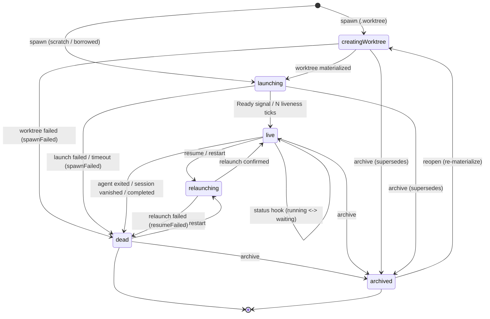
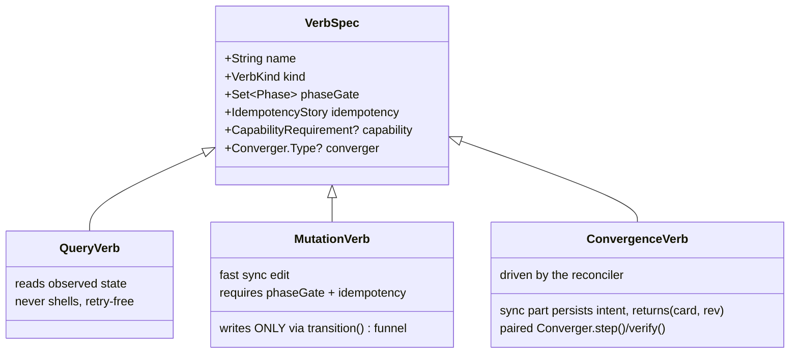

# Card Lifecycle Convergence — Design Spec

- **Status:** APPROVED + FINALIZED against `main` @ `f1aa568` (2026-07-09, card `4c2ec0`)
- **Date:** 2026-07-08 (finalized 2026-07-09)
- **Author:** card `025288` (design/lifecycle-convergence); finalization card `4c2ec0` (impl/lifecycle-convergence)
- **Approved direction:** "Intent + convergence" (approach B), approved after a deep adversarial review of branch `fix/spawn-hang-standalone`
- **Scope of this doc:** the full target design + a migration outline. The task-by-task plan lives in `notes/plans/2026-07-08-card-lifecycle-convergence.md`.
- **Finalization note (2026-07-09):** re-grounded on `main` @ `f1aa568` (the branch-tree merge landed after this spec was drafted). Corrections folded in: (a) the named timeout knobs (`sessionLaunchTimeout`/`worktreeAddTimeout`/`defaultControlTimeout`) do **not** exist on main — launches and checkouts are **unbounded** today, so this design *introduces* the knobs (§P3); (b) `provisioning` (flag + dict) never existed on main — it is branch-only; on main the uncoordinated variables are `status` + the `recovering` set (+ the branch would have added two more); (c) `reconcileLiveness`'s per-tick `sessions.list()` runs **on-actor** on main (the off-actor version was branch-only); (d) main is still **N:1** card↔branch (the 1:1 hard refusal `7bcde48` was reverted to a warning by `c099a82`; co-located sibling cards are an intentional, tested feature) — the refcount in §P3 is therefore *correct against main*, and 1:1 remains the separate worktree-coupling design's call; (e) branch-tree added new state machines + on-actor git sites this design must coexist with (§4 "Branch-tree surface", §9). Anchors in §2/§4/§9 are updated to `f1aa568`; anchors marked *(branch)* cite the discarded `fix/spawn-hang-standalone`.

---

## 1. TL;DR

Orchestra's card lifecycle is **edge-triggered** and spread across **four uncoordinated variables with no single writer**. Branch `fix/spawn-hang-standalone` made spawn non-blocking (good) but layered a fourth variable on top, and a review found **15 confirmed lifecycle bugs** — including worktree data-loss, a parent `wait` that hangs forever, a provisioning→zombie session collision, and a persisted flag that never reconciles after a daemon restart.

The fix is to make lifecycle **state-triggered and convergent**:

1. **One persisted `phase` per card**, written only through a single `transition()` funnel that validates edges, with a per-launch **epoch** that makes stale liveness signals harmless — this *deletes* the `recovering` set, grace timers, and the `provisioning` flag/dict.
2. **Slow verbs become persisted intent driven by an idempotent reconciler** — the phase *is* the intent; a crash-restart re-drives it. `reopen`/`archive`/`resume` stop freezing the actor.
3. A **`WorktreeRegistry` actor** serializes worktree ensure/release with a refcount and one removal policy — no more races, no more force-removing dirty/shared trees.
4. A **monotonic board `rev`** + client-minted ids + per-RPC deadlines make sync gap-detectable and retries idempotent.
5. An **actor-hygiene sweep** moves all subprocess/file IO off the single service actor.
6. A **UI contract** driven by one `displayState(phase, connection)` gates in-flight actions and tells the truth about failures.

Everything is **capability-gated** (works for `claude-code` *and* `codex`), takes a **clean wire break** (the daemon + all clients ship together; only on-disk state is migrated), and keeps the **single `OrchestraService` actor**.

---

## 2. Motivation

### 2.1 Root cause

A card's lifecycle today is the uncoordinated product of multiple variables, each written from multiple sites with no funnel. On **main** there are two; the discarded branch would have added two more:

| Variable | Kind | Declared | Writers (confirmed) |
|---|---|---|---|
| `status: AgentStatus` | persisted enum `{waiting, running, done, dead}` | `Model.swift` (`AgentStatus` :18) | hooks/telemetry `report`, liveness fallback, spawn, markDead |
| `recovering: Set<UUID>` | in-memory guard | `OrchestraService.swift:96` | spawn `:409-410`, resume/restart, reconcile gate `+Recovery.swift:241` |
| `provisioning: Bool?` *(branch-only)* | persisted flag | branch `Model.swift` | 5 sites on the branch |
| `provisioning: [UUID: Task]` *(branch-only)* | in-memory job dict | branch `OrchestraService.swift` | 5 sites on the branch |

Note the two branch variables *share the name* `provisioning` while being different variables. There is **no single writer**, so any two of them can disagree, and none survive a process restart coherently. On main the same disease presents differently: spawn persists the card `.running`/`.waiting` **before** the session exists (`OrchestraService.swift:409-410` guards the window with `recovering`), and worktree/session launches are **unbounded** — a wedged git or tmux freezes the actor forever.

### 2.2 The 15 confirmed bugs

All confirmed against `main` + `fix/spawn-hang-standalone`. Grouped by the pillar that fixes each. Anchors are current `main` @ `f1aa568` unless marked *(branch)*.

| # | Bug | Evidence | Fixed by |
|---|---|---|---|
| 1 | **Worktree data-loss.** Provision cleanup force-removes worktrees (`force: true`, no sibling/dirty guard) at 3 sites *(branch)*, unlike archive which guards. Main's spawn **orphan-rollback** (`:345-351`) also force-removes the just-cut branch+tree. | provision *(branch)* `OrchestraService.swift:352/:372/:448`; archive sibling filter `OrchestraService.swift:697`, `force:false` `:701`, dirty-keep `:702`; orphan rollback `:345-351` | P3 |
| 2 | **Parent `wait` hangs forever.** `dead(spawnFailed)` never reaches `concludeCard`, so a blocked parent is never released. `isConcluded` counts only `archived`/`.done`/`dead+agentExited`. | `markDead` (`+Recovery.swift:298-304`) never touches `mergeWatch`; `concludeCard` (`+Wake.swift:61`) only from clean exit; `isConcluded` `+Wake.swift:136-140` | P1 |
| 3 | **Provisioning→zombie session.** `openShell`/`inspect` `/bin/sh` keep-alive claims the agent's session name during the pre-launch window; the agent never launches; card flips `.running`. | `OrchestraService.swift:734/:773` (`ensure(argv:["/bin/sh"])`); name collision `SessionManager.swift:28` + short-circuit `:57`; neither checks the launch window | P1 (phase gate) |
| 4 | **Stale whole-object writes.** `report()` writes the whole Task from a stale snapshot (`$0 = task`), clobbering any concurrent field mutation. | `+Report.swift:10` snapshot, `:133` `$0 = task` | P1 (delta write) + P1 funnel |
| 5 | **Restart mid-provision never reconciles.** `recoverSessions` reconciles only session-liveness; an in-flight spawn's intermediate state doesn't survive a daemon restart (branch: a persisted `provisioning:true` sticks forever). | `+Recovery.swift:14-49`; reconcile gates on in-memory `recovering` only `:241` | P2 |
| 6 | **Concurrent same-branch `git worktree add` races.** `ensure` is check-then-act with no lock; loser → `branchInUse` → failure. *Codex variant:* during a card's `agentSessionId==nil` window, telemetry `discover(cwd:)` can bind a **sibling card's rollout** to the new card. | `WorktreeManager.ensure:23-72`, no lock; `branchInUse:69`; adoption via bare `fileExists` `:29` | P3 (+ P1 gate for the Codex variant) |
| 7 | **Reconcile stale-snapshot TOCTOU.** Reads `store.all()`, suspends on `sessions.list()`, then kills based on the stale snapshot. | `+Recovery.swift:236-243`; list `:239`; `markDead` on stale `t` `:243` | P2 |
| 8 | **Unbounded external processes.** `git worktree add`/`remove`/`prune`, `tmux new-session`, and control verbs run with **no timeout at all** on main — a wedged git/tmux hangs the operation (and the actor) forever. | `WorktreeManager.swift` (no timeout args); prune fallback `:146`; `SessionManager` launches unbounded | P3 (introduces the knobs + idle-reset watchdog) |
| 9 | **No launch-timeout story.** The named knobs (`sessionLaunchTimeout`, `worktreeAddTimeout`, `defaultControlTimeout`) **do not exist on main** — they were branch-only. Spawn, resume, restart, and reopen all launch unbounded, on-actor. The redesign introduces one set of Config knobs applied uniformly to spawn/resume/restart/reopen. | `+Recovery.swift:89/:177` (no timeout); spawn `OrchestraService.swift:422` | P1 + P3 + P5 |
| 10 | **`reopen` freezes the actor unbounded.** Recreates the worktree synchronously on-actor with no timeout — a huge/wedged checkout freezes every RPC indefinitely. | `+Recovery.swift:204` (fn), `:211` (`worktrees.ensure`, no timeout) | P2 |
| 11 | **Fresh spawn has no agent-up confirmation.** `sessions.ensure` returning (tmux exit 0) is treated as success. | `OrchestraService.swift:422` | P1 (Ready signal) |
| 12 | **Half-created worktree adopted.** `ensure` adopts any dir at the path via a bare `fileExists`. | `WorktreeManager.swift:29` | P3 (materialized marker) |
| 13 | **Whole-file writes.** `TaskStore.persist` rewrites all of `tasks.json` (incl. archived) per mutation. | `TaskStore.swift:55-67` | P5 (split + debounce) |
| 14 | **No sync versioning.** No `rev`/seq on client events or `boardSnapshot`; reconnect replays only a 200-item activity ring; late stale events clobber fresh state (last-write-wins). | ring `ControlServer.swift:16`/`BoardStore.swift:625-632`; unversioned `BoardSnapshot` `Model.swift:707-722`; `BoardStore.apply` `:587` | P4 |
| 15 | **No idempotency / no deadline.** Spawn mints the id server-side (`UUID()` `OrchestraService.swift:254`); a retry over dropped SSH = duplicate card. `ControlClient.call` awaits unbounded (`:152-168`); no ping keepalive. | mint `:254`; `ControlClient.call:152-168`; no heartbeat | P4 + P6 |

> A **per-card `seq` does exist**, but only on the agent→daemon `SnapshotReport` status-hook channel (`Model.swift:512-513`) — it is **not** on the client-facing `Event` stream or `BoardSnapshot`. Bug #14 is specifically about the *client* wire.

### 2.3 Why "intent + convergence"

The recurring failure shape is: an **edge** (a verb firing once) mutates several variables, then something (a race, a restart, a stale signal, a clobbering write) leaves them inconsistent with **no mechanism to repair them**. The cure is to make the persisted state *declarative* (the phase is the intended outcome) and add a **reconciler** whose job is to make reality match that intent, idempotently, from any starting point — including a cold restart.

---

## 3. Goals, non-goals, constraints

### Goals
- One coherent, persisted, single-writer lifecycle that survives daemon restarts.
- Kill all 15 bugs; make the *classes* of bug (races, stale writes, unreconciled flags, actor freezes) structurally impossible or self-healing.
- A **typed verb contract** so verb differences are well-defined and future verbs are easy to add correctly.
- Fail-safe defaults: on uncertainty, **keep** the card and the worktree; never destroy.

### Non-goals
- Rewriting the transport (stays newline-JSON-RPC over UDS; iOS stays on the shared-SSH `nc -U` bridge).
- Per-card executors / multiple actors. The single `OrchestraService` actor stays.
- Cross-version interop (an old client talking to a new daemon). We ship the daemon + all clients together; only on-disk state is migrated. Breaking the wire *is* in scope.

### Hard constraints
| Constraint | Why | Enforcement |
|---|---|---|
| **Agent-agnostic** | Claude *and* Codex are priority targets (repo `CLAUDE.md`). The current provisioning tests are Claude-only. | Every mechanism is capability-gated via `adapter.capabilities.*`; matrix tests run both agents. |
| **Break the wire freely; simplicity first** (updated 2026-07-08) | Single-user; Allen controls the daemon and every client and prefers dropping back-compat to reduce complexity. The wire is **not** frozen. | Restructure `Event`/`BoardSnapshot` as needed; make `phase` the field and **remove** `status`; make client-minted `id` **required**. Ship the daemon + all clients together. The **only** compat kept is a one-time defaulting read of the existing on-disk `tasks.json` so Allen's live board survives the upgrade — a *state migration*, not client compat. |
| **Single service actor** | Simplicity; avoids a concurrency rewrite. | No per-card executors; all blocking IO hops off-actor via `offActor`. |
| **Full test suite (~680 tests) stays green at every stage** | Each migration stage ships independently. | Stage gates run the full `swift test` suite. |

---

## 4. Current architecture (as-is, grounded)

- **Transport.** Newline-delimited JSON-RPC 2.0 over a UDS (`RPC.swift`, `ControlServer.swift`). iOS uses `SSHControlTransport` — one shared SSH session, one child channel running `nc -U <sock> || socat …` (`App-iOS/Terminal/SSHControlTransport.swift:65`). No seq/rev on events; no client RPC deadline; no keepalive.
- **State of record.** `TaskStore` (an actor) holds `[Task]` in memory and rewrites all of `tasks.json` atomically on every mutation (`TaskStore.swift:55-67`). Archived cards are a `Task.archived` bool in the same array. No board `rev`.
- **Service.** `OrchestraService` — a single actor (`OrchestraService.swift:6`) — owns spawn/recovery/report/wake/diff/notes. Many blocking calls run **on-actor** (see §9), including the every-2s `reconcileLiveness`'s `sessions.list()` (`+Recovery.swift:239`). Liveness runs every 2s from `orchestrad/main.swift:57-60` (`reconcileLiveness` + `pollTelemetry`).
- **Capability seam (already present).** `adapter.capabilities.resumeConfirmation` is `.sessionStartHook` (Claude waits for the SessionStart hook) vs `.relaunchLiveness` (Codex treats a clean `ensure` as confirmation) — `+Recovery.swift:96-116`, `AgentCapabilities.swift:47-49`. Telemetry transport is gated on `capabilities.telemetry == .fileTail`. `AgentCapabilities.swift:3` states the "no `if agentId ==`" contract. **We extend this seam, we don't invent it.**
- **Verb registry.** `CommandRegistry.build()` is a `[String: Command]` table; `Command = {schema, run}`. `CommandSchema` carries only `{name, summary, params, exposure∈{.all,.appOnly}}` (`CommandCatalog.swift:14-22`). 32 verbs are registered (incl. the seven branch-tree verbs `set-parent/tree/synced/shipped/merge-request/borrow/release`). Non-registry endpoints (`boardSnapshot`, `listDir`, the takeover trio, …) are a hardcoded switch in `ControlServer.swift:106-267` with a `default:` falling through to the registry.
- **Branch-tree surface (landed after this spec was drafted; must coexist).** Cards gained `parentBranch` + `treeStat` (`TreeState {inSync, stale, restackNeeded, mergeRequested}`) — a **parallel per-card state machine** about branch-vs-parent sync, cached from the git-config lineage SSOT (`BranchLineage` actor) and recomputed off the report funnel via 750ms debounces (`+Report.swift:141-142`, `+Tree.swift:369-384` computes edges *inside* the `store.update` closure to avoid lost updates). Per-card background loops with startup rebuild: remote watch loops (`+Remote.swift:167-208`, rebuilt by `rebuildRemoteWatches`) and merge-request re-nudge timers (`+MergeRequest.swift:63-95`, rebuilt by `rebuildMergeRequestNudges`). Startup order (`orchestrad/main.swift:47-53`): `sweepOrphanScratch → sweepOrphanBorrows → recoverSessions → rebuildRemoteWatches → rebuildMergeRequestNudges`. **Borrow**: a bare parent branch can be borrowed into a throwaway `orch-borrow-<branch>` worktree (`WorktreeManager.borrow:82-117`), exactly-one-borrower keyed on canonical path (`+Borrow.swift:43-52`); archive sweeps open borrows (`OrchestraService.swift:665-668`). The **owning-agent rule**: the daemon never merges/commits — agents do; the daemon only writes lineage + inbox nudges.
- **UI.** Actions are fire-and-forget (`_ = try? await`); archive toasts "Archived" even on failure (`BoardStore.swift:704-707`); nothing gated on connection/launch-in-flight; double-click Spawn double-spawns (`SpawnSheet.swift:302-321`); mac terminal attaches once with an empty `processTerminated` (`AgentTerminalView.swift:173`); the **iOS terminal has a good bounded-backoff retry loop** (`IOSTerminalView.swift` Coordinator, `:313-348`) — the model to copy.

---

## 5. The design — six pillars

### P1 — One persisted `phase` + a single transition funnel + epochs

**The phase enum** (persisted on `Task`; `phase` is *the* lifecycle field on the wire):

```
enum Phase {
  case creatingWorktree            // materializing the git worktree
  case launching                   // worktree ready; waiting for the agent to come up
  case live(RunState)              // session up + agent confirmed; RunState = .running | .waiting(WaitReason)
  case relaunching                 // resume/restart in flight
  case dead(DeadReason)            // terminal, not running (reason incl. .completed)
  case archived                    // terminal, dismissed by a human
}
```

**The state machine** (the only legal edges; the funnel rejects the rest):



**The funnel is the single writer:**

```
func transition(_ id: UUID, to: Phase, observedEpoch: Int? = nil) async
```

- The **only** place phase is written. Every verb, hook, and the reconciler go through it.
- **Validates edges** against the machine above; an illegal edge (e.g. `dead → live`) is dropped + logged, never applied. This is what makes "revive a dead card" go `dead → relaunching → live`, never a direct jump.
- **Epoch guard.** Each entry into `launching`/`relaunching` increments a persisted `sessionEpoch: Int` **before** the launch begins. Liveness ticks and `SessionEnd`/hook signals carry the epoch they observed; if `observedEpoch != current`, the funnel ignores the signal. A stale `SessionEnd` from a just-killed process carries the *old* epoch, so it is discarded **deterministically** — no timer, no race. **How signals learn their epoch:** (a) *hooks* — the launch environment stamps `ORCH_EPOCH` into the session, and the hook payload echoes it back (agent-agnostic: it's plumbing, not an agent feature); (b) *liveness* — the reconciler stamps each card's epoch into its observed-session snapshot at capture time, and the pre-kill fresh probe re-reads the current epoch, so a relaunch between snapshot and kill invalidates the kill. This deterministic ordering (epoch++ strictly before launch) also closes the branch's reopen race — an "early" readiness callback from the *new* session carries the *current* epoch and simply applies; there is no pending-confirmation buffer to wipe.
- **`concludeCard` fires on entering any terminal phase** (`dead` for any reason, incl. `.completed`). This is the structural fix for bug #2: a parent's `wait` resolves whether the child completed or crashed. The wire `Conclusion` carries the `DeadReason` so a watcher can distinguish completed/failed.
- **Entering `live` runs the pending-wake check** (`wakeIfPending`): a message `send` while the card was `creatingWorktree`/`launching` sits in the durable inbox; the transition into `live` is the single point that guarantees it gets delivered/woken — no path-specific release sites to forget (the branch had exactly this bug: a bare `recovering.remove` skipped `wakeIfPending` and stranded the first prompt).

**What this deletes:** the `recovering: Set` (`OrchestraService.swift:96`) and the `scheduleRecoveringRelease`/`releaseRecovering` grace timers — plus it obviates the discarded branch's `provisioning: Bool?` field and `provisioning: [UUID: Task]` dict (never on main). Their jobs are subsumed by `phase` + `epoch` + the reconciler.

**`phase` replaces `status`.** Because we ship the daemon + all clients together (no cross-version interop), the old `AgentStatus {waiting, running, done, dead}` enum is **removed from the model and the wire** — it does not survive as a derived/mirrored field. `phase` is the single lifecycle field; every client renders from it via `displayState` (P6). This deletes the whole "which of four legacy buckets does creating/launching/relaunching collapse to" problem — those are simply distinct `phase` cases.

`WaitReason {permission, humanTurn}` (the "why is it waiting" detail) is **folded into the phase**: `live(.waiting(WaitReason))`. It is meaningful only inside `live(.waiting)`, so making it an associated value (rather than a free-floating field that had to be nil'd elsewhere) removes a class of "stale reason" bug. `RunState` becomes:

```
enum RunState: Codable, Equatable { case running; case waiting(WaitReason) }
```

**On-disk migration (the one compat we keep).** On first load after the upgrade, a card's persisted `status`/`waitReason` is read once to seed its `phase` (`running → live(.running)`, `waiting → live(.waiting(reason))`, `done → dead(.completed)`, `dead → dead(.agentExited)`, `archived stays`). This preserves Allen's live board; it is a state migration, not a client-compat layer, and the old `status` field is dropped from the schema afterward.

**Ready signal (fixes #11), capability-gated.** `launching → live` fires on the agent's readiness signal, per `adapter.capabilities`:
- **Claude:** the `SessionStart` hook (`handleHook` `OrchestraService.swift:485`). `source == .startup` is currently dropped (`+Report.swift:52`); the funnel now consumes it as the `launching → live` trigger (still not a *status* change — it is a *phase* transition).
- **Codex:** the rollout `session_meta` line via the ~2s file-tail (`CodexAdapter.sessionId(fromRollout:):296`, parse `:94-95`). *(Note: the brief mentioned a "Codex 0.135+ SessionStart hook" for readiness — that does not exist in the code today; the Codex SessionStart hook carries orientation + a Stop drain only. Readiness = the rollout tail.)* **Rollout binding is phase/epoch-scoped:** telemetry `discover(cwd:)` may bind a rollout only to a card whose phase is `launching`+current-epoch or `live` — never adopt a sibling card's rollout into a card that hasn't launched (the review's Codex mis-binding variant of #6).
- **Fallback (any agent):** N consecutive liveness ticks with the session alive. This is the floor for agents with no readiness capability, and the safety net if a hook is missed.

**Readiness lands on the right `RunState`:** a *prompted* spawn transitions `launching → live(.running)`; a *provisional* (no-prompt) spawn transitions to `live(.waiting(.humanTurn))` — never `.running` for a card with nothing to run.

The same phase machine and the same **newly-introduced** timeout knobs apply to spawn, resume, restart, and reopen — main currently has *no* launch timeouts at all (§P3 introduces `worktreeAddTimeout` ≈180s idle-reset, `sessionLaunchTimeout` ≈30s, control-verb ≈15s, fast-git ≈10s; additive-optional in `Config` so an old `config.json` still decodes). A `launching`/`relaunching` card that exhausts its timeout transitions to `dead(.spawnFailed/.resumeFailed)` with the git/tmux stderr — **or an explicit timeout note** — as `deadDetail`.

### P2 — Slow verbs = persisted intent, driven by an idempotent reconciler

**Principle:** the phase *is* the intent. `creatingWorktree` means "this card should have a live worktree + agent"; `archived` means "this card's resources should be released." A **reconciler** (extending `reconcileLiveness`) drives reality toward the phase, idempotently, so a crash-restart simply re-drives whatever was in flight.

- **On daemon start**, the reconciler reads persisted phases and re-drives the in-flight ones: a `creatingWorktree` or `launching` card whose in-memory job died is either re-driven or, if unrecoverable, transitioned to `dead(spawnFailed)` (fixes #5 — the stuck `provisioning:true` — and kills "stuck-Creating" cards).
- **`reopen`, `archive`-reclaim, `resume`, `restart` become reconciler jobs**, not synchronous on-actor work — this removes the 180s `reopen` actor freeze (#10) and the on-actor recovery launches (#9).
- **Fail-safe verification (fixes #7).** Before **any kill**, the reconciler does a **fresh, off-actor, per-card** has-session probe **stamped with the epoch** — not a decision from a stale snapshot.

  > **Design tension, resolved.** Today `reconcileLiveness` uses **one** batched `sessions.list()` snapshot per pass — but runs it **on-actor** (`+Recovery.swift:239`; P5 moves it off-actor). The fresh per-card probe is therefore scoped to **pre-kill only** (kills are rare) and runs **off-actor**. The common per-tick path keeps using the cheap batched snapshot (off-actor after P5); only a candidate-for-death card pays for a confirming probe. This does **not** reintroduce the freeze P5 removes.

- **Liveness is phase-gated.** Session-vanished detection applies **only to `live` cards**. A `creatingWorktree`/`launching`/`relaunching` card legitimately has no (or a half-born) session — it is governed by its **launch timeout**, not by liveness; a `dead`/`archived` card is at rest. This is what structurally replaces the branch's "hold `recovering` across the whole provision + through failure cleanup" dance: there is no window in which a session-less being-born card can be false-killed, and no spurious `sessionVanished` can race a `spawnFailed` classification (the funnel would reject the second terminal write anyway).

### P3 — `WorktreeRegistry` actor

A new actor that is the **sole** owner of worktree lifecycle. Nothing else touches `git worktree` directly.

| Property | Behaviour | Kills bug |
|---|---|---|
| Serialized `ensure` | Same-branch requests are serialized and **join a refcount** instead of racing `git worktree add`. | #6 |
| `--progress` + idle-reset `Proc` | `git worktree add --progress` so bytes flow during checkout; a `Proc` **idle-reset** (activity-aware) watchdog replaces the fixed wall-clock timeout. | #8 (unbounded), slow-repo hangs |
| "materialized" marker | A worktree is only *adopted* if a materialized marker says it is complete — a half-cut dir is re-created, never adopted via bare `fileExists`. | #12 |
| One removal policy via `release()` | Never remove while `refcount > 0`; never remove a dirty tree without explicit `force`; honor the created-flag; **idempotent to an already-missing tree** (no-op success). All teardown (provision cleanup, archive, reopen) routes through `release()`. | #1 |

This unifies today's split behaviour where **archive guards** (sibling scan + `force:false` + dirty-keep, `OrchestraService.swift:697-702`) but spawn's **orphan rollback force-removes** the just-cut branch+tree on a lineage-record failure (`OrchestraService.swift:345-351`) — and the discarded branch's provision cleanup force-removed at three more sites. After P3 there is exactly one policy and no failure path can destroy a shared/dirty tree.

**Refcount is derived, not stored.** The registry's `[branch: refcount]` is **rebuilt on startup** by scanning the persisted card→worktree references (each non-archived card that references a path is +1). It is never persisted as its own counter, so a crash mid-mutation can't leave a stale count that wrongly blocks or permits a removal.

**Why a refcount at all (finalization check, 2026-07-09):** main is confirmed **N:1** — the 1:1 hard spawn refusal (`7bcde48`) was reverted to a warning (`c099a82`, `OrchestraService.swift:281-287`) because co-located sibling cards on one worktree are an intentional, tested feature. The refcount is the correct generalization of today's ad-hoc sibling scan. If the separate worktree-coupling design later enforces 1:1, the refcount simply pins at 0/1 — nothing here blocks that.

**Borrow trees belong to the registry too.** "Nothing else touches `git worktree`" includes the branch-tree borrow lifecycle: creating the throwaway `orch-borrow-<branch>` tree, the **exactly-one-borrower** rule (keyed on canonical path, today `+Borrow.swift:43-52`), release-only-your-registration, archive's open-borrow sweep, and the startup `sweepOrphanBorrows` all route through the registry (which delegates the git to `WorktreeManager` as before). The owning-agent rule is untouched — the *agent* merges inside the borrow tree; the registry only owns the tree's lifecycle.

**Path safety (two hard rules).** (1) The registry refuses to *create* a path that escapes the worktrees root: the branch component is validated (no `..`/absolute components; component-wise prefix check on the computed path) so a maliciously-crafted branch name can't yield a card whose `cwd` escapes the allowlist. (2) The registry refuses to *remove* any path outside the roots it owns (worktrees root + `orch-borrow-*`) — a borrowed/out-of-tree dir is never rm'd by any cleanup path, no matter what a card's `cwd` says.

### P2·P3 — Degraded & missing-resource behavior (fail-safe)

What happens when a card's prerequisites have vanished — worktree deleted, branch gone, `tasks.json` corrupt? The governing rule: **self-heal toward the phase's intent if recoverable; otherwise transition to a safe terminal `dead(reason)` — never crash, hang, or destroy.** Missing resources are handled by the reconciler/Converger, not by ad-hoc call-site checks.

| Phase | Worktree missing / half-cut | Behavior |
|---|---|---|
| `creatingWorktree` | expected | `WorktreeRegistry.ensure` creates it (idempotent). Branch/repo gone → can't create → `dead(.spawnFailed)`. |
| `launching` / `relaunching` | tree vanished under a card that should be live | Converger `step()` calls `ensure` **first** — the materialized marker re-creates the tree from the branch — then launches. **Observable:** emit an activity (`worktree missing → re-materialized from branch@<sha>`). Branch also gone → `dead(.spawnFailed/.resumeFailed)`. |
| `live` | tree vanished under a running agent | Do **not** silently recreate under a live agent (surprising). The agent errors, liveness observes it → `dead(.sessionVanished)`; a subsequent `restart` re-materializes. |
| `dead` | at rest | No driving. `restart` → `relaunching` (self-heal above); `archive` → `release()`. |
| `archived` / any teardown | tree already gone | `release()` is **idempotent to a missing tree** — a no-op success, never a throw. `reopen` re-materializes. |

Two hard notes:
- **Unrecoverable work is surfaced, not hidden.** Re-materializing recovers to the branch's last commit; uncommitted changes in a *manually deleted* worktree are gone for good — the emitted activity says so. This is honest fail-safe, not silent "success."
- **Corrupt/missing `tasks.json` must never crash-loop the daemon.** Atomic `replaceItemAt` prevents torn writes; on a genuinely unparseable file, **back it up** (`tasks.json.corrupt-<rev>`), log loudly, recover from the archive file / empty, and keep running. The on-disk migration (P1) maps an unknown/garbage legacy record to `dead(.rebootUnrevived)` — never drop the card, never throw.

### P2 — Crash recovery: any non-clean restart is just another reconciler start

The convergence guarantee is that a **SIGKILL / panic / power loss is not special** — on the next boot the reconciler re-drives every card from its persisted `phase`. This works only if the persisted state **plus what can be re-observed** is sufficient to reconstruct everything; nothing load-bearing may live only in memory.

**What survives vs. what is rebuilt:**

| State | On non-clean restart | Source of truth |
|---|---|---|
| `phase`, `sessionEpoch`, card fields, board `rev`, live + archive files | **Durable** | disk |
| Worktrees + materialized marker | **Durable** | disk |
| **tmux sessions** | **Survive a daemon crash; gone on a machine reboot** | `tmux list-sessions` (the key fork below) |
| Registry refcount map | Lost → **rebuilt** from persisted card refs | `rebuildRefcounts(from: cards)` |
| Observed-session cache | Lost → **rebuilt** | one `tmux list-sessions` |
| In-flight Converger `step`, debounce timers, RPC continuations, reconciler loop | Lost → **re-driven / re-established** | the `phase` (intent) |

**The one fork that changes everything — daemon crash vs. machine reboot:**
- **Daemon crash (tmux alive):** `live`/`launching` cards **adopt** their surviving session at the *persisted* epoch — **no relaunch**. The reconciler launches only when the session is genuinely gone.
- **Machine reboot (tmux gone):** every session vanished; each card resumes/restarts per capability (`isResumable`), else → `dead(.rebootUnrevived)`.

**Per-phase reconciliation on the next boot:**

| Phase at crash | Recovery |
|---|---|
| `creatingWorktree` | Re-drive `ensure` (adopt if marker present, re-materialize if half-cut) → `launching`. Branch gone → `dead(.spawnFailed)`. (Fixes the #5 stuck-Creating.) |
| `launching` | Session alive → adopt + await readiness / N-liveness → `live`. **A SessionStart hook that fired into the dead daemon is lost — the N-liveness fallback catches it.** Session gone → relaunch (idempotent `ensure`, no duplicate). |
| `live` | Session alive → **stay `live` at the persisted epoch** (adopt, never bump). Session gone → fresh pre-kill probe → `dead(.sessionVanished)`, or resume on a reboot per capability. |
| `relaunching` | Session alive → `live`. Session gone → launch (`ensure` re-materializes a missing tree first). A stale `SessionEnd` from the killed *old* session carries the old epoch → **ignored** by the funnel. |
| `dead(reason)` | At rest. Conclusion is **derived** from the phase, so nothing to re-drive on the daemon side (see requirement 2). |
| `archived` | **Re-attempt `release()`** (idempotent, respects the rebuilt refcount) so a crash mid-teardown heals. |

**Three requirements this imposes (each becomes a crash-restart test):**
1. **Adopt, don't relaunch.** A surviving session for a `live`/`launching` card is adopted at its persisted epoch; the reconciler relaunches *only* when the session is truly gone. This is **already** the behavior (`recoverSessions` skips alive sessions, `+Recovery.swift:23`) — the phase model carries it forward, adopting at the persisted epoch. Idempotency (stable card id + `ensure` short-circuiting on an alive session) guarantees re-driving never spawns a duplicate session or card.
2. **Conclusion is derived from the terminal phase — no stored "concluded" flag.** `isConcluded ≡ phase ∈ {dead(*), archived}`, read from persisted state. Entering a terminal phase notifies any *live* waiter; a parent that reconnects after a restart **re-issues `wait`**, and the daemon short-circuits on the persisted terminal phase. So a crash between "enter dead" and "notify" self-heals via the client re-issue — no persisted ack bit. Critically, **every** dead reason counts as concluded (incl. `.spawnFailed`): this is the true bug-#2 fix — today `isConcluded` only counts `done`/`archived`/`dead+agentExited` (`+Wake.swift:136`), so `spawnFailed`/`sessionVanished` silently hang the parent.
3. **The CLI-wait continuations stay in-memory — and that's fine.** `MergeWatch` (`MergeWatch.swift:20`) holds live continuations, so it *cannot* be persisted. It doesn't need to be: the durable truth is the terminal `phase`, and a blocked parent re-issues `wait` on reconnect (P4 deadline/keepalive tears down the dead call; the harness re-drives it — see [[orchestrator-nonblocking-wait]]). The daemon never reconstructs the continuations; it answers a re-issued `wait` from persisted phase. MCP watchers already use the *durable* watch registry + inbox path, which survives by construction. *(The git-config lineage SSOT from the branch-tree work provides the persisted parent↔child link; the `wait` recovery above does not depend on it.)*

**Startup order (integration with the branch-tree rebuilds).** Phase reconciliation replaces `recoverSessions` in the existing boot sequence (`orchestrad/main.swift:47-53`): `sweepOrphanScratch → sweepOrphanBorrows (via the registry) → rebuildRefcounts → phase reconciliation → rebuildRemoteWatches → rebuildMergeRequestNudges`. The last two are already-landed, generation-guarded per-card loops — the reconciler coexists with them, it does not absorb them.

**The Archive Converger keeps archive's full duty list.** Teardown via `release()` is necessary but not sufficient — today's archive also cancels the card's treeStat/child-fanout debounces (`OrchestraService.swift:671-672`), stops its remote watch loop, cancels its merge-request re-nudge timer, sweeps an open borrow (`:665-668`), and nudges live children that the parent branch is now bare (`:673-688`). All of that moves into the Archive Converger's idempotent `step()` — none of it may be lost in the migration.

### P4 — Sync contract: monotonic `rev` + idempotency + deadlines

| Mechanism | Detail | Kills bug |
|---|---|---|
| **Board `rev`** | `TaskStore` stamps a monotonic `rev` on every mutation. Every `Event` **and** `boardSnapshot` carries it. Clients apply iff `rev > lastSeen`; a gap → resync (fetch a fresh snapshot). | #14 |
| **Client-minted ids** | Spawn accepts an optional client-minted card id (message ids for `send`); the server dedups on it. A retry over dropped SSH is idempotent — no duplicate card. | #15 |
| **Per-RPC deadlines + ping keepalive** | `ControlClient.call` gets a deadline; a periodic ping detects a dead-but-open tunnel. Safe *because* mutations are now idempotent/reconcilable. | #15 |
| **Fast RPCs** | Every RPC enqueues intent and returns `(card, rev)` immediately; long outcomes arrive as phase-transition events. | actor-freeze-on-RPC |

**Wire mechanics (clean break).** `rev` is a first-class field on the `Event` type and on `BoardSnapshot` — the `Event` type may be restructured freely (add cases, add fields) since there are no old clients to placate. `phase`/`sessionEpoch` are required `Task` fields; the client-minted `id` is required on `spawn`/`send`. The only defaulting is the one-time on-disk read of a pre-upgrade `tasks.json` (see P1's migration note).

### P5 — Actor hygiene

The single service actor must **never** run a subprocess or blocking file IO on-actor. Move these off-actor (bounded) — see §9 for the full list with line numbers:

- diff render, diffstat recompute, changed-notes → off-actor.
- `exec` (up to 120s) → off-actor.
- `pollTelemetry`'s recursive `$CODEX_HOME/sessions` enumeration → off-actor.
- `prepareToLaunch`'s whole-`~/.claude.json` rewrite → off-actor.
- **`boardSnapshot` serves session state from the reconciler's observed cache** — no per-request 2×N tmux shelling (`OrchestraService.swift:661`).
- **`TaskStore` splits archived to an append-only file** and **debounces telemetry persists** — no whole-file rewrite (incl. archived) per delta (#13).

### P6 — UI contract

One function, `displayState(phase, connection)`, in `OrchestraKit` feeds every surface (mac + iOS). Each phase **declares its valid actions as data** (not per-button knowledge scattered in views):

- In-flight actions are **disabled** (fixes double-click Spawn, #15-UI).
- **Honest toasts** — no "Archived" on a failed archive; unknown outcomes show "resyncing…".
- A **stale-since banner** when `connection` is degraded (built on the new `rev`/keepalive signal).
- **Terminals attach when the phase says `live`**; the mac terminal copies the iOS bounded-backoff retry loop (`IOSTerminalView.swift:302-356`) instead of attaching once.

---

## 6. The verb contract (typed)

**Requirement (Allen's, explicit):** verb differences must be well-defined, typed, and organized so future verbs are easy to add correctly.

Three kinds, one declaration each:



| Kind | Contract | Verbs (all 32 registered) |
|---|---|---|
| **QueryVerb** | Read-only: never writes card state, never changes `phase`. May do a *bounded, off-actor* subprocess read (tmux capture, git-config lineage read). Retry-free. | `list`, `status`, `sessions`, `capture`, `tree`, `trustState`, `inbox` |
| **MutationVerb** | Completes inline; **idempotent**; may hop off-actor for bounded git/tmux work; **never changes `phase`**. Protocol **requires** `phaseGate: Set<Phase>` + an idempotency story. Card-state writes go through the store as field-delta patches (never whole-object); `phase` writes are forbidden (compile-visible: only the funnel writes `phase`). | `move`, `send`, `trust`, `wait` (registers a durable watch; short-circuits on a terminal phase), `inbox-edit`, `inbox-remove`, `inbox-reorder`, `set-parent`, `synced`, `shipped`, `merge-request`, `borrow`, `release`, `shell`, `inspect`, `closeShell`, `exec`, `send-keys` (`rename` stays a status-hook projection — resolved decision §12.3) |
| **ConvergenceVerb** | Sync part **only** persists intent (a `transition()`) + returns `(card, rev)`. A paired `Converger` with idempotent `step()`/`verify()` is driven by the reconciler. | `spawn`, `batch-spawn`, `archive`, `reopen`, `resume`, `restart`, `handoff` |

Notes on the finalized classification: the seven branch-tree verbs are **Mutations** — they do slow git/gh work but complete inline from the client's view and never touch `phase` (their slow parts hop off-actor per P5). `shell`/`inspect` are Mutations *with a real phaseGate* — denying them during `creatingWorktree`/`launching` **is** the bug-#3 fix, declared as data. `tree` is a pure lineage read. `treeStat` (the branch-vs-parent sync state machine) deliberately stays **outside** `phase`: it is orthogonal to lifecycle (a `live` card can be `inSync` or `restackNeeded`), has its own landed writers with lost-update guards, and folding it in would multiply the phase matrix for zero safety gain.

**The Converger protocol:**

```
protocol Converger {
  var cardId: UUID { get }
  func step(_ ctx: ConvergeContext) async throws   // idempotent: advance one edge toward the target phase
  func verify(_ ctx: ConvergeContext) async -> Bool // has the target been reached?
}
```

**Verb conflicts stop being pairwise races.** A newer intent supersedes an older one; the reconciler redirects. *Archive-during-provision* is just a newer intent: the funnel moves the card to `archived`, the reconciler sees the archive Converger supersede the spawn Converger, and drives teardown through `WorktreeRegistry.release()`. No special-case race handling.

**Where it lives.** Extend `CommandSchema` (`CommandCatalog.swift`, shared/wire-visible) with `kind`, `phaseGate`, `idempotency`, `capability`; extend `Command` (`CommandRegistry.swift`, handler-side) with the optional `converger`. The hardcoded non-registry switch in `ControlServer.swift` folds into `QueryVerb`s where it can.

**Two suite-enforced matrix tests:**
1. **Phase-gate completeness** — iterate *every verb × every phase* and assert the gate decision is **explicitly declared**, not defaulted. Adding a new phase then *forces* a per-verb decision (the test fails until every verb declares it).
2. **Converger crash-convergence** — for every `Converger`, kill the daemon at each `step()` boundary, re-run the reconciler, and assert `verify()` becomes true. This is the structural guarantee behind P2.

---

## 7. Testing strategy

| Test | What it proves | Ties to |
|---|---|---|
| **Phase-edge property test** | Every legal edge applies; every illegal edge is rejected by the funnel. | P1 |
| **Epoch-stale-signal test** | A `SessionEnd`/liveness signal carrying an old epoch is ignored; the card is not killed. | P1 (replaces `recovering`) |
| **Converger crash-restart tests** | Kill at each step of each Converger → reconciler converges. | P2, verb matrix test #2 |
| **Phase-gate completeness matrix** | Every verb declares a gate for every phase. | Verb contract test #1 |
| **`rev`-gap / stale-event transport tests** | A gap triggers resync; a late stale event (`rev ≤ lastSeen`) is dropped, not applied. | P4 |
| **Idempotent-spawn test** | Same client-minted id twice → one card. | P4 |
| **Slow-repo E2E fixture** | A ~28k-file repo (~9s checkout window) exercises `--progress`, the idle-reset `Proc` watchdog, race-free `WorktreeRegistry.ensure`, and a non-frozen actor. | P3, P5 |
| **Agent-agnostic coverage** | The Claude-only provisioning tests are extended to **Codex** (readiness via rollout tail, `.relaunchLiveness`). | Constraint |
| **Missing-resource / degraded tests** | Delete the worktree under a `relaunching` card → re-materialized (+ observable activity); delete branch too → `dead(.resumeFailed)`; `release()` on a missing tree → no-op success; corrupt `tasks.json` → backed up + daemon recovers; refcount rebuilt on startup. | P2·P3 fail-safe |
| **Supersede-race tests (mined from the discarded branch)** | Archive fired during `creatingWorktree` (mid-checkout), during `launching`, and in the narrow post-session-create window → converges to `archived` with the session killed + tree released within a reconciler tick; no resurrection by a late success/failure flip (the funnel rejects the edge). Run for **worktree, scratch, and borrowed** spawns. | P1 + P2 verb-conflict model |
| **Stranded-message test** | `send` to a `creatingWorktree`/`launching` card → delivered (card woken) once it enters `live`; no path-specific release site to forget. | P1 wake-on-live |
| **Codex rollout-binding test** | A Codex card in `launching` next to a live sibling in the same repo does **not** adopt the sibling's rollout; binding only at `launching`+current-epoch or `live`. | P1 readiness scoping |
| **Path-safety tests** | A branch name with `..` components is rejected at `ensure`; no cleanup path removes a dir outside the registry's owned roots even if `cwd` points elsewhere. | P3 path safety |
| **Deterministic stubs over E2E (test doctrine)** | Race/crash tests use blockable seams (blockable `ensure`, sleep-injecting session stubs, kill-at-step hooks) — the E2E variants are smoke, not proof (the review demonstrated an E2E "regression test" that passed on unfixed code). | all |

---

## 8. Migration outline (each stage shippable; suite stays green)

**Base decision (Allen, 2026-07-09):** build the phase model **fresh on `main`** and **discard** the `fix/spawn-hang-standalone` branch. That branch is 13 unique commits off a pre-branch-tree `main`; its core (`provisioning` flag + `provisioning[id]` dict) is exactly what Stage 2 deletes, and its 15 bugs are properties of *that* implementation — a fresh build never introduces most of them. **This supersedes the original brief's "Stage 0 as a follow-up card on `fix/spawn-hang-standalone`."** Non-blocking spawn is delivered **correctly in Stage 2** (`creatingWorktree → launching → live` + the "Creating…" pill via `displayState`) rather than carried over. The branch is kept read-only to **mine its hard-won edge cases** (the `review:` / `found via live isolated-daemon verify` commits — archive-races-launch reclaim, clear-provisioning-on-dead) as a test checklist.

Detailed task breakdown is in the plan doc. Stage summaries (all on a fresh branch off `main`):

| Stage | Scope |
|---|---|
| **~~0 — P0 hotfixes~~ (dissolved)** | The P0 concerns (no force-remove of dirty/shared trees, conclude on spawn-fail, don't let `openShell` claim the session) are satisfied **by construction** — WorktreeRegistry (P3), funnel conclude-on-terminal (P1), and the phase gate (P6). No separate hotfix card; the branch is not merged. |
| **1 — Sync `rev` + delta writes** | Board `rev` in `TaskStore`; `report()` becomes a field-delta write (interim fix for #4's clobber). |
| **2 — Phase + funnel + epochs** | The phase enum, `transition()` funnel, `sessionEpoch`; **delivers non-blocking spawn**; **removes `status`** (one-time on-disk migration seeds `phase`). |
| **3 — WorktreeRegistry** | The registry actor + refcount + materialized marker + one removal policy (incl. borrow trees + path safety); `--progress` + idle-reset `Proc`; **introduces the launch/checkout timeout knobs** (main has none). |
| **4 — Reconciler jobs** | `spawn`/`reopen`/`archive`/`resume`/`restart`/`handoff` become Convergers; startup phase reconciliation. |
| **5 — Actor hygiene** | Off-actor sweep; `TaskStore` archived-split + telemetry debounce; snapshot-from-cache. |
| **6 — Idempotency + deadlines + UI** | Client-minted ids for spawn/send; per-RPC deadlines + ping; `displayState` UI gating + honest toasts + mac terminal retry loop. |

---

## 9. On-actor blocking call sites (P5 work list)

Confirmed sites that run subprocess/file IO directly on the `OrchestraService` actor (anchors @ `f1aa568`):

| Site | Call | File:line |
|---|---|---|
| spawn | `worktrees.ensure` (git checkout, **unbounded**) | `OrchestraService.swift:312` |
| spawn | `sessions.ensure` (tmux launch, **unbounded**) | `:422` |
| exec | `Proc.run(sh -c, timeout 120s)` | `:795` |
| diffText | `GitDiffProvider().render` | `+Diff.swift:18` |
| recomputeDiffStat | `GitDiffProvider().stat` (debounced onto a detached Task) | `+Diff.swift:42` |
| changedNotes | `launcher.changedNoteFiles` | `+Notes.swift:16` |
| pollTelemetry | rollout tail (recursive enumeration now lives in `CodexAdapter.rolloutFiles`), every 2s | `OrchestraService.swift:224`; `CodexAdapter.swift:282-284` |
| prepareToLaunch | `~/.claude.json` read-merge-rewrite (multi-MB parse) | `ClaudeCodeAdapter.swift:127`→`ClaudeTrust.apply:305`/`grant:314` |
| boardSnapshot | serial 2×N tmux verbs | `:805-820` |
| sweepOrphanScratch | `sessions.list()` | `:467/:482` |
| reopen | `worktrees.ensure` (**unbounded**) | `+Recovery.swift:211` |
| reconcileLiveness (every 2s) | batched `sessions.list()` | `+Recovery.swift:239` |
| **branch-tree (new):** `gitRemotes` | `Proc.run(git remote)` — on spawn's hot path *and* the report→treeStat funnel | `+ParentRef.swift:13-17` |
| **branch-tree (new):** local tree probes | `treeTip`/`treeBehind*`/`treeBaseIsAncestor`/`mergeBaseOID`/`revParseOID` | `+Tree.swift:501-541` |
| **branch-tree (new):** remote-redirect probes | `privateRefOID`/`localBranchOID`/`isAncestor` | `+Remote.swift:223-237` |
| **branch-tree (new):** `WorktreeManager` is a struct | *all* its `Proc.run` (ensure/borrow/remove/prune) runs on the caller's actor | `WorktreeManager.swift:5` |

Already off-actor (the model to follow): `GhProbe` (Task.detached, `GhProbe.swift:53-57`), `RemoteParents` (actor), `BranchLineage` (actor).

---

## 10. Docs (SSOT) to update

`docs/` is the project source of truth (auto-synced from `main`). Pages this design changes:

| Page | Sections |
|---|---|
| `docs/02-architecture.md` | `#the-control-plane`, `#request-flow-server-side`, `#the-client-transport-seam-and-reconnect` (the `rev` sync contract + deadlines); `#the-three-clients` (shared verb taxonomy); `#the-daemon-orchestrad` (WorktreeRegistry as a daemon component) |
| `docs/03-data-model.md` | `Task` schema — new `phase` + `sessionEpoch` fields; **`status` + `waitReason` removed** (folded into `phase`); note the one-time on-disk migration |
| `docs/04-cards-worktrees-sessions.md` | `#worktrees` (registry + refcount), `#sessions-tmux`, `#recovery-resume-and-restart` (the funnel replaces scattered transitions) |
| `docs/05-command-reference.md` | Verb catalog classified Query / Mutation / Convergence |
| `docs/09-design-decisions.md` | New: phase + epoch funnel. Amend `#11-worktree-card-ownership` for the refcount model. |

---

## 11. Decisions made

| Decision | Why | Rejected alternative |
|---|---|---|
| One persisted `phase` + single `transition()` funnel | Single writer eliminates the 4-variable disagreement class | Keep separate vars, add more guards (today's approach — the bug source) |
| Per-launch `sessionEpoch` guard | Makes stale signals deterministically harmless | `recovering` set + grace timers (racy, in-memory, lost on restart) |
| `concludeCard` on entering **any** terminal phase | A parent's `wait` must resolve on crash *and* completion | Conclude only on clean exit (bug #2) |
| Reconciler drives intent; verbs persist it | Crash-restart re-drives in flight work; no orphaned flags | Edge-triggered verbs (today) |
| `WorktreeRegistry` is the sole git-worktree owner | One removal policy; refcount kills races + data-loss | Scattered `git worktree` calls with per-site guards |
| Board-global monotonic `rev` (first-class field on `Event`/`BoardSnapshot`) | Simple gap detection | Per-card rev (more state, still needs a global cursor for gaps) |
| Break the wire; `phase` replaces `status`; `WaitReason` folds into `live(.waiting)` | Single-user, we ship all clients together; deleting the compat layer + the down-projection removes real complexity | Additive-only / derived `status` (carries the frozen enum + a lossy projection forever) |
| Keep only a one-time on-disk `tasks.json` migration | Don't nuke Allen's live board on upgrade | Wipe state on upgrade (simpler, but loses the board) |
| Missing prerequisites → self-heal toward intent, else safe `dead(reason)` | Never crash/hang/destroy; re-materialize recovers to last commit and is observable | Fail hard on a missing tree (gives up recoverable work); or silently recreate (hides lost uncommitted work) |
| Refcount rebuilt from persisted card refs on startup | A crash can't leave a stale count | Persist the counter (drifts on crash) |
| Corrupt `tasks.json` → back up + recover, never crash-loop | Daemon stays up; board recoverable | Crash on parse error (unrecoverable boot loop) |
| Conclusion is derived from terminal `phase`; watch registry stays in-memory | `isConcluded ≡ terminal phase` + client `wait` re-issue self-heals across a crash; a persisted flag would be redundant | Persist a "concluded/notified" ack bit (extra state, still needs client re-issue anyway) |
| `isConcluded` counts **every** terminal reason (incl. `spawnFailed`/`sessionVanished`) | The durable bug-#2 fix — today only `done`/`archived`/`dead+agentExited` conclude, so other deaths hang the parent | Conclude only on clean exit (the current hang) |
| Adopt surviving sessions at the persisted epoch (already `recoverSessions` behavior) | A daemon crash must not kill working agents | Relaunch on every restart (kills healthy agents) |
| Rebuild fresh on `main`; discard `fix/spawn-hang-standalone` | Stage 2 deletes the branch's core (`provisioning`); its 15 bugs are its implementation; the value is already in this spec. Merge cost is low (13-commit rebase / ~5-file conflict) but irrelevant to the demolish-churn argument | Integrate-then-build on the branch (build-then-delete churn); ship-the-branch-first (merges throwaway machinery to main) |
| Pre-kill fresh probe is off-actor + kill-only | Correctness without reintroducing the actor freeze | Per-tick per-card probe (freezes actor) / stale snapshot (bug #7) |
| Keep the single service actor | Avoids a concurrency rewrite | Per-card executors |
| Liveness is phase-gated to `live` | A being-born card can't be false-killed; no `recovering`-style hold-across-provision dance | Guard-set choreography (the branch's approach — 3 of its hard-won fixes were holes in it) |
| Epoch++ strictly *before* launch; sessions stamped with `ORCH_EPOCH`; hook payloads echo it | Signals are attributable deterministically; closes the branch's reopen early-callback race with no pending-confirmation buffer | Grace timers / buffer resets (racy) |
| `wakeIfPending` runs on the funnel's entry into `live` | One structural delivery point for messages sent to a being-born card | Per-path release sites (the branch stranded the first prompt by missing one) |
| Keep the refcount despite the worktree-coupling 1:1 target | Main is confirmed N:1 (`c099a82` reverted the refusal; co-located cards are a feature); refcount degenerates to 0/1 if 1:1 lands later | Owner-map/1:1 enforcement here (regresses a live feature; belongs to the other design) |
| `treeStat` stays outside `phase` | Orthogonal state machine (a `live` card can be `stale`); folding it in multiplies the phase matrix for zero safety | One mega-enum of lifecycle × sync state |
| One `relaunching` phase; restart clears `agentSessionId` in the same patch | The persisted card state itself encodes resume-vs-blank; a crash mid-relaunch recovers the *user's chosen* flavor | `relaunching(kind)` phase split (more matrix rows) or a second intent field (violates single-variable) |
| Timeout knobs are introduced by this design, additive-optional in `Config` | Main has **no** launch/checkout timeouts (the named knobs were branch-only); an old `config.json` must still decode | Assuming the knobs exist (the spec's original #9 framing — wrong against main) |
| Borrow trees route through the registry | "Nothing else touches git worktree" must include borrows or the single-policy guarantee is a fiction | Leaving `WorktreeManager.borrow`/`pruneOrphanBorrows` as a second, unserialized owner |

## 12. Resolved decisions (Allen, 2026-07-08)

These were open at review; Allen's calls are now binding on the design above and the plan.

| # | Question | Decision |
|---|---|---|
| 1 | Concluded-card representation | **`dead(reason: .completed)`.** `concludeCard` fires on entering *any* terminal phase, so a parent's `wait` resolves on both crash and clean completion. No separate `concluded` phase. |
| 2 | `rev` scope | **Board-global monotonic `rev`.** A missed `rev` resyncs the whole board (already the reconnect path). |
| 3 | `rename` classification | **Leave as a status-hook projection**, not a first-class verb. The MutationVerb set is `move`/`send`/`trust`. |
| 4 | Codex readiness | **SessionStart-hook-readiness is a Claude capability**; Codex readiness is the rollout `session_meta` tail + the N-liveness-tick fallback. (The brief's "Codex 0.135+ hook" is not in the code.) |

## 13. Risks & fail-safe defaults

- **Fail-safe on uncertainty:** never kill without a fresh epoch-stamped probe; never force-remove a dirty/shared worktree; on any ambiguity, keep the card and the tree.
- **Flag-day rollout:** the daemon + all clients must ship together (no cross-version interop). The upgrade must land the on-disk `tasks.json` migration atomically so an existing board isn't misread — a test should load a pre-upgrade fixture and assert every card gets a correct `phase`.
- **Reconciler storms:** the reconciler must be debounced/bounded so a startup with many in-flight cards doesn't thrash git/tmux; reuse the existing 2s cadence + the observed-session cache.
- **Migration ordering:** `rev` (Stage 1) lands before idempotency/deadlines (Stage 6) so the client has gap detection before retries begin.
