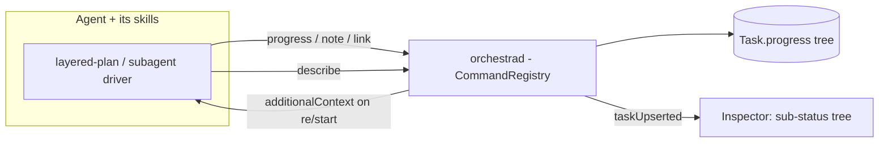
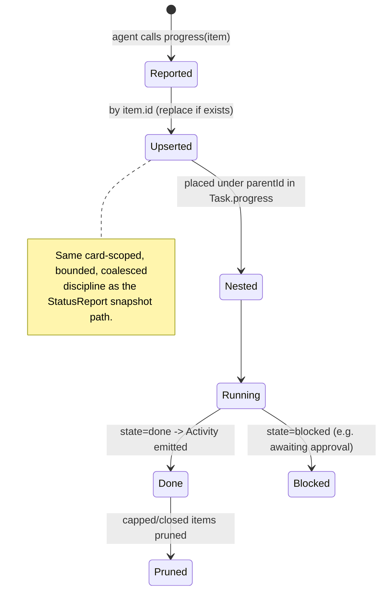

# Layer 1 — Initial Design: Deeper Agent Integration

> The **what**: make the agent a first-class collaborator with Orchestra — it reports structured
> progress (subagents, plan layers), commands Orchestra through a richer verb set, and Orchestra can
> inject context back.

## Purpose & problem

Today the agent↔Orchestra link is real but thin. **Inbound** (agent → Orchestra) is a fixed
`StatusReport` (ctx/desc/status/title/session-id) — it can't express "I spawned 3 subagents" or "I'm on
layer 2 of a layered plan". **Outbound commands** (agent → Orchestra control) is whatever MCP exposes,
but the `CommandRegistry` isn't the true single source (the CLI is hand-written; `models`/`archivedList`
are server-only), so the agent-facing surface is narrower and driftier than intended. **Orchestra →
agent** is just `send` (tmux keystrokes) + the one-shot spawn prompt; the richer `additionalContext`
injection is deferred.

Allen wants deeper workflows: an agent (e.g. running the **layered-plan** skill) should show its **layer
status** and **subagent statuses** on its card, and be able to drive Orchestra (create linked cards, read
back state) through a broader, consistent command set.

## Goals / non-goals

**Goals**
- **`CommandRegistry` becomes the true single source** (prereq): CLI generated from it; `models`/
  `archivedList`/`openInZed` folded in — so a new agent-facing verb appears on CLI **and** MCP at once.
- A **structured progress channel**: the agent (or its skills) reports a tree of `ProgressItem`s
  (subagents, plan layers, steps) that Orchestra stores on the card and renders as a **sub-status tree**.
- **Richer agent-facing verbs**: `describe` (read full card state back), `progress` (push a progress
  item), `note` (attach freeform context), `link` (relate cards). All via the registry → CLI + MCP.
- **Orchestra → agent injection**: land the deferred `SessionStart additionalContext` reverse path so a
  card's task/context can be (re)injected programmatically (ties to [[../context-continuity/index|axis 6]]).
- **Worked example: layered-plan.** The skill reports each layer (building/in-review/approved) + its
  Explore/Plan subagents as progress items; the card shows the ladder live.

**Non-goals (this axis)**
- A full **graph/tree UI** polish — v1 is a simple indented sub-status list in the inspector.
- Making every subagent its own **board card** (heavy) — default is in-card progress items (see open Qs).
- ACP / structured-UI agent protocol.
- Building the layered-plan reporting end-to-end — design the **generic** mechanism + show layered-plan as
  the example; the skill wiring is a follow-on.

## Scope

**In scope:** the registry-single-source refactor; a `ProgressItem` model + `Task.progress` + the
`progress` verb; `describe`/`note`/`link` verbs; the inspector sub-status tree; the `additionalContext`
reverse path. **Out of scope:** child-card hierarchy, graph UI, the concrete skill wiring, ACP.

## Inputs & outputs

| Direction | Description | Type / shape | Notes |
|-----------|-------------|--------------|-------|
| Input | Structured progress from the agent | `ProgressItem {id, parentId?, kind, label, state, detail?}` via `progress` | keyed by `$ORCHESTRA_TASK_ID` or ref |
| Input | Agent reads card state | `describe(ref)` → full `Task` (+ progress) | richer than `status` |
| Input | Agent annotations / links | `note(ref, text)`, `link(ref, toRef, rel)` | relate plan/subagent cards |
| Output | Sub-status tree | `Task.progress: [ProgressItem]` to the app | inspector renders indented |
| Output | Context to the agent | `additionalContext` on (re)start | reverse channel |

## Expected behaviour

- **Progress tree:** the agent calls `progress` with an item (e.g. `{id:"L2", kind:planLayer, label:"Layer
  2 — Contract", state:running}`); Orchestra upserts it into `Task.progress` and pushes `taskUpserted`; the
  inspector shows it under the card, nesting by `parentId`. State changes (running→done) emit Activity.
- **Subagents:** a parent agent reports each subagent as a `ProgressItem` (`kind:subagent`); they appear as
  child rows with live state, collapsing when done.
- **Richer control:** an agent calls `describe(ref)` to read a card's full state, `note` to leave context,
  `link` to relate cards — all identically on CLI and MCP (one registry).
- **Injection:** on a restart-with-context (axis 6) Orchestra passes `additionalContext` so a fresh/cleared
  session re-learns its task without a re-handed prompt.
- **Degrade:** an agent that reports no progress items just shows today's flat status — nothing regresses.

## Complexity & risks

| Risk | Note |
|------|------|
| Registry single-source refactor | Generating the CLI from the schema must preserve every current flag/behaviour; `shell`/`exec`/`batch-spawn` stay special. Test parity. |
| Unbounded progress | `Task.progress` must be capped + the agent must be able to replace/close items, or a long run bloats `tasks.json`. Cap + upsert-by-id + prune done. |
| Persistence churn | Progress upserts shouldn't thrash persistence; coalesce like the seq-gated snapshot path. |
| Trust/abuse | New verbs widen the agent's control surface; keep them scoped (an agent acts on its own card by default) — same posture as `exec`. |
| Provider-agnostic | Progress is most naturally pushed by a **skill/tool calling the verb**, not a model hook — so it works for any provider (Claude/Codex) without per-provider mapping. |

Rough sizing: **medium-large** — the registry refactor + a new data channel + UI. The progress model is
the conceptually new piece; the rest is additive verbs.

## Diagrams

### Bird's-eye (context)

### Detailed (progress lifecycle)

## Decisions made

| Decision | Why | Rejected |
|----------|-----|----------|
| `CommandRegistry` true single source first | A new verb must hit CLI + MCP at once; closes existing drift | Keep hand-written CLI |
| Sub-status = **in-card `ProgressItem` tree** (default) | Light; fits subagents + plan layers without card spam | Every subagent a board card (heavy) |
| Progress pushed via a **verb**, not a model hook | Provider-agnostic; emitted by skills/tools, works for Claude + Codex | Per-provider hook mapping |
| Land `additionalContext` reverse path | Enables axis 6 context continuity + richer workflows | Keep `send`-only |
| Generic mechanism; layered-plan is the example | One channel serves subagents, plan layers, any milestone | Bespoke layered-plan integration |

## Open questions — need your call

_All resolved at the 2026-06-26 gate:_ sub-status = **in-card `ProgressItem` tree** (promote to a linked
card later via `link`) · verb set = **all four** (`progress`/`describe`/`note`/`link`) · the
**registry single-source refactor rides in this axis** (it also unblocks axes 5 + 8).
