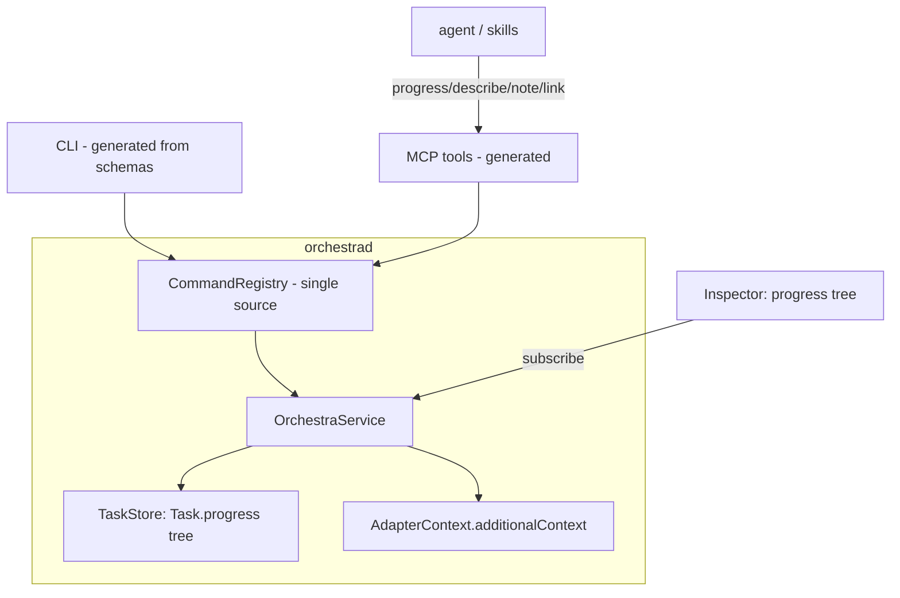
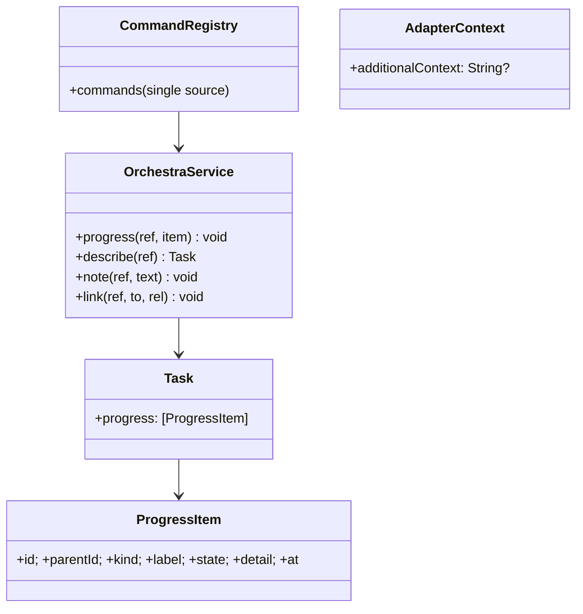

# Layer 2 — Contractual Design: Deeper Agent Integration

> The **interfaces**: the registry-single-source refactor, the `ProgressItem` model + verbs, and the
> reverse `additionalContext` path.

## Architecture overview

Three additive pieces over the existing daemon. **(1) Registry single-source:** `CommandRegistry` becomes
the only verb definition; a generic CLI driver maps `--flags` from each command's JSON schema, and the
server-only methods (`models`/`archivedList`/`openInZed`) move into the registry — so new verbs reach CLI
+ MCP automatically. **(2) Structured progress:** a `ProgressItem` value type forms a tree stored on
`Task.progress`; a `progress` verb upserts items (card-scoped, bounded, coalesced like the snapshot path);
the inspector renders the tree. **(3) New agent-facing verbs** (`describe`/`note`/`link`) + the reverse
`additionalContext` injection carried through `AdapterContext`. All inbound paths stay best-effort and
scoped to the caller's own card by default.

## Major classes / modules

| Name | Responsibility | Collaborators |
|------|----------------|---------------|
| `CommandRegistry` (refactor) | Single source; CLI generated from schemas; absorb server-only verbs | `CLIRunner`, `ControlServer`, MCP |
| `CLIRunner` (rewrite core) | Generic schema-driven flag→param mapping; keep `shell`/`exec`/`batch-spawn` special | `CommandRegistry` |
| `ProgressItem` (new, `Model.swift`) | One node: `id`, `parentId?`, `kind`, `label`, `state`, `detail?` | `Task`, inspector |
| `Task` (extend) | `progress: [ProgressItem]` (bounded, upsert-by-id) | `TaskStore` |
| `OrchestraService` (extend) | `progress`/`describe`/`note`/`link`; emit on progress transitions | `store` |
| `AdapterContext` (extend) | `additionalContext: String?` — the **keystone** seed (the 11th field) | adapters |
| `InspectorView` (extend) | Render the `Task.progress` tree (indented, state-colored) | `BoardModel` |

## Data model

```swift
// One node in a card's structured progress tree (subagent / plan layer / step / milestone).
public struct ProgressItem: Codable, Sendable, Equatable, Identifiable {
    public let id: String          // agent-chosen, stable; upsert key
    public var parentId: String?   // nest under another item (nil = top level)
    public var kind: ProgressKind  // subagent | planLayer | step | milestone
    public var label: String       // "Layer 2 — Contract", "Explore: SessionManager"
    public var state: ProgressState // running | done | blocked | failed
    public var detail: String?     // optional one-liner
    public var at: Date
}

public enum ProgressKind: String, Codable, Sendable { case subagent, planLayer, step, milestone }
public enum ProgressState: String, Codable, Sendable { case running, done, blocked, failed }
```

`Task.progress` is capped (e.g. 100 items) and upserted by `id`; closed (`done`/`failed`) items beyond a
keep-window are pruned. Updates coalesce so a chatty agent doesn't thrash `tasks.json` (same discipline as
the `StatusReport` snapshot path).

## Function / method contracts

### `OrchestraService.progress(_ ref:, _ item: ProgressItem)`
- **Does:** upsert `item` into the card's `Task.progress` by `id`; nest by `parentId`; persist (coalesced);
  emit `taskUpserted`; emit `.statusChanged`-style Activity only on a `state` transition of a top-level item.
- **Inputs:** card ref (defaults to `$ORCHESTRA_TASK_ID`), a `ProgressItem`.
- **Outputs:** none (event-driven).
- **Side-effects / errors:** unknown card → typed error; cap/prune enforced; best-effort (never fails the agent).

### `OrchestraService.describe(_ ref:) -> Task`
- **Does:** return the full `Task` (incl. `progress`, model, session ids) — richer than `status`'s
  `{task, running}`. The agent's read-back of its own (or another) card.

### `OrchestraService.note(_ ref:, _ text:)` / `link(_ ref:, to:, rel:)`
- **note:** append a freeform annotation (bounded) — context an agent leaves for itself/others.
- **link:** record a typed relation between two cards (`rel` ∈ parent/child/related) — e.g. a plan card to
  the cards it spawned; powers a future "promote a progress item to a card" + axis-4 discoverability.
  Relates to **fork lineage** in [[context-passing-topologies]]: a fork/fan-out child carries
  `Task.parentCardId` (a new card field, distinct from `origin`'s directory-kind), and `link` is the
  agent-facing verb that records that parent↔child relation on the board.

### `CommandRegistry` (refactor) + generic CLI
- Each `Command` already carries a JSON-schema `params`. A generic CLI driver maps `--key value` →
  params per the schema (string/int/enum/array), so verbs are defined once. `shell` (TTY attach), `exec`
  (exit-code passthrough), `batch-spawn` (stdin) remain explicit overrides. `models`/`archivedList`/
  `openInZed` become registry commands (so MCP/agents can call them).

### `AdapterContext.additionalContext: String?` — the keystone
- Carried into `start`/`resume` so a provider that supports context injection (Claude `SessionStart`
  `additionalContext`) re-teaches a session its task without a re-handed prompt. Adapters that can't use
  it ignore it. Consumed by [[../context-continuity/index|axis 6]].
- **Status (2026-06-29):** still unbuilt. In `main`, `AdapterContext` already carries **10 fields**
  (`cwd, repo, model, startIn, sessionId, prompt, name, hooksPath, access, trustCwd` — `Adapter.swift:4–23`,
  not the 8 the early text implied); `additionalContext` is the one field still missing and would be the
  11th. Pair it with `SpawnInput.additionalContext` (`Model.swift:484–520`) + `restart(_:withContext:)`.
- Per [[context-passing-topologies]] (§1, §8) this is **the chokepoint**: handoff, fork, fan-out, and
  Claude subagents are one primitive that all unlock from this seed — **build it first; the rest is
  topology.** It also carries the fork **merge-back inbox** safely (the inbox injects as
  `additionalContext` on the card's next live turn).

## Library / framework decisions

| Decision | Choice | Rationale | Alternatives considered |
|----------|--------|-----------|-------------------------|
| Sub-status representation | In-card `ProgressItem` tree | Light; fits subagents + plan layers; no card spam | Child cards (heavy) |
| Progress transport | A registry **verb** (`progress`) | Provider-agnostic; emitted by skills/tools | A model-hook event (per-provider) |
| Verb surface | Generated from `CommandRegistry` | New verbs hit CLI + MCP at once; kills drift | Keep hand-written CLI |
| Reverse injection | `additionalContext` field on `AdapterContext` | Interactive-compatible (verified in shipped design) | `initialUserMessage` (non-interactive only) |

## Diagrams

### Bird's-eye (components)



### Detailed (classes)



## Traceability → Layer 1

| L1 goal | Covered by |
|---------|-----------|
| `CommandRegistry` true single source | Registry refactor + generic CLI driver + absorbed verbs |
| Structured progress channel | `ProgressItem` + `Task.progress` + `progress` verb |
| Richer agent-facing verbs | `describe` / `note` / `link` on the registry |
| Orchestra→agent injection | `AdapterContext.additionalContext` |
| Sub-status tree in the inspector | `InspectorView` renders `Task.progress` |
| Layered-plan worked example | plan layers + subagents as `ProgressItem`s (skill wiring = follow-on) |

## Decisions made

| Decision | Why | Rejected |
|----------|-----|----------|
| `ProgressItem` tree on the card | One model covers subagents + plan layers + milestones | Bespoke fields per use |
| Card-scoped, bounded, coalesced upserts | Mirror the proven snapshot discipline; bound `tasks.json` | Unbounded append |
| `describe` separate from `status` | Agents need full state incl. progress; `status` stays cheap | Overload `status` |
| `link` now (even if UI later) | Records relations for axis-4 discovery + future child-cards | Defer relations entirely |

## Open questions — need your call

_All resolved at the 2026-06-26 gate:_ in-card progress items (v1) · all four verbs · registry
single-source refactor in this axis.
