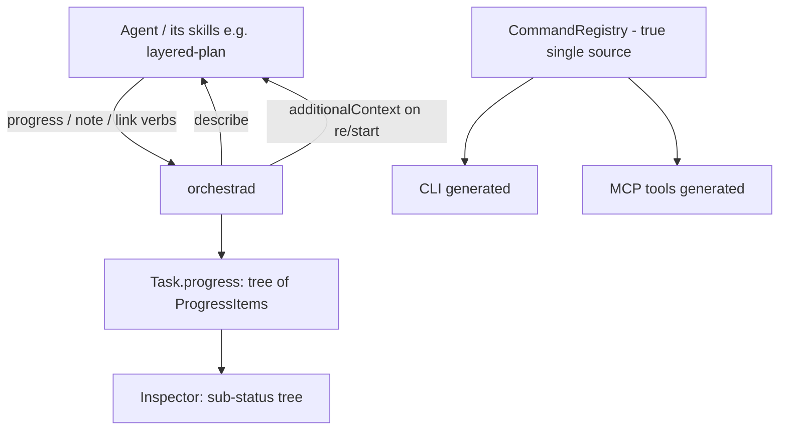

# Deeper Agent Integration — Design Index

> Widen the two-way Orchestra↔agent channel: (a) more agent-facing **commands** to drive/read Orchestra,
> (b) **structured sub-status** the agent reports — subagents, layered-plan layers, workflow milestones —
> shown as a tree on the card, and (c) richer **Orchestra→agent** context injection. Part of the
> [[extensibility-roadmap/index|extensibility roadmap]] (axis 3). Builds on [[../model-providers/index|model-providers]] (the report channel).

## Status vs `main` (2026-06-29)

- **Nothing in this axis is built yet** — the `CommandRegistry` is not the single source (CLI is still
  hand-written in `CLIRunner.swift`), the `progress`/`describe`/`note`/`link` verbs and `ProgressItem`
  tree don't exist, and `AdapterContext` carries **no** seed field.
- **This axis OWNS the `additionalContext` keystone.** The synthesis note
  [[context-passing-topologies]] (§1, §8) **elevates** it from "one of several injections" to *the
  chokepoint* — handoff, fork, fan-out, and Claude subagents are one primitive ("start/restart with an
  authored seed") and **all unlock from this field. Build it FIRST; the rest is wiring.**
- `AdapterContext` already grew to **10 fields** in `main` (`cwd, repo, model, startIn, sessionId,
  prompt, name, hooksPath, access, trustCwd` — `Adapter.swift:4–23`); `additionalContext` is the one
  field still missing.
- The `link` verb + a new `Task.parentCardId` underpin **fork lineage** in
  [[context-passing-topologies]] / [[stacked-branches-and-guardian-handoff]] — cross-linked below.

## Layers

| Layer | Document | Status |
|-------|----------|--------|
| 1 — Initial design | [[01-design]] | approved |
| 2 — Contract | [[02-contract]] | approved |
| 3 — Implementation | [[03-implementation]] | not started (design-only pass) |
| 3 — Tests | [[04-tests]] | not started (design-only pass) |

> Design-only pass: L1+L2 approved 2026-06-26. Registry single-source refactor rides in this axis
> (unblocks axes 5 + 8). In-card progress tree; verbs progress/describe/note/link. The
> `additionalContext` reverse path is the **keystone** — see [[context-passing-topologies]].

## Current picture

## Open questions (rolled up)

_Resolved at the 2026-06-26 gate:_ in-card `ProgressItem` tree (promote to linked card later) · all four
verbs (`progress`/`describe`/`note`/`link`) · registry single-source refactor rides in this axis.
