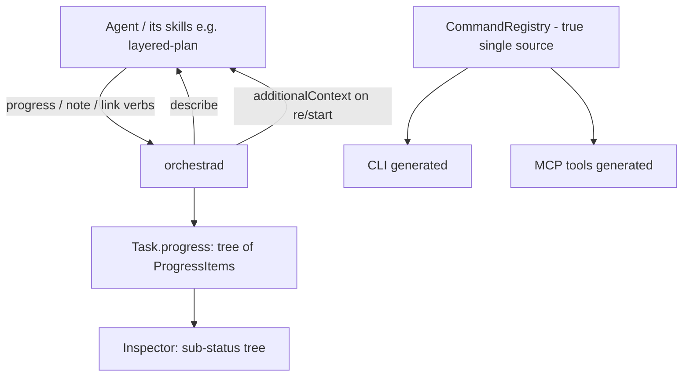

# Deeper Agent Integration — Design Index

> Widen the two-way Orchestra↔agent channel: (a) more agent-facing **commands** to drive/read Orchestra,
> (b) **structured sub-status** the agent reports — subagents, layered-plan layers, workflow milestones —
> shown as a tree on the card, and (c) richer **Orchestra→agent** context injection. Part of the
> [[extensibility-roadmap/index|extensibility roadmap]] (axis 3). Builds on [[../model-providers/index|model-providers]] (the report channel).

## Layers

| Layer | Document | Status |
|-------|----------|--------|
| 1 — Initial design | [[01-design]] | approved |
| 2 — Contract | [[02-contract]] | approved |
| 3 — Implementation | [[03-implementation]] | not started (design-only pass) |
| 3 — Tests | [[04-tests]] | not started (design-only pass) |

> Design-only pass: L1+L2 approved 2026-06-26. Registry single-source refactor rides in this axis
> (unblocks axes 5 + 8). In-card progress tree; verbs progress/describe/note/link.

## Current picture

## Open questions (rolled up)

_Resolved at the 2026-06-26 gate:_ in-card `ProgressItem` tree (promote to linked card later) · all four
verbs (`progress`/`describe`/`note`/`link`) · registry single-source refactor rides in this axis.
