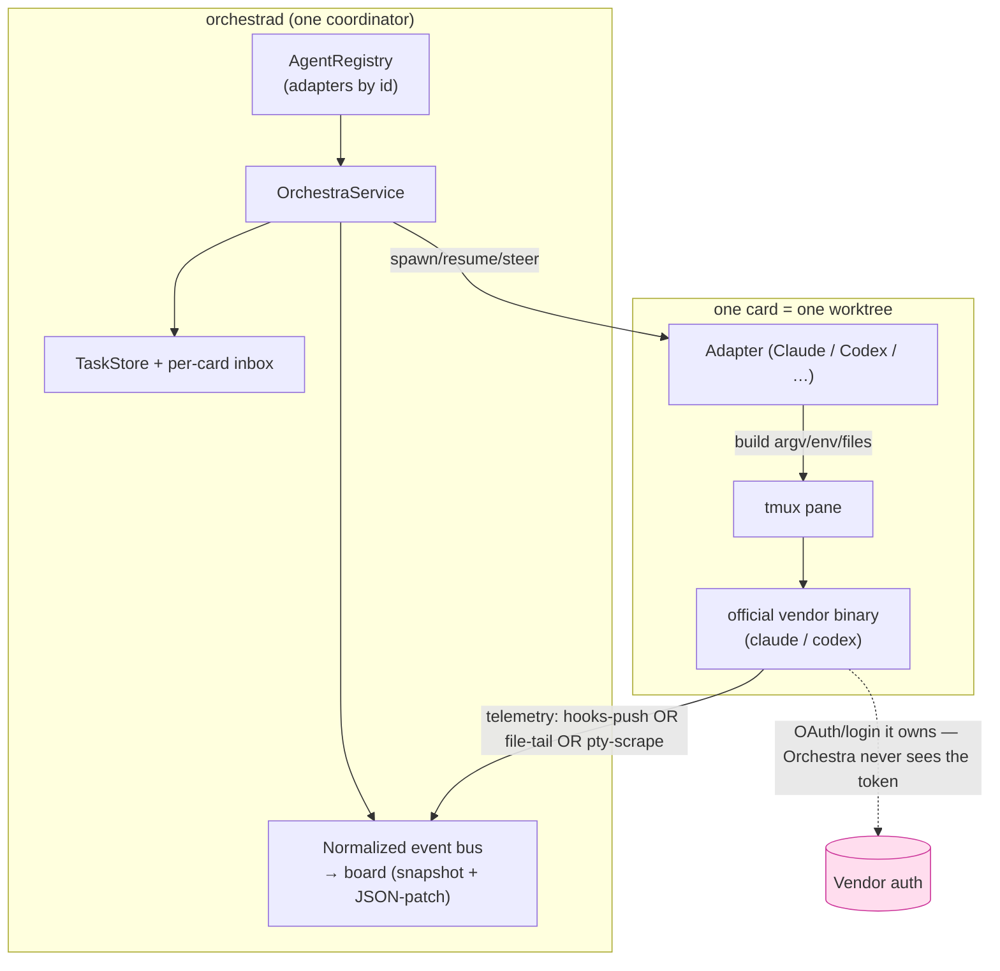
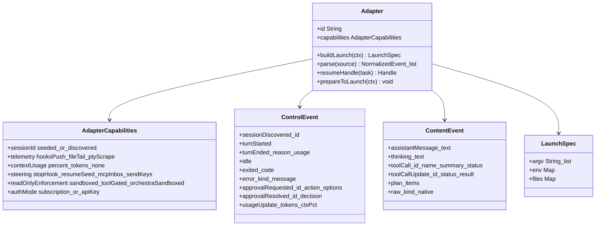
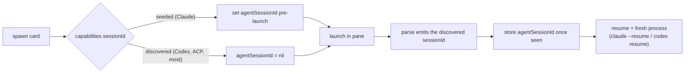
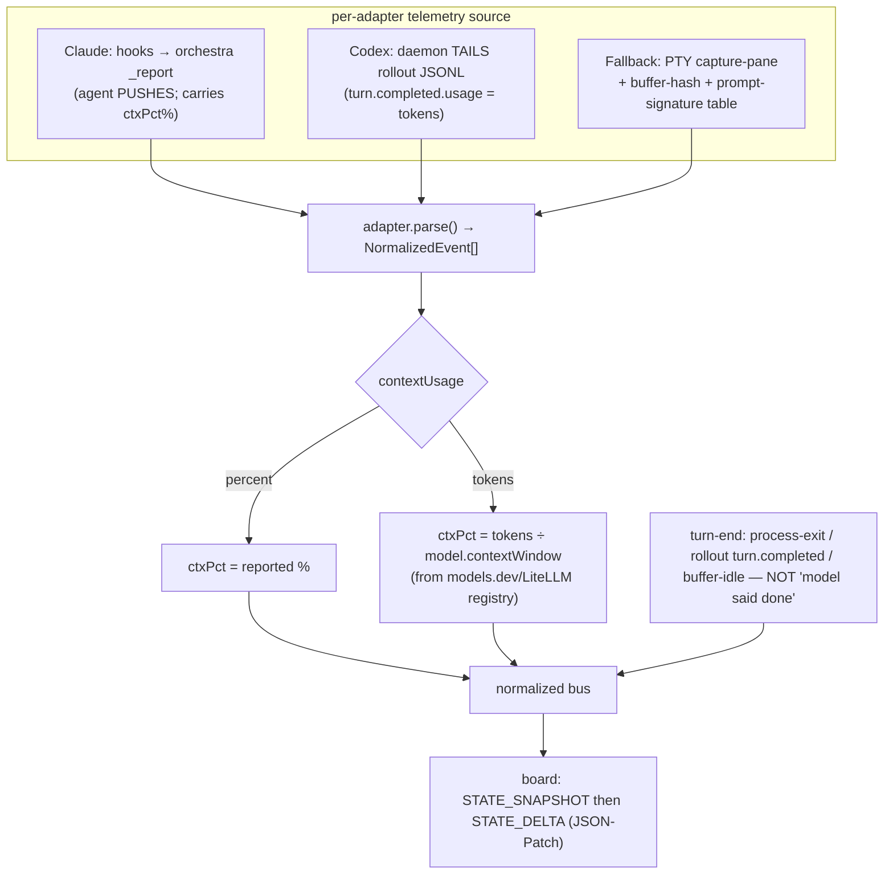
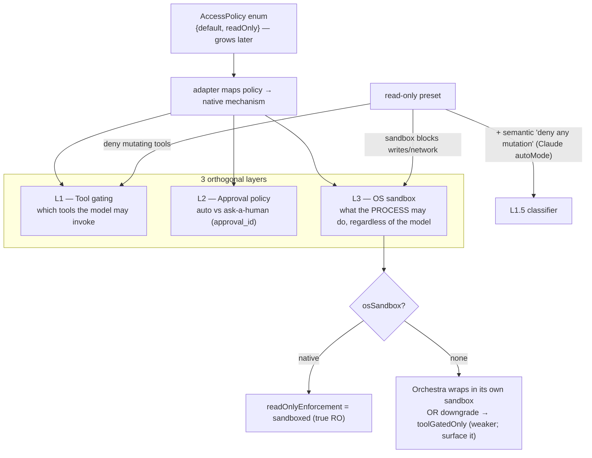
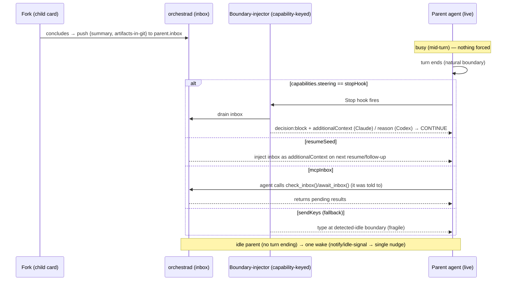
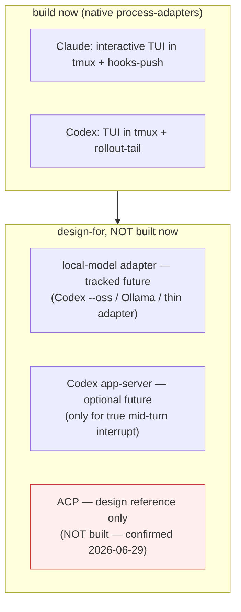

# The Agent-Agnostic Provider Interface — Design & Reference

> **What this is.** A single reference for how Orchestra runs *any* coding-agent CLI behind one seam —
> grounded in a deep investigation of Claude Code, OpenAI Codex, the broader agent-CLI landscape, ~14
> precedent orchestrators/protocols, the steering/merge-back problem, and the auth/ToS constraints.
> **Read it, confirm the decisions, iterate.** Every decision is tagged so you can react. Raw sources
> are in the [[agent-provider-research-appendix|research appendix]].
>
> **Status:** draft for your review. Nothing here is built yet; this deepens
> [[model-providers/index|axis 2 (model-providers)]] to an implementable design and pins the seam
> decisions that the other axes depend on.

---

## 0. The one-paragraph summary

Orchestra should keep doing exactly what it does — **drive the real vendor CLI as a process in a tmux
pane, one git worktree per card** — and generalize the seam around it. Almost every comparable system
(Databricks **Omnigent**, Vibe Kanban, OpenHands, opencode, Crystal, …) independently converged on this
shape, so it's the validated path, not a guess. A new provider plugs in by implementing a **small
adapter** (≈5 methods) that builds the launch command, **parses the agent's output into one normalized
event type**, and declares a **capability descriptor**. Everything variable across agents — session-id
ownership, telemetry transport, permission expression, steering — is handled by **capability flags +
per-adapter mapping**, never `if provider == "claude"` in the core. The hard invariant that keeps it
legal: **drive the official binary and let *it* authenticate; never reimplement the API client or lift
the login token.**

---

## 1. The core decisions (confirm / iterate on these)

| # | Decision | Recommendation | Status |
|---|----------|----------------|--------|
| D1 | Adapter shape | **Process-adapter over PTY/tmux** (not a server/HTTP adapter, not an in-proc SDK) | Recommend |
| D2 | How a backend is added | **Runtime registry of ~5-method adapters** (not a recompiled enum) | Recommend |
| D3 | Output handling | **One normalized event type** every adapter parses into | Recommend |
| D4 | Variation handling | **Capability descriptor** (flags) + per-adapter native mapping | Recommend |
| D5 | Session identity | **Discover-by-default** (store the id the backend emits); seeding is an optimization | Recommend |
| D6 | Telemetry | **Structured-stream parse** where available (Claude hooks-push, Codex rollout-tail), **PTY-scrape** fallback; turn-done detected **out-of-band** | Recommend |
| D7 | Context window / cost | **Vendor a model registry** (models.dev / LiteLLM JSON) → `contextWindow` + capability flags | Recommend |
| D8 | Permissions | **3 orthogonal layers** (tool-gating · approval-policy · OS-sandbox); read-only is a **preset** | **Confirmed** — no-sandbox agents → `toolGatedOnly` + a visible **weak-RO badge** |
| D9 | Steering / merge-back | **All input to a running agent — user follow-ups AND merge-back — rides the durable inbox**, drained at the turn boundary by the capability-keyed injector; `send-keys` only for the idle-wake | **Confirmed** |
| D10 | Transport | **Native Claude (TUI+hooks) + native Codex (TUI+rollout-tail) only.** ACP adapter **not built** (design reference only); Codex `app-server` **not needed for v1** (the inbox covers steering) | **Confirmed** |
| D11 | Auth invariant | **Drive the binary, never the token/API client** | **Hard constraint** |
| D12 | Auth modes | Carry `authMode ∈ {subscription, apiKey}`; warn on heavy parallel subscription use | Recommend |

The **only true constraint** is D11 (a ToS bright line); the rest are recommendations. Items confirmed
2026-06-29 are marked **Confirmed**; remaining open items are in §12.

> **Scope (confirmed 2026-06-29).** The targets that matter are **Claude, Codex, and (eventually) a local
> model.** The seam is built *agnostic* — the capability descriptor + normalized-event type mean any agent
> *could* be added — but the only concrete adapters built now are **Claude (done) + Codex (next)**. The
> long-tail (Gemini/opencode/Amp/Goose/…) and **ACP** are **not implemented**: we build the *base infra*
> that would admit them, nothing more. A **local-model** adapter (likely via Codex `--oss`/Ollama or a thin
> dedicated adapter) is a tracked future, not built now.

---

## 2. Grounding (why these decisions, in one screen)

This design rests on a multi-pass investigation (full sources in the appendix). The load-bearing findings:

- **Convergent architecture.** ~10 independent multi-agent coding orchestrators all (a) **wrap the real
  CLI**, (b) use **one git worktree per unit of work**, (c) drive it over **tmux/PTY**, and (d) normalize
  output to a board. Databricks **Omnigent** — the closest analog — states the contract as *"messages and
  files in, text streams and tool-calls out,"* with a per-agent `executor.harness` selector. **Orchestra
  already is this.**
- **Two telemetry strategies, period.** Structured-stream parse (preferred) vs **PTY scrape + buffer-hash
  + prompt-signature table** (the hook-less fallback). Turn-completion is detected from **process exit /
  buffer-stops-changing**, never from content.
- **Session ids are discovered, not seeded** — universally (even for Claude, Vibe Kanban parses the id
  from the stream). ACP's `session/new` *returns* the id.
- **Steering converged on queue-until-turn-boundary** — not mid-turn preemption. The synchronous path is
  reserved for **approvals** (an `approval_id` round-trip).
- **Standards validate the shape.** **ACP** (Zed) = capability handshake + discovered session id + a typed
  `session/update` event stream + a clean permission-option vocabulary — i.e. exactly the seam, minus
  Orchestra's tmux/worktree/async-steer core (which ACP lacks). **A2A** = AgentCard (capability
  descriptor) + a Task state machine + Artifact-rejoin. **AG-UI** = snapshot + JSON-Patch deltas for the
  board feed. **models.dev/LiteLLM** = the model/context-window registry.
- **Auth reality.** Claude: ACP/SDK reject subscription OAuth and ToS bars routing subscription creds
  through third-party tools — **only the native binary preserves a subscription.** Codex: native CLI,
  `app-server`, and `codex-acp` all preserve the ChatGPT subscription (they spawn the binary); only the
  SDK/Responses API forces a key. **Common rule: drive the binary, never the token.**

---

## 3. Architecture & the auth invariant

Orchestra is the **client** of each agent; each agent owns its pane, its worktree, and **its own auth**.
Orchestra never holds a provider API token and never speaks the provider's HTTP API directly.



**D11 — the invariant (hard constraint).** An adapter MUST launch the vendor's official binary (or its
own server process) and let *it* authenticate. It must NEVER reimplement the provider API client, inject a
provider API token into its own HTTP calls, or extract/reuse the user's login (OAuth) token. This is what
keeps subscription auth legal on both providers (token-lifting got OpenCode/Roo/Goose's subscription access
blocked, Jan 2026) and it's what all precedent orchestrators do anyway. (Details + per-provider matrix: §9.)

---

## 4. The adapter seam

A backend is admitted by implementing a **small adapter** registered by id (D2). The interface converges
(across Crystal's `AbstractCliManager` and Vibe Kanban's `StandardCodingAgentExecutor`) on ~5
responsibilities:



> `buildLaunch` returns argv+env+files and covers start/resume/read-only/seed; `parse` is **the
> normalization core**; `resumeHandle` returns the discovered id (resume = fresh process);
> `prepareToLaunch` does trust-grant + isolated config home + the read-only recipe. `AdapterCapabilities`
> values are enums (e.g. `sessionId ∈ {seeded, discovered}`); the normalized event is a **two-tier sum
> type** — `ControlEvent` (reliable lifecycle) + `ContentEvent` (best-effort display) — detailed in D3.

**D3 — the normalization core (a *two-tier* event type).** The single most important move (how every
multi-CLI tool abstracts Claude-vs-Codex): they do **not** unify wire protocols — each adapter's `parse()`
collapses its agent's output into **one normalized event type**. Claude hooks, Codex rollout JSONL, ACP
`session/update`, opencode SSE — all become the same shape. But the events split into **two tiers with
different reliability guarantees**, because the architecture already sources them differently (turn-end is
detected *out-of-band* from content, §6):

- **`ControlEvent` — low-volume, must-not-drop.** Drives the card state machine, the inbox/steering (§8),
  lineage, approvals, and the meters: `sessionDiscovered`, `turnStarted`, `turnEnded{reason, usage}`,
  `idle`, `exited{code}`, `error`, `approvalRequested{id, action, options}`, `approvalResolved`,
  `usageUpdate{tokens, ctxPct}`. **Losing one is a bug** — a dropped `turnEnded` means the inbox never
  drains and a merge-back is silently lost. (`usageUpdate` lives here, not in content: it's low-volume and
  both agents emit it reliably — Claude `used_percentage`, Codex `turn.completed.usage`.)
- **`ContentEvent` — higher-volume, lossy-OK.** Feeds the activity line and the detail view:
  `assistantMessage{text}`, `thinking{text}`, `toolCall{id, name, summary, status}`,
  `toolCallUpdate{id, status, result}`, `plan{items}`, `raw{kind, native}`. **The vendor's own transcript
  file is the source of truth** (`~/.claude/.../<id>.jsonl`, Codex `rollout-*.jsonl`); this tier is only
  for liveness, so a dropped event just means a momentarily stale board — recoverable from the file.

Three properties that fall out of this split:

- **Content is coarse, not streamed (v1).** Events carry *complete blocks*, not token-deltas — both v1
  transports are already item/boundary-grained (Claude hooks fire at `Pre/PostToolUse`/`Stop`; Codex's
  rollout is append-of-completed-items), so streaming deltas aren't even available without abandoning those
  transports (§6/§9). Tool calls still feel live because `toolCall{status:running}` lands the instant a tool
  starts. The only thing deferred is word-by-word prose — and that returns later as a *detail-view render
  feature tailing the vendor file*, never as a property of the event bus.
- **`toolCall` carries an id + a status lifecycle** (`pending → running → ok|error`, borrowed from ACP
  `tool_call`/`tool_call_update`) so the board updates a tool row in place. An **approval is just a tool
  call sitting in `pending` with options** — `approvalRequested` references the same id.
- **`raw{kind, native}` is the open escape hatch.** Unmodeled output (a novel agent's plan format, a
  web-search result, an MCP-specific item) is still displayable and storable without a core schema change —
  this is what makes "agnostic" honest rather than aspirational, and it matches the confirmed scope (build
  base infra to admit others; don't model the long-tail).

> **`turnEnded` ≠ concluded.** The *parent's* inbox drains on every `turnEnded` (the turn boundary). A
> *fork's* merge-back fires when the fork **concludes** — `exited` or moved-to-Done — **not** on any
> `turnEnded` (a fork ends many turns before it's done). So both events are first-class and merge-back keys
> off `exited`. `turnEnded.reason` carries ACP's stop vocabulary (`end_turn | max_tokens | cancelled |
> refusal | error`) so the injector knows whether to continue-with-inbox or back off.

The board, status logic, and inbox only ever see these normalized events — never a provider's wire format.

**D4 — capability descriptor.** Everything that varies in *kind* is a flag the adapter advertises
(modeled on ACP's `initialize` handshake and A2A's AgentCard). The daemon and UI **degrade on flags, never
branch on provider identity.** This is what admits Codex without `if claude`.

**D2 — registry, not enum.** Keep `AgentRegistry` keyed by id; resolve the adapter from `Task.agentId` at
every op (already the case). A new provider = a new adapter file + a registry entry.

### 4.1 Start actions — the launch seam

Orchestra→agent actions split into **start actions** (made true at/before the process is born) and **live
actions** (delivered to a running agent, §8). This section is the start side.

**One request behind every way a process comes up.** `spawn`, `batch-spawn`, `restart`, `resume`, and
`fork` look distinct but are the *same* normalized `LaunchRequest` with different data — they never differ
in mechanism:

| Operation | What differs | Reduces to |
|---|---|---|
| `spawn` | new card, cold session | `resume: nil` |
| `batch-spawn` | N spawns (fan-out) | N × `resume: nil` |
| `restart` | reuse card/worktree, discard session | `resume: nil` on existing cwd |
| `resume` | restore prior session | `resume: <handle>` |
| `fork` | child seeded with a parent slice | `resume: nil, seed: <slice>` |

So **`resume` is just a kind of start** (same prep + handle-restore), and — because the OS sandbox is fixed
at exec (§7 L3) — **changing a card's access posture is a *relaunch*, not a live action.** Resume is the
vehicle for every start-bound change.

**The six goals of bringing up an agent.** Five are start-bound; the sixth (Task) bridges to the live path.

1. **Place** — right cwd + an **isolated config home** so per-card settings/hooks don't leak or collide.
2. **Admit** — trust resolved so the agent doesn't block on a "trust this folder?" prompt (see below).
3. **Instrument** — telemetry wired, MCP (inbox) wired, session made addressable.
4. **Constrain** — access posture / sandbox fixed (§7).
5. **Orient** — authored seed context in place, model chosen.
6. **Task** — deliver the first user turn — *or* leave the agent idle and deliver it through the same live
   idle-wake path as every later message (§8). There is **no special "initial prompt" mechanism**; the seed
   is system-level (materialized before turn 1), the task is the first user message.

**The normalized request + the two adapter entry points.** The core builds one provider-agnostic
`LaunchRequest`; the adapter lowers it. Most goals are "same kind, different flag" (pure mapping); only
three vary in *kind* and are resolved from the capability descriptor inside the adapter: `sessionId`
(seed vs discover), `telemetry` (push agents *install* a hook at launch; tail agents install nothing), and
`readOnlyEnforcement` (the 3-layer map).

```
LaunchRequest                      // normalized intent — core builds from the card
  cwd          Path
  origin       CardOrigin          // worktree | scratch | borrowed(freeform) — drives trust (below)
  resume       SessionHandle?      // nil = cold (spawn/restart/fork); present = resume
  model        ModelRef            // model + effort
  access       AccessPolicy        // enum {default, readOnly} now (grows later) → §7.1
  seed         SeedContext?        // authored system-level context (handoff / additionalContext)
  task         Message?            // first user turn; nil → launch idle, deliver via inbox
  tools        McpConfig           // Orchestra inbox server + card tools
  // config-isolation + telemetry-install are IMPLIED (our instrumentation, never per-card).
  // trust: resolved by the CORE from origin (advisory, not a boundary); applied by the adapter — see below.

adapter.prepareToLaunch(req)       // idempotent FILESYSTEM/CONFIG side effects (safe to re-run on resume):
  materialize isolated config home · mirror resolved trust onto cwd · install telemetry wiring
  (Claude hooks→_report / Codex none) · write seed files (CLAUDE.md/AGENTS.md/append-prompt) ·
  write MCP config · apply file-expressed posture
adapter.buildLaunch(req) → LaunchSpec{argv, env}   // PURE:
  binary + resume flag + model flag + sandbox/approval flags + seeded session-id + env
```

**Trust — advisory, resolved by the core, granted only by a human.** Trust is **not a containment
boundary**: an agent with a shell can self-edit the vendor's own trust file (`~/.claude.json`
`hasTrustDialogAccepted`, Codex `trust_level`), and an agent launched *outside* Orchestra never sees our
resolution at all. The real boundary is the **OS sandbox (§7 L3)**, which the agent cannot edit its way out
of. So trust's job is narrower and honest: **avoid *accidentally* auto-executing unfamiliar in-repo config
(hooks/MCP) at startup, and record human intent.** We resolve it sensibly and guard the *accidental* case;
we never pretend it's a wall. (Goal: *assume a human launched the agent — just don't let the agent
accidentally trust something against that human's wishes.*)

*Resolution (core, provider-agnostic).* The core resolves trust from `origin` against **one Orchestra-owned
ledger**; the adapter only *applies* the result (writes the native flag). Every answer bottoms out in a
prior human act:

| `origin` | Trust rule | Why it's reasonable |
|---|---|---|
| `worktree` | **inherit from the source repo** (registering a repo to run agents *is* the trust act); mirror repo-trust onto the worktree path | worktree = same code as the repo |
| `scratch` | **trust** | Orchestra created it empty — no foreign in-repo config to execute |
| `borrowed` (freeform) | **trust iff already in the ledger**; else it's a fresh grant decision (below) | an arbitrary cwd must carry its own trust |

*Granting (always a human, never automatic).* When the cwd is untrusted and not yet in the ledger, a grant
is **only ever a human answering a prompt** — never an autonomous agent action *and never an automatic
policy*. The prompt routes like any other elicitation/hook — the agent's pane by default, or a board/phone
surface if so configured (trust gets no special routing) — but its one inviolable rule is **who answers it:
a human**. In particular, an autonomy / auto-accept card (which auto-answers ordinary tool approvals) must
**exempt trust**. The prompt renders wherever that human is:

- **App new-agent dialog** → inline choice as you pick the cwd (*trust · read-only · cancel*).
- **Agent via MCP** → an **elicitation** to the human running that agent — in their own client, or, for an
  Orchestra-spawned agent, natively in the card's pane. Same human, same machine, approved outside
  Orchestra's app.
- **CLI** → the human/agent split rides the **TTY** (human calls are interactive; an agent's Bash call is
  not):

| CLI case | Behavior |
|---|---|
| trusted / worktree / scratch | run |
| untrusted + **interactive (TTY → human)** | prompt *trust · read-only · cancel* |
| untrusted + `--read-only` (any caller) | run sandboxed read-only — the safe autonomous path |
| untrusted + **non-interactive, no `--read-only`** | **fail with actionable context** → "re-run with `--read-only` to run sandboxed, or use the MCP `trust`/`spawn` tool for **explicit human approval** (trust is a dangerous, human-only decision)" |

There is **no `--trust` flag** — no non-interactive path can grant trust, so an agent has no way to
*accidentally* trust; the worst it can do autonomously is run sandboxed. This is a deliberately *soft* guard
(a determined agent could allocate a PTY) — correctly scoped to the **accidental** case; malice is the
sandbox's job.

*Trusting a folder without launching a card.* Two deliberate pre-bless paths, same human-only property:
- **CLI `orchestra trust <path>`** — **interactive-only** (refuses non-interactively): a clearly deliberate
  human act, the agent can't reach it accidentally.
- **MCP `trust` tool** — agent-callable but **elicits explicit human approval** (same mechanism as the
  untrusted-spawn path): the agent *triggers*, the human *approves*. The agent never self-grants.

Notes: (a) the **one Orchestra-owned ledger** (keyed by repo/cwd, mirrored down per-agent) is what makes a
repo long-trusted in Claude not come up *untrusted* the first time you spawn a Codex card on it. (b)
`scratch`'s "trust" assumes it stays Orchestra-owned-and-empty; a scratch card that **clones a foreign repo
into itself** (external-intake) is really `borrowed` and demotes to conditional — the key is *whose code is
in the cwd*, with `origin` as the proxy.

---

## 5. Session identity (D5)



Treat **discover-and-store** as the normalized model; Claude's seedable id is an optimization, not the
architecture. Resume is always a **fresh process** with the stored handle (no live reattach). Resumability
becomes an **adapter answer** (`resumeHandle`), replacing today's `~/.claude` transcript-file stat — Codex
has no such file (its analog is `~/.codex/sessions/.../rollout-*.jsonl`).

> This loosens two current couplings (`isResumable`/`resume` requiring a pre-seeded id and a Claude
> transcript path) — both flagged in the seam audit as Claude-structural.

---

## 6. Telemetry (D6, D7)

Two transports collapse into one normalized stream; the board renders from a **snapshot + JSON-Patch
deltas** (the AG-UI / Vibe Kanban pattern).



- **Claude = hooks-push** (its strength; keep it — and it's the ToS-safe interactive path, §9). **Codex =
  rollout-tail**: the TUI doesn't emit `--json`, but it *does* write `~/.codex/sessions/.../rollout-*.jsonl`
  containing token usage, activity items, the session id, and turn completion — so the daemon tails that
  file per card. Both are instances of "structured-stream parse → normalized event."
- **PTY-scrape is the universal fallback** (for hook-less agents): `capture-pane` + SHA-256(buffer)
  unchanged = idle + a **prompt-signature table kept as adapter config, not hardcoded** (it's the
  highest-churn technique in the field).
- **The event bus is a control+liveness channel, not the transcript store.** The conversation's source of
  truth is the **vendor's own transcript file** (`~/.claude/.../<id>.jsonl`, Codex `rollout-*.jsonl`),
  rendered into the card-detail view on demand. So `ContentEvent`s are deliberately **coarse** (complete
  blocks, not token-deltas) — which also aligns with the transports: both push at item/boundary granularity
  (Claude hooks, Codex rollout items), so streaming would require a different, billing-disfavored transport
  (§9). A live word-by-word feed, if ever wanted, is a *detail-view render path tailing the vendor file* —
  decoupled from the bus. (See D3 for the `ControlEvent`/`ContentEvent` split.)
- **D7 — model registry.** Drop hand-maintained context windows; vendor `models.dev/api.json` (or
  LiteLLM's `model_prices_and_context_window.json`). Use `limit.context` as the `ctxPct` denominator and
  the `tool_call/reasoning/vision` booleans as per-model capability flags. (Replaces the absent
  `AgentModel.contextWindow`.)

---

## 7. Permissions & read-only (D8)

Permissions are **three orthogonal layers**, not one knob. "Read-only" is a **preset across them**, not a
primitive.



| | Claude | Codex | No-sandbox agents (opencode/Amp/Goose/Aider) |
|---|---|---|---|
| **L1 tool gating** | `--allowedTools`/`--disallowedTools` | approval rules | per-tool allow/ask/deny |
| **L2 approval** | `--permission-mode` + PreToolUse hooks | `--ask-for-approval` | varies |
| **L3 OS sandbox** | seatbelt + `denyWrite` | `--sandbox read-only/workspace-write/…` | **none** |
| **read-only** | L1+L1.5+L3 (shipped 3-layer barrier) | `--sandbox read-only -a never` | L1 only → **not true RO** |

**The real read-only decision (confirmed 2026-06-29):** `supportsReadOnly` is too coarse — model it as
`readOnlyEnforcement ∈ {sandboxed, toolGatedOnly, orchestraSandboxed}`. **For agents with no OS sandbox,
ship `toolGatedOnly` with a visible "weak read-only" badge** (a Bash escape could still write) rather than
Orchestra wrapping the process itself; `orchestraSandboxed` (our own `sandbox-exec`/container) stays a
*future* option, not built now. This is moot for the targets that matter — **Claude and Codex both have
native OS sandboxes → `sandboxed` (true read-only).** *Never advertise a read-only card you can't enforce —
the badge makes the weaker guarantee explicit.* Approvals normalize to one `ApprovalRequest{id, action}` event + a
`respond(id, decision)` call, `decision` using ACP's `{allow_once, allow_always, reject_once,
reject_always}` vocabulary — so the board's approval UI is provider-agnostic. On Claude these are sourced
from the **`Elicitation`/`ElicitationResult` hooks and `PreToolUse permissionDecision:"ask"`**; on Codex
from `--ask-for-approval` + its during-tool-flow elicitation. By default a prompt **passes through** to the
agent's pane for the human; re-routing it to another human surface (board/phone) is a **uniform hook choice,
not approval-specific** — any hook/elicitation can be routed that way. The trust elicitation (§4.1) is no
exception to this routing; its only special rule is *who* answers it: a human, never an automatic policy.

### 7.1 The access interface — what actually crosses the seam

For the targets that matter now, **two access sets** are defined:

| Set | Meaning |
|---|---|
| `default` | run under the **user's own** permission/sandbox config — Orchestra adds nothing but its instrumentation (the isolated config home *layers over* the user's settings, never replaces them) |
| `readOnly` | `default` minus the ability to mutate — Orchestra imposes the read-only barrier |

*(Tracked for later: `supervised`, and a "read-only except writes to plans/notes" carve-out — the latter
is `readOnly` + a path allow-list.)*

**What crosses the core↔adapter boundary is tiny**, despite all the conceptual machinery above — two things:
- **Request (core → adapter):** `LaunchRequest.access` — a small preset enum (`default | readOnly`),
  consumed inside `buildLaunch`/`prepareToLaunch` (§4.1); no separate method.
- **Capability (adapter → core):** `readOnlyEnforcement` — *what `readOnly` is worth on this agent.*

Everything else stays **below the line**: the **axes** (writeScope · network · approval · toolGating) are
the *vocabulary that defines what a preset means* — documentation, not types; the **layers** (L1/L1.5/L3)
are each adapter's *internal* realization (Claude stacks L1+L1.5+L3, Codex uses L3 alone) and a **checklist
for adapter authors**, never an interface.

**Capability flags are outcomes, not mechanisms.** The rule for what becomes a flag: *would core branch on
it?* Core branches on `readOnlyEnforcement` (badge vs trust); it would never branch on "has a classifier" or
"has an L3 sandbox" — those are *means*, and exposing them would (a) leak adapter internals and (b) force
core to recombine them into the guarantee, i.e. re-derive per-provider logic in core — the exact thing the
descriptor exists to avoid. So:
- **`readOnlyEnforcement` is the only access capability flag now.** `osSandbox` is **redundant with it** for
  the 2-set scope and is **deferred** — it earns its own flag only if a future `autonomous` mode needs "is
  the sandbox the boundary?" as a gate.
- **No `L1/L2/L3` flags** — they're the adapter's means, not a contract, and they don't even map uniformly
  (Codex *fuses* L1+L3 into `-s` modes, with no standalone L1 and no L1.5).

**Share the policy, realize the enforcement ad hoc.** The provider-agnostic part is the **policy intent**
(`AccessPolicy`) — defined once in core. The **enforcement** is irreducibly per-adapter, because the agents'
shapes diverge too much for a faithful shared framework: Claude separates gating/classifier/sandbox and
gates per-tool; Codex fuses them into `-s`/`-a` modes with no per-tool gating. A uniform "every adapter
implements L1/L2/L3" base class — or even a fine-grained allow/ask/deny rule-compiler — would be a **leaky
abstraction one of them fights** (Codex can't take per-path rules; they'd degrade lossily into the nearest
mode, and that degrade is itself per-adapter). So:
- **Now:** ad hoc per-adapter realization (two trivial branches); shared surface = the `AccessPolicy` enum +
  `readOnlyEnforcement`. A framework would be over-engineering.
- **At mode #3:** promote `AccessPolicy` to a more structured policy; each adapter **advertises which policy
  values it can bind**, provides the native binding, and reports an advertised **fidelity** (the
  `readOnlyEnforcement` pattern, generalized) — so a new mode is defined once without a shared enforcement
  framework. **The exact shape of that structured policy is an open question** — to be decided when mode #3
  forces it, with two real adapters to validate against. *(The axes named above —
  writeScope/network/approval/toolGating — are only a first sketch; their right decomposition is itself
  open and not yet agreed.)*
- **Never:** a shared `L1/L2/L3` base class adapters subclass — wrong seam.

> **Trust is part of this surface, but it is *advisory*, not a boundary (links to §4.1).** The trust gate
> controls whether the workspace's **own in-repo config executes** — `.claude/` SessionStart/PreToolUse
> hooks, in-repo `.mcp.json` servers, `AGENTS.md` — and that shell runs at startup, *below* the L1
> tool-gating layer. So trust matters (auto-trusting an untrusted repo lets an in-repo `SessionStart` hook
> run before the model takes a turn — config isolation doesn't cover this, since the in-repo config lives
> inside the very worktree being checked out). **But trust is not enforceable against the agent** — an agent
> with a shell can rewrite the vendor trust file itself. The actual containment is **this layer's L3 OS
> sandbox**, which the agent can't edit out of. So trust is scoped to the *accidental* case: resolved from
> `origin`, **granted only by a human** (§4.1), with the untrusted-freeform default being to **clamp posture**
> (read-only + sandbox + ignore in-repo config). If trust is ever defeated, L3 still holds.

---

## 8. Steering & merge-back (D9)

The field converged on **queue-until-turn-boundary**, not mid-turn injection. So Orchestra's model is: a
**durable per-card inbox**, drained at the agent's next natural boundary, where the **delivery mechanism is
a capability** (`capabilities.steering`). The only synchronous path is approvals.

> **Decision (2026-06-29) — one inbox for everything.** *All* input to a running agent rides this inbox: a
> user-typed follow-up and a fork merge-back are the **same primitive** — a message queued for the card,
> drained at the next turn boundary by the Stop-hook injector. Consequence: **Codex needs neither the
> app-server nor fragile send-keys-into-a-busy-TUI for v1.** The only residual `send-keys` use is the
> **idle-wake** — typing a queued message into an already-*ready* prompt to start a turn (reliable, not a
> race). The single thing this defers is *true mid-turn interrupt* (a message lands at the next boundary,
> not instantly) — the industry-standard behavior, and exactly where Codex `app-server turn/steer` would
> slot in later if ever wanted. This unifies steering across Claude and Codex on one mechanism.



- **Stop-hook drain is the primary for Claude+Codex** — at the turn boundary an Orchestra hook drains the
  inbox and **forces continuation with no steering and no restart** (Claude via `decision:block` +
  `additionalContext`; Codex via `decision:block` + `reason`, which *has* a `stop_hook_active` loop guard;
  Claude lacks one, so Orchestra caps consecutive injects).
- **MCP `check_inbox`/`await_inbox`** is the portable cross-agent layer (tools are the only MCP primitive
  both clients support today) — but it requires the agent to *choose* to call it.
- **send-keys** is no longer a steering path for busy agents — it shrinks to the **idle-wake** only:
  delivering a queued message to an *idle* agent at a ready prompt (Stop won't fire when no turn is
  running, so detect idle via Codex `notify` / Claude idle-signal and type the message to start a turn).
  This is the *safe* form of send-keys; the fragile busy-TUI race is eliminated by the inbox.
- **Artifacts ride git, conclusions ride the inbox.** Every precedent keeps the durable result in a branch
  (+ a `parentCardId` pointer); the inbox carries only the lightweight "a fork concluded: …" — your maxim
  *handoff carries intent, artifacts carry facts*, confirmed by Omnigent/A2A/OpenHands/LangGraph.

This **unifies** the steering seam with [[context-passing-topologies]]'s `pendingContext` inbox: the inbox
is provider-agnostic; the injector is capability-keyed.

---

## 9. Transport & auth (D10, D11, D12)



**Auth — the per-path reality (drives D10/D11):**

| Path | Claude (Anthropic) | Codex (OpenAI) |
|---|---|---|
| Native binary in a pane (TUI/exec) | ✅ subscription — "ordinary use" | ✅ subscription (reuses `~/.codex/auth.json`) |
| ACP bridge | ❌ **API key required** (rejects OAuth; ToS-barred) | ✅ subscription (`codex-acp` spawns the app-server) |
| App-server / SDK | ❌ SDK not permitted on subscription | ⚠️ app-server ✅ subscription · SDK/Responses ❌ key |
| Extract/reuse OAuth token | 🚫 bright-line ToS violation, enforced | 🚫 same |

Implications:
- **Native adapters are the core, and the *only* legal subscription path for Claude.** The **ACP adapter is
  not built** (confirmed 2026-06-29) — it's kept only as a *design reference* (handshake / event taxonomy /
  permission vocabulary); it would force API billing on Claude users and degrade Claude to 200K context on
  Max anyway. **Prefer Claude's interactive TUI over `claude -p`** (a paused June-2026 billing split singled
  out headless `-p`; interactive is carved out as first-party).
- **Codex's app-server is subscription-safe but not needed for v1** — the inbox (§8) covers steering, so v1
  runs the Codex **TUI in tmux + rollout-tail**. The app-server stays an *optional future* (only if you ever
  want true mid-turn interrupt); auth doesn't constrain it, so the path is open without cost to subscription
  users.
- **D12 — carry `authMode ∈ {subscription, apiKey}`** so the UI can offer API-key mode (sidesteps the ToS
  gray zone + the shared rate pools) and **warn that heavy parallel fan-out on one subscription seat** is
  the exact pattern both providers' anti-automation clauses target (discretionary enforcement; shared
  5-hour/weekly rate pools with no per-agent isolation). Surface rate-limit state where the adapter can
  read it (Codex app-server can; Claude via reported usage).

---

## 10. Claude vs Codex mapped onto the seam (the build sheet)

| Seam point | Claude Code adapter | Codex adapter (v1) |
|---|---|---|
| Launch | interactive `claude` TUI in tmux | `codex` TUI in tmux |
| Auth | native OAuth subscription (or API key) | native ChatGPT login (or API key) |
| Session id | `.seeded` (`--session-id`) — or discover | `.discovered` (read from rollout / first event) |
| Telemetry | `.hooksPush` (managed `--settings` → `_report`) | `.fileTail` (daemon tails rollout JSONL) |
| ctxPct | `.percent` (reported) | `.tokens` ÷ `model.contextWindow` (registry) |
| Seed (`additionalContext`) | `SessionStart` hook / `--append-system-prompt` | `AGENTS.md` write / `-c model_instructions_file` / hook |
| Read-only | L1+L1.5+L3 (`disallowedTools` + classifier + `denyWrite`) | `--sandbox read-only -a never` |
| Trust | `~/.claude.json hasTrustDialogAccepted` | `-c projects."<cwd>".trust_level="trusted"` / isolated `CODEX_HOME` |
| Config isolation | per-card `--settings` | per-card `CODEX_HOME=<card-dir>` + `--ignore-user-config` |
| Steering / merge-back | `.stopHook` (`decision:block`+`additionalContext`) | `.stopHook` (`decision:block`+`reason`, has loop guard) |
| Resume | `claude --resume <id>` (fresh proc) | `codex resume <id>` / `codex exec resume` (fresh proc) |

---

## 11. What this changes in the existing designs

- **[[model-providers/index|axis 2]]** — this note *is* its L3 deepening (the seam, capabilities,
  telemetry strategies, registry, transport/auth). The index should point here.
- **[[agent-integration/index|axis 3]]** — `additionalContext` stays the keystone; the **report path
  generalizes** to the normalized-event seam (mapping resolved by `agentId`, push *or* tail). The
  `progress`/`note`/`link` verbs ride the same normalized bus.
- **[[context-passing-topologies]]** — the steering/merge-back model is **materially refined** here:
  queue-until-boundary + capability-keyed injector + the idle-wake gap. §5/§9 of that note should reference
  §8 here.
- **[[context-continuity/index|axis 6]]** — handoff delivery = the boundary-injector; the durable inbox is
  the `pendingContext` channel.
- **[[freeform-and-borrowed-cards/index|PR1/freeform]]** — the read-only barrier generalizes to the
  3-layer model + `readOnlyEnforcement` levels (§7); the shipped Claude 3-layer barrier is the
  `sandboxed` case.
- **Build order** — confirms the prior **Wave B (provider seam + CodexAdapter)**: do the seam refactor
  (normalized events, capability descriptor, discover-mode session id, registry-vendor, tail-telemetry)
  proven by a running Codex adapter, *before* the report-consuming/restart-shaped features.

---

## 12. Open questions to confirm or push back on

**Resolved 2026-06-29:**
1. ~~Read-only for no-OS-sandbox agents~~ → **`toolGatedOnly` + visible "weak RO" badge** (not
   Orchestra-wrapped). Moot for Claude/Codex (both `sandboxed`). (§7)
2. ~~Build an ACP adapter?~~ → **No.** Kept as a design reference only. (§9)
3. ~~Codex steering — TUI+send-keys vs app-server?~~ → **Neither — the inbox covers it.** v1 = Codex TUI +
   rollout-tail; all input rides the inbox/Stop-hook; send-keys only for idle-wake; app-server deferred. (§8)
8. ~~Normalized event schema — ACP/AG-UI verbatim or native?~~ → **Thin Orchestra-native, *two-tier*.**
   `ControlEvent` (reliable: lifecycle + usage + approvals + session id) vs `ContentEvent` (best-effort:
   text/thinking/tool/plan + `raw` passthrough). Borrow ACP's tool-call-lifecycle + permission vocabulary
   and AG-UI's snapshot+delta+raw transport; adopt neither verbatim. **Content is coarse** (complete blocks,
   not streamed deltas) for v1 — the **vendor transcript file is the conversation's source of truth**; a live
   streaming view is a later detail-view render feature. **Approvals deferred** in the first Codex cut
   (read-only `-s read-only -a never` sidesteps `approvalRequested`). (§4, §6)

**Still open:**
4. **`authMode` UX** — how hard to warn/limit parallel fan-out on a subscription seat? Soft warning vs a
   configurable concurrency cap per auth mode. (§9)
5. **Stop-hook loop cap** (Claude has no `stop_hook_active`) — max consecutive auto-inject before Orchestra
   forces a real stop? (§8)
6. **Model registry source** — models.dev vs LiteLLM vs both (fallback)? Vendor-at-build vs fetch-and-cache?
   (§6)

---

## 13. Appendix

Full primary-source research (Codex/Claude/landscape capability sheets, the 14-system precedent survey,
the steering/agent-pull + MCP investigation, and the auth/ToS findings — all with citations) is in
[[agent-provider-research-appendix|the research appendix]].
