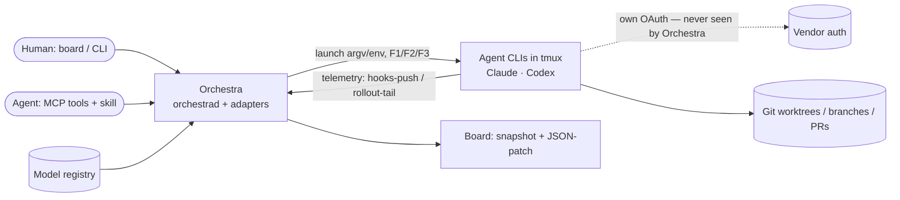
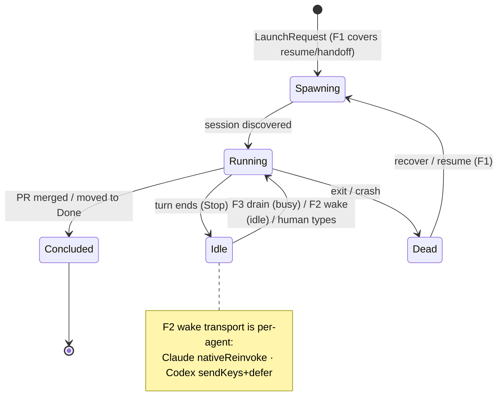

# Layer 1 — Initial Design: Agent-Provider Interface

> The **what**. Full reference: [[agent-provider-interface]]; this is the distilled scope for planning.

## Purpose & problem

Orchestra drives **one** agent today (Claude Code) as a process in a tmux pane, one git worktree per card.
The launch, telemetry, and read-only logic are Claude-shaped. We want to run **any** coding-agent CLI behind
one seam so **Codex** (then a local model) plugs in without `if provider == "claude"` scattered through the
core — and to add the **live-delivery** functions (deliver context into a running agent, wake an idle one)
that handoff / fork / fan-out depend on. The hard constraint: **drive the official binary and let it
authenticate** — never lift the token (keeps subscription use legal).

## Goals / non-goals

**Goals**
- **Agnostic adapter seam** — a small per-agent adapter + a **capability descriptor**; core degrades on flags.
- **Codex as the second adapter** — proves the seam is real (launch, rollout-tail telemetry, read-only).
- **Live delivery** — the three core functions: **F1** resume-in-card, **F2** wake, **F3** push-inbox.
- **The desired goals** — handoff, fork, fan-out, send, queue, handoff-in — composed from F1/F2/F3.
- **Dual surface** — every goal drivable by an **agent** (MCP + skill) *and* a **human** (board/CLI).
- **Read-only + trust** — read-only per-adapter; **trust granting** via an Orchestra-owned **ledger** + core
  resolution from `origin` + a **human-only** grant (MCP `trust` tool · `orchestra trust` CLI · app dialog).
  Trust advisory, OS sandbox the real boundary.

**Non-goals**
- **ACP adapter, app-server, mid-turn interrupt** — design-reference / tracked-future only.
- **Approvals in the first Codex cut** — ships read-only (`-s read-only -a never`), defers the round-trip.
- **Long-tail agents** (Gemini/opencode/…) — build base infra to *admit* them, don't model them.
- **Replacing the agent's own UI** — the tmux pane stays the chat surface; we don't intercept it.
- **Remote/phone trust-prompt routing** — v1 reaches the human via MCP `requestElicitation` (native) / app /
  CLI; routing a grant to a *different* human surface (board/phone) is later.

## Scope

| In scope | Out of scope |
|---|---|
| Capability descriptor + push/tail telemetry seam | ACP adapter, Codex app-server, mid-turn interrupt |
| Codex adapter (launch / session / trust / read-only / rollout-tail) | Codex approvals round-trip (later PR) |
| Inbox (F3) + wake (F2) + resume-in-card/handoff (F1) | True streaming token-by-token content feed |
| MCP `wait`/`handoff` tools + the delegation skill | Long-tail agent adapters, local-model adapter (later) |
| Model registry (context-window denominator) | authMode hard enforcement (soft-warn only — resolved, no cap) |
| **Trust ledger + resolution + human-only grant** (MCP `requestElicitation` · CLI · app dialog) | Remote/phone prompt routing; routing a grant to a *different* human surface |

## The four design areas

Orchestra's job over any agent decomposes into **four interactions**. Each is defined as a seam over the
`Adapter` protocol and driven by a slice of `AgentCapabilities`: **core speaks the interface, each adapter
supplies the provider-specific functionality, and core degrades on the capability flags** (never on provider
identity). The rest of this doc's I/O and behaviour live inside these four.

| # | Area | Direction | Interface (seam) | Capabilities |
|---|------|-----------|------------------|--------------|
| 1 | **Retrieve** — read agent state | agent → Orchestra | `TelemetrySource` → `StatusReport` | `telemetry`, `contextUsage`, `sessionId` |
| 2 | **Startup** — seed a fresh agent | Orchestra → agent (launch) | `AdapterContext` + `start`/`prepareToLaunch` | `sessionId`, `authMode` |
| 3 | **Permissioning** — posture & trust | fixed at exec | read-only argv + trust ledger/resolve/grant + mirror | `readOnlyEnforcement`, `authMode` |
| 4 | **Live delivery** — feed/wake a running agent | Orchestra → agent (live) | F1 `resumeInCard` · F2 `wake` · F3 `Inbox` | `wakeTransport`, `inboxDrain` |

### 1 · Retrieve information from the agent (observe)

**Goals / tasks**
- Know each agent's activity, turn boundaries, session-id, token/context usage, and pending approvals.
- Normalize provider signals into one **two-tier** stream — `EventReport` (control: must-not-drop
  session/usage + turn boundaries) + `SnapshotReport` (content: coarse, best-effort) → board as
  snapshot + JSON-patch events. (Typed `turnEnded{reason}` + approvals deferred with the round-trip.)

**Interface (over adapters)**
- `TelemetrySource` — **push** *or* **tail** → `StatusReport`.
- `ControlEvent` / `ContentEvent` normalized shapes; the vendor transcript file is the source of truth.

| Adapter | Functionality | Capabilities |
|---|---|---|
| Claude | agent **pushes** via hooks → `_report`; session **seeded**; context as **percent** from hook | `telemetry: hooksPush`, `sessionId: seeded`, `contextUsage: percent` |
| Codex | daemon **tails** rollout JSONL; session **discovered** from rollout; **tokens** ÷ `ModelRegistry` window | `telemetry: fileTail`, `sessionId: discovered`, `contextUsage: tokens` |

### 2 · Provide startup information to the agent (launch)

**Goals / tasks**
- Launch / restart / resume / fork behind **one** normalized intent: right binary + model, worktree cwd,
  session identity, initial **seed** (task prompt + `additionalContext` for handoff / fork / fan-out),
  telemetry install, isolated config home.
- Trust resolved by core from card origin; read-only posture fixed at exec.

**Interface (over adapters)**
- `AdapterContext` (`LaunchRequest`) — one intent behind spawn / restart / resume / fork.
- `Adapter.start(ctx) / resume(ctx) -> argv` (pure) + `prepareToLaunch(ctx)` (FS side-effects: config home,
  trust mirror, telemetry install, seed write).

| Adapter | Functionality | Capabilities |
|---|---|---|
| Claude | argv w/ model + session; seed via initial prompt / `additionalContext`; settings + hooks installed | `sessionId: seeded` |
| Codex | argv w/ model; `CODEX_HOME` isolation; seed via prompt / AGENTS.md; session read back post-launch | `sessionId: discovered` |

### 3 · Permissioning with the agent (posture · trust · auth)

**Goals / tasks**
- Run **read-only** where the card demands it (observe / plan); resolve **trust** from `origin` against an
  Orchestra-owned **ledger** and mirror it so the agent doesn't prompt; keep auth **subscription-legal** —
  drive the official binary, **never lift the token**. Approvals round-trip deferred.
- **Grant trust only via a human.** An untrusted cwd is trusted **iff a human says so** — never an autonomous
  agent, never an automatic policy. The grant records into the ledger; there is **no `--trust` flag**.
- **Two write vectors, two tiers.** Edit/Write **tools** are hard-closed at the **harness** (`permissions.deny`,
  with the auto-mode classifier `hard_deny` as approval-policy backstop); **subprocess** writes only at the
  **OS sandbox**. Real read-only needs both — Codex folds them into one flag, Claude composes them — so both
  still land at `readOnlyEnforcement: sandboxed`. An agent that can *only* tool-gate (no OS sandbox) is
  `toolGatedOnly` → **weak-RO badge**.
- The **OS sandbox is the hard boundary** (subprocess vector); the trust file is advisory (the agent can edit its own).

**Interface (over adapters)**
- Read-only is applied at launch — Codex via one argv flag; **Claude by composition** (auto mode):
  `permissions.deny` Edit/Write + classifier `autoMode.hard_deny` **plus** a Bash-sandbox `denyWrite`, all
  written in `prepareToLaunch`. Trust mirrored there too.
- `AgentCapabilities.readOnlyEnforcement ∈ {sandboxed, toolGatedOnly, orchestraSandboxed}` tells core the
  enforcement tier; anything short of the OS boundary shows a **weak-RO** badge.

| Adapter | Functionality | Capabilities |
|---|---|---|
| Claude | **3-layer barrier under auto mode**: `permissions.deny` Edit/Write (harness, hard — tool vector) + classifier `autoMode.hard_deny` rejecting writes (approval-policy backstop) + Bash sandbox `denyWrite` (OS, hard — subprocess vector); trust via settings; own OAuth | `readOnlyEnforcement: sandboxed` (by composition), `authMode: subscription` |
| Codex | read-only via **one flag** `-s read-only -a never` (OS-sandboxed, both vectors); `trust_level` mirrored from ledger; own OAuth | `readOnlyEnforcement: sandboxed`, `authMode: subscription` |

**Trust granting (the ledger + resolution + human-only grant).** One Orchestra-owned **`TrustLedger`** (keyed
by repo/cwd) is the source of truth; each adapter *mirrors* it into its native flag (Claude
`hasTrustDialogAccepted`, Codex `trust_level`) — so a repo trusted once is trusted across both agents. The
core resolves trust from `Task.origin` (the `CardOrigin` enum already exists):

| `origin` | Resolution | Grant needed? |
|---|---|---|
| `worktree` | inherit the **source repo's** ledger entry; mirror onto the worktree path | no (repo already trusted when registered) |
| `scratch` | auto-trust (Orchestra made it empty); record in ledger | no |
| `borrowed` | trusted **iff cwd already in the ledger**; else `needsGrant` | **yes → human grant** |

When resolution returns `needsGrant`, trust is granted **only by a human** through whichever surface that
human is at — never by the agent, and an autonomy/auto-accept card (none today; forward-looking) must exempt
trust:

| Surface | Grant path |
|---|---|
| **App** new-agent dialog | inline **trust · read-only · cancel** in `SpawnSheet` (freeform) |
| **Agent via MCP** | `trust` tool / untrusted `spawn` → **`requestElicitation`** to the human at the agent's client (both v1 targets advertise MCP `elicitation`) |
| **CLI** | TTY split — interactive → prompt; `--read-only` (any caller) → run sandboxed RO; non-interactive + no `--read-only` → **fail with actionable context** |

Pre-bless without launching: **`orchestra trust <path>`** (interactive-only, refuses non-interactively) and
the **MCP `trust` tool** (agent-*triggers*, human-*approves*). The worst an agent can do autonomously is run
**sandboxed**; if trust is ever defeated, the **L3 OS sandbox** still holds.

### 4 · Provide live information to the agent (live delivery)

**Goals / tasks**
- Deliver context into a **running** agent, **wake** an **idle** one, and hand off to a **fresh** process —
  the substrate for handoff / fork / fan-out / send / queue / handoff-in, while the agent **stays chattable**.
- Busy → **F3** alone (drain at next turn-end). Idle → **F2** wakes, then **F3** delivers. Fresh process → **F1** seed.

**Interface (over adapters)** — the three core functions
- **F1 `resumeInCard(cardId, seed)`** — kill + resume the same card seeded with context + inbox (also a start action).
- **F2 `wake(cardId)`** — trigger a turn on an idle card per `wakeTransport`; content rides F3, not the wake.
- **F3 `Inbox.enqueue / drain`** — durable per-card queue drained at turn-end via the Stop hook.

| Adapter | Functionality | Capabilities |
|---|---|---|
| Claude | wake = background `orchestra wait` → harness **re-invokes** in-session; drain = Stop `decision:block` + `additionalContext` | `wakeTransport: nativeReinvoke`, `inboxDrain: stopHook` |
| Codex | wake = **send-keys** nudge + detect-and-defer (future `controlChannel` via app-server); drain = Stop `decision:block` + `reason` | `wakeTransport: sendKeys`, `inboxDrain: stopHook` |

**Headline workflow (reactive fan-out):** orchestrator spawns child cards via MCP, backgrounds a watcher,
stays chattable; each child concludes (merge-watch on real card state) → **F2** wake → **F3** drain → spawn
next-in-stack.

## Work artifacts vs conclusions

Orthogonal to the four areas: **work artifacts ride git** (branches / PRs, tagged `parentCardId`),
**conclusions ride the inbox** (the merge-watch signal → F3). Keeping them separate is what lets a child
conclude without the parent polling a diff.

## Complexity & risks

| Area | Risk | Sizing |
|---|---|---|
| Live delivery (F1/F2/F3) | **greenfield** — no inbox/wake exists today | largest |
| Codex rollout-tail telemetry | version-sensitive JSONL shape (field renames) | medium |
| Codex send-keys wake | composer race with a typing human → **detect-and-defer** | medium |
| Capability descriptor | enum churn rebases the whole forest → freeze at L0 | small but central |
| Trust granting | new ledger + a daemon→human **ask** channel (none today) + CLI TTY detection | medium |
| Auth | must stay subscription-legal — drive the binary, never the token | hard constraint |

## Diagrams

### Bird's-eye (context)

### Detailed (card lifecycle)

## Decisions made

| Decision | Why | Rejected |
|----------|-----|----------|
| Process-adapter over PTY/tmux | matches every precedent; keeps auth legal | server/SDK adapter, ACP |
| Capability descriptor, not provider `if` | admits Codex without core branching | recompiled enum |
| Two-tier normalized events | reliability split (control must-not-drop) | one flat event type |
| Three core functions F1/F2/F3 | minimal set; goals compose from them | blocking-`await` pull (holds turn) |
| Codex read-only first | sidesteps approvals for v1 | full approval round-trip now |
| `readOnlyEnforcement` is a *tier*, not a mechanism count | Claude reaches the OS tier by composing 3 layers → `sandboxed`, same as Codex | labeling Claude `toolGatedOnly` (its weakest lever) |
| Claude read-only = auto mode + deny-rules + classifier, **not plan mode** | matches how Orchestra runs (auto mode); `permissions.deny` hard-closes the tool vector, classifier `hard_deny` is the approval-policy backstop | plan mode (wrong interaction model; classifier alone default-allows cwd writes) |
| Trust advisory, sandbox is boundary | agent can edit its own trust file | credential/card-token scheme |
| Trust granting **in scope**: ledger + human grant | a repo trusted once must carry across Claude+Codex; borrowed cards need a real grant path | defer it (leaves borrowed untrusted) |
| Human-only grant, no `--trust` flag | trust is dangerous; no non-interactive path may self-grant | agent / auto-policy can grant |
| Grant elicits via MCP `requestElicitation` | both v1 targets advertise `elicitation`; protocol-native, no daemon ask-channel | bespoke board-gate (no target needs it) |
| One Orchestra `TrustLedger`, adapters mirror | provider-agnostic source of truth; native flag is a mirror | per-adapter trust files as truth |
| Drive the binary, never the token | subscription-legal on both vendors | API client / token lift |
| authMode = **soft-warn only** (no cap) | subscription-seat fan-out just needs a nudge; a cap adds config + queueing for little v1 gain | configurable concurrency cap (deferred) |
| **Seam contract frozen at A1** — complete `AgentCapabilities` + `AdapterContext.seed` | shared protocol/struct shape defined once; downstream PRs implement behind it, additions defaulted → no drift | growing the shared shape across PRs; full L0 stubbing greenfield types |

## Open questions — need your call

_All resolved 2026-07-01 — see [[index]] for the rollup._

**Resolved:**
- **q4 — authMode UX** → **soft-warn only** for v1. Warn past a threshold on subscription-seat fan-out; **no** concurrency cap (deferred). E2 ships just the warning.
- **Approvals deferral** → **confirmed.** First Codex cut is read-only (`-s read-only -a never`); the approval round-trip + typed `turnEnded{reason}` / `approvalRequested` events land in a later PR outside this forest.
