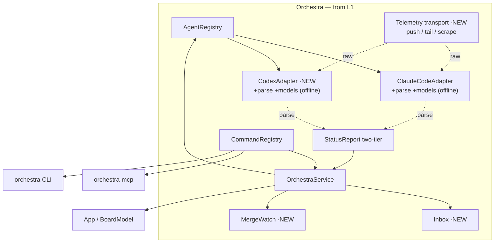
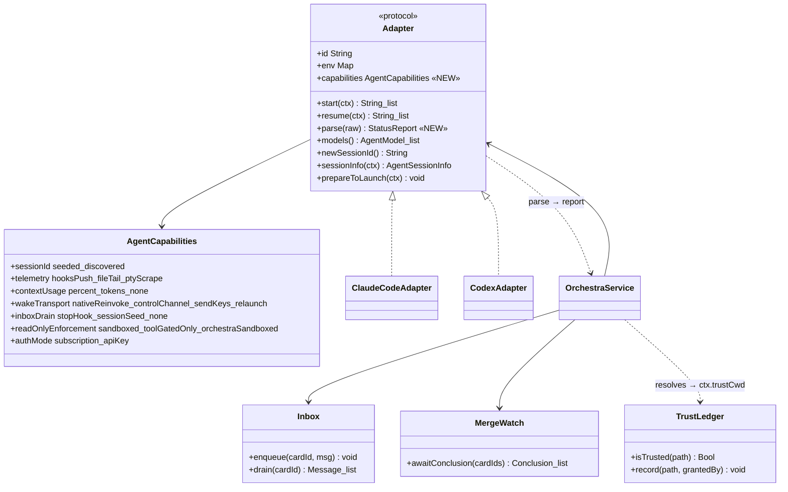
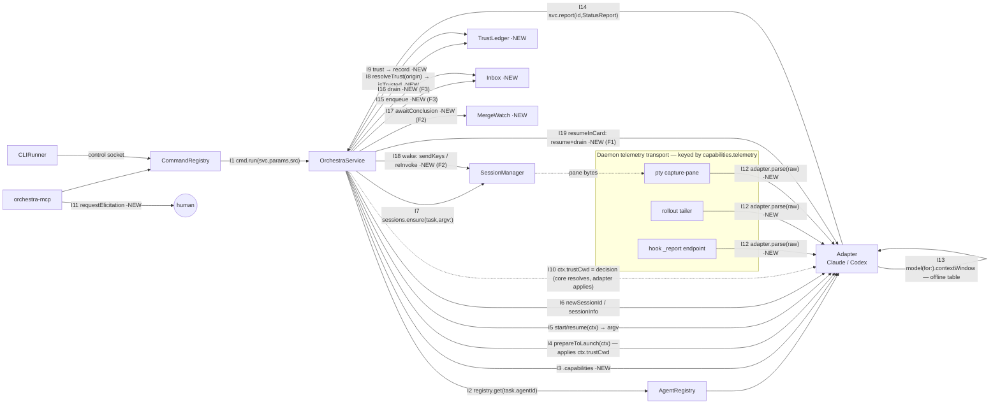
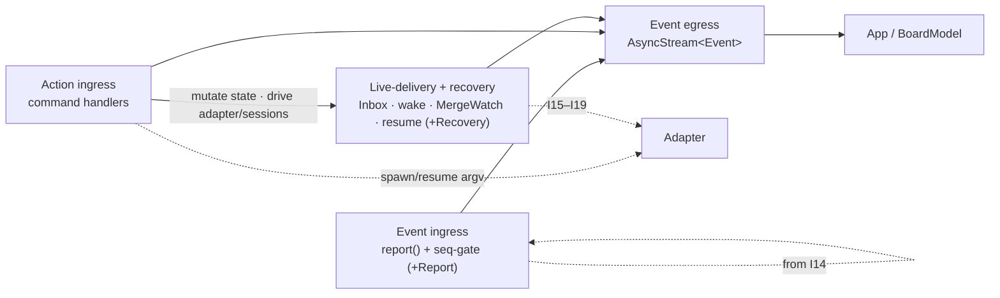

# Layer 2 — Contractual Design: Agent-Provider Interface

> The **interfaces**. Grounded in the existing Swift seam (`Sources/OrchestraCore/Agents/`); new pieces marked **NEW**.

## Architecture overview

`OrchestraCore` already has an `Adapter` protocol + `AdapterContext` (a `LaunchRequest`-equivalent) +
`AgentRegistry`, with `ClaudeCodeAdapter` conforming, and a **two-tier `StatusReport`** (`EventReport` +
`SnapshotReport`) the daemon merges provider-agnostically. We **add** three things: a **capability
descriptor** on the protocol; a **telemetry transport** (push *or* tail) that feeds the **adapter's own
`parse`** (conversion is agent-dependent) behind the existing report model; and a greenfield
**live-delivery** layer (inbox + wake + merge-watch). The command surface
(`Commands.swift` `CommandRegistry`) single-sources the **MCP** tool list; the **CLI is a hand-written
`CLIRunner` switch** over the same command names — so a new agent tool = a new `Command` (auto in MCP) **+ a
`CLIRunner` case** (parity is tested MCP↔registry only).

These contracts realize Layer 1's **four areas**: **1 retrieve** = telemetry transport + `adapter.parse`;
**2 startup** = `AdapterContext` + `start`; **3 permissioning** = read-only argv + trust in
`prepareToLaunch`; **4 live delivery** = `Inbox` / `wake` / `resumeInCard`. `AgentCapabilities` is
**cross-cutting** — all four degrade on it.

> **Name map — design → real Swift seam.** The design note ([[agent-provider-interface]] §4) is idealized;
> the real protocol (`Agents/Adapter.swift`) is what these contracts extend. `buildLaunch`→`start`/`resume`
> (return `[String]` argv; process `env` is a separate `Adapter.env` property); `parse`→the **adapter's
> own `parse`** (the daemon owns only the telemetry transport); `resumeHandle`→existing `sessionInfo(...)` + `isResumable`. Design `AccessPolicy{default,
> readOnly}` = the existing **`CardAccess{readWrite, readOnly}`** enum (`AdapterContext.access`). Design
> `ControlEvent`/`ContentEvent` = the existing **`EventReport`/`SnapshotReport`** halves of `StatusReport`.

## Major classes / modules

| Name | Area | Responsibility | Collaborators |
|------|------|----------------|---------------|
| `Adapter` (protocol) | all | per-agent launch + capabilities | `AdapterContext`, `AgentCapabilities` |
| `AgentCapabilities` **NEW** | cross-cut | descriptor core degrades on | every adapter, `OrchestraService` |
| `AdapterContext` | 2 startup | normalized launch intent (`LaunchRequest`) | `OrchestraService.spawn` |
| `ClaudeCodeAdapter` · `CodexAdapter` **NEW** | 2·3 | concrete argv/env/session/RO/trust | `AgentRegistry` |
| Telemetry **transport** **NEW** | 1 retrieve | daemon-side push endpoint / tail loop / scrape, keyed by `capabilities.telemetry` — obtains **raw** bytes | `HooksRenderer`, tailer, `ReportHelper` |
| `Adapter.parse(raw)` **NEW** | 1 retrieve | **agent-dependent** conversion raw → `StatusReport` (the D3 normalization core) | the adapter, transport |
| `StatusReport` (`EventReport`+`SnapshotReport`) | 1 retrieve | two-tier normalized telemetry | `OrchestraService+Report` |
| Adapter **model table** **NEW** | 1 retrieve | per-adapter offline models + context-window + flags; **vendored in-repo, PR-updated** (extends existing `Adapter.models()`) | the adapter (`ctxPct`), `parse` |
| `Inbox` **NEW** | 4 live | durable per-card message queue (F3) | `OrchestraService.send`, Stop-hook drain |
| `MergeWatch` **NEW** | 4 live | conclusion detection from real card state | F2 wake, `wait` tool |
| `TrustLedger` **NEW** | 3 permissioning | Orchestra-owned trust source of truth (repo/cwd → trusted) | `resolveTrust`/`trust` (**core only** — adapters never read it) |
| `CommandRegistry` | cross-cut | single-source **MCP** tools; CLI = manual `CLIRunner` switch over the same names | `orchestra-mcp`, `CLIRunner` |
| `OrchestraService` | all (core) | orchestration core (spawn/send/wake/resume) | all of the above |

## Function / method contracts

Grouped by Layer 1's four areas. `Adapter.capabilities` is cross-cutting (every area gates on it).

### Cross-cutting — capability descriptor

**`Adapter.capabilities -> AgentCapabilities`** **NEW**
- **Does:** advertise `sessionId`, `telemetry`, `contextUsage`, `wakeTransport`, `inboxDrain`, `readOnlyEnforcement`, `authMode`.
- **Outputs:** value type; core switches on it, never on adapter identity.

### Area 1 · Retrieve (telemetry)

**`Adapter.parse(raw) -> StatusReport`** **NEW** — the conversion is **agent-dependent** (D3)
- **Does:** the *adapter* converts its raw output → one two-tier `StatusReport`; the *daemon* only supplies the raw bytes via the transport keyed by `capabilities.telemetry`, then merges provider-agnostically (seq-gate).
- **Transport variants (daemon-owned):** `hooksPush` = agent pushes to the `_report` endpoint (out-of-band, not via the pane); `fileTail` = daemon tails the rollout path (from `sessionInfo`); `ptyScrape` = daemon reads `SessionManager.capture`.
- **ctxPct denominator:** `adapter.model(for:).contextWindow` — the adapter's **offline** model table, never a network fetch.
- **As-built (A2, shipped):** `RawTelemetry` (`Agents/Telemetry.swift`) — `enum RawTelemetry {case hooksPush(kind:payload:); case fileTail(line:)}` (the raw unit a transport hands to parse; `ptyScrape` deferred — no v1 consumer). `Adapter.parse(_ raw: RawTelemetry) -> StatusReport?` added to the protocol with a `nil` default in `extension Adapter` (**additive** — no conformer breaks). `ClaudeCodeAdapter.parse` owns the `hooksPush` conversion, **relocated verbatim** from the former `orchestra` CLI `ReportHelper.map`/`toolDesc` (cross-target move); the `_report` push transport (`ReportHelper.run`) now calls `ClaudeCodeAdapter().parse(.hooksPush(...))`. Daemon `report` endpoint (`ControlServer` `case "report"`) + `OrchestraService.report` seq-gate merge **unchanged** — `ReportTests` byte-identical (126 tests green). `fileTail` parse + the rollout tailer land in **B2** (daemon-side, same `adapter.parse` seam).

**`ControlEvent` / `ContentEvent`** (normalized, maps to existing `EventReport`/`SnapshotReport`)
- **Does:** control = reliable session-id/usage + turn boundaries (**today**: status transitions + the Stop hook); content = best-effort coarse blocks + `raw`.
- **Deferred:** typed `turnEnded{reason}` and `approvalRequested`/`approvalResolved` are **not** `EventReport` fields yet — they land with the approval round-trip, not this forest.
- **Notes:** vendor transcript file is the source of truth; content is coarse (§4 D3).

### Area 2 · Startup (launch)

**`Adapter.start(ctx) / resume(ctx) -> [String]`** (argv)
- **Does:** build launch / resume argv (binary, model, session-id, read-only, seed). Pure.
- **Side-effects:** none (filesystem prep is `prepareToLaunch`).
- **Seed (F1) rides on `ctx`:** the handoff/fork seed is carried by **`AdapterContext.seed`** — a defaulted field **frozen in A1** (`Adapter.swift:4`), so `resume`'s signature stays `(ctx) -> [String]?` and C3 only *reads* the new field. `prompt` is doc-committed to nil-on-resume (`ClaudeCodeAdapter.swift:108`), so the seed needs its own carrier.

**`Adapter.prepareToLaunch(ctx) throws`**
- **Does:** idempotent FS/config side-effects — isolated config home, mirror trust, install telemetry, write seed.
- **Errors:** throws on unwritable config / trust mirror failure.

**`Adapter.newSessionId() -> String?` · `sessionInfo(ctx) -> AgentSessionInfo?`** (existing — session identity, D5)
- **Does:** `newSessionId` supplies a seed id (Claude); `sessionInfo` discovers the live id + transcript/rollout path.
- **Refactor:** `OrchestraService.isResumable` gates on `capabilities.sessionId` + `sessionInfo` — **not** the hard-coded `~/.claude` transcript stat (design §5 loosens that Claude coupling).

### Area 3 · Permissioning (posture · trust · auth)

**Read-only posture + trust mirror** (no dedicated method — expressed through the launch seam)
- **Does:** apply read-only at launch — Codex via one argv flag; **Claude by composition** (auto mode): `permissions.deny` Edit/Write + classifier `autoMode.hard_deny` + a Bash-sandbox `denyWrite`, written in `prepareToLaunch`. Trust mirrored there.
- **Gates on:** `capabilities.readOnlyEnforcement ∈ {sandboxed, toolGatedOnly, orchestraSandboxed}` (tier / badge) + `authMode` (fan-out).
- **Notes:** deny-rules (hard) close the tool vector, the OS sandbox (hard) the subprocess vector, the classifier is an approval-policy backstop; `toolGatedOnly` (no OS sandbox) is weak — surface it. Trust file is advisory; the ledger below is the source of truth.

**`TrustLedger.isTrusted(path) -> Bool` · `record(path, grantedBy)`** **NEW** (trust)
- **Does:** durable repo/cwd→trusted store (actor-over-JSON, sibling to `TaskStore`); the provider-agnostic source of truth a repo is trusted-once across Claude+Codex.
- **Side-effects:** persists; **only core** reads it (in `resolveTrust`) — the result rides `ctx.trustCwd`; adapters never read the ledger.
- **As-built (T1, shipped):** `Agents/TrustLedger.swift` — `public actor TrustLedger` (`isTrusted(_:) -> Bool`, `@discardableResult record(_:grantedBy:) throws -> Bool`, keys canonicalized via `PathResolver.canonical`, atomic save + `.bak`-on-malformed like `TaskStore`), `enum TrustDecision {trusted, needsGrant}`, `enum TrustGrantor {human, orchestra, repoRegistration}`, `Config.trustLedgerPath`. Core `OrchestraService.resolveTrust(origin:cwd:repo:) async -> TrustDecision` sets `ctx.trustCwd` at all 3 launch sites (spawn/resume/restart); `ClaudeTrust.apply(trusted:cwd:home:)` mirrors the decision into `~/.claude.json` (the old repo-conditional `mirror` is removed — worktree trust is now core-resolved). Grant surfaces (elicitation/CLI) remain **T2**.

**`OrchestraService.resolveTrust(origin, cwd, repo) -> TrustDecision`** **NEW**
- **Does:** `{trusted | needsGrant}` from the existing `CardOrigin` — `worktree` inherits the source-repo entry, `scratch` auto-trusts (+records), `borrowed` is trusted iff cwd is in the ledger. Feeds `AdapterContext.trustCwd` (today just `origin == .scratch`).

**`OrchestraService.trust(path)`** **NEW** (Command — MCP tool + CLI verb)
- **Does:** record a grant into the ledger — **only after a human approves** (the agent *triggers*, a human *answers*; autonomy cards exempt trust; **no `--trust` flag**).
- **MCP / untrusted-spawn:** orchestra-mcp calls `Server.requestElicitation(...)` back over its **persistent MCP session** to the agent's own client — gated on the client's advertised **`elicitation`** capability (MCP `initialize`). **Both v1 targets (Claude Code, Codex) support it**, so this is *the* grant path. Surfaces to the human at that client / the card's pane; on approval, record via the daemon `trust` command. **No daemon ask-channel** (the round-trip never touches the per-call `ControlClient`).
- **CLI `orchestra trust <path>`:** interactive-only (`isatty`); refuses non-interactively with actionable context.
- **Note:** `elicitation` is the **MCP client's own** advertised capability, read live at call time — *not* a new `AgentCapabilities` value (keeps the frozen descriptor enum clean).
- **Future (not built):** an agent whose client lacks `elicitation` would need a fallback — a board approval gate (daemon `CheckedContinuation` via the `resumeWaiters` pattern + a `trustRequested` event). No v1 target needs it, so it's a note, not code.

**Adapter trust mirror** (inside `prepareToLaunch`, from **`ctx.trustCwd`**)
- **Does:** write the native flag *from the core's decision on `ctx`* — Claude `ClaudeTrust` (`hasTrustDialogAccepted`), Codex `trust_level`. The adapter **never reads `TrustLedger`**; core resolves (I8) + sets `ctx.trustCwd`, adapter applies (I10). Never the reverse.

### Area 4 · Live delivery (F1/F2/F3)

**`Inbox.enqueue(cardId, message)` · `drain(cardId) -> [Message]`** **NEW** (F3)
- **Does:** durable append; drain returns + clears pending in order; survives restart.
- **Side-effects:** persists (sibling to `TaskStore`); drain capped per the loop guard.

**`OrchestraService.wake(cardId)`** **NEW** (F2)
- **Does:** trigger a turn on an idle card per `wakeTransport`; content rides the inbox, not the wake.
- **Inputs:** card must be idle; for `sendKeys`, gated by detect-and-defer (idle + composer-empty).

**`OrchestraService.resumeInCard(cardId, seed)`** **NEW** (F1)
- **Does:** kill + resume same card, seeding handoff context + pending inbox. `LaunchRequest{resume, seed}`.
- **Side-effects:** new process; same logical session (resume, not blank restart).

**`wait(cardIds) -> conclusion` · `MergeWatch.awaitConclusion(cardIds)`** **NEW** (Command + service)
- **Does:** resolve as soon as **any one** of `cardIds` reaches a terminal state (Done / merged / exited), read from **real card state** — never `git merge-base` (the 0-commit false positive). Backs `orchestra wait`.
- **Detection (how it knows) — it doesn't detect; it subscribes.** MergeWatch owns **no** detection: no git poll, no file stat, no per-card watcher. It **subscribes to the service's lifecycle event bus** (the egress `AsyncStream<Event>` the board also reads) and registers a **continuation keyed on the watch set** (the `awaitResume`/`resolveResume` pattern). `OrchestraService` is the **single authority** that computes a card's terminal state — from telemetry `exited`, `reconcileLiveness`/`markDead`, or a `move`-to-Done command — and publishes it. So **yes: the service informs the watcher of lifecycle transitions; the watcher just filters for its `cardIds`.**
- **Settled terminal, not raw exit.** It keys on the **post-liveness-reconcile** state, so a transient crash that gets **revived** (≤ `maxRevivals`) does **not** signal conclusion — "process ended" ≠ "card concluded."
- **Multi fan-out (Q6):** watching N children yields **one conclusion event per child, as each concludes** — not a barrier on all N. Each conclusion → `Inbox.enqueue(parent, conclusion)` (F3) + wake the parent (F2) if idle. The **inbox coalesces**: several children concluding while the parent is mid-turn all enqueue and **drain together at the next turn-end** — so wake is only a trigger, content is durable, and no return is lost or needs its own wake. The `orchestra wait` loop re-issues on the remaining children after each return.
- **Errors:** cancellation; continuation pattern like existing `resumeWaiters` / `awaitResume`.

## Library / framework decisions

| Decision | Choice | Rationale | Alternatives considered |
|----------|--------|-----------|-------------------------|
| MCP transport | `modelcontextprotocol/swift-sdk` (already a dep) | only existing external dep; stdio bridge | hand-rolled JSON-RPC |
| Model data | **per-adapter offline table** (extends `Adapter.models()`), vendored in-repo + PR-updated | keeps the app fully offline; already the seam's shape; no external registry to fetch or drift | global models.dev/LiteLLM registry (external, rejected — offline pref) |
| Process / pane | tmux + `Proc` (existing) | precedent-validated; keeps native TUI | app-server (drops TUI) |
| Tests | swift-testing (existing) | repo standard; `StubAdapter`/`StubSessions` ready | XCTest |
| Codex telemetry | daemon **tails** rollout JSONL | TUI emits no `--json`; rollout has usage/turns | app-server stream |

## Diagrams

### Bird's-eye (components — zoom into the L1 "Orchestra" box)

### Detailed (classes)

## Component interaction graph — grounding the contract

The seam is only as real as the **calls that cross it**. This graph pins every inter-component
function invocation (an edge = one call, grounded in the real Swift symbols); the table below binds
**each edge to a covering test in [[04-tests]]** so no interaction is contract-only. `·NEW` marks a
greenfield symbol (the rest exist in `Sources/OrchestraCore/`).

> **Where agent-specific logic lives.** Core is agnostic; the **adapter owns four things** — launch
> argv (I5), **output parse** (I12, agent-dependent by D3), its **offline model table** (I13), and
> **applying** the core's trust decision (I10). Trust is *resolved by core* (I8) and passed in on
> `ctx.trustCwd` — the adapter never reads the ledger. Telemetry **transport** (push/tail/scrape) is
> the daemon's, keyed by `capabilities.telemetry`; only the **parse** is the adapter's.

**Every edge → a test.** If a row's test does not yet exist, it is **added in [[04-tests]]** (marked
*add*); the rest already exist.

| # | Caller → Callee | Function (real seam) | Area | Covering test ([[04-tests]]) |
|---|-----------------|----------------------|------|------------------------------|
| I1 | CommandRegistry → OrchestraService | `cmd.run(service, params, source)` | X | `test_registry_mcp_parity` · `test_command_roundtrip` |
| I2 | OrchestraService → AgentRegistry | `registry.get(task.agentId)` | 2 | `test_adapter_resolved_by_agentId` *(add)* |
| I3 | OrchestraService → Adapter | `adapter.capabilities` ·NEW | X | `test_core_gates_on_caps` |
| I4 | OrchestraService → Adapter | `prepareToLaunch(ctx)` | 2 | `test_prepareToLaunch_before_start` *(add)* |
| I5 | OrchestraService → Adapter | `start(ctx)` / `resume(ctx)` → argv | 2 | `test_codex_argv` · `test_argv_passed_to_session` *(add)* |
| I6 | OrchestraService → Adapter | `newSessionId()` / `sessionInfo(ctx,current:,prior:)` | 2 | `test_isResumable_gated_by_caps` |
| I7 | OrchestraService → SessionManager | `sessions.ensure(task, argv:)` | 2 | `test_argv_passed_to_session` (StubSessions.ensureArgv) *(add)* |
| I8 | OrchestraService → TrustLedger | `resolveTrust(origin,cwd,repo)` → `isTrusted(path)` ·NEW | 3 | `test_origin_resolution` |
| I9 | OrchestraService → TrustLedger | `trust(path)` → `record(path, grantedBy)` ·NEW | 3 | `test_trust_records_after_grant` · persistence |
| I10 | OrchestraService → Adapter | trust decision via `ctx.trustCwd` (core resolves I8, adapter **applies** in `prepareToLaunch`; never reads the ledger) ·NEW | 3 | `test_adapter_applies_ctx_trust` *(add)* |
| I11 | orchestra-mcp → agent client | `Server.requestElicitation(...)` ·NEW | 3 | `test_no_self_grant` |
| I12 | telemetry transport → Adapter | `adapter.parse(raw) -> StatusReport` (**agent-dependent**, D3) ·NEW | 1 | `test_claude_report_unchanged` · `test_rollout_to_statusreport` |
| I13 | Adapter → own offline model table | `model(for:).contextWindow` (ctxPct denom; vendored in-repo, PR-updated) | 1 | `test_ctxpct_from_model_table` *(add)* |
| I14 | Adapter → OrchestraService | `service.report(id, StatusReport)` (+Report seq-gate merge) | 1 | `test_report_reaches_board` *(add)* |
| I15 | OrchestraService → Inbox | `enqueue(cardId, msg)` ·NEW (F3) | 4 | `test_enqueue_drain_order` |
| I16 | OrchestraService → Inbox | `drain(cardId)` ·NEW (F3, Stop-hook) | 4 | `test_stopdrain_preserves_notify` |
| I17 | OrchestraService → MergeWatch | `awaitConclusion(cardIds)` ·NEW (F2 / `wait`) | 4 | `test_zero_commit_not_concluded` |
| I18 | OrchestraService → SessionManager | `wake` → `sendKeys` (Codex) / native re-invoke (Claude) ·NEW (F2) | 4 | `test_defer_on_draft` · `test_wake_fires` |
| I19 | OrchestraService → Adapter + Inbox | `resumeInCard`: `resume(ctx)` + `drain`→seed ·NEW (F1) | 4·2 | `test_resume_carries_seed` |

> **Reading the graph.** `OrchestraService` is the hub every edge routes through — there is **no
> adapter↔session or adapter↔inbox shortcut**. That is the invariant the seam buys: core owns
> orchestration and gates on `capabilities` (I3); adapters only *lower* intent — argv (I5), parse
> (I12), model table (I13), and applying the core's trust decision (I10). The one edge that leaves
> the process is I11 (trust elicitation to a human).

### OrchestraService internals (the hub, decomposed)

The hub above is not monolithic; it separates into four concerns (the real code already splits
`+Report`/`+Recovery` off the core). This is the seam *inside* core — the UI reads only the egress
bus, never the handlers.

| Sub-component | Owns | Real seam |
|---------------|------|-----------|
| **Action ingress** | command handlers (spawn/send/wake/wait/trust) → state mutation + adapter/session drive | `Command.run` → `OrchestraService` methods |
| **Event ingress** | `report(id, StatusReport)` — event half unconditional, snapshot half seq-gated | `OrchestraService+Report.swift` (`lastSeqStore`) |
| **Event egress** | the `AsyncStream<Event>` broadcast the UI subscribes to | existing `Event` stream → `BoardModel` |
| **Live-delivery + recovery** | Inbox (F3), wake (F2), MergeWatch, `resumeInCard` (F1), liveness/resume | `+Recovery.swift` + new `Inbox`/`MergeWatch` |

**Authority & source of truth — is the service the SSOT, or a relay?** Both, split by the D3 tier — and
it is **state-authoritative, not event-sourced**. It is an **authoritative *reducer***: the single writer
that interprets noisy inputs into one canonical card state and **rejects contradictions** (the seq-gate
drops stale snapshots — a relay would not). But it is the authoritative *interpreter* of reality, **not the
definer** of it (the process / transcript / git are ground truth).

| "Who is authoritative for…" | SSOT | Note |
|---|---|---|
| card **lifecycle** (running / idle / exited / **concluded**) — ControlEvent | **`OrchestraService` + `TaskStore`** | adjudicated: seq-gate + `reconcileLiveness` (terminal-vs-revive), persisted |
| what the agent **said** — ContentEvent | **vendor transcript file** | bus is best-effort liveness; a dropped event is recoverable from the file — service **relays** |
| repo **trust** | **`TrustLedger`** | §4.1 |
| **pending** messages | **`Inbox`** (durable) | F3 |

- **Single writer, adjudicated** (authority, not pass-through) for lifecycle; **relay** for content.
- **Snapshot, not replay:** the egress bus is an *ephemeral projection*; durable truth is the stores +
  the transcript. A late subscriber gets a **snapshot** (AG-UI snapshot+delta), never an event-log replay.
- This is exactly why **MergeWatch trusts the service's derived terminal state** (not raw exits): the
  terminal-vs-revive call is the service's authority to make.

## Traceability → Layer 1 (the four areas)

| L1 area | Interface / contract covering it |
|---------|----------------------------------|
| **1 · Retrieve** | daemon telemetry transport (push/tail/scrape) → `adapter.parse` → `StatusReport`; `ControlEvent`/`ContentEvent`; per-adapter offline model table (ctx denominator) |
| **2 · Startup** | `AdapterContext` + `Adapter.start`/`resume`/`prepareToLaunch` |
| **3 · Permissioning** | read-only in `start` argv; **trust** = `TrustLedger` + `resolveTrust` + `trust` Command (human grant) + adapter mirror in `prepareToLaunch`; `capabilities.readOnlyEnforcement`/`authMode` |
| **4 · Live delivery** | `Inbox` (F3) · `OrchestraService.wake` (F2) · `resumeInCard` (F1) · `MergeWatch` + `wait` |
| **cross-cutting** | `Adapter.capabilities` (all four degrade on it); `CommandRegistry` (dual surface); goals compose via `spawn`/`send`/`wait`/`handoff` + skill |

## Decisions made

| Decision | Why | Rejected |
|----------|-----|----------|
| Add caps to existing `Adapter`, don't rebuild seam | seam already good (`start`/`resume`/`sessionInfo`/`prepareToLaunch` stay) | new abstraction |
| Daemon-side report model unchanged | already two-tier (`EventReport`+`SnapshotReport`) + agnostic | re-model events |
| Reuse existing `CardAccess` enum, don't add `AccessPolicy` | `AdapterContext.access` already carries it | parallel access type |
| New tools = new `Command`s (MCP auto) + a `CLIRunner` case | registry single-sources MCP; CLI is a manual switch | claim CLI is auto-derived |
| `Inbox` sibling to `TaskStore` | matches actor-over-JSON pattern | in-memory only |
| `TrustLedger` is truth; adapters mirror | trusted-once carries across Claude+Codex; native flag is derived | per-adapter trust files as truth |
| Grant via MCP `requestElicitation`, no fallback built | both v1 targets advertise `elicitation`; native, no daemon ask-channel | build a board-gate no target needs |
| **Telemetry parse is the adapter's** (`adapter.parse`); daemon owns transport only | conversion is agent-dependent (D3); Claude push vs Codex tail diverge | core-owned `TelemetrySource` doing the parse (leaks agent shape into core) |
| **Model table lives per-adapter, offline** (no `ModelRegistry` component) | `Adapter.models()` already carries it; keeps app offline, PR-updated | separate global registry / models.dev fetch |
| **Trust resolved by core, applied by adapter** via `ctx.trustCwd` | §4.1 — core decides, adapter can't be trusted to; field already exists | adapter reading `TrustLedger.isTrusted` itself |
| **Split `OrchestraService`** into action-ingress / event-ingress / egress-bus / live+recovery | it was a god-hub; UI must read only the egress bus | one monolithic service class |
| **A1 is the seam-contract-freeze root** — complete `AgentCapabilities` + `AdapterContext.seed` (defaulted) land first | shared protocol/struct shape defined once; every later PR implements behind it; additions defaulted so no conformer breaks (`env`/`prepareToLaunch` precedent) | grow the protocol/context across PRs; stub greenfield `Inbox`/`MergeWatch`/`TrustLedger` early |
| `wake` and `wait` are **two distinct Commands** | trigger (fire-and-forget) vs blocking conclusion-watch differ in semantics, params, callers | one parameterized verb |

## Open questions — need your call

_All resolved 2026-07-01._

**Resolved:**
- **`wake`/`wait`** → **two distinct commands.** Different semantics (a fire-and-forget turn-trigger vs a blocking conclusion-watch), params, and callers — clearer MCP schema, skill docs, and `CLIRunner` cases than one parameterized verb.
- **q6 — model data** → **per-adapter offline table** (extends `Adapter.models()`), vendored in-repo + PR-updated. **No** global registry, no models.dev/LiteLLM fetch — the app stays offline.
- **Telemetry parse** is the **adapter's** (`adapter.parse`), agent-dependent (D3); the daemon owns only the transport (push/tail/scrape) keyed by `capabilities.telemetry`.
- **Trust** is resolved by **core** (`resolveTrust` → `ctx.trustCwd`) and **applied** by the adapter; the adapter never reads `TrustLedger`.
- **Trust-grant transport** = MCP `requestElicitation` gated on the client's `elicitation` flag; **both v1 targets support it**, so there is no fallback in v1 (a board-gate is a future note for non-elicitation agents).
