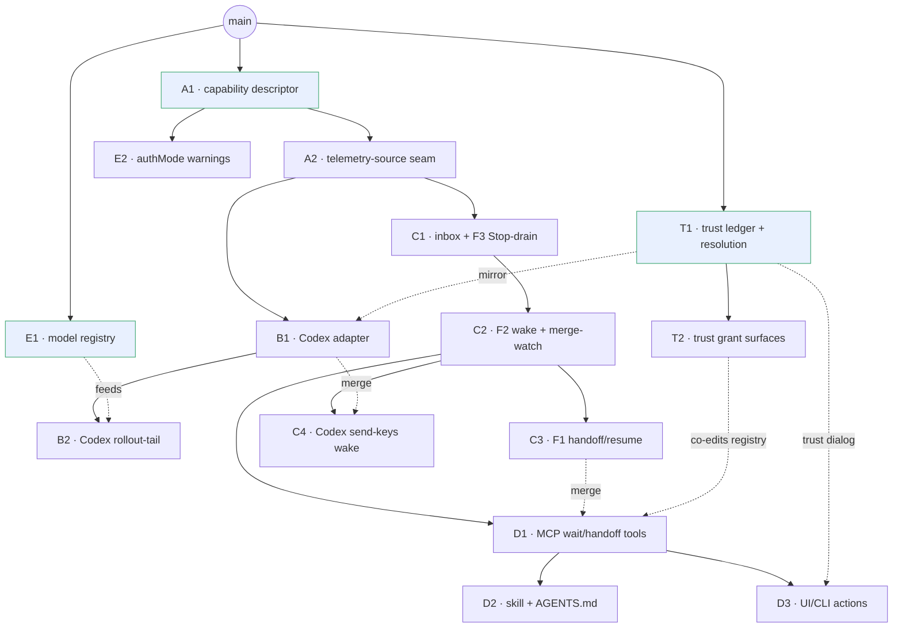
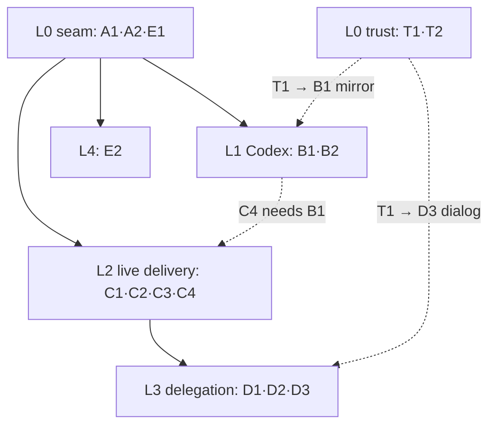
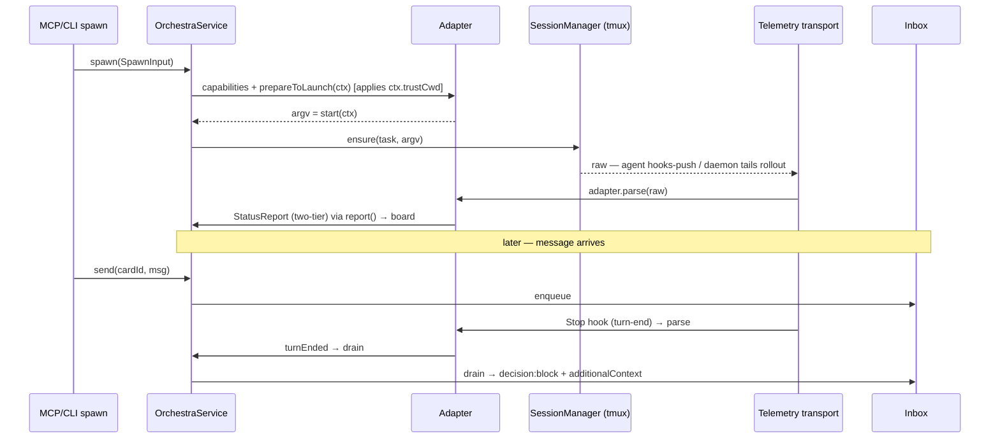

# Layer 3 — Implementation: Agent-Provider Interface

> The **how** + the **PR forest** (the sequencing *is* the forest). Reviewed with [[04-tests]] at one gate.

## Implementation approach (per component)

Area = the Layer 1 design area each component serves (1 retrieve · 2 startup · 3 permissioning · 4 live).

| Component | Area | Build approach | Key files (real paths) |
|---|---|---|---|
| Capability descriptor | cross-cut | add `AgentCapabilities` to `Adapter` (alongside real `env`/`newSessionId()`/`sessionInfo()`); replace nil-return capability-implications with explicit switches; gate `isResumable` on caps + `sessionInfo` (drop the Claude-transcript-stat assumption, §5) | `Agents/Adapter.swift`, `ClaudeCodeAdapter.swift`, `OrchestraService.swift`, `+Recovery.swift` |
| Telemetry seam | 1 | daemon owns **transport** keyed on `capabilities.telemetry` (push endpoint / tailer / scrape → **raw**); the **adapter's `parse`** converts raw → `StatusReport` (agent-dependent); core merges (seq-gate) | `Control/HooksRenderer.swift`, `orchestra/ReportHelper.swift`, new tailer, `Adapter.parse` per adapter |
| Model table (per-adapter, offline) | 1 | extend `Adapter.models()` with context-window + flags from a **vendored in-repo JSON, PR-updated** — no global registry, no fetch; `ctxPct` = `adapter.model(for:).contextWindow` | `ClaudeCodeAdapter.swift`, `CodexAdapter.swift`, `Resources/<agent>-models.json` |
| Codex adapter | 2·3 | mirror `ClaudeCodeAdapter`: argv, discovered session-id, `CODEX_HOME` isolation, `trust_level` (**from `ctx.trustCwd`**), `-s read-only -a never` | new `Agents/CodexAdapter.swift`, `ReadOnlyLaunch` sibling |
| Read-only posture | 3 | Codex: one flag `-s read-only -a never`. Claude (auto mode): `permissions.deny` Edit/Write + classifier `autoMode.hard_deny` + Bash `sandbox.denyWrite`, written in `prepareToLaunch` — both advertise `sandboxed` | `ClaudeCodeAdapter.swift`, `CodexAdapter.swift`, settings/`hard_deny` render, `+Recovery.swift` |
| Trust ledger + grant | 3 | new `TrustLedger` (actor-over-JSON); core `resolveTrust(origin)` (worktree inherit / scratch auto / borrowed conditional) sets **`ctx.trustCwd`**; refactor `ClaudeTrust` to mirror *from* `ctx.trustCwd` (**adapter never reads the ledger**); `trust` Command + `orchestra trust` (`isatty`, interactive-only); grant via MCP `requestElicitation` (both v1 targets advertise `elicitation`); `SpawnSheet` trust·read-only·cancel | new `Agents/TrustLedger.swift`, `OrchestraService.swift`, `ClaudeCodeAdapter.swift`, `Commands.swift`, `orchestra-mcp/main.swift`, `CLIRunner.swift`, `App/Views/SpawnSheet.swift` |
| Inbox + F3 | 4 | durable store (sibling to `TaskStore`); route `send` through it; repurpose the **existing** Stop hook (today: `_report --event notify` → `waiting`) to *also* drain (`decision:block`+ctx), preserving the waiting report | new `Inbox.swift`, `OrchestraService.swift`, `HooksRenderer`, `claude-hooks.json`, `ReportHelper` |
| F2 wake + merge-watch | 4 | `orchestra wait` command; merge-watch on real card state; Claude native re-invoke; Codex send-keys + detect-and-defer | new `MergeWatch.swift`, `Commands.swift`, `OrchestraService.swift`, `SessionManager.swift` |
| F1 resume-in-card | 4·2 | extend `resume` to carry a seed (handoff ctx + inbox) | `OrchestraService+Recovery.swift`, adapters |
| Delegation tools + skill | cross-cut | add `wait`/`handoff` `Command`s (auto in MCP; add a `CLIRunner` switch case per verb — CLI isn't auto-derived); author skill + AGENTS.md injected via seed | `Commands.swift`, `CLIRunner.swift`, new skill/AGENTS.md resource |
| Dual-surface UI | cross-cut | board/card actions (Handoff/Fork/Send/Fan-out) | `App/Views/*`, `App/BoardModel.swift` |

## Edge cases & error handling

- **Detect-and-defer (F2 send-keys):** wake only when **idle AND composer-empty** (`capture-pane`); defer on a draft; *focus is not a gate*; re-check before nudge.
- **Inject loop cap (F3):** both agents' `stop_hook_active` is informational → Orchestra caps consecutive auto-injects.
- **Merge-watch:** detect via **real card/merge state**, never `git merge-base` (0-commit-ancestor false positive).
- **Merge-watch is a subscriber, not a detector:** it consumes the service's lifecycle event bus + a continuation keyed on the watch set (`awaitResume` pattern); `OrchestraService` is the single authority that marks terminal state (telemetry `exited` / `reconcileLiveness` / `move`-to-Done). It keys on the **settled** state — a crash **revived** (≤ `maxRevivals`) is **not** a conclusion.
- **Merge-watch multi fan-out (Q6):** watching N children emits **one conclusion per child, as it concludes** (not a barrier on all N). Each → `Inbox.enqueue(parent)` + wake if idle. The **inbox coalesces** concurrent returns: 3 children concluding mid-turn drain **together** at the next turn-end — wake triggers, content is durable, none lost. `orchestra wait` re-issues on the remaining children each cycle.
- **Offline build:** per-adapter model table **vendored in-repo** (PR-updated); no network in `swift build`/`test` or at runtime.
- **Telemetry refactor:** the **adapter owns `parse`** (agent-dependent); the daemon owns only the transport. Claude telemetry must stay byte-identical (`ReportTests` green) after the transport/parse seam.
- **Rollout version drift:** Codex parser tolerates field renames (`TaskComplete`→`TurnComplete`).
- **Trust — agent can't self-grant:** MCP `trust` / untrusted `spawn` blocks on an **elicitation** to the human at the agent's client; the agent only *triggers*; timeout / no-human → deny → sandboxed fallback.
- **Trust — non-interactive CLI:** untrusted + no `--read-only` → fail with actionable context ("re-run with `--read-only`, or use the MCP/CLI `trust` tool"); there is **no `--trust` flag**.
- **Trust — scratch that clones a foreign repo:** external-intake demotes `scratch`→`borrowed` (whose code sits in cwd), re-entering the grant path rather than auto-trusting.

## Sequencing / build order — the PR forest

The build is a **stacked-PR forest**: solid = stacked base branch; dotted = secondary dep (orchestrator waits on both, merges secondary in before spawning). Each PR = one implementation card.

Area = the Layer 1 design area (1 retrieve · 2 startup · 3 permissioning · 4 live · X cross-cut).

| PR | Area | Branch | Base | Also-needs | Scope (one line) | Plan must cover |
|---|---|---|---|---|---|---|
| **A1** | X | `seam/01-contract` | `main` | — | **seam-contract freeze:** COMPLETE `AgentCapabilities` (all fields+variants) + `AdapterContext.seed` (defaulted `nil`) + gate core on caps; Claude unchanged | freeze every enum spelling incl. later-only variants (`wakeTransport: controlChannel` etc.); add `seed` **defaulted** so 0 of 9 `AdapterContext(...)` call sites break; audit nil-return sites; cap-parameterized `StubAdapter` |
| **A2** | 1 | `seam/02-telemetry-source` | `A1` | — | telemetry **transport** (push/tail) + **`adapter.parse`** ownership; Claude=push | transport/parse boundary; tailer lifecycle; parse is per-adapter — **relocate `ReportHelper.map` from the `orchestra` CLI target into the adapter** (cross-target move, not just a signature); `parse` added **defaulted** (additive, not a mutation); `ReportTests` byte-identical |
| **E1** | 1 | `seam/03-model-table` | `main` | — | per-adapter **offline** model table (context window + flags) on `Adapter.models()`; vendored JSON | offline (no fetch); PR-update path; unknown-model fallback |
| **B1** | 2·3 | `codex/01-adapter-launch` | `A2` | `T1` | CodexAdapter argv/session/trust/RO; register | rollout session-id discovery; read-only-first; `trust_level` mirrors `ctx.trustCwd`; trust+isolation order |
| **B2** | 1 | `codex/02-rollout-tail` | `B1` | `E1` | rollout JSONL tailer → StatusReport | line shape + rename tolerance; seq-gate mapping; idle signal |
| **C1** | 4 | `live/01-inbox-stopdrain` | `A2` | — | inbox store + F3 Claude Stop-drain | durability/order; inject cap; 10k `additionalContext` contract |
| **C2** | 4 | `live/02-wake-mergewatch` | `C1` | — | `orchestra wait` + merge-watch + native re-invoke | real-card-state signal (not git); continuation/cancel |
| **C3** | 4·2 | `live/03-handoff-resume` | `C2` | — | F1 resume-with-seed (handoff) | resume-not-restart; inbox-into-seed; **`seed` field already frozen in A1 — C3 only reads `ctx.seed`, `resume` signature unchanged**; per-agent seed delivery |
| **C4** | 4 | `live/04-codex-wake` | `C2` | `B1` | Codex send-keys wake + detect-and-defer | composer detection + fragility; defer-retry; nudge-only |
| **D1** | X | `deleg/01-mcp-tools` | `C2` | `C3` | `wait`/`handoff` Commands; stacked-spawn args | tool schemas; add `CLIRunner` verb case (CLI not auto-derived); preserve registry↔MCP parity test |
| **D2** | X | `deleg/02-skill` | `D1` | — | skill + AGENTS.md (card-vs-subagent line; loops) | heuristic wording; per-agent variant; keep native subagents |
| **D3** | X | `deleg/03-ui-actions` | `D1` | `T1` | board/CLI Handoff/Fork/Send/Fan-out actions + `SpawnSheet` trust·read-only·cancel | which goals are card actions; fan-out kickoff UX; trust-dialog wiring; **app+daemon UX-e2e isolation** — isolated `$HOME` + `orchestrad` **spawned directly** (not launchctl; fixed label `com.orchestra.daemon` would collide with live) + `ORCHESTRA_TMUX_SOCKET`; replay UC1–UC8 |
| **E2** | 3 | `polish/01-authmode` | `A1` | — | authMode **soft-warn** (no cap) | soft-warn only — q4 resolved, **no** concurrency cap; rate state per adapter |
| **T1** | 3 | `trust/01-ledger-resolve` | `main` | — | `TrustLedger` + core `resolveTrust(origin)` → `ctx.trustCwd`; Claude mirror reads **`ctx.trustCwd`** (not the ledger) | ledger schema/persistence; origin→decision table; keep worktree/scratch behavior; `trustCwd` resolved not hardcoded |
| **T2** | 3 | `trust/02-grant-surfaces` | `T1` | `D1` | `trust` Command (MCP+CLI) + `orchestra trust` + untrusted-spawn human-grant | MCP `requestElicitation` gated on client `elicitation` (both targets have it); `isatty` CLI split; non-interactive fail; no `--trust`; autonomy-exempt |

**Critical path:** `A1 → A2 → C1 → C2 → C3 → D1 → {D2, D3}`. **Widest fan-out:** after `A2` lands, `B1` + `C1` (+ running `E1`, `T1`) proceed in parallel. `T1` is a root off `main` (parallel with `A1`/`E1`); it must land before `B1` (Codex `trust_level` mirror) and `D3` (trust dialog), but sits **off** the critical path.

### Definition of Done — every PR lands the final design in `docs/` (a merge gate)

**The final design lives in the [`docs/`](../../../docs) reference manual — not here.** These layered docs
+ [[agent-provider-interface]] are **planning scaffolding**: *input* to the design, not its destination.
The authoritative, shipped reference is `docs/` (chapters `01`–`11`), which is **auto-maintained** —
`scripts/update-docs.sh` runs on every merge to `main`, reads the changed source **+ new `notes/designs/`**,
and surgically updates `docs/` (and migrates a shipped roadmap axis from `docs/10-roadmap.md` into
`docs/09-design-decisions.md`; see `docs/11-doc-automation.md`).

So recording into `docs/` is *mostly automatic* — but the headless sync is **fallible** (its own caveat:
"Claude is good but not infallible; if prose and code disagree, the code wins"). The gate makes it
reliable. A PR is **not done** until:

1. **`docs/` reflects the as-built design.** After the PR merges, **verify** the auto-sync landed the new
   definitions + decisions in the right chapter (map below); **hand-correct** the chapter if it missed or
   garbled them. When the seam ships, **migrate axis 2/3** from `10-roadmap` → `09` history and shrink
   `10`'s "Where Claude-specifics live today."
2. **Planning stays truthful** (secondary hygiene, so the *input* to the sync is accurate): update the
   layer doc's `Decisions made` + flip the [[agent-provider-interface]] D-row / resolve its `q#` / record
   real symbol names.

**Per-PR → the `docs/` chapter it must land in** (primary target) and the planning-doc anchor (secondary):

| PR | `docs/` chapter(s) — the real reference | planning anchor |
|----|------------------------------------------|-----------------|
| **A1** | `03` data-model (`AgentCapabilities` enum) · `09` (capability-descriptor principle) | D2·D3·D4; §4 |
| **A2** | `02` report channel (transport + **`adapter.parse`**) · `09` (parse-in-adapter) | D6; §6 |
| **E1** | `03` (model table) · `09` (offline-model-table, **D7**) | §6; q6 |
| **B1·B2** | `04` cards/sessions (Codex session/resume) · `02` (rollout-tail report) · `06` (codex client) | D1·D5; §10 |
| **C1** | `03` (`Inbox`) · `04` (live delivery) · `02` (Stop-hook report) | D9; §8 F3 |
| **C2·C4** | `02` (MergeWatch + **authority/SSOT** model) · `04` (wake) · `09` (subscriber-not-detector) | D9; §8 F2 |
| **C3** | `04` (resume-in-card / handoff) · `09` ("one seed, four topologies" extends) | D9; §8 F1 |
| **D1** | `05` command-reference (`wait`/`handoff`) · `06` (MCP+CLI surfaces) | §8.4 |
| **D2·D3** | `06`/`07` (skill / AGENTS.md / app-UI + CLI actions) | §8.4·§8.5 |
| **E2** | `09` (authMode) · `10` (roadmap) | D12; §9; q4 |
| **T1·T2** | `03` (`TrustLedger`) · `09` (trust boundaries) · `05`/`06` (`trust` command) | D8; §4.1 |
| **all** | `10-roadmap`: migrate **axis 2 (model-providers)** + **axis 3 (agent-integration)** into `09` shipped-history as they land | §11 |

> **How the two references relate.** `notes/designs/` (this plan + [[agent-provider-interface]]) is the
> *reviewable intent*; `docs/` is the *shipped truth*. The auto-sync reads the former to write the latter,
> so keeping the planning docs accurate (step 2) is what makes the automatic `docs/` update trustworthy —
> and step 1 is the human check that it actually happened.
>
> **Deltas already decided this session** to verify in `docs/` when their PR lands (the reference now
> shows the new recommendation, so the sync has the right input): q6 → per-adapter offline model table
> (A2/E1 → `docs/03`,`09`); telemetry **parse is the adapter's** (A2 → `docs/02`); **MergeWatch subscriber
> + authority/SSOT split** (C2 → `docs/02`,`09`); **`OrchestraService` decomposition** (any A–C → `docs/02`).

## Diagrams

### Bird's-eye (the build flow)

> These L0–L4 groupings are **build waves** (dependency order), *orthogonal* to Layer 1's four design
> areas (the Area column above). A wave bundles whatever is unblocked; an area is what the code is *for*.

### Detailed (sequence — spawn + telemetry + F3 drain)

## Traceability → Layer 2 contracts

| L2 contract | Implemented by (PR) |
|-------------|----------------|
| `AgentCapabilities` | A1 |
| Telemetry transport + `adapter.parse` | A2 (transport + Claude push parse) · B2 (Codex tail parse) |
| Per-adapter offline model table | E1 |
| `CodexAdapter` | B1 |
| `Inbox` / F3 | C1 |
| `MergeWatch` / `wake` (F2) | C2 · C4 |
| `resumeInCard` (F1) | C3 |
| `wait`/`handoff` Commands | D1 |
| `TrustLedger` + `resolveTrust` | T1 (Claude mirror; Codex mirror in B1) |
| `trust` Command + human-grant gate | T2 (app dialog in D3) |

## Concerns / decisions for review

- **Contract freeze at A1** — A1 is the seam-contract root: the **complete** `AgentCapabilities` (every field + variant spelling, incl. later-only ones like `wakeTransport: controlChannel`) **and** `AdapterContext.seed` (defaulted) land here, so every downstream PR implements behind a frozen shape. Lock the spellings in A1 review.
- **Additions are defaulted, never mutations** — every new protocol/context member ships with a behavior-preserving default (the `env`/`prepareToLaunch`/`SessionManaging.closeShellWindow` precedent), and the handoff seed rides on `ctx.seed`, **not** a new `resume` param. So growing the seam across PRs is *additive*, not drift: no conformer or consumer breaks. The only true drift vector is the capability enum's spellings — hence the A1 freeze.
- **C1 must base on A2** — both touch the Stop hook; avoids a three-way `HooksRenderer` conflict.
- **One merge-watch** — shared by F2 (C2/C4) and `wait` (D1); do not reintroduce git-ancestry detection.
- **Approvals deferred** — B1 ships read-only; the approval round-trip is a later PR outside this forest. `EventReport` carries **no** turn/approval fields today (turn boundaries are status transitions + the Stop hook); the typed `turnEnded{reason}` / `ApprovalRequest` normalization (design §7 / D3) lands with approvals, not here.
- **Trust granting is in scope (T1/T2)** — `TrustLedger` is the source of truth; **core** resolves it (I8) and sets `ctx.trustCwd`; adapters mirror **from `ctx.trustCwd`** (Claude `hasTrustDialogAccepted`, Codex `trust_level`), never reading the ledger and never the reverse. The grant transport is MCP `requestElicitation` back over orchestra-mcp's persistent session, gated on the client's advertised `elicitation` flag — **both v1 targets support it, so there's no fallback and no daemon ask-channel**. The agent may only *trigger*; a human answers. **T2 co-edits `CommandRegistry`/`CLIRunner` with D1** — sequence or rebase to avoid a conflict; the registry↔MCP parity test guards the tool surface.
- **Future — non-elicitation agent** — if an agent whose MCP client lacks `elicitation` is ever added, its grant path is a board approval gate (daemon `CheckedContinuation` via `resumeWaiters` + a `trustRequested` event). A note, not v1 code.
- **Stop hook is not inert** — it emits `_report --event notify` → `waiting` today; C1's drain must *preserve* that report, not replace the hook wholesale.
- **Claude read-only is composed** — it only reaches `sandboxed` if *both* hard tiers land: `permissions.deny` Edit/Write (tool vector) **and** the Bash-sandbox `denyWrite` (subprocess vector), with classifier `hard_deny` as the approval-policy backstop. Deny-only or classifier-only (no OS sandbox) is `toolGatedOnly` (weak); the adapter must emit all three.

## Open questions — need your call

_All resolved 2026-07-01._

**Resolved:**
- **q10 — Codex wake** → **send-keys + detect-and-defer for v1** (C4). `app-server`/`controlChannel` deferred — it needs an Orchestra-built viewer and drops the native TUI (a non-goal). **Watch upstream #29922 / #28144**; revisit if they land.
- **PR forest** → **ship as-is with A1 tightened into the seam-contract root** (see *Contract freeze at A1* above). Base / also-needs columns are the fixed gate contract; if any PR is re-split, keep them consistent.
