# Layer 3 — Test Design: Agent-Provider Interface

> Written with [[03-implementation]], one combined gate. Each PR lands with its tests green.

## Test strategy & philosophy

- **Behavior-preservation first** — A1/A2 are refactors; the Claude suites (`ReportTests`, `AdapterTests`, `RecoveryTests`) must stay green unchanged. That is the proof the seam didn't regress Claude.
- **Adapter parity via stubs** — exercise core against `StubAdapter` advertising varied capability tuples, so core gates on flags, not identity.
- **Argv/parse over live agents** — assert built argv and parsed `StatusReport` from fixtures; never spawn real `claude`/`codex` in unit tests (`StubSessions` records argv).
- **Registry↔MCP parity is a tripwire** — every new `Command` keeps `E2EBinaryTests` green.
- **App UX e2e (D3)** — the macOS app is exercised by a **background app-driving harness**: an **isolated** demo instance (isolated `$HOME` + `ORCHESTRA_TMUX_SOCKET`) driven by computer control, screenshot by window id — never the user's live app. Runs for all features, **especially the UC1–UC8 workflows** in [[index]] — not just `typecheck-app.sh`. **Implemented as `scripts/orch-ux-e2e.sh`**, combining the two prior halves (`orch-ui-shot.sh` app+mock, `orch-test.sh` isolated daemon) — see the isolation contract below.
- **Not tested:** real vendor binaries; network model-data fetch (vendored).

## Framework / tooling

- **swift-testing** (`@Suite`/`@Test`/`#expect`/`#require`); two targets (`OrchestraCoreTests`, `IntegrationTests`); run via `scripts/test.sh`.
- **Harness:** `Tests/OrchestraCoreTests/Stubs.swift` — `StubAdapter`, `StubSessions` (records launch argv), `EventCollector`, `TestEnv.make()`.

## Unit tests (per contract)

Area = the Layer 1 design area (1 retrieve · 2 startup · 3 permissioning · 4 live · X cross-cut).

| L2 contract | Area | Test cases |
|-------------|------|-----------|
| `AgentCapabilities` | X | core resumes only if cap says so; read-only path gated by `readOnlyEnforcement ∈ {sandboxed, toolGatedOnly, orchestraSandboxed}`; stub advertises each tuple |
| Claude read-only (composition) | 3 | `permissions.deny` Edit/Write + classifier `autoMode.hard_deny` + Bash-sandbox `denyWrite` all rendered → advertises `sandboxed`; missing the sandbox (deny/classifier only) → `toolGatedOnly` (weak) |
| `TrustLedger` + `resolveTrust` | 3 | worktree inherits the source-repo entry; scratch auto-trusts (+records); borrowed-in-ledger = trusted, else `needsGrant`; ledger persists across restart |
| Trust grant (human-only) | 3 | agent / `trust` tool **can't self-grant** (timeout → deny); `requestElicitation` grant path (both targets advertise `elicitation`); interactive grant records + mirrors the native flag; **non-interactive CLI fails** (no `--trust`); `scratch`-clones-repo demotes to `borrowed` · **As-built (T2, shipped):** `TrustGrantTests` — `TrustGrantSeamTests` (SurfaceGrantResolver gating: interactive→approve, agent/daemon→deny; `TrustPrompt.isAffirmative`/`nonInteractiveHelp`), `GrantTrustTests` (approve records `.human` + flips `resolveTrust`→trusted [mirror]; deny throws `trustDenied`, records nothing = no self-grant; already-trusted no-op, resolver not asked), `TrustCommandTests` (registry dispatch approve/deny), `ScratchDemotionTests` (empty→trusted; `.git`-present→needsGrant then human-grant→trusted), `UntrustedSpawnTests` (borrowed un-ledgered spawn stays sandboxed + emits actionable `orchestra trust` activity). Integration `E2EBinaryTests`: trust is a routed verb; `orchestra trust <path>` with non-tty stdin fails closed with actionable text (no `--trust`). All via **`StubGrantResolver`** (approve/deny) — no live MCP client, `USE_REAL_CLAUDE` unset (O7). The native-flag mirror itself is the T1 `ClaudeApplyTrustTests`; the live `requestElicitation`/`SpawnSheet` dialog is the MANUAL one-time acceptance (O7). |
| `adapter.parse` push (Claude) | 1 | Claude hook payload → `StatusReport` byte-identical to today (`ReportTests` unchanged) |
| `adapter.parse` tail (Codex) | 1 | rollout JSONL fixture → `StatusReport`; rename tolerance; seq-gate holds |
| Per-adapter offline model table | 1 | known model → context window; unknown → fallback; **offline (no network) at build & runtime** |
| `CodexAdapter` | 2·3 | start/resume argv adjacency; discovered session-id; read-only argv (`-s read-only -a never`); trust+isolation |
| `Inbox` / F3 | 4 | enqueue→drain order; durability across restart; inject cap (loop guard); 10k payload bound; Stop-drain **still emits the existing `notify`/`waiting` report** (behavior-preserved) |
| Session identity / `isResumable` | 2 | resumable gated by `sessionId` cap + `sessionInfo`, **not** the `~/.claude` transcript stat (§5); seeded (Claude) vs discovered (Codex) |
| `MergeWatch` / `wake` | 4 | conclusion from real card state; **0-commit branch = NOT concluded** (regression); cancel; **watcher resolves off the service's lifecycle event (subscriber, not git-poll)**; **transient crash + revive (≤ `maxRevivals`) = NOT concluded** (settled-terminal only); **multi fan-out: N children → one conclusion per child; concurrent returns coalesce in the inbox, one drain, none lost** · **As-built (C2, shipped):** `MergeWatchTests` (4: resolve-on-conclude, first-of-set, unwatched-noop, cancel) + `WakeMergeWatchTests` (9: archive→done, 0-commit-not-concluded, wait-cancels, resolves-off-lifecycle-event, crash-revived-not-concluded, clean-exit→exited, fan-out-coalesces via C1 inbox+StopDrain, already-concluded short-circuit, wait-command-roundtrip). E2E parity (`E2EBinaryTests`) stays green — the `wait` registry `Command` auto-appears in MCP `tools/list`. |
| `resumeInCard` (F1) | 4·2 | resume carries seed; uses resume (session kept) not blank restart; inbox folds into seed · **As-built (C3, shipped):** `HandoffResumeTests` (13) — `HandoffSeed.fold` (order/nil-handoff/blank-handoff/empty→nil/10k-clamp), per-agent seed delivery (Claude+Codex+stub resume append `ctx.seed` positional; no-seed → unchanged argv), `resume(seed:)` threads onto `ctx.seed` + keeps id, `resumeInCard` carries seed + keeps id (not `restart`) + folds & drains the inbox (no Stop-drain double-deliver) + no-seed pure resume. Known parallel-load flake shared with `RecoveryTests.resumeSuccess` (grace-callback race) → green in isolation. |
| Codex send-keys wake (C4) | 4 | wake only when idle+composer-empty; defer on draft; nudge-only (no content via keys) |
| `wait`/`handoff` Commands | X | schema present; round-trip; surface in MCP+CLI |

### Seam interaction tests (every edge in the [[02-contract]] graph)

The contract graph binds each inter-component call (I1–I19) to a test. Most are covered by the
rows above; these rows **add** the edges that had no explicit test, so *no interaction is
contract-only*. All use `TestEnv.make()` + `StubAdapter` / `StubSessions`.

| Edge | Added test | Asserts |
|------|-----------|---------|
| I1 | `test_command_roundtrip` | a `Command.run` reaches the matching `OrchestraService` method with parsed params |
| I2 | `test_adapter_resolved_by_agentId` | spawn with `agentId="codex"` resolves via `registry.get`, not a hardcoded default |
| I4 | `test_prepareToLaunch_before_start` | `prepareToLaunch` side-effects run **before** `start` argv is handed to `ensure` |
| I5·I7 | `test_argv_passed_to_session` | `StubSessions.ensureArgv[name]` equals the adapter's `start(ctx)` output verbatim |
| I10 | `test_adapter_applies_ctx_trust` | adapter writes the native trust flag **from `ctx.trustCwd`**, and **never reads `TrustLedger`** itself (core resolves I8) |
| I12 | `test_adapter_owns_parse` | raw bytes go through **`adapter.parse`** (agent-dependent), not a core parser — Codex-shaped raw yields a Codex-parsed report a Claude stub can't produce |
| I13 | `test_ctxpct_from_model_table` | tail tokens ÷ `adapter.model(for:).contextWindow` (offline table) = the `ctxPct` in the emitted `StatusReport` |
| I14 | `test_report_reaches_board` | an `adapter.parse`-produced `StatusReport` reaches `service.report` and updates the board (`EventCollector`) |

## Integration / end-to-end tests

- **`E2EBinaryTests`** (`IntegrationTests` target) — CLI + MCP binaries vs in-process daemon; **registry↔MCP tools/list parity** after `wait`/`handoff` added. **Note:** parity guards MCP only — the hand-written `CLIRunner` switch isn't auto-derived, so each new verb also needs a CLI smoke (or a manual case) here.
- **Spawn→telemetry→board** round-trip for a `fileTail` stub adapter (Codex-shaped) alongside the push (Claude) path.
- **App UX e2e (D3)** — **`scripts/orch-ux-e2e.sh`** combines `orch-ui-shot.sh`'s app-launch with `orch-test.sh`'s isolated daemon: launch the demo app under isolated `$HOME` + `ORCHESTRA_TMUX_SOCKET`, point it at an isolated daemon **spawned directly**, drive the board by computer control, screenshot by window id. Covers every board/CLI action (Handoff/Fork/Send/Fan-out + `SpawnSheet` trust·read-only·cancel) and **replays each UC1–UC8 workflow** end-to-end through the real UI — never the user's live app. UC-workflow drivers get added onto this harness per D3. **Concurrency-safe** (`scripts/orch-ux-e2e-concurrency-test.sh` proves it): a per-run `RUN_ID` namespaces `$HOME`/socket/tmux/OUT, teardown is pid-scoped (no cross-run kill), the app bundle is built once and shared, and a GUI cap (`UX_E2E_GUI_SLOTS`, default 2) bounds concurrent windows — so multiple PR cards can run e2e at once overnight.

**D3 isolation contract (why the demo can't touch live).** `Config.home` → `$HOME` derives the daemon socket/data/config **and** the app's `ControlClient` path (`Config.swift:50`, `BoardModel.swift:51`), so an isolated `$HOME` isolates both sides and they connect to each other. **Do not use the app's launchctl install path** (`ensureDaemonAndStart`): the LaunchAgent label `com.orchestra.daemon` is **fixed / not HOME-namespaced** (`DaemonLifecycle.swift:18`) and would collide with the live agent. **Spawn `orchestrad` directly** under the isolated `$HOME` (the `orch-test.sh` pattern); add `ORCHESTRA_TMUX_SOCKET` so tmux sessions don't collide either. There is **no** `ORCHESTRA_SOCKET`/`ORCHESTRA_DATA` override — `$HOME` is the only steering lever.

Two runtime gotchas the harness handles (learned building it): (1) **screenshot the demo window by OWNER PID, not by name** — the live app also owns a window named "Orchestra", so a name-only match grabs the user's live window; (2) **prove the app connected via ≥2 endpoints on the socket path** — macOS attributes an accepted UDS endpoint to the *listener*, so a connected client shows as a second daemon-held fd, not a client-pid entry.

### Use-case e2e tests (one per [[index]] use case)

Stub-driven (no real binaries): drive `OrchestraService` through each SSOT use case and assert the
composed F1/F2/F3 + start-action mechanics. `StubSessions` records argv / `sendKeys`; a stub
merge-watch marks conclusions; `EventCollector` observes the bus.

| e2e test | UC | Drives → asserts |
|----------|----|------------------|
| `e2e_uc1_parallel_discussions` | UC1 | batch-spawn N forks → mark each concluded → **each triggers F2 wake + F3 drain** back to the orchestrator card |
| `e2e_uc2_stacked_pr_dag` | UC2 | spawn head → `wait` backgrounded → mark concluded (merge-watch, **real card state**) → wake fires → inbox drained → **next-in-stack spawned off the branch** |
| `e2e_uc3_handoff_clean_context` | UC3 | `resumeInCard(card, seed)` → **resume argv** (not blank restart) + seed materialized + **same session id** |
| `e2e_uc4_handoff_new_card` | UC4 | handoff → `spawn(seed)` on a **new** worktree; seed present in `prepareToLaunch`; source card untouched |
| `e2e_uc5_fork_comeback` | UC5 | fork = spawn(seed=slice); conclude → **parent active ⇒ F3 only**; **parent idle ⇒ F2 then F3** (both branches) |
| `e2e_uc6_fanout_batch` | UC6 | `batch-spawn` N → N distinct `ensure` calls, N seeds, **no come-back wiring** installed |
| `e2e_uc7_send_queue` | UC7 | `send` (+ queue + handoff-in) → `Inbox.enqueue` durable → **busy ⇒ F3 at turn-end**; **idle ⇒ F2+F3** |
| `e2e_uc8_cross_agent_handoff` | UC8 | handoff Claude→Codex: `registry.get("codex")`, **TrustLedger trusted-once carries** (no re-grant), Codex argv (`-s read-only`), come-back via **`sendKeys` wakeTransport** — proving no `if claude` branch |

## Edge & error cases

- Composer-non-empty → wake deferred (stub `capture-pane`).
- `stop_hook_active` set → inject cap halts continuation.
- Resume when transcript/rollout missing → graceful (existing `resume` guard).
- Unknown model id → registry fallback, telemetry still emits.
- Untrusted borrowed spawn, non-interactive, no `--read-only` → actionable failure (no `--trust` path).
- Trust-grant gate times out (no human) → deny → card clamps to sandboxed, not trusted.
- **Real trust-dialog acceptance is MANUAL / out-of-scope for the autonomous run.** The automated suite covers trust only via the **stub grant resolver** (approve/deny/timeout); the single path where a human approves the live MCP `requestElicitation` / `SpawnSheet` dialog is a one-time manual acceptance run separately (see [[03-implementation]] rule **O7**). Rule **O1** ensures no live grant ever fires during the forest.

## Fixtures / mocks / test data

- Codex `rollout-*.jsonl` fixture (turn boundaries + `usage`).
- Per-adapter offline model-table fixture (in-repo JSON subset) — no network.
- `StubAdapter` variants per capability tuple; `StubSessions` argv capture; stub `capture-pane` for C4.
- `TrustLedger` fixture (pre-trusted repo entries) + a stub human-grant resolver (approve / deny / timeout) for T1/T2.

## Coverage map

Two rails: **contract edges** (I1–I19, [[02-contract]] graph) each hit a unit test; **use cases**
(UC1–UC8, [[index]]) each hit an e2e test.

```mermaid
flowchart LR
    subgraph Edges[Contract edges → unit tests]
      Caps[I3 capabilities] --> Tg[test_core_gates_on_caps]
      Res[I2 registry.get] --> Trg[test_adapter_resolved_by_agentId]
      Prep[I4 prepareToLaunch] --> Tprep[test_prepareToLaunch_before_start]
      Argv[I5·I7 start→ensure] --> Ta[test_argv_passed_to_session]
      Parse[I12 adapter.parse] --> Tpr[test_adapter_owns_parse]
      Tail[I12 tail] --> Tr[test_rollout_to_statusreport]
      Push[I12 push] --> Tp[test_claude_report_unchanged]
      Ctx[I13 model table] --> Tctx[test_ctxpct_from_model_table]
      Rep[I14 svc.report] --> Trep[test_report_reaches_board]
      Inbox[I15·I16 Inbox] --> Ti[test_enqueue_drain_order]
      MW[I17 MergeWatch] --> Tz[test_zero_commit_not_concluded]
      MW --> Tco[test_fanout_conclusions_coalesce]
      Wake[I18 F2 wake] --> Tw[test_defer_on_draft]
      F1[I19 resumeInCard] --> Ts[test_resume_carries_seed]
      Cmds[I1 wait/handoff] --> Tpar[test_registry_mcp_parity]
      Trust[I8·I9 TrustLedger] --> Tt[test_origin_resolution]
      TrustApply[I10 ctx.trustCwd] --> Tmir[test_adapter_applies_ctx_trust]
      Grant[I11 elicitation] --> Tgr[test_no_self_grant]
    end
    subgraph UCs[Use cases → e2e tests]
      U1[UC1] --> E1[e2e_uc1_parallel_discussions]
      U2[UC2] --> E2[e2e_uc2_stacked_pr_dag]
      U3[UC3] --> E3[e2e_uc3_handoff_clean_context]
      U4[UC4] --> E4[e2e_uc4_handoff_new_card]
      U5[UC5] --> E5[e2e_uc5_fork_comeback]
      U6[UC6] --> E6[e2e_uc6_fanout_batch]
      U7[UC7] --> E7[e2e_uc7_send_queue]
      U8[UC8] --> E8[e2e_uc8_cross_agent_handoff]
    end
```

## Traceability → L2 contracts + L3 components

| Contract / component | Area | Covering tests |
|----------------------|------|----------------|
| `AgentCapabilities` (A1) | X | `test_core_gates_on_caps`, stub tuples |
| Session identity / `isResumable` (A1) | 2 | cap+`sessionInfo`-gated resumability (not transcript stat) |
| Telemetry transport + `adapter.parse` (A2/B2) | 1 | `test_adapter_owns_parse`, `test_claude_report_unchanged`, `test_rollout_to_statusreport` |
| Per-adapter offline model table (E1) | 1 | known/unknown/offline; `test_ctxpct_from_model_table` |
| `CodexAdapter` (B1) | 2·3 | argv/session/RO/trust |
| `Inbox`/F3 (C1) | 4 | order/durability/cap/bound |
| `MergeWatch`/F2 (C2/C4) | 4 | real-state/0-commit/defer |
| `resumeInCard`/F1 (C3) | 4·2 | seed/resume-not-restart |
| `wait`/`handoff` (D1) | X | parity/round-trip |
| `TrustLedger`/`resolveTrust` (T1) | 3 | origin resolution / persistence |
| Trust grant (T2) | 3 | human-only / non-interactive fail / timeout-deny |

### Contract-edge → test (the [[02-contract]] interaction graph)

Every edge I1–I19 has a covering test; the seven `*(add)*` edges land as the **Seam interaction
tests** above, the rest reuse the rows in this table. See the [[02-contract]] coverage table for the
full edge→test binding.

### Use case → e2e test (the [[index]] use cases)

| UC | e2e test | SSOT §8.3 goal(s) covered |
|----|----------|---------------------------|
| UC1 | `e2e_uc1_parallel_discussions` | pattern A (parallel forks) |
| UC2 | `e2e_uc2_stacked_pr_dag` | Fan-out DAG step (reactive) |
| UC3 | `e2e_uc3_handoff_clean_context` | Handoff → clean context |
| UC4 | `e2e_uc4_handoff_new_card` | Handoff → new card |
| UC5 | `e2e_uc5_fork_comeback` | Fork-out · Fork come-back |
| UC6 | `e2e_uc6_fanout_batch` | Fan-out |
| UC7 | `e2e_uc7_send_queue` | Send · Queue a command · Handoff-in |
| UC8 | `e2e_uc8_cross_agent_handoff` | (agnostic seam — cross-agent handoff/fork) |

## Decisions made

| Decision | Why | Rejected |
|----------|-----|----------|
| Behavior-preservation gate on A1/A2 | proves seam didn't regress Claude | trust review only |
| 0-commit case is an explicit regression test | it was a real prior bug | rely on git-ancestry |
| No real-binary unit tests | fast, offline, deterministic | live `claude`/`codex` spawns |
| macOS app tested via **background app-driving UX e2e** | an isolated demo instance + screenshot-by-window-id exercises the real UI incl. UC1–UC8; typecheck alone leaves wiring unguarded | typecheck-only; a new SwiftUI UI-test harness |

## Open questions — need your call

_All resolved 2026-07-01._

**Resolved:**
- **macOS-app (D3) coverage** → **full background app-driving UX e2e** via the existing harness (`orch-ui-shot.sh` / `orch-test.sh`, `ORCH_SHOW`, screenshot-by-window-id), not just `typecheck-app.sh`. Runs for all features, **especially the UC1–UC8 workflows**; isolated demo instance, screenshot by window id, never the live app.
