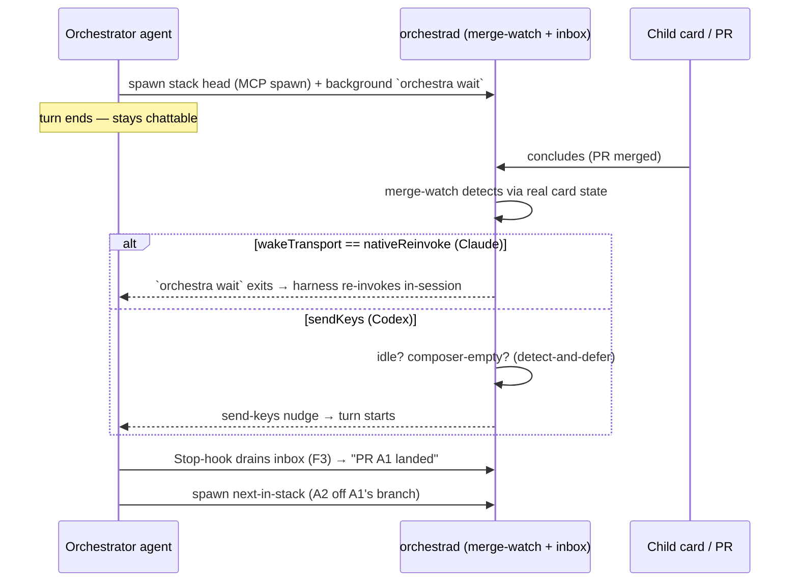
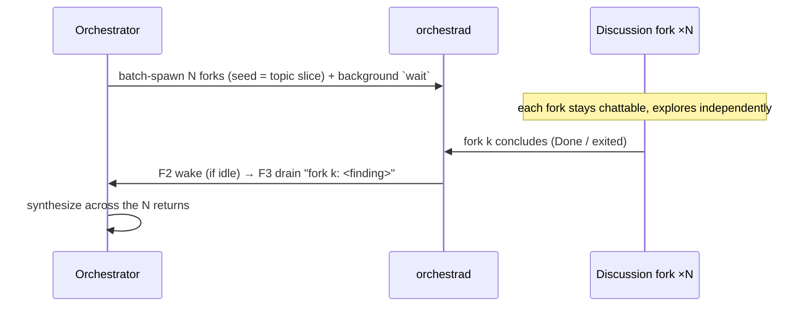
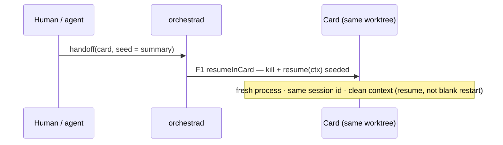
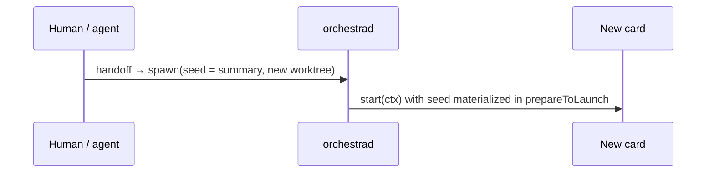
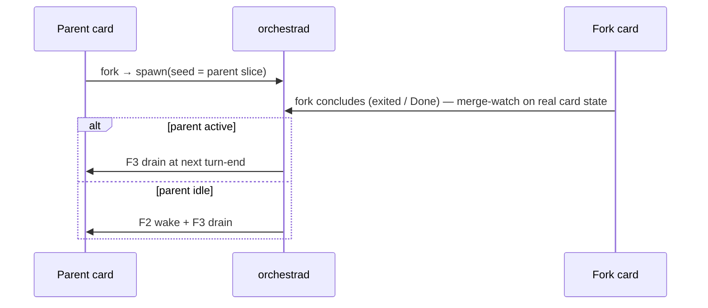
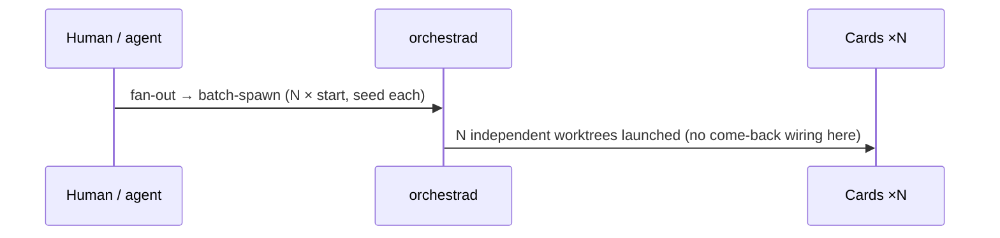
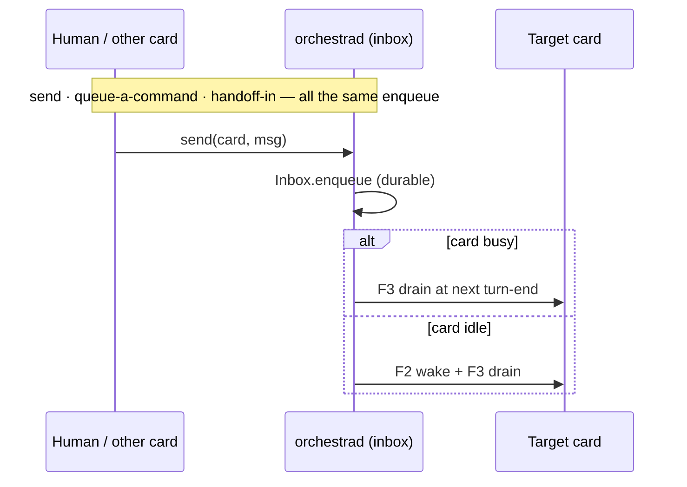
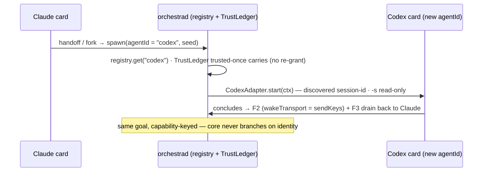

# Agent-Provider Interface — Design Index

> Make Orchestra **agent-agnostic** — run any coding-agent CLI behind one seam — and add **Codex** as the
> second adapter, plus the **live-delivery** functions (handoff / fork / fan-out). The exhaustive reference
> is [[agent-provider-interface]]; these layers are the **plannable, reviewable distillation** + the **PR
> forest** to build it.

## Layers

| Layer | Document | Status |
|-------|----------|--------|
| 1 — Initial design | [[01-design]] | in-review |
| 2 — Contract | [[02-contract]] | in-review |
| 3 — Implementation (+ PR forest) | [[03-implementation]] | in-review |
| 3 — Tests | [[04-tests]] | in-review |

<!-- All presented together for a single review pass (per-layer gates waived). -->

> **Docs stay in sync (merge gate).** No PR is done until its **as-built** definitions + decisions are
> recorded in (a) its layer doc's `Decisions made` table and (b) the reference SSOT
> [[agent-provider-interface]] (flip the D-row status, resolve the `q#`, record real symbol names). See
> **[[03-implementation#Definition of Done — every PR records back to the docs (a merge gate)]]** for the
> per-PR recording map.

## Design spine — Layer 1's four areas

Every layer is organized around the four interactions Orchestra has with any agent. Core speaks the
interface; each adapter supplies the functionality; core degrades on `AgentCapabilities` (never on identity).

| # | Area | Interface (seam) | Capabilities |
|---|------|------------------|--------------|
| 1 | **Retrieve** (observe) | daemon transport → `adapter.parse` → two-tier `StatusReport` | `telemetry`, `contextUsage`, `sessionId` |
| 2 | **Startup** (launch) | `AdapterContext` + `start`/`prepareToLaunch` | `sessionId`, `authMode` |
| 3 | **Permissioning** | read-only argv + `TrustLedger`/`resolveTrust`/`trust`-grant + mirror | `readOnlyEnforcement`, `authMode` |
| 4 | **Live delivery** | F1 `resumeInCard` · F2 `wake` · F3 `Inbox` | `wakeTransport`, `inboxDrain` |

The lower layers carry an **Area** column threading each contract / PR / test back to this spine.

## Current picture

The reactive fan-out — this card as orchestrator, building its own PR forest (the L3 detailed flow):

## Use cases (SSOT §8.2–8.3) — how each plays out

Every SSOT goal composes **start-actions + F1 (resume-in-card) / F2 (wake) / F3 (push-inbox)** — no
goal has its own mechanism. The eight distinct scenarios below cover every §8.3 goal; each has an
**end-to-end test** in [[04-tests]]. `OrchestraService` (as `orchestrad`) is the hub in all of them.

| UC | SSOT goal(s) | Composition | e2e test ([[04-tests]]) |
|----|--------------|-------------|-------------------------|
| **UC1** Parallel discussions | pattern A (forks) | batch-spawn forks → each concludes → **F2 + F3** back | `e2e_uc1_parallel_discussions` |
| **UC2** Reactive stacked-PR DAG | Fan-out DAG step | spawn head → `wait` → **F2** wake → **F3** drain → spawn next | `e2e_uc2_stacked_pr_dag` (= *Current picture*) |
| **UC3** Handoff → clean context (same card) | Handoff→clean | **F1** `resumeInCard(seed)` | `e2e_uc3_handoff_clean_context` |
| **UC4** Handoff → new card | Handoff→new | spawn(seed) — start action | `e2e_uc4_handoff_new_card` |
| **UC5** Fork-out + come-back | Fork-out · Fork come-back | spawn(seed=slice) → **F3** (active) / **F2+F3** (idle) | `e2e_uc5_fork_comeback` |
| **UC6** Fan-out | Fan-out | batch-spawn N (N × start) | `e2e_uc6_fanout_batch` |
| **UC7** Send / queue / handoff-in | Send · Queue · Handoff-in | **F3** (+ **F2** if idle) | `e2e_uc7_send_queue` |
| **UC8** Cross-agent handoff / fork | agnostic seam | spawn(agentId ≠ source, seed); trusted-once carries; `wakeTransport` per-agent | `e2e_uc8_cross_agent_handoff` |

### UC1 — Parallel discussions (pattern A)

### UC2 — Reactive stacked-PR DAG (pattern A)

See **Current picture** above — spawn head → `wait` → merge-watch conclude → F2 wake → F3 drain →
spawn next-in-stack off the merged branch.

### UC3 — Handoff → clean context, same card (F1)

### UC4 — Handoff → new card (start action)

### UC5 — Fork-out + come-back

### UC6 — Fan-out (batch)

### UC7 — Send / queue / handoff-in (F3, +F2 if idle)

### UC8 — Cross-agent handoff / fork (e.g. Claude → Codex)

The use case that proves the seam is *agent-agnostic*: the target carries a **different `agentId`**, so
the registry resolves a different adapter, the shared `TrustLedger` means the repo is **trusted-once**
(no re-grant on the switch), and `wakeTransport` differs per agent — all with **no `if claude` in core**.

## Decisions — all open questions resolved (2026-07-01)

- [x] **q4 — authMode UX** → **soft-warn only** (no concurrency cap); E2 ships just the warning. (L1)
- [x] **q6 — model data** → **per-adapter offline table** (extends `Adapter.models()`), vendored in-repo + PR-updated; no models.dev/LiteLLM fetch. (L2)
- [x] **q10 — Codex wake** → **send-keys + detect-and-defer for v1** (C4); `app-server`/`controlChannel` deferred (needs a viewer, drops the TUI). Watch upstream #29922 / #28144. (L3)
- [x] **Approvals scope** → **confirmed deferred**: first Codex cut is read-only (`-s read-only -a never`); approvals + typed turn/approval events land in a later PR. (L1)
- [x] **`wake`/`wait` shape** → **two distinct `Command`s** (fire-and-forget trigger vs blocking conclusion-watch differ in semantics, params, callers). (L2)
- [x] **macOS-app coverage** → **full background app-driving UX e2e** (`orch-ui-shot.sh` / `orch-test.sh`, `ORCH_SHOW`, screenshot-by-window-id) over all features, especially UC1–UC8; not just `typecheck-app.sh`. (L4)
- [x] **PR forest / interface split** → **ship as-is with A1 tightened into the seam-contract root**: A1 freezes the *complete* `AgentCapabilities` + `AdapterContext.seed` (defaulted); later PRs implement behind the frozen shape, additions defaulted → no drift. Base / also-needs columns stay the gate contract. (L3)
