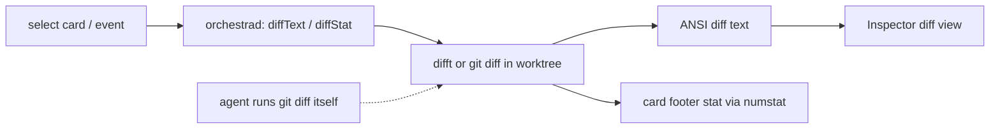
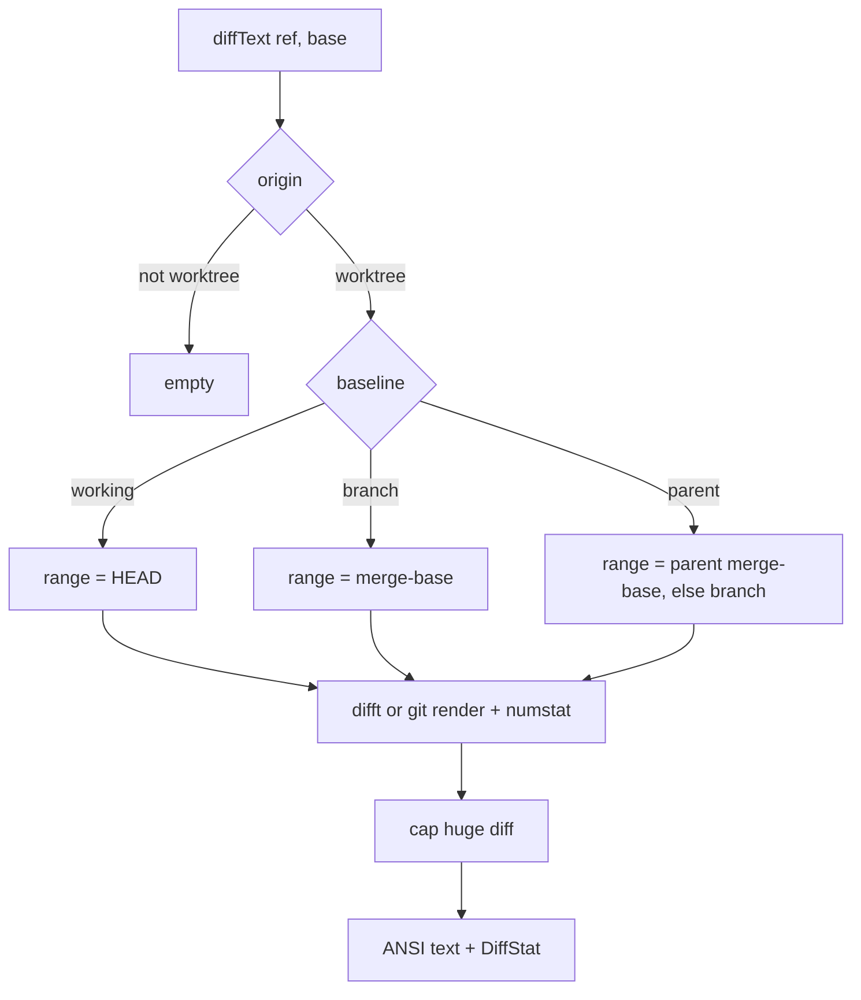

# Layer 1 — Initial Design: View/Review Code on the Board

> The **what**: surface an agent's code changes inside Orchestra — a diffstat on the card and a readable
> diff in the inspector — so a glance/quick review doesn't require opening Zed.

## Purpose & problem

Today the only way to see what an agent changed is **"View changes" → Zed** (`Launcher.openInZed`) — a
context switch out of the board. The `CardView` footer even has a placeholder comment for a diff-stat the
daemon doesn't yet plumb. For a board whose whole point is at-a-glance awareness, the **size and content
of each agent's changes** should be visible in Orchestra itself: a `+N −M / k files` stat on the card, and
a rendered diff in the inspector for a quick read. Editing stays Zed's job (an explicit v1 non-goal).

## Goals / non-goals

**Goals**
- A **diffstat on the card** (files changed, insertions/deletions) — fills the existing footer placeholder.
- A **generic `DiffProvider`** seam with **difftastic (`difft`) as the default** display backend (structural,
  syntax-aware diffs) and **git as the fallback** — so the inspector shows the best available rendering.
- An **in-app diff view** in the inspector: the **rendered diff text** (difftastic when available, git
  fallback), read-only, monospaced — not a parsed/structured payload.
- A **baseline choice**: working changes (vs `HEAD`) and/or branch changes (vs the base branch — the "PR
  diff"); the latter is the default when resolvable. **For stacked branches the base is the *parent
  branch*, not `main`** — a `parentBranch`/`parentCardId` card field (new, unbuilt) supplies it
  ([[../stacked-branches-and-guardian-handoff|stacked-branches-and-guardian-handoff]] §2), making
  parent-relative a third baseline alongside working/branch.
- **Event-driven refresh**: re-diff a card on its agent activity — via Orchestra's **normalized report
  funnel** (coalesced), not per-agent tool detection — + on selection; not a blanket time poll.
- **Guarded for non-git cards**: the guard now keys on the **shipped `Task.origin`** (PR2/PR3/PR4) — a
  `.scratch` or `.borrowed` card runs in a dir that may not be a git worktree (`cwd != .worktree`), so it
  has no diff baseline. Degrade cleanly (no stat, no diff view) for any non-`.worktree` origin, exactly as
  for a non-repo dir.

**Non-goals (this axis)**
- **Editing** in Orchestra — Zed remains the editor (original design non-goal).
- **A structured/machine-readable diff payload for agents** — an agent runs `git diff` in its own cwd, so
  Orchestra serves no `[FileDiff]` payload and no MCP `diff` verb.
- **Inline review comments / approvals** — that's review workflow (axis 5); v1 is read-only viewing.
- Full **syntax highlighting** polish — difftastic's own coloring is enough for v1.
- A general code browser — this is the *diff*, not the whole tree.

## Scope

**In scope:** a `diffStat` on `Task` + an **app-only diff-text endpoint**; the inspector diff view
(difftastic-rendered); the baseline toggle; the non-git guard. **Out of scope:** editing, a structured
payload / MCP verb, inline comments/approvals, full highlighting, a tree browser.

## Inputs & outputs

| Direction | Description | Type / shape | Notes |
|-----------|-------------|--------------|-------|
| Input | Request diff text | `diffText(ref, base?)` endpoint | rendered ANSI string (app-only) |
| Input | Diffstat refresh | `git diff --numstat` | cheap; event/on-select |
| Output | Card diffstat | `Task.diffStat {files, +, −}` | footer (existing placeholder) |
| Output | Inspector diff | rendered ANSI diff text | read-only view |

## Expected behaviour

- **Card stat:** each git card shows `k files · +N −M` in its footer, refreshed cheaply (event or on
  selection). Zero changes → no stat. Freeform cards → no stat.
- **Inspector diff:** selecting a card offers a **Diff** view — the **rendered diff** (difftastic when
  available, git fallback), add/remove colored, monospaced, read-only. A **baseline toggle** switches
  between *working changes* (vs `HEAD`) and *branch changes* (vs the base branch — the **parent branch**
  for a stacked card, else `main`/merge-base).
- **Agent/PR-review use:** an agent reads the diff by running `git diff` in the card's cwd — Orchestra
  serves no structured payload (the agent is already trained on git diff).
- **Big diffs:** cap rendered size (truncate + "open in Zed") so a massive diff doesn't freeze the UI.
- **Degrade:** `git` missing / not a repo / non-`.worktree` origin (`.scratch`/`.borrowed`, which may have
  no git baseline) → no diff view, no stat (never fabricated).

## Complexity & risks

| Risk | Note |
|------|------|
| ANSI rendering | Render difft/git ANSI output into an `AttributedString` (a small SGR parser); use difft **inline** mode so it fits a narrow inspector pane. |
| Backend selection | difftastic renders the display when `difft` is on PATH; git's colored diff is the always-available fallback. Both emit ANSI → one renderer. The `--numstat` stat is git-only. |
| difftastic availability | `difft` may be absent → fall back to git's own colored diff. Detect like other tools (`Proc.toolExists`). |
| Baseline = base branch | The merge-base for branch-diff isn't always obvious; default to branch when resolvable, else `HEAD`. For a **stacked** card the base is its **parent branch** (`parentBranch`, new + unbuilt), not `main` ([[../stacked-branches-and-guardian-handoff\|stacked-branches-and-guardian-handoff]] §2). |
| Large diffs | Must cap so the UI stays responsive; truncate + "open in Zed". |
| Event-driven refresh | Re-diff off the **normalized report funnel** (coalesced) + on selection, not every tick — adapter-agnostic (no per-agent tool detection), cheap with many cards. |
| Non-git guard | Skip cleanly for any non-`.worktree` origin (`.scratch`/`.borrowed`, shipped PR3/PR4) — keyed on `Task.origin`, not a `kind` field. |

Rough sizing: **small–medium** — a thin `numstat` stat parser + a difft/git render call + a SwiftUI
diff-text view (ANSI→AttributedString). No porcelain hunk parser (dropped with the structured payload).

## Diagrams

### Bird's-eye (context)

### Detailed (diff retrieval)

## Decisions made

| Decision | Why | Rejected |
|----------|-----|----------|
| Generic `DiffProvider`; **difftastic default**, git fallback | Best display when available; no hard dep | git-only rendering |
| **No structured payload**; agents run `git diff` | Re-serving a diff the agent can already get is dead weight | `[FileDiff]` payload over MCP |
| **App-only** diff-text endpoint (not a registry/MCP verb) | Only the inspector consumes it | MCP `diff` tool |
| Diffstat on the card | Fills the existing footer placeholder; at-a-glance | No stat |
| Read-only view; editing stays Zed | Honors the original non-goal | In-app editing |
| Baseline default = **branch** (else working); **parent branch** for stacked cards | Reviewers want the branch (PR) diff; stacked diffs must exclude the parent's changes | Working-tree default; always-vs-`main` |
| **Event-driven** refresh (+ on selection) | Re-diff only when something changed it | Time poll all cards |
| Cap large diffs + "open in Zed" | Keep the UI responsive | Render everything |

## Open questions — need your call

_Resolved at the 2026-06-26 gate:_ `DiffProvider` is **generic with difftastic as the default** display
backend (git fallback) · default baseline = **branch when resolvable, else working** · refresh is
**event-driven** (commit/push/edit/pull) **+ on selection** · **read-only** this axis (inline comments
deferred to axis 5).

_Resolved at the 2026-07-01 L3 gate:_ **lean scope** — no structured `[FileDiff]` payload and **no MCP
`diff` verb** (agents run `git diff`); the inspector renders **difftastic-colored diff text** via an
**app-only `diffText` endpoint**; `parentBranch` ships as a **thin stub** (`.parent` → `.branch` until
stacked-branches sets it) · the non-git guard keys on shipped `Task.origin` so `.scratch`/`.borrowed`
cards degrade cleanly.
