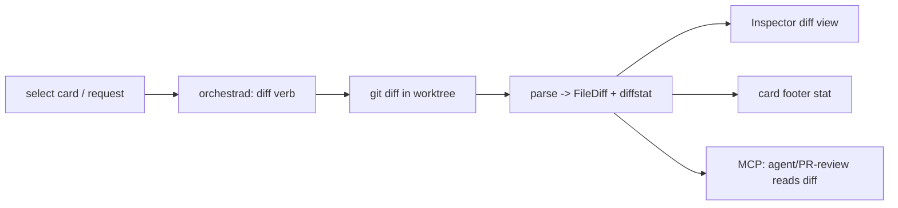
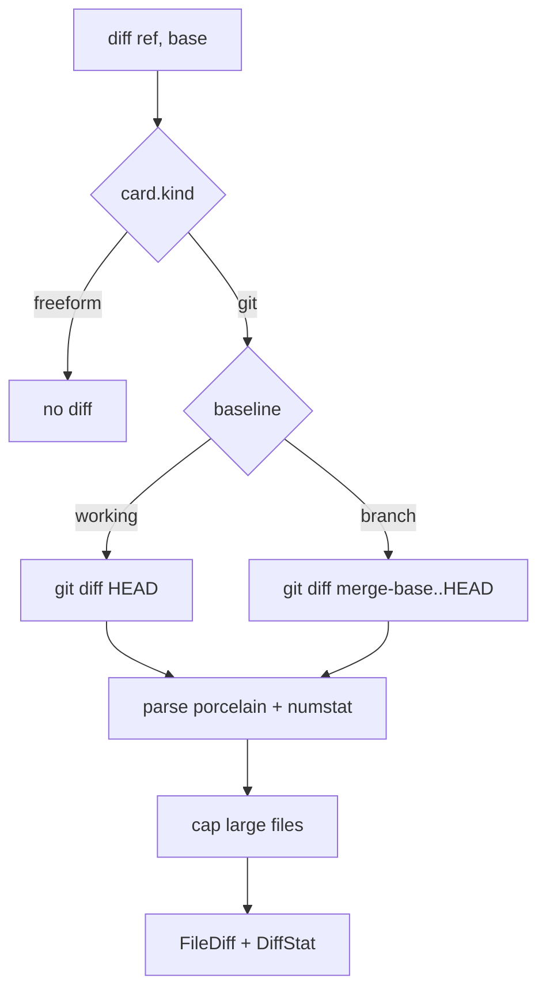

# Layer 1 — Initial Design: View/Review Code on the Board

> The **what**: surface an agent's code changes inside Orchestra — a diffstat on the card and a readable
> diff in the inspector — so a glance/quick review doesn't require opening Zed.

## Purpose & problem

Today the only way to see what an agent changed is **"View changes" → Zed** (`Launcher.openInZed`) — a
context switch out of the board. The `CardView` footer even has a placeholder comment for a diff-stat the
daemon doesn't yet plumb. For a board whose whole point is at-a-glance awareness, the **size and content
of each agent's changes** should be visible in Orchestra itself: a `+N −M / k files` stat on the card, and
a structured diff in the inspector for a quick read. Editing stays Zed's job (an explicit v1 non-goal).

## Goals / non-goals

**Goals**
- A **diffstat on the card** (files changed, insertions/deletions) — fills the existing footer placeholder.
- A **generic `DiffProvider`** seam with **difftastic (`difft`) as the default** display backend (structural,
  syntax-aware diffs) and **git as the fallback** — so the inspector shows the best available rendering.
- A **structured diff** from the daemon (machine-readable, from git): a `diff` verb returning files + hunks,
  so it's agent- and PR-review-readable, not just UI.
- An **in-app diff view** in the inspector: a files list + expandable hunks (difftastic-rendered when
  available), read-only, monospaced.
- A **baseline choice**: working changes (vs `HEAD`) and/or branch changes (vs the base branch — the "PR
  diff"); the latter is the default when resolvable.
- **Event-driven refresh**: re-diff a card on events that actually change it (agent commit/push/edit/pull)
  + on selection — not a blanket time poll.
- **Guarded for non-git cards**: a freeform card ([[../non-git-cards-search/index|axis 4]]) has no diff.

**Non-goals (this axis)**
- **Editing** in Orchestra — Zed remains the editor (original design non-goal).
- **Inline review comments / approvals** — that's review workflow (axis 5); v1 is read-only viewing.
- Full **syntax highlighting** polish — basic add/remove coloring is enough for v1.
- A general code browser — this is the *diff*, not the whole tree.

## Scope

**In scope:** the `diff` verb (structured) + diffstat on `Task`; the inspector diff view; the baseline
toggle; the non-git guard. **Out of scope:** editing, inline comments/approvals, full highlighting, a tree browser.

## Inputs & outputs

| Direction | Description | Type / shape | Notes |
|-----------|-------------|--------------|-------|
| Input | Request a diff | `diff(ref, base?)` verb | structured FileDiffs |
| Input | Diffstat refresh | `git diff --numstat` | cheap; poll/on-select |
| Output | Card diffstat | `Task.diffStat {files, +, −}` | footer (existing placeholder) |
| Output | Inspector diff | `[FileDiff {path, status, hunks}]` | read-only view |
| Output | Reviewable diff for agents | same `diff` payload over MCP | axis 5 / agent self-review |

## Expected behaviour

- **Card stat:** each git card shows `k files · +N −M` in its footer, refreshed cheaply (poll or on
  selection). Zero changes → no stat. Freeform cards → no stat.
- **Inspector diff:** selecting a card offers a **Diff** view — a list of changed files (status: added/
  modified/deleted/renamed) with expandable hunks, add/remove colored, monospaced. A **baseline toggle**
  switches between *working changes* (vs `HEAD`) and *branch changes* (vs the base branch).
- **Agent/PR-review use:** the same `diff` verb returns the structured payload over MCP, so the PR-review
  agent (axis 5) or any agent can read the diff programmatically.
- **Big diffs:** cap rendered size (truncate huge files / collapse by default) so a massive diff doesn't
  freeze the UI; offer "open in Zed" for the full thing.
- **Degrade:** `git` missing / not a repo / freeform card → no diff view, no stat (never fabricated).

## Complexity & risks

| Risk | Note |
|------|------|
| Diff parsing | Parse `git diff` porcelain into files+hunks reliably (renames, binary files, mode changes). Use `--numstat` for the stat + a porcelain diff for hunks. |
| Two backends, two purposes | difftastic gives the best **display** but is not cleanly machine-parseable; git gives the **structured** payload for agents/MCP. Use git for `[FileDiff]`/stat, difftastic for inspector rendering when `difft` is on PATH. |
| difftastic availability | `difft` may be absent → fall back to git's own diff rendering. Detect like other tools (`Proc.toolExists`). |
| Baseline = base branch | Determining the "base branch" (merge-base) for branch-diff isn't always obvious; default to branch when resolvable, else `HEAD`. |
| Large diffs | Must cap/stream so the UI stays responsive; truncate + "open in Zed". |
| Event-driven refresh | Re-diff on change events (commit/push/edit/pull from the report stream) + on selection, not every tick — keeps it cheap with many cards. |
| Non-git guard | Skip cleanly for freeform cards (axis 4). |

Rough sizing: **medium** — a focused git-diff parser + a SwiftUI diff view. The parser edge cases
(renames/binary/large) are the main care; the rest is additive.

## Diagrams

### Bird's-eye (context)

### Detailed (diff retrieval)

## Decisions made

| Decision | Why | Rejected |
|----------|-----|----------|
| Generic `DiffProvider`; **difftastic default**, git fallback | Best display when available; no hard dep | git-only rendering |
| Structured payload from **git** (not difftastic) | Machine-parseable for agents/MCP | Parse difftastic output |
| Structured `diff` **verb** (not UI-only) | Agent + PR-review (axis 5) read it too | App-only diff |
| Diffstat on the card | Fills the existing footer placeholder; at-a-glance | No stat |
| Read-only view; editing stays Zed | Honors the original non-goal | In-app editing |
| Baseline default = **branch** (else working) | Reviewers want the branch (PR) diff | Working-tree default |
| **Event-driven** refresh (+ on selection) | Re-diff only when something changed it | Time poll all cards |
| Cap large diffs + "open in Zed" | Keep the UI responsive | Render everything |

## Open questions — need your call

_All resolved at the 2026-06-26 gate:_ `DiffProvider` is **generic with difftastic as the default** display
backend (git fallback; git for the structured payload) · default baseline = **branch when resolvable, else
working** · refresh is **event-driven** (commit/push/edit/pull) **+ on selection** · **read-only** this
axis (inline comments deferred to axis 5).
