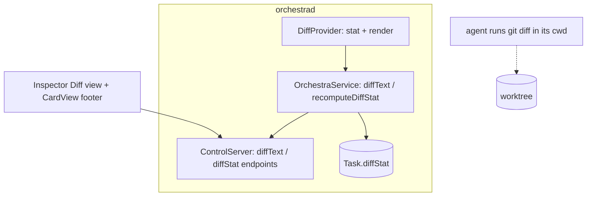
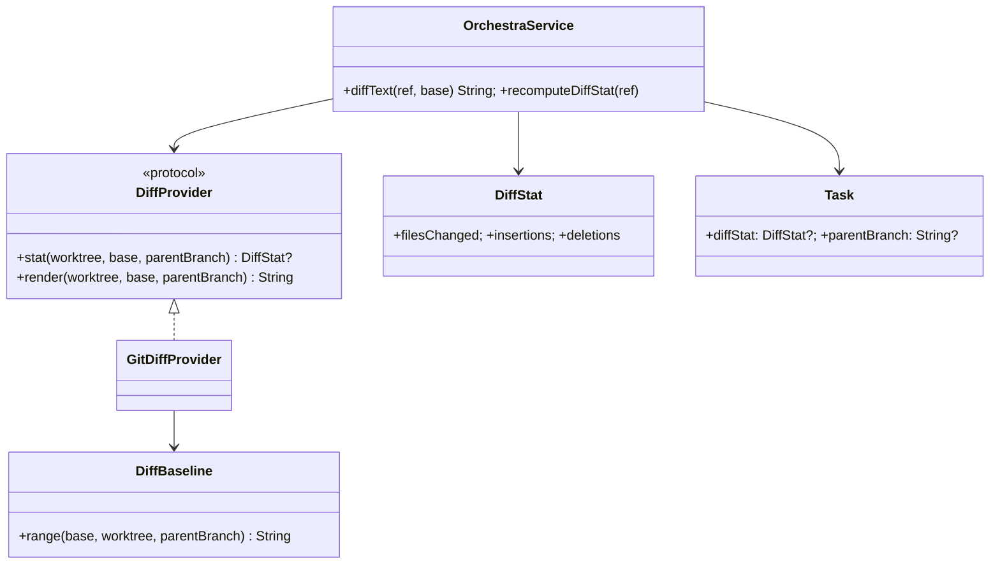

# Layer 2 — Contractual Design: View/Review Code on the Board

> The **interfaces**: the `DiffProvider` seam (stat + render), the diffstat on `Task`, the app-only
> diff-text endpoints, and the inspector view.

## Architecture overview

A generic **`DiffProvider` protocol** computes diffs for a card's worktree. It has two jobs, both from
git: a cheap **`DiffStat`** (`git diff --numstat`) for the card footer, and a **rendered diff string**
for the inspector — **difftastic (`difft`) when on PATH, git's own colored diff as the fallback** (both
emit ANSI, so one app-side renderer handles both). **There is no structured `[FileDiff]` payload and no
MCP `diff` verb** — an agent reads a diff by running `git diff` in the card's cwd, so re-serving it would
be dead weight. `Task` carries a small `diffStat`, refreshed **event-driven** off the **normalized `report()` funnel**
(a coalesced re-stat on any per-card activity — no tool-name inspection, so adapter-agnostic) + on
selection — filling the `CardView` footer placeholder. The daemon exposes two **internal `ControlServer` endpoints** (`diffText`, `diffStat`) — the
`openInZed` shape, app-only, not registry commands. The inspector gains a read-only **Diff** view with a
working/branch baseline toggle (default branch; **parent-relative** for stacked cards — see below).
Everything guards on the **shipped `Task.origin`** (`.scratch`/`.borrowed` cards may have no git
baseline), not a `kind` field.

## Major classes / modules

| Name | Responsibility | Collaborators |
|------|----------------|---------------|
| `DiffProvider` (new protocol) | `stat` + `render`; the generic seam; baseline resolution | `Proc`, `PathResolver` |
| `GitDiffProvider` (new) | `--numstat` stat + difft-or-git ANSI render | `Proc`, `Launcher.mergeBase` |
| `DiffBaseline` (new helper) | `DiffBase` → git range string | `Launcher.mergeBase` |
| `DiffStat` / `DiffBase` (new models) | diffstat + baseline enum | card, inspector, endpoints |
| `Task` (extend) | `diffStat: DiffStat?` + `parentBranch: String?` (thin stub) | `TaskStore`, `CardView` |
| `OrchestraService.diffText` / `recomputeDiffStat` (new) | render text / recompute + emit stat | `DiffProvider` |
| `ControlServer` (extend) | `diffText` / `diffStat` **internal** endpoints (app-only) | `OrchestraService` |
| `InspectorView` (extend) | read-only Diff view + baseline toggle | `BoardModel` |
| `ANSIText` (new, app) | SGR → `AttributedString` for the diff pane | `DiffInspectorView` |
| `CardView` (change) | render `diffStat` in the footer | — |

## Data model

```swift
public struct DiffStat: Codable, Sendable, Equatable {
    public var filesChanged: Int
    public var insertions: Int
    public var deletions: Int
}

// vs HEAD; vs the base branch (merge-base); vs the *parent* branch for a stacked card
// (parentBranch — thin stub, nil until stacked-branches sets it; see stacked-branches §2)
public enum DiffBase: String, Codable, Sendable { case working, branch, parent }
```

`Task.diffStat` is small + nilable and persisted; `Task.parentBranch` is a nil-default stub. The
rendered diff is a **transient ANSI string**, fetched on demand via `diffText` (never persisted). **No
`FileDiff`/`Hunk`/`DiffLine`/`FileStatus` types** — those were the structured payload, dropped at the
2026-07-01 gate.

## Function / method contracts

### `DiffProvider.stat(worktree:base:parentBranch:) -> DiffStat?` / `render(worktree:base:parentBranch:) -> String`
- **stat:** `git diff --numstat <range>` in `worktree` → summed `DiffStat` (binary rows count as 1 file, 0/0; all-zero → nil).
- **render:** the ANSI diff string — `difft` (via `GIT_EXTERNAL_DIFF=difft`, `DFT_DISPLAY=inline`, `DFT_COLOR=always`) when `Proc.toolExists("difft")`, else `git -c color.ui=always diff <range>`.
- **`base`** ∈ `.working` (vs `HEAD`), `.branch` (vs `merge-base(baseBranch, HEAD)`), or **`.parent`** (vs the card's **parent branch** — `merge-base(parentBranch, HEAD)`, not `main`; stacked-branches §2). `parentBranch == nil` → `.parent` falls back to `.branch`.
- **Inputs:** worktree path (assertAllowed), baseline, optional parent branch. **Side-effects:** none (read-only git). **Errors:** not a repo / `git` missing → nil / `""` (degrade).

### `OrchestraService.diffText(_ ref:, base: DiffBase = .branch) -> String`
- **Does:** resolve the card; if `origin != .worktree` (`.scratch`/`.borrowed`, possibly no git baseline) return `""`; else `assertAllowed(cwd)` → `DiffProvider.render`, capping huge output (truncate + "open in Zed" sentinel). Read-only.
- **Errors:** unknown card → `unknownTask`.

### `OrchestraService.recomputeDiffStat(_ ref:, base: DiffBase = .branch)`
- **Does:** origin-guarded `DiffProvider.stat`; **only if changed** `store.update{ $0.diffStat = new }` then `emit(.taskUpserted)`. Best-effort; never throws into the report funnel.

### Diffstat refresh (event-driven, adapter-agnostic)
- Recomputed off the **normalized `report()` funnel** — any per-card activity report (the funnel sees a normalized `StatusReport`, never a `tool_name`) schedules a **coalesced** re-stat for that `.worktree` card — **plus** on card selection (app calls `diffStat`). No blanket per-tick poll. **No adapter-specific signal**: every adapter (Claude hooks, Codex rollout-tail) feeds the same funnel, so all refresh identically.

### `diffText` / `diffStat` internal endpoints
- `ControlServer` switch cases (the `openInZed` shape), **not** registry commands → app-only, **not** MCP tools. `diffText {ref, base?}` → String; `diffStat {ref}` → recompute + return `DiffStat?`.

## Library / framework decisions

| Decision          | Choice                                                                              | Rationale                                                              | Alternatives considered                          |
| ----------------- | ----------------------------------------------------------------------------------- | ---------------------------------------------------------------------- | ------------------------------------------------ |
| Diff abstraction  | Generic `DiffProvider` (stat + render); **difftastic default** render, git fallback | Best rendering, no hard dep                                            | git-only                                         |
| Agent access      | **None added** — agents run `git diff` themselves                                   | Re-serving a diff the agent already has is dead weight                 | structured `[FileDiff]` over MCP                 |
| Daemon surface    | **Internal `ControlServer` endpoints** (app-only)                                   | Only the inspector consumes them                                       | registry/MCP `diff` verb                         |
| Render form       | ANSI string → app-side `AttributedString` (SGR parse)                               | Native scroll/selection/theme; difft & git both ANSI                   | parse structured hunks; SwiftTerm read-only view |
| Stat vs full diff | `--numstat` for the card; difft/git render on demand                                | Cheap stat; heavy render only when viewed                              | Always full render                               |
| Baseline          | `.working` / `.branch` (merge-base) / **`.parent`** toggle, **default branch**      | Branch diff = the reviewable one; parent-relative for stacked branches | Working-only; always-vs-`main`                   |
| Refresh           | **Event-driven** (commit/push/edit/pull) + on selection                             | Re-diff only on real changes                                           | Poll all cards                                   |
| Large diffs       | Cap + "open in Zed"                                                                 | UI responsiveness                                                      | Render everything                                |
| Persistence       | `DiffStat` on the card; render string transient                                     | Small `tasks.json`                                                     | Persist rendered diffs                           |

## Diagrams

### Bird's-eye (components)



### Detailed (classes)



## Traceability → Layer 1

| L1 goal | Covered by |
|---------|-----------|
| Card diffstat | `DiffStat` + `Task.diffStat` + `CardView` footer |
| Generic provider; difftastic default, git fallback | `DiffProvider` protocol + `GitDiffProvider` (stat + render) |
| In-app diff view (rendered text, not structured) | `InspectorView` Diff view + `ANSIText` (difft/git ANSI) |
| No agent payload | agents run `git diff` in-cwd; no MCP verb |
| Event-driven diffstat refresh | coalesced re-stat off the normalized `report()` funnel + on-selection → `recomputeDiffStat` |
| Baseline choice | `DiffBase` (working / branch merge-base / **parent** for stacked) toggle |
| Non-git guard | `diffText`/`recomputeDiffStat` degrade for `origin != .worktree` (`.scratch`/`.borrowed`) |

## Decisions made

| Decision | Why | Rejected |
|----------|-----|----------|
| `diffText`/`diffStat` are **internal** endpoints | Only the app consumes them; no agent surface | registry/MCP `diff` verb |
| No structured `[FileDiff]` payload | Agents run `git diff` themselves | parse porcelain into hunks |
| Cheap `--numstat` stat + on-demand render | At-a-glance everywhere; heavy only when viewed | Full render always |
| `DiffStat` persisted, render string transient | Small persistence | Persist rendered diffs |
| Read-only; editing via Zed | Honors original non-goal | In-app editing |

## Open questions — need your call

_Resolved at the 2026-06-26 gate:_ generic `DiffProvider`, **difftastic default** + git fallback ·
default baseline **branch (else working)** · refresh **event-driven** + on-selection · **read-only** this
axis (inline comments deferred to axis 5).

_Resolved at the 2026-07-01 L3 gate:_ **lean** — no structured `[FileDiff]` and **no MCP `diff` verb**
(agents run `git diff`); render is a **difftastic-colored ANSI string** over **app-only `diffText`/
`diffStat` endpoints**; `parentBranch` is a **thin stub** (`.parent` → `.branch` until stacked-branches
sets it) · the non-git guard keys on shipped `Task.origin`.
