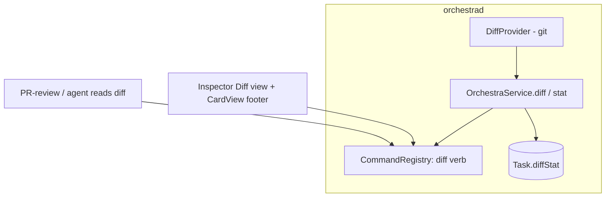
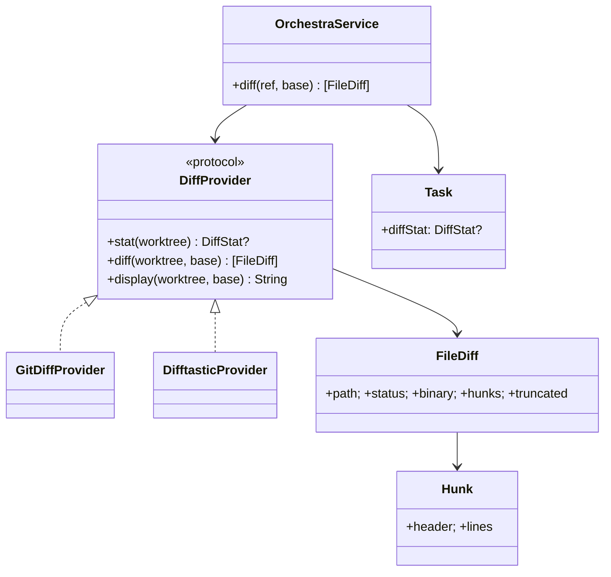

# Layer 2 — Contractual Design: View/Review Code on the Board

> The **interfaces**: the `diff` verb + diff models, the diffstat on `Task`, and the inspector view.

## Architecture overview

A generic **`DiffProvider` protocol** computes diffs for a card's worktree. Two backends: `GitDiffProvider`
(via `Proc`) produces the cheap `DiffStat` (`--numstat`) **and** the machine-readable structured
`[FileDiff]` parsed from porcelain `git diff` — this is the payload agents/MCP consume; `DifftasticProvider`
(`difft`, default when on PATH) produces the richer **display** rendering for the inspector, with git as the
fallback. A `diff` registry verb (axis-3 single source) exposes the structured diff to app/CLI/MCP. `Task`
carries a small `diffStat`, refreshed **event-driven** (on agent commit/push/edit/pull, detected via the
report stream) + on selection — filling the `CardView` footer placeholder. The inspector gains a read-only
**Diff** view with a working/branch baseline toggle (default branch). Everything guards on `card.kind`.

## Major classes / modules

| Name | Responsibility | Collaborators |
|------|----------------|---------------|
| `DiffProvider` (new protocol) | `stat` + structured `diff` + a `display` rendering; baseline resolution | `Proc`, `PathResolver` |
| `GitDiffProvider` (new) | `--numstat` stat + porcelain → machine-readable `[FileDiff]` (the agent/MCP payload + fallback display) | `Proc` |
| `DifftasticProvider` (new) | `difft` structural **display** rendering (default when on PATH) | `Proc` |
| `DiffStat` / `FileDiff` / `Hunk` (new models) | Diffstat + structured diff | card, inspector, verb |
| `Task` (extend) | `diffStat: DiffStat?` (nil for freeform / no changes) | `TaskStore`, `CardView` |
| `OrchestraService.diff` (new) | Run `DiffProvider` for a card; return `[FileDiff]` | `DiffProvider` |
| `CommandRegistry` (extend) | `diff` verb (axis-3 single source) | `OrchestraService` |
| `InspectorView` (extend) | Read-only Diff view + baseline toggle | `BoardModel` |
| `CardView` (change) | Render `diffStat` in the footer | — |

## Data model

```swift
public struct DiffStat: Codable, Sendable, Equatable {
    public var filesChanged: Int
    public var insertions: Int
    public var deletions: Int
}

public enum FileStatus: String, Codable, Sendable { case added, modified, deleted, renamed }

public struct FileDiff: Codable, Sendable, Equatable {
    public var path: String
    public var oldPath: String?     // for renames
    public var status: FileStatus
    public var binary: Bool
    public var hunks: [Hunk]        // empty for binary / capped files
    public var truncated: Bool      // true when capped for size
}

public struct Hunk: Codable, Sendable, Equatable {
    public var header: String       // "@@ -a,b +c,d @@"
    public var lines: [DiffLine]
}
public struct DiffLine: Codable, Sendable, Equatable {
    public enum Kind: String, Codable, Sendable { case context, add, remove }
    public var kind: Kind
    public var text: String
}
```

`Task.diffStat` is small + nilable; the full `[FileDiff]` is fetched on demand via the `diff` verb (not
persisted).

## Function / method contracts

### `DiffProvider.stat(worktree:) -> DiffStat?` / `diff(worktree:, base: DiffBase) -> [FileDiff]`
- **Does:** `git -C worktree diff --numstat [<range>]` → `DiffStat`; porcelain `git diff` parsed into
  `[FileDiff]`. `base` ∈ `.working` (vs `HEAD`) or `.branch` (vs `merge-base(baseBranch, HEAD)`).
- **Inputs:** worktree path (assertAllowed), baseline. **Outputs:** stat / file diffs. **Side-effects:** none
  (read-only git). **Errors:** not a repo / `git` missing → nil/empty (degrade).

### `OrchestraService.diff(_ ref:, base: DiffBase = .branch) -> [FileDiff]`
- **Does:** resolve the card; if `kind == .freeform` return `[]`; else `DiffProvider.diff`, capping large
  files (`truncated = true`). Read-only.
- **Errors:** unknown card → typed error.

### Diffstat refresh (event-driven)
- Computed by `GitDiffProvider.stat` on **change events** — the report stream's tool/Bash events that imply
  a worktree change (commit/push/pull/edit) trigger a re-stat for that card — **plus** on card selection.
  No blanket per-tick poll of all cards. Merged onto `Task.diffStat`; emits `taskUpserted` on change.

### `diff` registry verb
- `diff {ref, base?}` → `[FileDiff]` — exposed on CLI + MCP (so axis-5's PR-review agent / any agent can
  read the structured diff).

## Library / framework decisions

| Decision | Choice | Rationale | Alternatives considered |
|----------|--------|-----------|-------------------------|
| Diff abstraction | Generic `DiffProvider`; **difftastic default** display, **git** structured/fallback | Best rendering, no hard dep; git stays machine-parseable | git-only |
| Structured payload source | **git** porcelain (not difftastic) | difftastic output isn't cleanly machine-parseable | Parse difftastic |
| Stat vs full diff | `--numstat` for the card; porcelain/difft on demand | Cheap stat; heavy diff only when viewed | Always full diff |
| Baseline | `.working` / `.branch` (merge-base) toggle, **default branch** | Branch diff = the reviewable one | Working-only |
| Refresh | **Event-driven** (commit/push/edit/pull) + on selection | Re-diff only on real changes | Poll all cards |
| Large diffs | Cap + `truncated` flag + "open in Zed" | UI responsiveness | Render everything |
| Persistence | `DiffStat` on the card; `[FileDiff]` transient | Small `tasks.json` | Persist full diffs |

## Diagrams

### Bird's-eye (components)



### Detailed (classes)



## Traceability → Layer 1

| L1 goal | Covered by |
|---------|-----------|
| Card diffstat | `DiffStat` + `Task.diffStat` + `CardView` footer |
| Generic provider; difftastic default, git fallback | `DiffProvider` protocol + `GitDiffProvider`/`DifftasticProvider` |
| Structured diff from the daemon | `GitDiffProvider` + `FileDiff`/`Hunk` + `diff` verb |
| Event-driven diffstat refresh | report-stream change events + on-selection → `stat` |
| In-app inspector diff view | `InspectorView` Diff view (read-only) |
| Baseline choice | `DiffBase` (working / branch merge-base) toggle |
| Agent/PR-review readable | `diff` verb on CLI + MCP |
| Non-git guard | `diff` returns `[]` for `kind == .freeform` |

## Decisions made

| Decision | Why | Rejected |
|----------|-----|----------|
| `diff` is a registry verb | Agent + PR-review read it, not just the UI | App-only |
| Cheap `--numstat` stat + on-demand full diff | At-a-glance everywhere; heavy only when viewed | Full diff always |
| `DiffStat` persisted, `[FileDiff]` transient | Small persistence | Persist full diffs |
| Read-only; editing via Zed | Honors original non-goal | In-app editing |

## Open questions — need your call

_All resolved at the 2026-06-26 gate:_ generic `DiffProvider`, **difftastic default** + git fallback (git
for the structured payload) · default baseline **branch (else working)** · refresh **event-driven** +
on-selection · **read-only** this axis (inline comments deferred to axis 5).