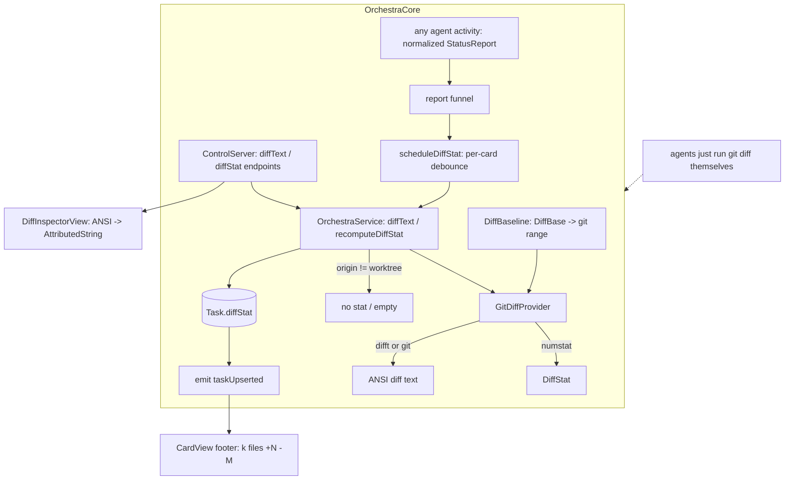

# Layer 3 — Implementation: View/Review Code on the Board

> The **how**. Written together with [[04-tests]] and reviewed at one combined gate. Grounded in a
> read of `main`: file:line anchors below are the real seams this builds on.

## Scope note — lean, text-rendered, app-only (decided 2026-07-01)

Two calls at this gate shaped the build and rippled up into [[01-design]]/[[02-contract]]:

- **No structured/agent-facing diff.** An agent in a card already has a shell in its cwd and runs
  `git diff` itself — so the machine-readable `[FileDiff]` payload, the porcelain hunk parser, and the
  MCP `diff` verb are **dropped**. The inspector shows **rendered diff text**, not parsed hunks.
- **Difftastic-colored text, app-only.** The diff is rendered by `difft` (git colored-diff fallback)
  into an **ANSI string** and returned to the app over **internal `ControlServer` endpoints** (the
  `openInZed` shape) — not registry verbs, so not MCP tools.

This preserves L1/L2's "generic `DiffProvider` seam, difftastic default, git fallback" and drops only
the structured-payload half.

## What already exists (reuse, don't rewrite)

| Existing seam | Where | Reused for |
|---------------|-------|-----------|
| `Launcher.mergeBase(worktree:)` | `Sources/OrchestraCore/Launcher.swift:98` | `.branch` baseline SHA (origin/HEAD → main → master → `git merge-base`) |
| `Proc.run([...], cwd:, env:)` / `Proc.toolExists` | `Sources/OrchestraCore/Proc.swift:16,114` | run git/difft; detect `difft` on PATH |
| `resolver.assertAllowed(cwd)` | `PathResolver.swift:58` | allowlist-gate a `.worktree` cwd before git |
| ControlServer `openInZed` internal endpoint | `Control/ControlServer.swift:138-144` | the exact template for app-only `diffText`/`diffStat` endpoints |
| `require(id)` / `resolveRef` | `OrchestraService.swift:524,530` | card lookup → `unknownTask` error |
| `store.update(id){…}` → `emit(.taskUpserted)` | `OrchestraService+Report.swift:104-105` | persist `diffStat`, push to app |
| `OrchestraService.report(id, patch)` | `OrchestraService+Report.swift:10` | the **normalized** per-card funnel every adapter feeds — where the coalesced re-stat hangs (no tool-name inspection) |
| `CardView.meta` diff-stat placeholder | `App/Views/CardView.swift:160-171` | the footer slot (already width-capped 148pt trailing) |
| `HeaderBar` "View changes" button | `App/Views/InspectorView.swift:45-56` | where the Diff view mode + baseline toggle live |
| `BoardModel.openInZed` / `sessions` calls | `App/BoardModel.swift:322-333` | templates for `BoardModel.diffText`/`diffStat` |

## Implementation approach (per Layer 2 contract)

### Models — `Sources/OrchestraCore/Model.swift`

Add only two small model types (no `FileDiff`/`Hunk`/`DiffLine`) near `ExecResult` (`Model.swift:310`):

```swift
public struct DiffStat: Codable, Sendable, Equatable {
    public var filesChanged: Int, insertions: Int, deletions: Int
}
public enum DiffBase: String, Codable, Sendable { case working, branch, parent }
```

Extend `Task` (`Model.swift:143`) with one persisted scalar + the thin parent stub:

```swift
public var diffStat: DiffStat?      // nil = freeform / no changes / not computed
public var parentBranch: String?    // stub — nil until stacked-branches sets it
```

`Task`'s Codable is hand-written (`Model.swift:228-293`) — mirror the `origin`/`access` precedent:
add to stored props, `init`, `init(from:)` with `decodeIfPresent` (default `nil`), `encode(to:)`,
`CodingKeys`. Both nil-default, so old `tasks.json` decodes unchanged.

### `DiffProvider` seam — `Sources/OrchestraCore/Diff/` (new folder)

The seam survives L2; it now carries **stat + render**, no structured payload.

```swift
protocol DiffProvider: Sendable {
    func stat(worktree: String, base: DiffBase, parentBranch: String?) throws -> DiffStat?
    func render(worktree: String, base: DiffBase, parentBranch: String?) throws -> String  // ANSI
}
```

| Type                         | File                         | Responsibility                              |
| ---------------------------- | ---------------------------- | ------------------------------------------- |
| `DiffProvider` (protocol)    | `Diff/DiffProvider.swift`    | stat + render; the generic seam             |
| `GitDiffProvider` (concrete) | `Diff/GitDiffProvider.swift` | `--numstat` stat + difft-or-git ANSI render |
| `DiffBaseline` (helper)      | `Diff/DiffBaseline.swift`    | `DiffBase` → git range string               |

**Baseline resolution** (`DiffBaseline`) → the git range argument:

| `DiffBase` | Range | Notes |
|-----------|-------|-------|
| `.working` | `HEAD` | staged + unstaged vs last commit |
| `.branch` | `<mergeBase>` | `Launcher.mergeBase`; base→worktree, incl. uncommitted (the PR diff) |
| `.parent` | `merge-base(parentBranch, HEAD)` if `parentBranch != nil`, **else fall through to `.branch`** | stub: `.parent` degrades cleanly until stacked-branches populates the field |
| any, no merge-base | `HEAD` | no commits yet → fall back to `.working` |

**`GitDiffProvider`** — two responsibilities, both `Proc.run(["git","-C",worktree,…])` (the
`WorktreeManager.swift:79` shape):

1. `stat` = `git diff --numstat <range>` → sum `added`/`deleted`/`files` → `DiffStat`. Binary rows (`-\t-`) count as 1 changed file, 0/0. All-zero → `nil`.
2. `render` = **difft when present, git fallback** — both emit ANSI:
   - `Proc.toolExists("difft")` → `git -C <wt> diff <range>` with env `GIT_EXTERNAL_DIFF=difft, DFT_DISPLAY=inline, DFT_COLOR=always` (inline mode fits a narrow inspector pane; `always` forces color under a non-TTY).
   - else → `git -C <wt> -c color.ui=always diff <range>`.
   - git missing (`toolMissing`) → caught → `""` (degrade).

### `OrchestraService` — `Sources/OrchestraCore/OrchestraService+Diff.swift` (new extension)

```swift
func diffText(_ id: UUID, base: DiffBase = .branch) async throws -> String
func recomputeDiffStat(_ id: UUID, base: DiffBase = .branch) async
func scheduleDiffStat(_ id: UUID)   // per-card coalescing debounce → recomputeDiffStat
```

- `diffText`: `require(id)` → **guard `t.origin == .worktree` else `""`** → `assertAllowed(t.cwd)` → `provider.render(t.cwd, base, t.parentBranch)` → **cap** (truncate past a byte/line ceiling, append a "… truncated — open in Zed" sentinel line) → return.
- `recomputeDiffStat`: same origin guard (non-worktree → ensure `diffStat = nil`) → `provider.stat` → **only if changed** `store.update{ $0.diffStat = new }` → `emit(.taskUpserted(saved))`. Best-effort; never throws into the report funnel.
- `scheduleDiffStat`: a **per-card debounce** — keeps a `[UUID: Task]` of pending one-shots; cancels any pending re-stat for `id` and starts a fresh `Task { try? await Task.sleep(~750ms); await recomputeDiffStat(id) }`. Coalesces a burst of activity into one `numstat`. A one-shot per burst, **not** a periodic timer.

The non-git guard (`origin != .worktree`) is the single degradation point — covers
`.scratch`/`.borrowed`/repo-less cwd exactly as L1 requires.

### Daemon surface — `Sources/OrchestraCore/Control/ControlServer.swift`

Two **internal** endpoints in the `dispatch` switch, mirroring `openInZed` (`:138-144`) — **not**
registry commands, so **no `Commands.swift`/`CLIRunner.swift` edit and no MCP tool**:

```swift
case "diffText":
    let t = try await service.resolveRef(req.params.ref)
    let base = DiffBase(rawValue: req.params.base ?? "branch") ?? .branch
    return .string(try await service.diffText(t.id, base: base))
case "diffStat":
    let t = try await service.resolveRef(req.params.ref)
    await service.recomputeDiffStat(t.id)
    return try JSONValue(encodable: await service.store.get(t.id)?.diffStat)
```

### Event-driven refresh — off the normalized funnel, adapter-agnostic

**The trigger lives in the normalized funnel, not in any adapter.** `OrchestraService.report(id, patch)`
(`OrchestraService+Report.swift:10`) is the one choke point every agent's telemetry passes through — and
by that point it's already a **normalized `StatusReport`** (`event`/`snapshot`), with **no `tool_name`**
(the raw tool payload was flattened to `desc` back in the adapter). So the diff core keys off *card
activity*, never off what an agent did — it cannot tell Claude from Codex, by construction.

The wiring is one line at the funnel's existing delta point:

- After `report()` persists a delta and emits `taskUpserted` (`:104-105`), **if `task.origin == .worktree`, call `scheduleDiffStat(id)`**. No event-type inspection, no new `StatusReport` field.
- `scheduleDiffStat` debounces (~750ms, per card) → `recomputeDiffStat`, which emits `taskUpserted` **only when the `DiffStat` changed** — so the funnel → schedule → recompute → emit chain self-terminates (a re-stat finding no change ends it; no feedback loop).

This is **event-driven, not a poll**: it fires on real per-card activity reports (coalesced), never on a
timer sweeping all cards — honoring L1's "not a blanket time poll." Because every adapter feeds the same
`report()` funnel (Claude hook snapshots, Codex rollout-tail ticks alike), **every agent refreshes
identically** — no Claude-only path, no adapter code touched. `ClaudeCodeAdapter` is **not modified**.

> Why not detect the mutating tool? That would force each adapter to recognize its own "a git/edit
> happened" events — re-coupling the diff core to per-agent semantics. Reacting to *any* normalized
> activity (coalesced, idempotent-emit) is cheaper to reason about and works for every adapter for free.

### App footer diffstat — `App/Views/CardView.swift`

Render `task.diffStat` in `meta` (`:163-171`), replacing the "show the model instead" placeholder
(`:160-162`) when a stat exists: `k files · +N −M`, `F.mono(10.5)`; `+N` in `theme.green.text`, `−M`
in `theme.red.text`; `nil` → today's model-name fallback. Rides the existing `taskUpserted`
subscription (`BoardModel.swift:12`) — no new wiring.

### App inspector Diff view — `App/`

| Piece                          | Where                                                                                   | Detail                                                                                                                                                                                                         |
| ------------------------------ | --------------------------------------------------------------------------------------- | -------------------------------------------------------------------------------------------------------------------------------------------------------------------------------------------------------------- |
| `BoardModel.diffText(_:base:)` | `App/BoardModel.swift`                                                                  | `client.call("diffText", {ref, base}).string` (the `openInZed` call shape `:325`)                                                                                                                              |
| View-mode toggle               | `InspectorView.HeaderBar` `:43-92`                                                      | segmented `Agent \| Diff`; `@State`/`@Published` mode switched in `body` `:18-21`                                                                                                                              |
| `DiffInspectorView` (new)      | `App/Views/DiffInspectorView.swift`                                                     | `private struct … : View`; `let task`, `@EnvironmentObject model`, `@Environment(\.theme)` — the standard sub-view shape                                                                                       |
| ANSI → text                    | `DiffInspectorView` + `App/ANSIText.swift` (new)                                        | minimal SGR parser (fg color, bold, reset) → `AttributedString`, rendered in a selectable mono scroll view. Handles both difft and git-colored output (same ANSI). See Concerns for the SwiftTerm alternative. |
| Baseline toggle                | `DiffInspectorView`                                                                     | `Working \| Branch` (default Branch); `Parent` shown only when `task.parentBranch != nil`                                                                                                                      |
| Refresh on selection           | `DiffInspectorView`                                                                     | `.task(id: task.id) { await load() }` (the `InboxEditorView` reload precedent `:193,229`); also on baseline change                                                                                             |
| Large diff                     | `diffText` cap (service) + a "open full in Zed" button reusing `model.openInZed` `:325` |                                                                                                                                                                                                                |

## Edge cases & error handling

| Case                                            | Handling                                                                                         |
| ----------------------------------------------- | ------------------------------------------------------------------------------------------------ |
| Non-git card (`.scratch`/`.borrowed`/repo-less) | service origin guard → `""` / `diffStat=nil`; footer shows model, Diff view shows an empty-state |
| `git` not on PATH                               | `Proc` throws `toolMissing` → caught → empty (degrade, never fabricate)                          |
| `difft` absent                                  | `toolExists` false → git colored-diff render (fallback)                                          |
| No commits / no merge-base                      | `.branch`/`.parent` → `.working` (vs HEAD)                                                       |
| `.parent`, `parentBranch == nil`                | resolves as `.branch` (stub)                                                                     |
| Zero changes                                    | `DiffStat` all-zero → nil (no footer stat); Diff view empty-state                                |
| Binary file                                     | difft/git render it as "binary differ"; stat counts 1 file, 0/0                                  |
| Huge diff                                       | service truncates the string + sentinel; "open in Zed" for the full thing                        |
| Repeated identical edit                         | `recomputeDiffStat` emits only when `DiffStat` changed (self-terminates the schedule chain)      |
| Burst of activity events                        | per-card `scheduleDiffStat` debounce coalesces to one `numstat`                                  |
| Non-activity report (pure ctx% tick)            | still coalesced; at worst one wasted cheap `numstat`, no emit                                    |
| Untrusted/disallowed cwd                        | `assertAllowed` throws `pathNotAllowed` before any git runs                                      |

## Sequencing / build order

Leaner than the structured plan — 5 stages, each independently compilable/testable.

1. **Models** — `DiffStat` + `DiffBase` + `Task.diffStat`/`parentBranch`. Codable round-trip tests.
2. **`DiffProvider` + `GitDiffProvider` + `DiffBaseline`** — pure, over a fixture repo. Stat parser + difft/git render branch + baseline resolution.
3. **`OrchestraService+Diff`** (`diffText` + `recomputeDiffStat`, origin guard, cap) → **`diffText`/`diffStat` ControlServer endpoints**. App-reachable (no MCP/CLI).
4. **Event-driven refresh** — `scheduleDiffStat` debounce + the one-line hook in `report()` after its delta point (adapter-agnostic; no adapter/`StatusReport` change).
5. **App** — footer diffstat (`CardView.meta`); then `ANSIText` + `DiffInspectorView` + mode/baseline toggles + refresh-on-selection + "open in Zed".

## Diagrams

### Bird's-eye



### Detailed (sequence) — inspector diff on selection

```mermaid
sequenceDiagram
    participant U as User
    participant App as DiffInspectorView
    participant BM as BoardModel
    participant CS as ControlServer
    participant Svc as OrchestraService
    participant GP as GitDiffProvider
    U->>App: select card / pick baseline
    App->>BM: diffText(id, base)
    BM->>CS: call("diffText", {ref, base})
    CS->>Svc: diffText(id, base)
    Svc->>Svc: require(id); guard origin == .worktree; assertAllowed
    Svc->>GP: render(cwd, base, parentBranch)
    GP->>GP: mergeBase + (difft | git -c color.ui=always) diff
    GP-->>Svc: ANSI string
    Svc->>Svc: cap if huge
    Svc-->>CS: string
    CS-->>BM: string
    BM-->>App: string
    App->>App: SGR parse -> AttributedString
    App->>U: colored diff text
```

### Detailed (sequence) — event-driven footer refresh

```mermaid
sequenceDiagram
    participant Ag as any agent (Claude hook / Codex tail)
    participant Rep as adapter.parse -> normalized StatusReport
    participant Svc as OrchestraService.report
    participant Sch as scheduleDiffStat (per-card debounce)
    participant GP as GitDiffProvider
    participant App as CardView footer
    Ag->>Rep: raw telemetry
    Rep->>Svc: report(id, StatusReport)  %% no tool_name
    Svc->>Svc: persist delta; emit(taskUpserted)
    Svc->>Sch: scheduleDiffStat(id)  %% only if origin == .worktree
    Sch->>Sch: debounce ~750ms (coalesce burst)
    Sch->>GP: stat(cwd, .branch)
    GP-->>Sch: DiffStat
    Sch->>Svc: changed? store.update + emit(taskUpserted)
    Svc-->>App: footer re-renders
```

## Traceability → Layer 2 contracts (post-refine)

| L2 contract (lean) | Implemented by |
|--------------------|----------------|
| `DiffProvider.stat/render` | `Diff/DiffProvider.swift` + `GitDiffProvider` (stages 1-2) |
| `DiffStat` model + `DiffBase` | `Model.swift` (stage 1) |
| `Task.diffStat` / `parentBranch` | `Task` + Codable (stage 1); footer (stage 5) |
| `OrchestraService.diffText` / `recomputeDiffStat` | `OrchestraService+Diff.swift` (stage 3) |
| `diffText`/`diffStat` internal endpoints | `ControlServer` switch (stage 3) |
| Diffstat refresh (event-driven, adapter-agnostic) | `scheduleDiffStat` debounce hooked in `report()` after its delta (stage 4) + on-selection (stage 5) |
| `InspectorView` Diff view (difft render) | `DiffInspectorView` + `ANSIText` (stage 5) |
| `CardView` footer stat | `CardView.meta` (stage 5) |
| Baseline `.working`/`.branch`/`.parent` | `DiffBaseline`; `.parent` stub-fallback |
| Non-git guard on `origin` | service origin guard (stage 3) |

## Concerns / decisions for review

| Concern | Position |
|---------|----------|
| ANSI rendering approach | Recommend a minimal SGR→`AttributedString` parser (`ANSIText.swift`) for native scroll/selection/theme. Alternative: reuse the app's SwiftTerm as a read-only view fed the bytes — heavier, PTY-shaped, worse for static text. Going with the parser. |
| difft output width | Use `DFT_DISPLAY=inline` so the diff fits a narrow inspector pane (side-by-side is too wide). |
| Event refresh coupling | Trigger hangs off the **normalized `report()` funnel** (no tool-name inspection), so every adapter refreshes identically — no adapter code, no Claude-only path. Cost bounded by the per-card debounce + idempotent emit. |
| difft as a hard dep | No — `toolExists` gate; git colored-diff is the always-available fallback. |
| Blocking git on the actor (found in impl) | `recomputeDiffStat`/`diffText` run `Proc.run` synchronously on the `OrchestraService` actor — consistent with the existing `exec`/`openInZed`/`pollTelemetry` pattern. Bounded by the per-card debounce + idempotent emit; a future optimization could hop git off-actor. |
| Untracked-uncommitted files (found in impl) | Both stat and render key off `git diff <range>`, which omits never-added files, so footer + inspector stay consistent. Documented limitation; committed/staged files show fully. |

## Open questions — need your call

_All resolved at the 2026-07-01 gate:_ lean (no structured payload / no MCP verb) · difftastic-colored
text in-app · thin `parentBranch` stub with `.branch` fallback. ANSI rendering via an SGR parser is an
implementation choice (recommended above), not a blocking question.
