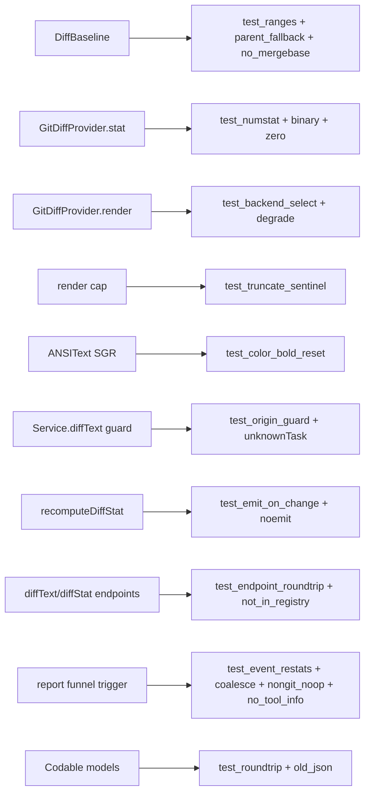

# Layer 3 — Test Design: View/Review Code on the Board

> Dedicated test plan, written with [[03-implementation]] and reviewed at the same gate. Completed
> before any code is written.

## Test strategy & philosophy

The lean design removed the porcelain hunk parser (the old risk center), so the correctness surface is
now small and mostly **command-shaped**: build the right git/difft invocation for a baseline, parse the
three-column `--numstat` into a `DiffStat`, guard on `origin`, and emit on change. Test weight sits on
**`GitDiffProvider` + `DiffBaseline` units over throwaway fixture repos**, with thin integration tests
for the endpoints and the event trigger. The rendered diff *text* (difft/git ANSI) is **not**
content-asserted — it's opaque, tool-owned output; we test only that the right backend is chosen and
that a non-git card yields empty.

| Level | What | Why |
|-------|------|-----|
| Unit | `DiffBaseline`, `GitDiffProvider.stat`, backend selection, model Codable, cap | deterministic, the real logic |
| Integration (thin) | `diffText`/`diffStat` endpoints; `recomputeDiffStat` emits `taskUpserted`; event trigger | wiring |
| Manual/visual | footer stat, inspector Diff view, ANSI coloring, toggles | no headless SwiftUI harness (repo convention) |

**Deliberately not tested:** difft/git render *content* (opaque ANSI); SwiftUI layout; the SGR parser is unit-tested in isolation but the rendered pane is checked visually; git itself.

## Framework / tooling

- Swift `Testing`/`XCTest` under `Tests/OrchestraCoreTests` + `Tests/IntegrationTests` (+ `Fixtures`) — the existing targets. Run: `swift test`.
- **Fixture git repos** built in a temp dir via a helper (`Proc.run(["git", …])`): `git init`, base commit, mutate — so `numstat`/`mergeBase` are real. Precedent: `WakeMergeWatchTests`, `IntegrationTests/Fixtures`.
- `difft` presence faked by testing the `toolExists` branch both ways (skip render-content assertions when absent — repo convention for optional tools).

## Unit tests (per contract)

| L2 contract (lean) | Test cases |
|--------------------|-----------|
| `DiffStat`/`DiffBase` Codable + `Task` fields | round-trip; `Task` with & without `diffStat`/`parentBranch` decodes (old JSON → nil defaults) |
| `DiffBaseline` (base → range) | `.working`→HEAD; `.branch`→merge-base; `.parent` w/ `parentBranch`→its merge-base; `.parent` nil→`.branch`; no merge-base→`.working` |
| `GitDiffProvider.stat` | added/modified/deleted counts; insertions/deletions sum; binary row (`-\t-`)→1 file 0/0; zero changes→nil |
| `GitDiffProvider.render` — backend selection | `difft` present → difft env invocation built; absent → `git -c color.ui=always`; both return non-empty for a real change |
| `GitDiffProvider.render` — degrade | not-a-repo cwd → `""`; `git` missing (`toolMissing`) → caught, `""` |
| Large-diff cap | render over ceiling → truncated + sentinel line present |
| `ANSIText` SGR parser | fg-color / bold / reset spans → correct `AttributedString` runs; unknown SGR ignored; plain text passes through |
| `OrchestraService.diffText` origin guard | `.worktree`→text; `.scratch`/`.borrowed`→`""`; unknown ref→`unknownTask` |
| `recomputeDiffStat` | worktree card → sets `diffStat`, emits `taskUpserted`; **no change → no emit**; non-worktree → `diffStat` stays nil, no emit |

## Integration / end-to-end tests

- **`diffText` endpoint** — over the control socket: `diffText {ref, base}` returns non-empty for a dirty fixture worktree; `base` defaults to `branch`; bad `base` string → defaults to `.branch` (not an error); `.scratch` card → `""`.
- **`diffStat` endpoint** — recomputes, returns the stat, and the card now carries `diffStat`.
- **Event trigger (adapter-agnostic)** — push **any** `StatusReport` (e.g. a plain `desc`/`status` snapshot, no tool info) through `report(id,_)` over a fixture worktree with a new commit → after the debounce, `diffStat` updated + a `taskUpserted` observed on `subscribe()`. A second report with a bare ctx% snapshot (identical tree) → coalesced re-stat, **no** further emit.
- **Coalescing** — several `report()` calls in quick succession → a single `recomputeDiffStat` (one `numstat`) after the debounce window.
- **Non-git event** — same trigger but `.scratch` card → no stat, no emit (origin guard, no scheduling).
- **Socket round-trip** (`ControlRoundTripTests.diffEndpoints`) — spawn a card over the UDS, git-init its cwd with a change, then `diffStat`/`diffText` **through the `ControlClient`** → verifies the internal-endpoint wiring (dispatch routing + decode), not just the service method.
- **No MCP/CLI surface** — `diffText`/`diffStat` are internal `ControlServer` cases, absent from `CommandRegistry` (guards the "internal endpoint, not a tool" decision).

## Edge & error cases

| Case | Expected |
|------|----------|
| Repo with no commits | `.branch`/`.parent` → `.working`; no crash |
| `.parent` selected, `parentBranch == nil` | resolves as `.branch` |
| Staged / committed new file | counted (`git diff <range>` sees it) |
| Untracked-uncommitted new file | **not** counted until staged/committed (stat + render consistent) — documented limitation |
| Zero changes | stat nil, footer shows model, Diff view empty-state |
| `assertAllowed` fails | `pathNotAllowed` before any git runs |
| Burst of reports | per-card debounce → single recompute |
| Repeated identical edit | `recomputeDiffStat` no-emit (chain self-terminates) |
| Report with no tool info | still schedules a re-stat (adapter-agnostic; core never inspects tool name) |
| difft present vs absent | render non-empty either way (backend swap invisible to the stat) |

## Fixtures / mocks / test data

| Fixture | Builds |
|---------|--------|
| `makeRepo()` helper | temp `git init` + base commit; returns worktree path (torn down in temp) |
| Mutation helpers | add / modify / delete / rename / write-binary / large-file, committed or left dirty |
| Stacked pair | base branch + child branch with a distinct parent commit → `.branch` vs `.parent` merge-base |
| Fake `StatusReport` | a plain snapshot (desc/status, no tool info) pushed through `report()` to drive the event path without real hooks |
| Non-git dir | plain temp dir (no `.git`) for `.scratch`/`.borrowed` degradation |
| ANSI samples | hand-written SGR strings for the parser unit tests |

## Coverage map

## Traceability → L2 contracts + L3 components

| Contract / component | Covering tests |
|----------------------|----------------|
| `DiffProvider.stat/render` | `GitDiffProvider` unit suite + backend-select |
| `DiffBaseline` | range + parent-fallback + no-merge-base |
| `DiffStat` model / `Task` fields | Codable round-trip + old-JSON |
| `OrchestraService.diffText` | origin-guard + `unknownTask` + endpoint-roundtrip |
| `recomputeDiffStat` + `scheduleDiffStat` | emit-on-change, no-emit, event-restat, coalesce, no-tool-info, non-git no-op |
| `diffText`/`diffStat` endpoints | endpoint integration + not-in-registry |
| ANSI render (app) | `ANSIText` SGR units; pane checked visually |
| Non-git degradation | `.scratch`/not-a-repo/`toolMissing` |
| Footer stat / inspector view | manual visual check (documented, not automated) |

## Decisions made

| Decision | Why | Rejected |
|----------|-----|----------|
| Fixture git repos over mocked `Proc` | invocations must face real git output | stub git stdout strings (brittle) |
| Don't assert render *content* | difft/git ANSI is opaque, tool-owned | pin exact colored output (non-deterministic) |
| Assert endpoints absent from registry | encodes the "app-only, not MCP" decision as a test | leave the boundary untested |
| Unit-test the SGR parser in isolation | it's the one new bit of parsing left | test only via the rendered pane |
| UI verified manually | app isn't a SwiftPM target; `swift test` headless/offline | headless SwiftUI harness (not present) |
| Event path via synthetic `StatusReport` | isolate the trigger from live hooks | end-to-end hook spawn (slow, flaky) |

## Open questions — need your call

_None._ All design questions resolved at the 2026-07-01 gate (lean scope, difftastic-colored text,
`parentBranch` stub). The SGR-parser-vs-SwiftTerm render choice is settled in [[03-implementation]]
Concerns (SGR parser).
