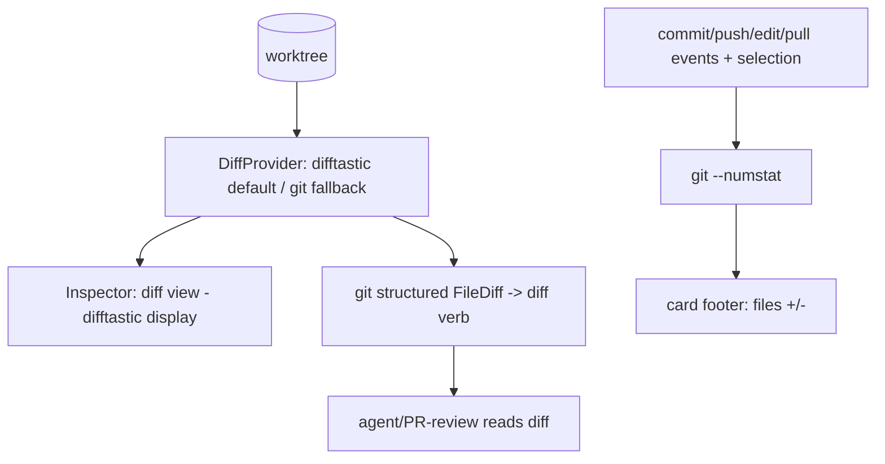

# View/Review Code on the Board — Design Index

> See an agent's changes **in Orchestra** — a diffstat on the card and a structured diff view in the
> inspector — instead of only "View changes" → Zed. Part of the
> [[extensibility-roadmap/index|extensibility roadmap]] (axis 7). Feeds [[../pr-review-phase/index|axis 5]]
> (the PR-review view).

## Layers

| Layer | Document | Status |
|-------|----------|--------|
| 1 — Initial design | [[01-design]] | approved |
| 2 — Contract | [[02-contract]] | approved |
| 3 — Implementation | [[03-implementation]] | not started (design-only pass) |
| 3 — Tests | [[04-tests]] | not started (design-only pass) |

> Design-only pass: L1+L2 approved 2026-06-26. Generic DiffProvider (difftastic default, git fallback +
> structured payload); default branch baseline; event-driven refresh; read-only.

## Current picture

## Open questions (rolled up)

_Resolved at the 2026-06-26 gate:_ generic `DiffProvider` with **difftastic default** + git fallback (git
for the structured payload) · default baseline **branch (else working)** · refresh **event-driven** + on
selection · read-only (inline comments → axis 5).
