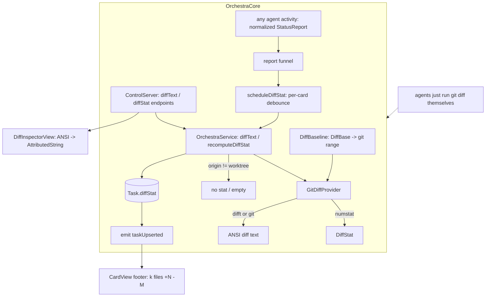

# View/Review Code on the Board — Design Index

> See an agent's changes **in Orchestra** — a diffstat on the card and a structured diff view in the
> inspector — instead of only "View changes" → Zed. Part of the
> [[extensibility-roadmap/index|extensibility roadmap]] (axis 7). Feeds [[../pr-review-phase/index|axis 5]]
> (the PR-review view).

## Status vs `main` (2026-06-29)

> **Unbuilt** (design-only), but two facts now shift the baseline. **(1) Shipped foundation:** PR2 replaced
> `Task.worktree` with **`Task.cwd` + `Task.origin: CardOrigin {worktree, scratch, borrowed}`**, and PR3/PR4
> shipped **freeform/borrowed/scratch** cards — so the non-git guard keys on **`origin`** (a `.scratch` or
> `.borrowed` card may point at a dir with **no git baseline**, i.e. `cwd != .worktree`), not a `kind` field.
> The diff view must degrade gracefully for these. **(2) Parent-relative baseline:** for **stacked branches**
> the reviewable diff is **relative to the parent branch, not `main`**
> ([[../stacked-branches-and-guardian-handoff|stacked-branches-and-guardian-handoff]] §2). That makes a
> **`parentBranch`/`parentCardId`** card field (new, **unbuilt**) the baseline input for `DiffProvider` — a
> third `DiffBase` alongside working/branch.

## Layers

| Layer | Document | Status |
|-------|----------|--------|
| 1 — Initial design | [[01-design]] | approved (refined 2026-07-01) |
| 2 — Contract | [[02-contract]] | approved (refined 2026-07-01) |
| 3 — Implementation | [[03-implementation]] | approved 2026-07-01 |
| 3 — Tests | [[04-tests]] | approved 2026-07-01 |

> L1+L2 approved 2026-06-26; **refined 2026-07-01** to a **lean** scope (see below). L3 (implementation)
> + tests approved 2026-07-01 at one combined gate — **implementing**. Generic DiffProvider (difftastic
> default, git fallback); default branch baseline; event-driven refresh off the normalized funnel;
> read-only.

## Current picture

## Open questions (rolled up)

_Resolved at the 2026-06-26 gate:_ generic `DiffProvider` with **difftastic default** + git fallback ·
default baseline **branch (else working)** · refresh **event-driven** + on selection · read-only (inline
comments → axis 5).

_Resolved at the 2026-07-01 L3 gate:_ **lean scope** — no structured `[FileDiff]` payload and **no MCP
`diff` verb** (agents run `git diff` in their cwd); the inspector renders **difftastic-colored diff text**
over **app-only `diffText`/`diffStat` `ControlServer` endpoints** · **`parentBranch` is a thin stub**
(`.parent` → `.branch` until stacked-branches sets it;
[[../stacked-branches-and-guardian-handoff|stacked-branches-and-guardian-handoff]] §2) · the non-git guard
keys on shipped **`Task.origin`** (`.scratch`/`.borrowed` cards may have no git baseline).
