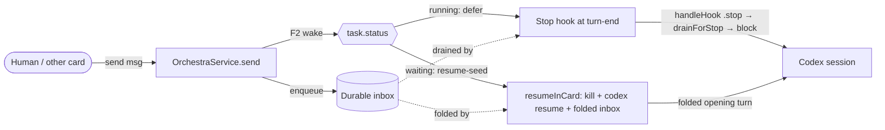
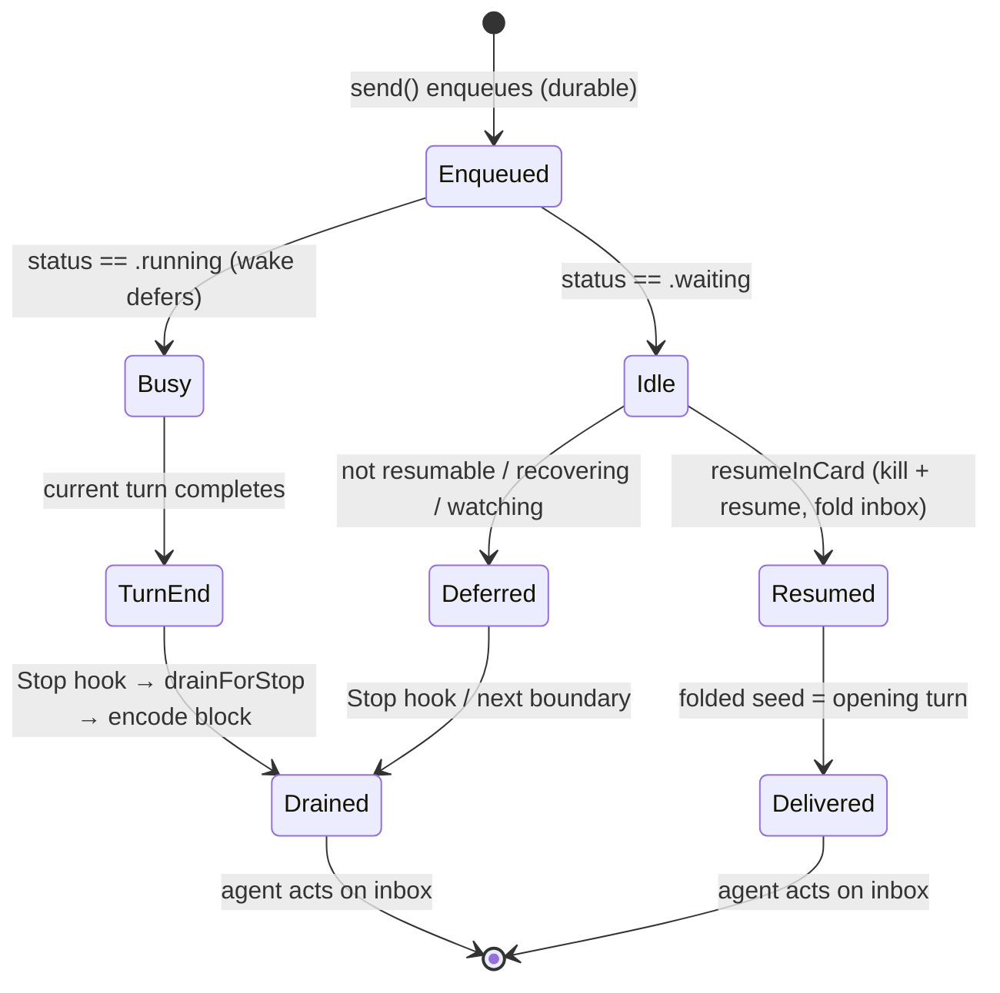

# Layer 1 — Initial Design: Codex Wake + Live-Session Inbox Delivery

> The **what**, not the how. `send` to a live/idle **Codex** card enqueues durably but never delivers.
> The fix **retires the TUI pane-scraper entirely**: idle cards wake by **session resume-seed**, busy cards
> drain via the **Stop hook** — no terminal reading, no blind keystrokes. Spans the
> [[agent-provider-interface]] spine's area 4 (**Live delivery** — `wakeTransport` · `inboxDrain`), rebased
> onto the merged [[first-class-hooks/01-design|first-class hooks channel]].

## Purpose & problem

`send`-ing a review to a running Codex card enqueues the message durably but **never delivers it** — even
after the agent goes idle — until a manual reseed. Two independent defects compound:

**Defect 1 — the wake is a fragile pane-scraper.** F2 wake for Codex is `sendKeys`: capture the TUI pane,
heuristically decide it's idle (`CodexComposer.isWorking` substring-scans the **whole pane**, so a git noun
like "working tree" in scrollback reads as busy), then fire a blind keystroke (`"Please continue."`). It is
janky in two independent ways — **scraping to detect idle** and **a blind keystroke to act**.

**Defect 2 — no live inbox-drain path.** Codex ships `inboxDrain == .sessionSeed` and wires **no Stop hook**,
so a live session never drains its durable inbox on turn-end. The nudge is content-free by design, so even a
*successful* wake starts a turn that delivers nothing.

### The reframe (why we delete rather than harden)

Both halves of the janky wake are **replaceable by things the system already has**:

| Janky job | Replaced by | Already exists? |
|-----------|-------------|-----------------|
| Detect idle (`isWorking` pane-scrape) | **Authoritative `task.status == .waiting`** from the rollout tail (`CodexAdapter.parse` → `report`) | yes |
| Wake an idle card (blind keystroke) | **Resume-seed refold** (`resumeInCard`: kill + `codex resume <sid>` with the inbox folded into the opening turn; full replay, session kept) | yes, proven — the `handoff` engine; Claude's own idle `send` uses it |
| Drain a busy card | **Stop hook** → `handleHook(.stop)` → `drainForStop` → `HookEnvelope.block` (adapter-free; `CodexAdapter.encode` already handles `.continuation`) | yes, built post-merge — only the hooks-file wiring is missing |

So there is **nothing to harden**. The pane-scraper is deleted outright.

## Goals / non-goals

**Goals**
- **Idle/live Codex `send` reliably delivers** without a manual reseed.
- **Retire the TUI pane-scraper** (`CodexComposer`, `canNudge`, the `sendKeys` nudge) — no pane reads at all.
- **Idle wake = session resume-seed**, gated purely on the authoritative rollout-tail status.
- **Busy drain = Stop hook**, riding the natural turn-end in-session (no relaunch).
- **Framing byte-identical** — shared `drainForStop` → `HookEnvelope.block` / `HandoffSeed.fold`.
- **A1 discipline preserved** — reuse existing capability variants; core never names a Codex type.
- **Name the `controlChannel` seam** as the eventual no-relaunch wake, without touching Claude.

**Non-goals**
- **Draft protection.** *Explicitly dropped* — no pane read to guard a half-typed composer; resume proceeds
  on `.waiting`. (Resume is full-replay, so session history survives; an unsent draft is not protected.)
- **Build `controlChannel` / app-server `turn/start`** — needs the app-server viewer run-mode (§9 / q10). Seam only.
- **Remove the frozen enum variants.** `WakeTransport.sendKeys` / `InboxDrain.sessionSeed` stay *declared*
  (A1 freeze); they simply become unused by shipped adapters.
- **Change Claude, or change drain content/caps.**

## Scope

| Bucket | Item |
|--------|------|
| **Delete** | `CodexComposer.swift`; `Adapter.canNudge` (protocol + default + `CodexAdapter`/`StubAdapter` impls); `sendKeysWake` + `sendKeysWakeNudge`; `CodexComposerTests.swift` |
| **Reroute** | `wake()` switch: `.relaunch`/`.nativeReinvoke` → `resumeSeedWake`; `.sendKeys` → `break` (retired); generalize `resumeSeedWake`'s doc (Claude-no-wait **+ Codex**) |
| **Flip caps** | `CodexAdapter`: `wakeTransport .sendKeys → .relaunch`; `inboxDrain .sessionSeed → .stopHook` |
| **Wire hook** | Add `Stop` to the Codex hooks template (`_report --event stop --agent codex`) |
| **Verify** | Loop guard (`maxConsecutiveInjects` vs Codex native `stop_hook_active`; `drainForStop` self-resets on empty); the reactive `watchRegistry` guard for a Codex card with a live `orchestra wait` |
| **Seam only** | `wakeTransport.controlChannel` — document how `turn/start` slots into `wake`'s switch as the no-relaunch successor |

## Expected behaviour

One shared inbox; **F2 triggers, F3 delivers** — parity with Claude:

| Codex card state at `send` | Path | Cost |
|----------------------------|------|------|
| **Busy** (`status == .running`) | wake defers; the running turn's **Stop hook** drains at its end | in-session, no relaunch |
| **Idle** (`status == .waiting`) | wake **resume-seeds** — kill + `codex resume` with the inbox folded into the opening turn | one relaunch (full replay) |
| **Not resumable / recovering / watching** | defer (existing `resumeSeedWake` guards); Stop hook or next boundary delivers | — |

The Stop hook rides *whatever* turn is ending, so a message queued while busy drains at that turn's own end
— no separate re-wake, no scrape. A genuinely idle card (no turn coming) resumes. Delivery never depends on
a second `send` nudging a stranded card.

## Complexity & risks

| Risk | Note / mitigation |
|------|-------------------|
| Idle-send relaunch | Resume kills + relaunches the live TUI (full replay, ~seconds; the pane reloads). Accepted per direction; the app-server `turn/start` is the eventual no-relaunch cure (deferred). |
| Reactive `watchRegistry` guard | `resumeSeedWake` defers when a card has a live `orchestra wait` (Claude relies on the wait-exit re-invoke; Codex has none). Safe **iff** a live wait means the Codex card is `.running` (so its Stop hook drains). Verify in Layer 2. |
| Loop-guard interaction | Codex native `stop_hook_active` + Orchestra `maxConsecutiveInjects` (card-keyed); `drainForStop` self-resets on empty inbox. Verify no double-suppress; decide if `UserPromptSubmit` reset is needed. |
| Capability honesty | Flip `inboxDrain → .stopHook` **only with** the wired Stop hook. Nothing in core branches on it, so it stays descriptive. |
| Test churn | `CodexComposerTests` deleted; `CodexWakeTests` rewritten to the resume-seed path; capability assertions updated. |

**Sizing:** small — a net **subtraction** (delete a file + a protocol member + a keystroke path) plus one
capability flip, one hook-template line, and rerouting one switch. No new types.

## Diagrams

### Bird's-eye (context)

### Detailed (delivery by state)

## Decisions made

| Decision | Why | Rejected |
|----------|-----|----------|
| **Retire the pane-scraper**; idle wake = resume-seed | The user's call; delete jank at its source, reuse the proven `resumeInCard` (Claude parity) | harden `isWorking` (still a scraper); keep the blind keystroke |
| Detect idle via authoritative `task.status`, not the pane | The rollout tail already tracks running/waiting reliably | scrape the pane for idleness |
| **No draft protection** | The user's call; resume is full-replay so history survives, and gating on a draft would reintroduce a pane read | keep a composer-empty guard |
| Busy path stays the **Stop hook** | Rides the natural turn-end in-session — no relaunch when a boundary is already coming | resume-seed on every delivery (relaunches a card that just finished a turn) |
| Caps: `wakeTransport .sendKeys→.relaunch`, `inboxDrain .sessionSeed→.stopHook` | Existing variants; `.relaunch` == "kill + resume"; makes `inboxDrain` truthful | new variants (breaks A1 freeze) |
| Keep `.sendKeys`/`.sessionSeed` **declared but unused** | A1 freezes enum spellings — don't delete cases | remove the cases |
| `controlChannel` seam-only | The no-relaunch cure, but needs the app-server viewer (q10 / §9) | build it now |

## Open questions — need your call

- [ ] **Reactive `watchRegistry` guard** — confirm a Codex card with a live `orchestra wait` is always
  `.running` (so deferring resume is safe because its Stop hook drains). *(Layer 2 verification.)*
- [ ] **`UserPromptSubmit` for Codex?** Wire for loop-guard-reset parity, or rely on `drainForStop`'s
  empty-inbox self-reset? *(Layer 2 — leaning: verify the guard can't stick, then decide.)*
