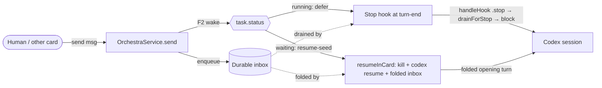

# Codex Wake + Live-Session Inbox Delivery — Design Index

> Fix two proven gaps in Orchestra's F2 wake + F3 live-delivery for **Codex** cards: (1) the fragile
> whole-pane `isWorking` scraper drops legitimate wakes, and (2) an idle/live Codex card has **no passive
> inbox-delivery path** (`inboxDrain == .sessionSeed`, no Stop hook), so `send` enqueues durably but is
> never delivered until a manual reseed. A seam refinement around the [[agent-provider-interface]] SSOT,
> not a greenfield feature.

## Layers

Collapsed to two docs (the change is small — a net subtraction): design (the *what*) + a single folded
implementation plan (contract + impl + tests).

| Layer | Document | Status |
|-------|----------|--------|
| 1 — Initial design | [[01-design]] | settled |
| 2 — Implementation (folded contract+impl+tests) | [[02-implementation]] | **implemented** |

<!-- Status values: not started · draft · in-review · settled · approved · implemented · skipped -->

**As-built (2026-07-03):** shipped as planned. Codex `wakeTransport .sendKeys→.relaunch`, `inboxDrain
.sessionSeed→.stopHook`; `CodexComposer` / `canNudge` / `sendKeysWake` / `SessionManaging.capture` /
`WakeTransport.sendKeys` / `InboxDrain.sessionSeed` deleted; one shared `resumeSeedWake(watcherWillReinvoke:)`;
Codex `Stop` hook wired. 371/372 tests pass (1 pre-existing `DiffServiceTests` flake, green in isolation);
macOS App typechecks. SSOT [[agent-provider-interface]] §8 updated. `UserPromptSubmit` for Codex deemed
unnecessary (guard self-heals). Not built: the `orch-test.sh` full fake-codex drive (rides already-shipping
Codex hook plumbing).

## Current picture

Retire the pane-scraper: idle cards wake by session **resume-seed**, busy cards drain via the **Stop hook**.

## Open questions (rolled up)

- [ ] Reactive `watchRegistry` guard — confirm a Codex card with a live `orchestra wait` is always `.running` (L2).
- [ ] `UserPromptSubmit` for Codex loop-guard reset, or rely on `drainForStop`'s empty-inbox self-reset? (L2)
