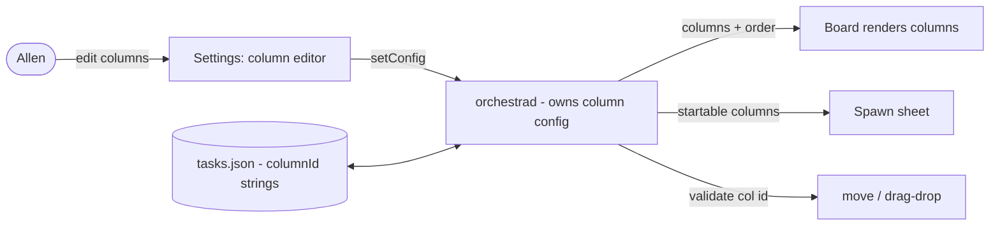
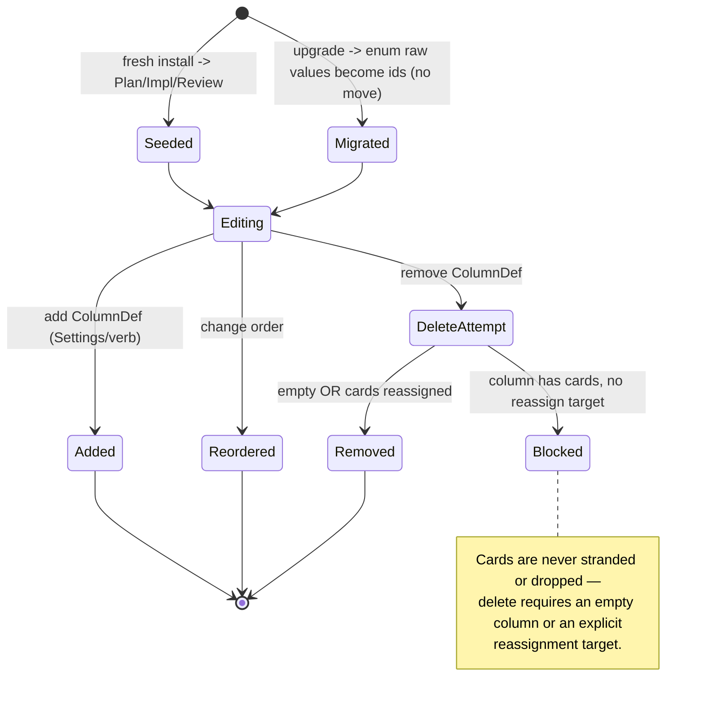

# Layer 1 — Initial Design: Configurable Kanban Columns

> The **what**, not the how. Make board columns data, not a compiled-in enum.

## Purpose & problem

Today the board's columns are a fixed Swift enum `Column { plan, impl, review }` (`Model.swift`). That
choice is baked into the data model (`Task.column`), the board layout, `StartIn`, drag-and-drop, the
CLI/MCP `col` param schema, and column display names. Changing the columns — adding a "PR review"
stage, splitting "Implementation", or letting the user name their own workflow — means editing an enum
and recompiling every surface.

Orchestra is a personal command center whose workflow will evolve. Columns should be **configuration**:
an ordered list the daemon owns and the board renders, editable without a rebuild, and eventually
authored by the user in Settings.

## Goals / non-goals

**Goals**
- Columns become an **ordered, daemon-owned list** of `ColumnDef` (stable `id` + `name` + order).
- `Task.column` becomes a **column-id string**, not an enum case.
- The board, Spawn sheet, and `move` validation all **derive from the column config** — no hardcoded set.
- Existing `tasks.json` (`plan`/`impl`/`review`) **migrates transparently** to the seeded default columns.
- `StartIn` generalizes to "which columns a spawn may start in" (a `startable` flag on `ColumnDef`).
- The **delete/reorder policy** is *designed and recorded* (block-with-reassign) but its **editing
  surface is deferred** — see the non-goals.

**Non-goals (this axis)**
- A **column-management surface** — no `add/remove/reorder` verbs and no Settings column editor *yet*
  (decided 2026-06-26). This axis makes columns **data** (seeded config the board derives from); editing
  them is a later, separate change. The data model is shaped so that surface drops in cleanly.
- Per-column **automation** (spawn a review agent on entry) — that's [[../pr-review-phase/index|axis 5]].
- Non-board **lanes / separate areas** for non-git cards — that's [[../non-git-cards-search/index|axis 4]].
- Intra-column drag **reordering** of cards (separate, smaller change).

## Scope

**In scope:** the `ColumnDef` model (incl. `semantic`) + its storage in `Config`; `Task.columnId` +
migration; deriving board/spawn/move from config; the CLI/MCP `col` param becoming config-validated.

**Out of scope:** the column-management surface (verbs + Settings editor), automation hooks, lanes,
card reordering, multi-board/workspace support.

## Inputs & outputs

| Direction | Description | Type / shape | Notes |
|-----------|-------------|--------------|-------|
| Input | Column config edits | `[ColumnDef]` via `getConfig`/`setConfig` (or column verbs) | daemon-owned, persisted |
| Input | Spawn `col` / move `col` | column **id** string | validated against config |
| Input | Legacy persisted tasks | `Task.column` raw `plan/impl/review` | decoded → seeded default ids |
| Output | Board columns | ordered `[ColumnDef]` to the app | renders columns + order |
| Output | Spawn "start in" choices | `ColumnDef` where `startable` | sheet picker |

## Expected behaviour

- **Default seed:** a fresh install seeds three columns — Plan, Implementation, Review — preserving
  today's board exactly. Plan + Implementation are `startable`.
- **Board render:** the app renders one column per `ColumnDef` in `order`; adding a column in Settings
  makes it appear; reordering updates the board.
- **Spawn:** the "Start in" picker lists only `startable` columns; the default is the first startable.
- **Move:** `move(ref, col)` accepts any configured column id; an unknown id is a typed error.
- **Delete policy (chosen at gate):** deleting a column with cards is **blocked** with a clear error
  unless the caller supplies a reassignment target — never silently strand or drop cards.
- **Migration:** first daemon start after upgrade maps `plan→plan`, `impl→impl`, `review→review` ids
  (same strings), so no data moves; only the *type* changes (enum → id string + a seeded config list).

## Complexity & risks

| Risk | Note |
|------|------|
| Persisted-data migration | `Task.column` enum → id string; `Codable` must decode old files. Keep ids equal to old raw values so it's a no-move migration. |
| Dynamic `col` schema | MCP `inputSchema` `enum` was static; now either generated from config at registry build, or free-string validated at runtime. |
| Deleting a non-empty column | Needs an explicit policy (block + reassign) so cards never vanish. |
| `StartIn` coupling | `StartIn`/`startIn.column` and the Spawn sheet assume two fixed start columns; generalize to a `startable` flag. |
| "done" semantics | `done`/archive is a status, not a column (unchanged) — keep that invariant; columns stay orthogonal to lifecycle status. |

Rough sizing: a **medium** change — small in concept, but it touches the model, persistence/migration,
the command schema, and the board. The risk concentrates in migration + the dynamic `col` schema.

## Diagrams

### Bird's-eye (context)

### Detailed (column lifecycle + card placement)

## Decisions made

| Decision | Why | Rejected |
|----------|-----|----------|
| Columns are data in `Config`, not an enum | Edit without recompile; eventual user authoring | Keep enum (defeats the goal) |
| `Task.column` → id **string** | Decouples cards from a closed set; stable across renames | Index int (fragile on reorder) |
| Default ids equal old raw values (`plan/impl/review`) | No-move migration of existing tasks | New ids + a data rewrite |
| `done`/archive stays a **status**, not a column | Preserves the shipped invariant; columns are orthogonal to lifecycle | A "Done" column (contradicts existing design) |
| Delete a non-empty column is **blocked + reassign** | Cards must never be silently lost | Cascade-archive (surprising) |
| **No column-management surface yet** (2026-06-26) | Keep this axis to "columns as data"; editing is a later change | Build verbs + Settings editor now |
| Add `ColumnSemantic` now (2026-06-26) | Cheap; axis 5 needs "the review column" | Purely presentational columns |
| Single global board for v1 (2026-06-26) | Matches today; columns are global | Multi-board/workspace |

## Open questions — need your call

_All resolved at the 2026-06-26 gate:_ column-management surface → **deferred** (columns are data now,
editing later) · column semantics → **add `ColumnSemantic` now** · delete policy → **block + require an
explicit reassignment target** · scope → **single global board**.
