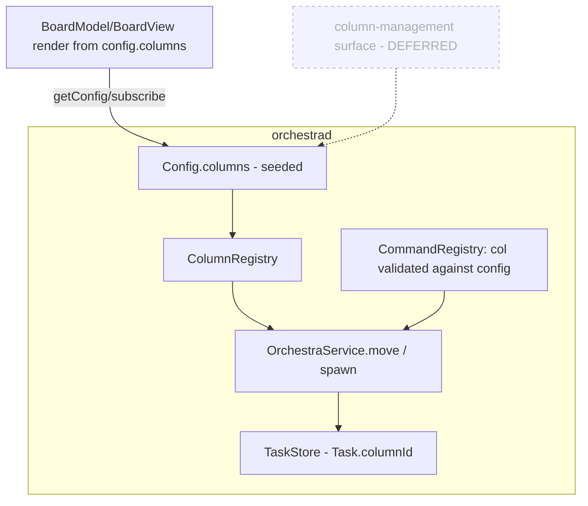
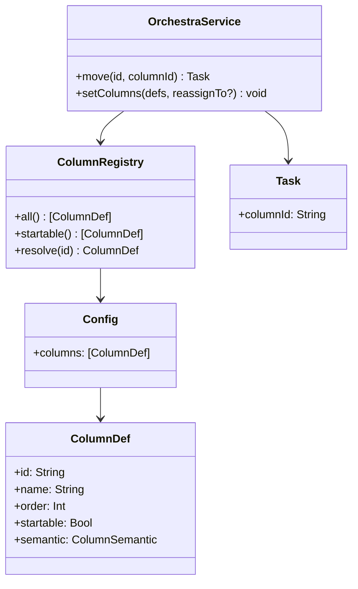

# Layer 2 — Contractual Design: Configurable Kanban Columns

> The **interfaces**: the `ColumnDef` model, where it lives, the migration, and the verbs/validation.

## Architecture overview

A new `ColumnDef` value type (id + name + order + flags) replaces the `Column` enum as the unit of board
structure. The ordered list of `ColumnDef` lives in daemon-owned `Config` (persisted in `config.json`,
already round-tripped via `getConfig`/`setConfig`). `Task.column` becomes `Task.columnId: String`. A
`ColumnRegistry` helper (pure, built from `Config.columns`) is the one place that resolves/validates a
column id, lists startable columns, and supplies display names — the same role `Column.displayName` plays
today, but data-driven. `OrchestraService.move` validates the target id through it; the app's `BoardModel`
renders columns from `config.columns`. Migration lives in `Task`'s decoder + a one-time `Config` seed.

## Major classes / modules

| Name | Responsibility | Collaborators |
|------|----------------|---------------|
| `ColumnDef` (new, `Model.swift`) | One column: `id`, `name`, `order`, `startable`, `semantic?` | `Config`, `Task`, board |
| `ColumnRegistry` (new, pure) | Resolve/validate a column id, list columns/startable, display name | `OrchestraService`, `BoardModel` |
| `Config` (extend) | Holds `columns: [ColumnDef]`; seeds defaults if empty | `ConfigStore`, control plane |
| `Task` (change) | `columnId: String` replaces `column: Column`; decoder migrates old `column` | `TaskStore` |
| `OrchestraService` (change) | `move` validates id; spawn uses startable default | `ColumnRegistry`, `store` |
| `CommandRegistry` (change) | `col` params validated against config (not a static enum) | `OrchestraService` |
| `BoardModel` / `BoardView` (change) | Render columns from `config.columns` | control plane |
| `StartIn` (retire/fold) | Replaced by `startable` flag + a default-start column id | Spawn sheet |

## Data model

```swift
// One board column — daemon-owned configuration, not a compiled-in enum.
public struct ColumnDef: Codable, Sendable, Equatable, Identifiable {
    public let id: String        // stable key (e.g. "plan"); used by Task.columnId + move(col:)
    public var name: String      // display label (e.g. "Implementation")
    public var order: Int        // board left-to-right position
    public var startable: Bool   // may a spawn start here? (replaces StartIn)
    public var semantic: ColumnSemantic   // coarse role other axes key on
}

public enum ColumnSemantic: String, Codable, Sendable {
    case backlog, active, review, other   // e.g. axis 5 keys automation on .review
}
```

> **`semantic` is the hook for an `onEnter` column policy — the one new mechanism this axis would add.**
> Per [[../context-passing-topologies|context-passing-topologies]] §7, a `move` is *pure data* today
> (`TaskStore.swift:93`, no `onEnter` hook), so column transitions are otherwise a **consumer** of
> existing primitives: a context reset at a plan↔impl↔review boundary is opt-in (`restart + seed`) until
> an `onEnter` policy keyed on `semantic == .review` lands here. That policy is what
> [[../pr-review-phase/index|axis 5]] and the guardian/review-phase shape
> ([[../stacked-branches-and-guardian-handoff|stacked-branches]] §3a) consume. A *cross-category*
> transition (freeform → workflow) is **not** a `move` at all — it is a **promotion** that spawns a new
> `.worktree` card; these columns cover only the worktree category.

Default seed (preserves today's board exactly):

| id | name | order | startable | semantic |
|----|------|-------|-----------|----------|
| `plan` | Plan | 0 | true | backlog |
| `impl` | Implementation | 1 | true | active |
| `review` | Review | 2 | false | review |

`Task` migration: a custom `decodeIfPresent` reads `columnId`, else falls back to the legacy `column`
string, else `"plan"`. Because the default ids equal the old enum raw values, **no card moves** — only the
field name/type changes. (Same transparent-migration trick already used for `AgentModel` in `Model.swift`.)

## Function / method contracts

### `ColumnRegistry(config:)` / `.resolve(_ id:) throws -> ColumnDef`
- **Does:** validate a column id against the configured set; list `all()` (ordered) + `startable()`.
- **Inputs:** `Config.columns`; a candidate id.
- **Outputs:** the `ColumnDef`, or throws `OrchestraError.unknownColumn(id)`.
- **Side-effects / errors:** pure; `unknownColumn` is a new typed error → control-error → toast.

### `OrchestraService.move(_ id:, to columnId: String, source:) -> Task`
- **Does:** validate `columnId` via `ColumnRegistry`, set `task.columnId`, recompute `order`, emit.
- **Inputs:** card id, target column id.
- **Outputs:** updated `Task`; emits `taskUpserted` + `.moved` activity (unchanged shape).
- **Side-effects / errors:** `unknownColumn` if not configured.

### Column management — DEFERRED (designed, not built this axis)
- No `add/remove/reorder` verbs and no Settings editor yet (2026-06-26 gate). Columns are seeded config
  the board derives from; editing them is a later change.
- **Recorded policy for when it lands:** a `setColumns(_ defs:, reassignTo:?)` that rejects a delete which
  would strand cards — `columnHasCards(id, count)` unless an explicit `reassignTo` column id is supplied
  (no default-to-first, no cascade-archive). The `ColumnDef` shape (stable id + `semantic`) is chosen now
  precisely so that surface drops in without a data change.

### `CommandRegistry` col params
- `colProp()` no longer emits a static `enum`; the schema becomes a string described as "a configured
  column id" and validation happens in `move`/`spawn` against `ColumnRegistry`. (Optionally, the daemon
  can still advertise the *current* ids in the description for discoverability.)

## Library / framework decisions

| Decision | Choice | Rationale | Alternatives considered |
|----------|--------|-----------|-------------------------|
| Column storage | In `Config` (`config.json`) | Already daemon-owned + app-managed via get/setConfig | Separate `columns.json` (more plumbing) |
| Column identity | Stable string `id` | Survives rename/reorder; matches Task.columnId | Int index (breaks on reorder) |
| Validation point | Runtime in service via `ColumnRegistry` | One source of truth; dynamic config can't be a static schema enum | Per-call-site checks (drift) |
| Migration | `Task` decoder fallback + default-id equality | Zero data movement; proven `AgentModel` pattern | A migration script (heavier) |

## Diagrams

### Bird's-eye (components)



### Detailed (classes)



## Traceability → Layer 1

| L1 goal | Covered by |
|---------|-----------|
| Columns become an ordered daemon-owned list | `ColumnDef` + `Config.columns` |
| `Task.column` → id string | `Task.columnId: String` + migrating decoder |
| Board/spawn/move derive from config | `ColumnRegistry` + `BoardModel`/`BoardView` + `move` validation |
| Transparent migration of existing tasks | `Task` decoder fallback; default ids == old raw values |
| Delete/reorder policy recorded (surface deferred) | `setColumns(reassignTo:)` contract noted for later; not built |
| `StartIn` generalizes | `ColumnDef.startable` + default-start column |

## Decisions made

| Decision | Why | Rejected |
|----------|-----|----------|
| `ColumnRegistry` is a pure helper over `Config` | Single validation/display source; no new actor | Methods scattered on the service |
| Add `ColumnSemantic` now | Cheap; axis 5 needs "the review column"; future-proofs automation | Purely presentational columns |
| Column-management surface **deferred** (2026-06-26) | Keep axis to "columns as data"; shape it so verbs drop in later | Build verbs/editor now |
| Delete = block + **explicit reassign** (recorded) | Cards never silently lost | Default-to-first / cascade-archive |
| Retire `StartIn` for a `startable` flag | One concept; works with N columns | Keep `StartIn` enum (re-introduces a fixed set) |

## Open questions — need your call

_All resolved at the 2026-06-26 gate:_ management surface **deferred** · keep **`ColumnSemantic`** ·
delete policy = **explicit reassignment target** (recorded for the deferred surface).
