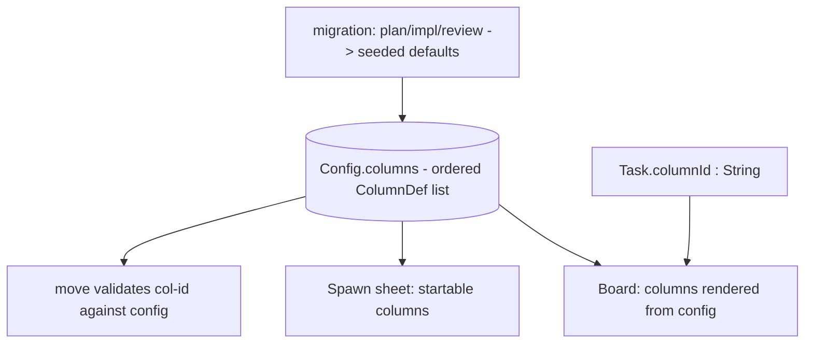

# Configurable Kanban Columns — Design Index

> Turn Orchestra's board columns from a fixed Swift enum (`plan/impl/review`) into a **daemon-owned,
> ordered, configurable list** so columns can be added, removed, reordered, and eventually
> user-defined — without an enum edit + recompile. Part of the [[extensibility-roadmap/index|extensibility roadmap]] (axis 1).

## Layers

| Layer | Document | Status |
|-------|----------|--------|
| 1 — Initial design | [[01-design]] | approved |
| 2 — Contract | [[02-contract]] | approved |
| 3 — Implementation | [[03-implementation]] | not started (design-only pass) |
| 3 — Tests | [[04-tests]] | not started (design-only pass) |

<!-- Status values: not started · draft · in-review · approved · skipped -->
> Design-only pass: L1+L2 approved 2026-06-26. Deepen to L3+tests when picked up for implementation.

## Current picture

## Open questions (rolled up)

_Resolved at the 2026-06-26 gate:_ column-management surface → **deferred** (columns are data now,
editing later) · delete policy → **block + explicit reassignment target** (recorded for the deferred
surface) · columns carry a coarse **`ColumnSemantic`** tag (added now) · single global board for v1.
