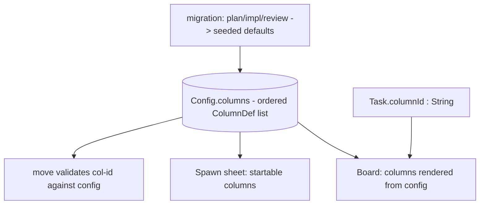

# Configurable Kanban Columns — Design Index

> Turn Orchestra's board columns from a fixed Swift enum (`plan/impl/review`) into a **daemon-owned,
> ordered, configurable list** so columns can be added, removed, reordered, and eventually
> user-defined — without an enum edit + recompile. Part of the [[extensibility-roadmap/index|extensibility roadmap]] (axis 1).

## Status vs `main` (2026-06-29)

- **Not yet shipped.** Columns are still a fixed Swift enum (`plan/impl/review`) in `main`; this axis
  (columns-as-data) remains design-only. The L1+L2 approval stands.
- **The freeform region shipped *separately* — and axis 1 does NOT own it.** Non-`.worktree` cards now
  live in a **standalone** `FreeformRegionView`, deliberately independent of configurable columns (a
  card *category*, not a workflow stage). The old "freeform area = an axis-1 lane" framing is retired —
  see [[../freeform-and-borrowed-cards/index|freeform-and-borrowed-cards]] §4.4. Axis 1 governs only the
  worktree-category lifecycle columns (plan/impl/review).
- **Synthesis decision — columns are a *consumer*, not a new mechanism.** Per
  [[../context-passing-topologies|context-passing-topologies]] §7: *within* the worktree category
  `move` is pure data (no `onEnter` hook today); a context reset at a boundary is opt-in
  (`restart + seed`) or a **future `onEnter` column policy this axis would add**. *Across* categories
  (freeform → workflow) is **not a move** but a **promotion** (spawn a new `.worktree` card seeded from
  the freeform card). The `review`-column-with-`onEnter` shape is what
  [[../stacked-branches-and-guardian-handoff|stacked-branches-and-guardian-handoff]] §3a leans on.

## Layers

| Layer | Document | Status |
|-------|----------|--------|
| 1 — Initial design | [[01-design]] | approved |
| 2 — Contract | [[02-contract]] | approved |
| 3 — Implementation | [[03-implementation]] | not started (design-only pass) |
| 3 — Tests | [[04-tests]] | not started (design-only pass) |

<!-- Status values: not started · draft · in-review · approved · skipped -->
> Design-only pass: L1+L2 approved 2026-06-26. Deepen to L3+tests when picked up for implementation.

## Current picture

## Open questions (rolled up)

_Resolved at the 2026-06-26 gate:_ column-management surface → **deferred** (columns are data now,
editing later) · delete policy → **block + explicit reassignment target** (recorded for the deferred
surface) · columns carry a coarse **`ColumnSemantic`** tag (added now) · single global board for v1.
