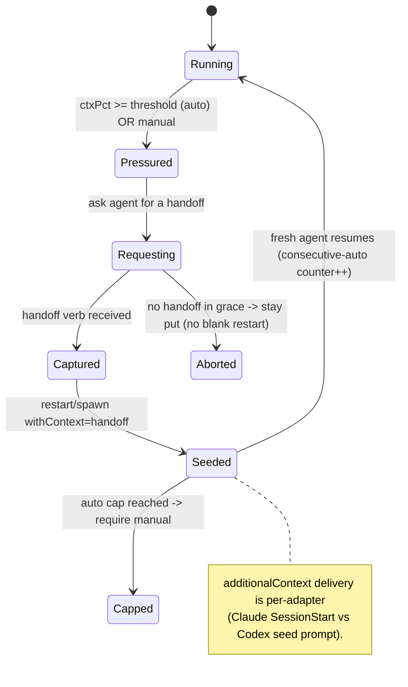

# Layer 1 — Initial Design: Context-clearing Continuity

> The **what**: survive a context wipe by capturing a handoff and resuming work in a fresh agent seeded
> with it — instead of a blank restart or a degraded session.

## Purpose & problem

When an agent's context window fills, the options today are poor: keep going (quality degrades), `/compact`
(lossy, provider-controlled), or `restart` — which Orchestra deliberately makes **blank** (no prompt
re-handed), so the fresh agent loses everything it learned. Allen wants the good path: the agent **saves a
handoff** (what it's doing, what's done, what's next, key files), and Orchestra **auto-launches a fresh
agent seeded with that handoff** to continue — or to perform a derived task.

The reverse-injection keystone for this — `AdapterContext.additionalContext` from
[[../agent-integration/index|axis 3]] — is **still unbuilt** (it is the chokepoint the whole
handoff/fork/fan-out family unlocks from; see [[context-passing-topologies]]). ctxPct + `restart` *are*
shipped, and **`restart` already is ~95% of continue-same-card handoff**
(`OrchestraService+Recovery.swift:100–135`): fresh `agentSessionId` (old → `priorSessionIds`),
**`cwd` kept**, `status → .waiting`, `titleProvisional`, and it **clears `desc`/`deadReason`** and passes
`prompt: nil`. The *only* missing step is **seeding the fresh session** with the handoff. So this axis adds
the **handoff capture**, the **seed** (the axis-3 field), the **seeded restart/spawn**, and the **trigger**.

> Because `restart` **clears `desc`**, `desc` is **not** a durable carrier across a reset — the maxim is
> *handoff carries intent, artifacts carry facts*: the seed carries navigation + next-steps, while
> committed code, plan files, and the durable record live in the worktree (see [[context-passing-topologies]] §1).

> **Reconciliation to the boundary-injector model ([[agent-provider-interface]] §8).** Handoff/restart-
> with-context is one instance of the **durable per-card inbox + capability-keyed boundary-injector**: the
> `pendingContext` inbox **IS** the channel, and delivery follows `capabilities.steering` —
> queue-until-turn-boundary is the universal pattern (Stop-hook drain for Claude/Codex, **resume-seed** —
> which is exactly this axis's seeded `restart`/`spawn` — MCP `check_inbox`, send-keys fallback), with one
> wake for an idle parent. This is why the merge-back conclusion must ride the inbox (injected as
> `additionalContext` at the next live turn) and **never** `send`-to-tmux. Consistent with the maxim above:
> **merge-back artifacts ride git; the inbox carries only the conclusion.** Cross-linked, not duplicated.

## Goals / non-goals

**Goals**
- A **handoff artifact**: a concise, structured continuation context (state · done · next · key files),
  authored by the agent via a `handoff` verb and stored on the card (and optionally written to the worktree).
- **Seeded restart**: a `restart(withContext:)` variant — a fresh session in the same worktree that
  receives the handoff via `additionalContext` (vs today's blank restart).
- **Handoff to a new task**: `spawn(withContext:)` — launch a *new* linked card seeded with the handoff to
  "perform a task" derived from the run (e.g. plan → implementation handoff). Linked via axis-3 `link`.
- **Triggers**: manual ("Continue in a fresh agent") and optional **auto** at a ctxPct threshold (default
  off) — both also reachable as **CLI/MCP verbs** (`handoff` + `continue`) so an agent/script can drive it.
- **Provider-agnostic delivery**: the adapter decides how to deliver `additionalContext` (Claude:
  SessionStart `additionalContext`; Codex: a seed prompt / context file).

**Non-goals (this axis)**
- Replacing the provider's native `/compact` — this is the *curated-handoff* alternative, used when a clean
  fresh start beats in-place compaction.
- **Transcript scraping** — the handoff is **agent-authored only** (decided). If no handoff is produced,
  Orchestra stays put; it never fabricates a continuation from the transcript.
- Fully unattended chains of restarts — bounded + visible.

## Scope

**In scope:** the `Handoff` model + `handoff` verb + `Task.handoff`; `restart(withContext:)` +
`spawn(withContext:)`; the ctxPct auto-trigger (configurable, default off) + manual action; the
inspector affordance. **Out of scope:** replacing `/compact`, transcript auto-summarization as primary,
unbounded auto-chaining.

## Inputs & outputs

| Direction | Description | Type / shape | Notes |
|-----------|-------------|--------------|-------|
| Input | Agent saves a handoff | `handoff(ref, Handoff)` verb | authored by the agent |
| Input | ctxPct crossing threshold | existing `ctxPct` report | optional auto-trigger |
| Input | Manual "continue" | inspector action / verb | restart or new-task |
| Output | Seeded fresh agent | `restart`/`spawn` with `additionalContext = handoff` | continues work |
| Output | Linked new card | `spawn(withContext:)` + `link` to the source | "perform a task" handoff |
| Output | Stored handoff | `Task.handoff` (+ optional worktree file) | visible, re-usable |

## Expected behaviour

- **Manual continue:** Allen (or the agent) triggers "Continue in a fresh agent". If no current handoff,
  Orchestra asks the agent to produce one (a `send` prompt: "write a handoff to continue"), waits for the
  `handoff` verb, then `restart(withContext: handoff)` — the fresh agent comes up seeded.
- **Auto on ctx pressure:** if `autoContinueCtxPct` is set (default off) and ctxPct crosses it, Orchestra
  requests a handoff and, on receipt, performs the seeded restart — bounded (won't loop) + announced in
  Activity. If the agent doesn't produce one in a grace window, it stays put (no blind blank restart).
- **Handoff to a new task:** the agent (or Allen) calls `spawn(withContext: handoff)` to start a new linked
  card performing a derived task (e.g. a planning card hands implementation to a new card), related via `link`.
- **Re-learn after /clear:** if the user `/clear`s, Orchestra can inject the last handoff via
  `additionalContext` so the cleared session re-learns its task (the long-deferred design note).
- **Degrade:** no handoff + no auto config → today's behaviour (blank `restart`) unchanged.

## Complexity & risks

| Risk | Note |
|------|------|
| Handoff quality | Garbage handoff → bad continuation. Keep a structured template; the agent authors it; keep it concise (bounded size). |
| Trigger tuning | Auto at a threshold can fire mid-thought. Default off; only act after the agent confirms a handoff; bound the rate. |
| Loop avoidance | A seeded restart that immediately fills context again must not auto-restart endlessly — cap consecutive auto-continues. |
| Provider delivery | `additionalContext` is Claude's interactive field; Codex delivers via a seed prompt/file. Adapter decides (axes 2/3). |
| Race with recovery | A handoff-restart and the dead/recovery paths must not collide — reuse the `recovering` guard. |
| **Prereq bug — `require()` doesn't reject archived** | `require()`/`resolveRef`/`TaskRef.resolve` don't filter archived cards (`OrchestraService.swift:316`), so a seeded `restart`/`continue` can **resurrect an archived card**. The synthesis model assumes an `assertActive` guard that does not exist yet. *Noted as a known prerequisite — not fixed here.* See [[stacked-branches-and-guardian-handoff]] §7. |
| **Prereq bug — concurrent `restart` not serialized** | The `recovering` set guards report-*attribution* but does **not** serialize the operation; two concurrent restarts race and the DB `agentSessionId` can diverge from the live tmux (ABA). A seeded handoff inherits this race. *Noted, not fixed here.* |
| Merge-back is a separate model | A fork's conclusion must not be `send`-to-tmux (`send → sendKeys` throws the instant the session isn't alive). The durable inbox (`Task.pendingContext`, `Task.succeededBy`, orphan-promotion) is specified in [[context-passing-topologies]] §5 / [[stacked-branches-and-guardian-handoff]] §7 — cross-linked, not duplicated here. |

Rough sizing: **medium** — a small artifact + two seeded launch variants + a trigger. The subtlety is the
trigger/loop discipline and leaning on the agent (not scraping) for handoff quality.

## Diagrams

### Bird's-eye (context)

```mermaid
flowchart LR
    Trig[ctx threshold / manual] --> Req[request handoff from agent]
    Req --> HO[agent: handoff verb -> Task.handoff]
    HO --> Mode{continue | new task}
    Mode -->|continue| RS[restart withContext - same card]
    Mode -->|new task| SP[spawn withContext - new linked card]
    RS --> New[fresh agent + additionalContext]
    SP --> New
```

### Detailed (continue lifecycle)



## Decisions made

| Decision | Why | Rejected |
|----------|-----|----------|
| Agent **authors** the handoff (verb), **no scrape** | Best quality; the agent knows its state | Transcript-tail fallback (lossy) |
| `restart(withContext:)` + `spawn(withContext:)` | Continue same card OR hand to a new task | Blank restart only |
| Auto-trigger **default off**, bounded | Avoid firing mid-thought / loops | Always-on auto-continue |
| `handoff` + `continue` are **CLI/MCP verbs** | Agents/scripts can drive continuity, not just the UI | UI-only trigger |
| Reuse axis-3 `additionalContext` | One injection mechanism, provider-agnostic | Re-handed prompt |
| Never blank-restart on a missing handoff | Don't lose work silently | Fall back to blank restart |

## Open questions — need your call

_All resolved at the 2026-06-26 gate:_ ship **both** triggers (auto default off) **and expose
`handoff`/`continue` over CLI + MCP** · handoff is **agent-authored only** (no transcript-tail fallback) ·
default mode = **continue-same-card** (new-task is explicit).
