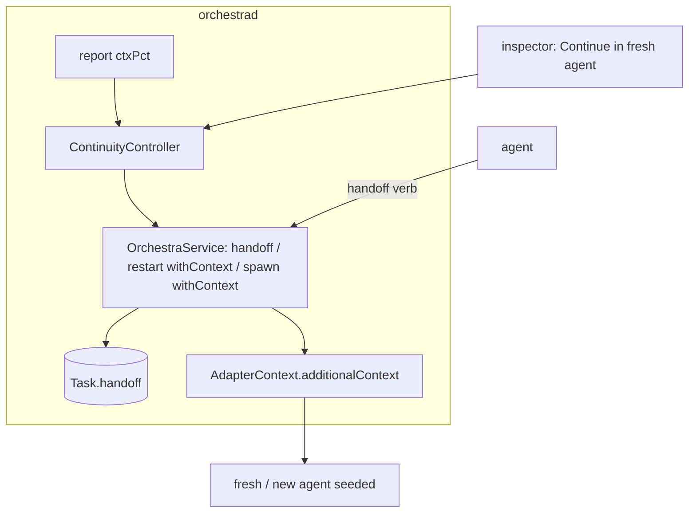
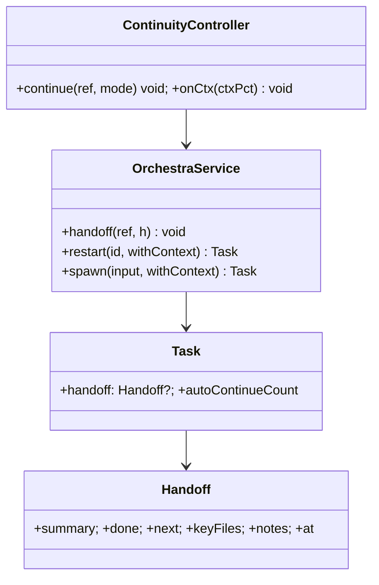

# Layer 2 — Contractual Design: Context-clearing Continuity

> The **interfaces**: the `Handoff` artifact + `handoff` verb, the seeded `restart`/`spawn` variants, and
> the trigger.

## Architecture overview

A `Handoff` value type (structured continuation context) is authored by the agent through a `handoff`
verb (axis-3 registry) and stored on `Task.handoff` (+ optionally written to the worktree as `HANDOFF.md`).
`OrchestraService.restart` gains a `withContext:` parameter that passes the handoff into
`AdapterContext.additionalContext` (axis 3) so the fresh session is seeded instead of blank; `spawn` gains
the same to launch a derived linked card. A small `ContinuityController` handles the trigger: manual
action, or an optional ctxPct threshold — it requests a handoff (`send`), waits, then performs the seeded
restart/spawn, bounded by a consecutive-auto cap. Delivery of `additionalContext` is per-adapter.

## Major classes / modules

| Name | Responsibility | Collaborators |
|------|----------------|---------------|
| `Handoff` (new, `Model.swift`) | Structured continuation context | `Task`, verbs |
| `Task` (extend) | `handoff: Handoff?`, `autoContinueCount` (loop cap) | `TaskStore` |
| `OrchestraService.handoff` (new verb) | Store the agent's handoff on the card | axis-3 registry |
| `OrchestraService.restart` (extend) | `withContext:` → `additionalContext` (seeded, not blank) | adapters |
| `OrchestraService.spawn` (extend) | `withContext:` → new linked card seeded with the handoff | `link` |
| `ContinuityController` (new) | Trigger (manual / ctxPct), request handoff, seeded relaunch, cap loops | `OrchestraService` |
| `Config` (extend) | `autoContinueCtxPct: Double?` (default nil/off), `maxAutoContinues` | `ConfigStore` |
| `AdapterContext.additionalContext` (axis 3) | Carries the handoff to the fresh session | adapters |

## Data model

```swift
// A concise, agent-authored continuation context. Bounded in size.
public struct Handoff: Codable, Sendable, Equatable {
    public var summary: String        // where things stand
    public var done: [String]         // what's completed
    public var next: [String]         // what to do next
    public var keyFiles: [String]     // important paths in the worktree
    public var notes: String?         // anything else
    public var at: Date
}
```

`Task` gains `handoff: Handoff?` and `autoContinueCount: Int` (reset on real user activity; caps auto
loops). Delivery: the adapter renders `Handoff` into `additionalContext` text (Claude: SessionStart
`additionalContext`; Codex: a seed prompt / `--context` file).

## Function / method contracts

### `OrchestraService.handoff(_ ref:, _ handoff: Handoff)`
- **Does:** store `handoff` on the card (+ optionally write `HANDOFF.md` in the worktree); emit
  `taskUpserted`; resolve a pending continuity wait (`ContinuityController`).
- **Inputs:** card ref (defaults to `$ORCHESTRA_TASK_ID`), the `Handoff`. **Side-effects:** persist; bounded size.

### `OrchestraService.restart(_ id:, withContext: Handoff?, source:) -> Task` (extend)
- **Does:** as today (`OrchestraService+Recovery.swift:100–135`: fresh `agentSessionId`, old →
  `priorSessionIds`, **`cwd` kept**, `status → .waiting`, `titleProvisional`, **clears `desc`/`deadReason`**,
  `trustCwd: origin == .scratch`), but when `withContext` is non-nil, set `AdapterContext.additionalContext`
  from it so the fresh session is **seeded**, not blank (`prompt:` stays `nil`). The seed is the keystone
  field still missing in `main` (axis 3).
- **Note — `desc` is cleared**, so the handoff must ride the **seed** (`additionalContext`), not `desc`,
  which is not a durable carrier across a reset.
- **Errors / prereq bugs:** reuses the `recovering` guard, but that guard **only attributes reports — it
  does not serialize the operation**, so concurrent restarts race (DB `agentSessionId` vs live tmux). And
  `require()` does **not reject archived cards** (`OrchestraService.swift:316`), so a seeded restart can
  resurrect an archived card. Both are **known prerequisites** (the synthesis model assumes an
  `assertActive` guard + per-card serialization that don't exist yet) — *noted, not fixed here.* See
  [[stacked-branches-and-guardian-handoff]] §7.

### `OrchestraService.spawn(_ input:, withContext: Handoff?) -> Task` (extend)
- **Does:** normal spawn, plus seed `additionalContext` from the handoff and `link` the new card to the
  source — a derived "perform a task" handoff.
- **Topology note:** in [[context-passing-topologies]] this is the *new-card transfer* handoff — `spawn`
  inheriting `{repo, branch, cwd, origin:.worktree, model, column}` + seed, then
  `archive(source, removeWorktree: false)` to keep the whole working tree (1:1, no refcount). The same
  primitive, with a live parent + `Task.parentCardId`, is a **fork**; with `batch-spawn` + per-slice seed,
  a **fan-out**. The fork's conclusion returns via the durable **merge-back inbox** (`Task.pendingContext`,
  rerouted by `Task.succeededBy`) — *not* `send` — injected as `additionalContext` on the card's next live
  turn (see [[context-passing-topologies]] §5).

> **Delivery = capability-keyed boundary-injector ([[agent-provider-interface]] §8).** The seeded
> `restart`/`spawn` and the `pendingContext` inbox are the **durable per-card inbox + capability-keyed
> boundary-injector** specified in the seam note. `pendingContext` **IS** the inbox; delivery is keyed on
> `capabilities.steering` (Stop-hook drain for Claude/Codex, **resume-seed** = this axis's seeded launch,
> MCP `check_inbox`, send-keys fallback) under the universal *queue-until-turn-boundary* rule, with one
> wake for an idle parent. This is why the conclusion must never `send`-to-tmux. **Merge-back artifacts
> ride git; the inbox carries only the conclusion.** Cross-linked, not duplicated.

### `continue` verb (registry — CLI + MCP) → `ContinuityController.continue(ref, mode:)`
- **Does:** trigger continuity for a card — if no current handoff, `send` a "write a handoff" prompt, await
  the `handoff` verb (grace window), then `restart(withContext:)` (mode `.same`, default) or
  `spawn(withContext:)` (mode `.newTask`). Exposed as a verb so an agent/script can self-continue, not just
  the inspector button.
- **Inputs:** `ref`, `mode` (default `.same`). **Side-effects:** seeded relaunch. **Errors:** no handoff in
  grace → stays put (no blank restart); **never scrapes the transcript**.

### `ContinuityController` (auto path)
- **Auto:** when a `report` raises `ctxPct >= config.autoContinueCtxPct` (default nil/off) and
  `autoContinueCount < maxAutoContinues`, run the same flow; increment the counter; announce in Activity.
  On no-handoff-in-grace → stay put. Agent-authored handoff only (no fallback).

## Library / framework decisions

| Decision | Choice | Rationale | Alternatives considered |
|----------|--------|-----------|-------------------------|
| Handoff authorship | Agent via `handoff` verb, **no scrape** | Highest fidelity; agent knows its state | Transcript-tail fallback (lossy) |
| Injection | Reuse `AdapterContext.additionalContext` (axis 3) | One provider-agnostic mechanism | Re-handed prompt |
| Trigger | Manual + optional ctxPct (default off); both **CLI/MCP verbs** | Safe default; agent/script-drivable | UI-only / always-on |
| Loop safety | `autoContinueCount` cap + grace + Activity | Prevent restart storms | Unbounded auto-chaining |
| New-task handoff | `spawn(withContext:)` + `link` | Covers "perform a task"; relates cards | Only same-card continue |

## Diagrams

### Bird's-eye (components)



### Detailed (classes)



## Traceability → Layer 1

| L1 goal | Covered by |
|---------|-----------|
| Handoff artifact authored by the agent | `Handoff` + `handoff` verb + `Task.handoff` |
| Seeded restart (continue same card) | `restart(withContext:)` → `additionalContext` |
| Handoff to a new task | `spawn(withContext:)` + `link` |
| Manual + optional auto trigger | `ContinuityController` + `Config.autoContinueCtxPct` |
| Provider-agnostic delivery | adapter renders `Handoff` into `additionalContext` |
| Never blank-restart on failure | controller stays put if no handoff in grace |

## Decisions made

| Decision | Why | Rejected |
|----------|-----|----------|
| `Handoff` is structured + bounded | Quality + small persistence | Free-form blob |
| Seeded `restart`/`spawn` via `additionalContext` | Reuse axis-3 channel; provider-agnostic | New injection path |
| Auto default off + capped | Safety; avoid mid-thought firing + loops | Always-on |
| Reuse `recovering` guard | Avoid colliding with dead/recovery | A parallel lock |

## Open questions — need your call

_All resolved at the 2026-06-26 gate:_ ship both triggers (auto default off) + `handoff`/`continue` over
CLI + MCP · agent-authored handoff only (no transcript fallback) · default mode continue-same-card.
