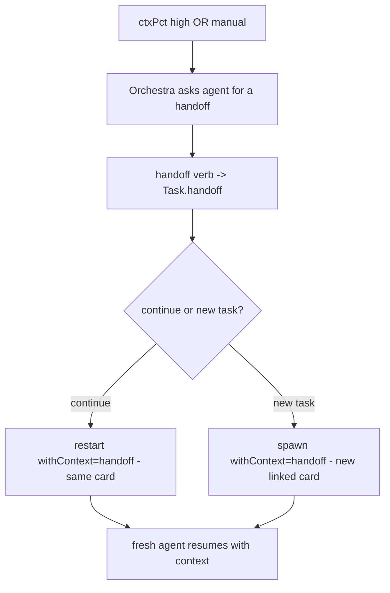

# Context-clearing Continuity — Design Index

> When an agent's context fills, don't lose the thread: the agent **saves a handoff**, and Orchestra
> **launches a fresh agent seeded with it** — either continuing the same card or spinning a new task.
> Part of the [[extensibility-roadmap/index|extensibility roadmap]] (axis 6). Builds on
> [[../agent-integration/index|agent-integration]] (`additionalContext` injection) + the shipped
> ctxPct / `restart` machinery.

## Layers

| Layer | Document | Status |
|-------|----------|--------|
| 1 — Initial design | [[01-design]] | approved |
| 2 — Contract | [[02-contract]] | approved |
| 3 — Implementation | [[03-implementation]] | not started (design-only pass) |
| 3 — Tests | [[04-tests]] | not started (design-only pass) |

> Design-only pass: L1+L2 approved 2026-06-26. Agent-authored handoff only; `handoff`/`continue` over
> CLI+MCP; auto ctxPct trigger default off; default mode continue-same-card.

## Current picture

## Open questions (rolled up)

_Resolved at the 2026-06-26 gate:_ ship both triggers (auto default off) + `handoff`/`continue` over
CLI + MCP · agent-authored handoff only · default mode continue-same-card.
