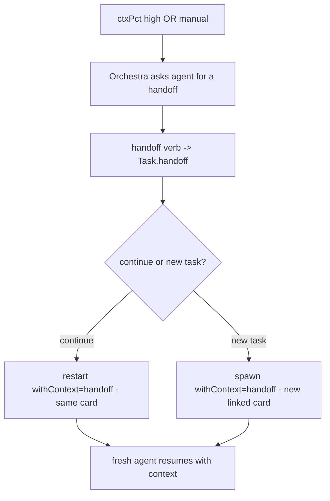

# Context-clearing Continuity — Design Index

> When an agent's context fills, don't lose the thread: the agent **saves a handoff**, and Orchestra
> **launches a fresh agent seeded with it** — either continuing the same card or spinning a new task.
> Part of the [[extensibility-roadmap/index|extensibility roadmap]] (axis 6). Builds on
> [[../agent-integration/index|agent-integration]] (`additionalContext` injection) + the shipped
> ctxPct / `restart` machinery.

## Status vs `main` (2026-06-29)

- This is **the HANDOFF axis**, now subsumed as one of four topologies under
  [[context-passing-topologies]] — *continue-same-card handoff*. Its sibling — *new-card transfer* — and
  the fork/fan-out cases are detailed there + in [[stacked-branches-and-guardian-handoff]].
- **`restart` already IS ~95% of continue-same-card handoff** (`OrchestraService+Recovery.swift:100–135`):
  it mints a fresh `agentSessionId` (old → `priorSessionIds`), **keeps `cwd`**, sets `status → .waiting` +
  `titleProvisional`, **clears `desc`/`deadReason`**, passes `prompt: nil`. The *only* missing step is the
  **seed** — the `additionalContext` keystone (axis 3, still unbuilt). This axis is mostly wiring once that lands.
- **Load-bearing addition from the synthesis notes:** the merge-back / fork-safety / lineage model —
  durable `Task.pendingContext` inbox, `Task.succeededBy` lineage pointer, orphan-promotion. Cross-linked,
  not duplicated, below.
- **Handoff delivery is now specified concretely in [[agent-provider-interface]] §8** — the **durable
  per-card inbox + capability-keyed boundary-injector** (Stop-hook drain for Claude/Codex, resume-seed,
  MCP `check_inbox`, send-keys fallback; *queue-until-turn-boundary* is the universal pattern, with one
  wake for an idle parent). The `pendingContext` inbox **IS** that channel, and the seeded
  `restart(withContext:)` / `spawn(withContext:)` mechanism is the capability-keyed injector in its
  resume-seed form. **Merge-back artifacts ride git; the inbox carries only the conclusion.** Cross-linked,
  not duplicated.
- **Two prerequisite bugs** bear directly on seeded restart/handoff safety (noted, not fixed): `require()`
  does not reject **archived** cards (no `assertActive` guard), and **concurrent `restart` is not
  serialized** (the `recovering` set only guards report-attribution). See [[01-design]] risks.

## Layers

| Layer | Document | Status |
|-------|----------|--------|
| 1 — Initial design | [[01-design]] | approved |
| 2 — Contract | [[02-contract]] | approved |
| 3 — Implementation | [[03-implementation]] | not started (design-only pass) |
| 3 — Tests | [[04-tests]] | not started (design-only pass) |

> Design-only pass: L1+L2 approved 2026-06-26. Agent-authored handoff only; `handoff`/`continue` over
> CLI+MCP; auto ctxPct trigger default off; default mode continue-same-card.

## Current picture

## Open questions (rolled up)

_Resolved at the 2026-06-26 gate:_ ship both triggers (auto default off) + `handoff`/`continue` over
CLI + MCP · agent-authored handoff only · default mode continue-same-card.
