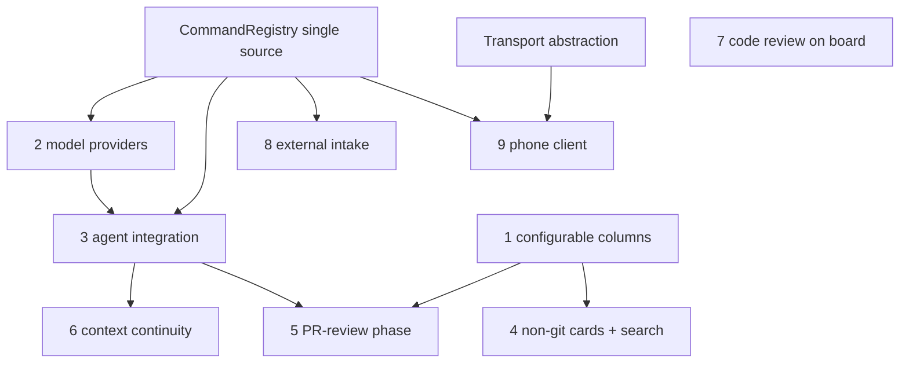

# Orchestra — Extensibility Roadmap

> A map-of-content for the **9 forward-looking extensibility designs** for Orchestra. Each axis is its
> own design-only layered plan (Layer 1 *what* + Layer 2 *interfaces*, no implementation yet) in its
> own folder. Deepen an axis to Layer 3 + tests and implement when it's picked up. Anchored by the
> shipped architecture in [[kanban-board/index|kanban-board]].

## Why these, now

The core (daemon + `OrchestraService` actor + thin clients) is sound. These designs widen the seams
**before they calcify** so each future feature drops into an interface that already anticipated it.
Source: the 2026-06-26 deep code review.

## The 9 axes (planned in dependency/leverage order)

| # | Axis | Folder | L1 | L2 |
|---|------|--------|----|----|
| 1 | Configurable kanban columns | [[configurable-columns/index\|configurable-columns]] | ✅ approved | ✅ approved |
| 2 | Multiple model providers | [[model-providers/index\|model-providers]] | ✅ approved | ✅ approved |
| 3 | Deeper agent integration | [[agent-integration/index\|agent-integration]] | ✅ approved | ✅ approved |
| 4 | Non-git cards + searchability | [[non-git-cards-search/index\|non-git-cards-search]] | ✅ approved | ✅ approved |
| 5 | Automated PR-review phase | [[pr-review-phase/index\|pr-review-phase]] | ✅ approved | ✅ approved |
| 6 | Context-clearing continuity | [[context-continuity/index\|context-continuity]] | ✅ approved | ✅ approved |
| 7 | View/review code on the board | [[code-review-on-board/index\|code-review-on-board]] | ✅ approved | ✅ approved |
| 8 | Outside-source intake | [[external-intake/index\|external-intake]] | ✅ approved | ✅ approved |
| 9 | Phone client | [[phone-client/index\|phone-client]] | ✅ approved | ✅ approved |

<!-- Status values: not started · draft · in-review · approved · skipped -->

## Shared seams (the leverage points every axis routes through)

| Seam | Where | Unlocks |
|------|-------|---------|
| `CommandRegistry` as the *true* single source | `Commands.swift` (CLI is hand-written today; `models`/`archivedList` are server-only) | axes 2, 3, 5, 8 |
| `Adapter` provider abstraction | `Agents/Adapter.swift` (+ Claude-shaped report path to generalize) | axes 2, 3, 6 |
| Columns as **data**, not an enum | `Model.swift` `Column`, `Config` | axes 1, 4, 5 |
| `Transport` abstraction over raw-fd UDS | `Control/*` | axes 8, 9 |
| The `report` two-way hook channel | `OrchestraService+Report.swift`, `claude-hooks.json` | axes 3, 5, 6 |

## Cross-axis dependencies

## Status — design-only pass complete (2026-06-26)

All 9 axes have an **approved L1 (design) + L2 (contract)**. None are implemented yet — each is a
design-only plan; deepen an axis to **L3 (implementation) + L4 (tests)** and build when it's picked up.

**Sequencing notes from the gates:**
- **Foundational, do first:** the `CommandRegistry` single-source refactor (in axis 3) — it unblocks axes
  3/5/8. `ControlClient` auto-reconnect (from axis 9) is a near-term standalone fix that also hardens the
  desktop (deepens the shipped B5 fix).
- **Committed follow-on:** build a `CodexAdapter` (axis 2) as the first multi-provider consumer once the
  seam lands.
- **Dependency order:** axis 1 (columns) → enables 4 (freeform lane) + 5 (PR-review column). axis 2 →
  3 → 5/6. axis 4 (freeform) ← used by 8 (no-repo intake). axis 7 feeds 5's review view.

## Cross-layer review & refine pass

With all layers in place, the set is now a queryable model. Per the layered-plan two-pass workflow, a
follow-up **review/refine pass** can propagate any change across the affected axes' docs + diagrams in one
pass. Ask for it when reviewing the set as a whole.

## Open questions (rolled up)

_All per-axis gate questions resolved 2026-06-26 (see each axis's index)._ Remaining items are
build-time confirmations noted in the axis docs (e.g. Codex flag/hook coverage at adapter-build time).
