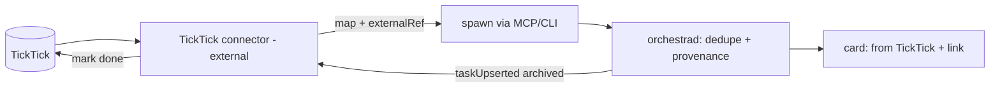
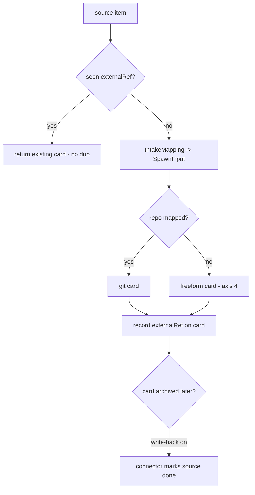

# Layer 1 — Initial Design: Outside-source Intake

> The **what**: an external source can create an Orchestra card — safely, idempotently, with provenance —
> by mapping its item to a spawn.

## Purpose & problem

Allen wants to send a task from elsewhere — a **TickTick** to-do, a webhook, an email, a Shortcut — and
have Orchestra pick it up as a card. The control plane already makes this *possible* (MCP lets any client
`spawn`/`batch-spawn`), but three things are missing for it to be **safe and ergonomic**: (1) **idempotency**
— a source that re-delivers shouldn't spawn duplicates; (2) **mapping** — an external task knows a title,
not a repo/branch/model; (3) **provenance + write-back** — the card should know where it came from and,
ideally, mark the source item done when archived.

## Goals / non-goals

**Goals**
- **Idempotent spawn**: `spawn` accepts an optional `externalRef` ({source, id, url}); the daemon dedupes by
  it so re-delivery returns the existing card, never a duplicate.
- A generic **`IntakeConnector` seam**: any source maps its item → `SpawnInput` (+ `externalRef`) and calls
  the control plane. **TickTick** is the reference connector.
- **Mapping rules**: a source list/tag/label → repo/branch/model/column/kind. A task with no repo becomes a
  **freeform card** ([[../non-git-cards-search/index|axis 4]]); a mapped one becomes a git card.
- **Provenance**: the card records its `externalRef` (shown as "from TickTick", links back to the source item).
- **Optional status write-back**: when a card is archived/done, the connector can mark the source item done.
- **Daemon stays network-free**: the connector runs **external** by default (it talks to the source's API,
  the daemon only sees `spawn` calls) — preserving the no-network-listener posture.

**Non-goals (this axis)**
- Connectors for *many* sources — design the seam, ship **TickTick** as the reference.
- Full **bi-directional sync** (live two-way field mirroring) — v1 is intake + a simple done write-back.
- A daemon-hosted poller as the primary path (optional alternative; default is the external connector).
- Source **auth UX** polish — the connector handles its own OAuth/token (note the seam).

## Scope

**In scope:** `externalRef` on `SpawnInput`/`Task` + daemon dedupe; the `IntakeConnector` seam +
`IntakeMapping`; a TickTick connector (poll → map → spawn); provenance on the card; optional done
write-back. **Out of scope:** many connectors, full bi-directional sync, daemon-hosted polling as default,
auth UX.

## Inputs & outputs

| Direction | Description | Type / shape | Notes |
|-----------|-------------|--------------|-------|
| Input | Source items | TickTick API / webhook payload | connector-specific |
| Input | Mapping rules | `IntakeMapping` (list/tag → repo/branch/model/kind) | connector config |
| Input | Spawn w/ provenance | `SpawnInput.externalRef {source, id, url}` | dedupe key |
| Output | Card | git or freeform, with `externalRef` | provenance + link back |
| Output | Write-back | mark source item done on archive | connector → source API |

## Expected behaviour

- **Intake:** the TickTick connector polls (or receives a webhook for) tasks in a configured list/tag, maps
  each to a `SpawnInput` per the rules, and calls `spawn` with an `externalRef`. A task with no repo mapping
  → a freeform card; a mapped one → a git card on the rule's repo/branch.
- **Idempotency:** the daemon keys cards by `externalRef`; a re-delivered/re-polled item returns the
  existing card (no duplicate). Editing the source item can update the card's title/desc per policy.
- **Provenance:** the card shows "from TickTick" with a link to the source item (its `url`).
- **Write-back (optional):** when the card is archived/done, the connector (watching the event stream or
  polled) marks the TickTick task complete.
- **Daemon posture:** the daemon never calls TickTick; it only receives `spawn` calls — no new network
  listener, no outbound creds in the daemon. The connector owns the source API + tokens.
- **Degrade:** connector down → no cards from that source (the rest of Orchestra is unaffected).

## Complexity & risks

| Risk | Note |
|------|------|
| Idempotency correctness | `externalRef` must be a stable, unique key per source item; the dedupe map must survive restarts (persist with the task). |
| Mapping the missing repo/branch | An external task has only text; rules must supply repo/branch or fall back to a freeform card — don't guess a repo. |
| Daemon network posture | Keep source API calls OUT of the daemon (external connector) to preserve no-network-listener; a daemon-hosted poller is opt-in only. |
| Auth/secrets | Source OAuth/tokens live with the connector, not the daemon; document the seam. |
| Write-back loops | Marking the source done shouldn't loop back into a re-spawn (dedupe + a "completed" guard). |
| Re-delivery / edits | Decide what a changed source item updates on an existing card (title/desc) vs ignores. |

Rough sizing: **medium** — the daemon side is small (`externalRef` + dedupe + provenance); the connector
(TickTick API + mapping + write-back) is the bulk, and it's an external process reusing MCP/CLI.

## Diagrams

### Bird's-eye (context)

### Detailed (intake + idempotency)

## Decisions made

| Decision | Why | Rejected |
|----------|-----|----------|
| Intake = another control-plane client | The control plane already supports it; minimal daemon change | A bespoke intake API |
| `externalRef` + daemon dedupe | Safe re-delivery; provenance; one obvious key | No idempotency (dup spawns) |
| Connector runs **external** by default | Keeps the daemon network-free (no listener, no source creds) | Daemon-hosted poller (posture change) |
| No-repo task → **freeform card** | Reuse axis 4; don't guess a repo | Force a default repo |
| TickTick as the reference connector | Concrete; proves the seam | Many connectors at once |

## Open questions — need your call

_All resolved at the 2026-06-26 gate:_ connector runs **external** (daemon stays network-free) · no-repo
task → **freeform card** · **done write-back ships in v1**.
