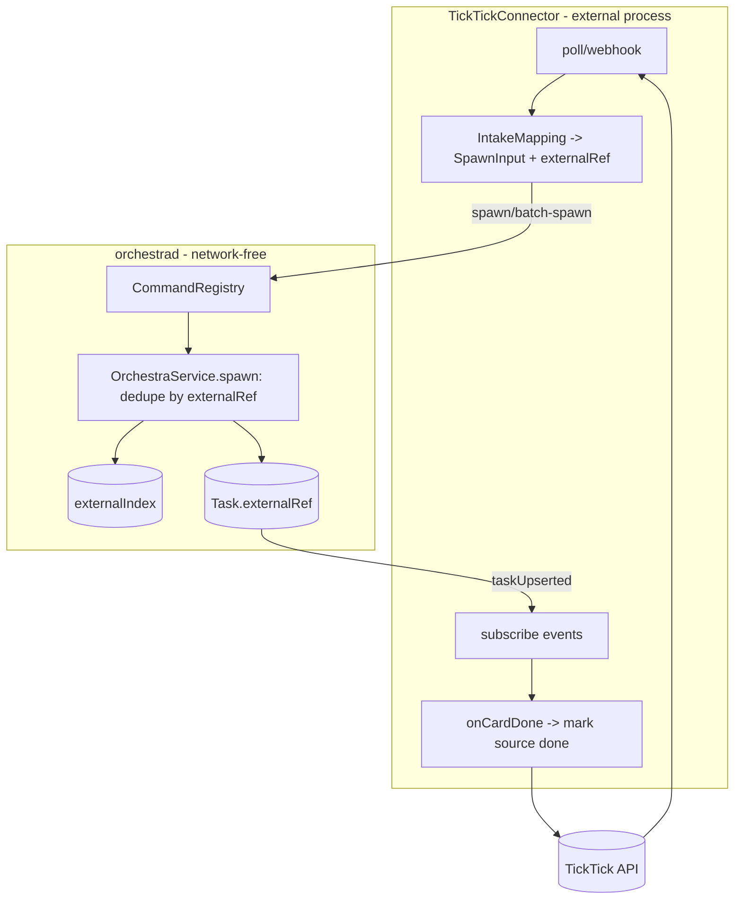
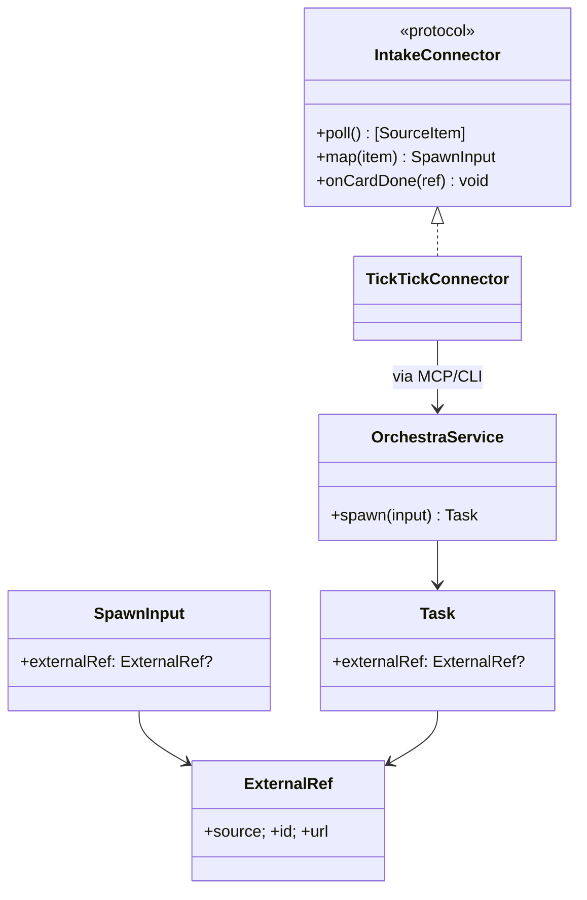

# Layer 2 — Contractual Design: Outside-source Intake

> The **interfaces**: `externalRef` + daemon dedupe, the `IntakeConnector`/`IntakeMapping` seam, and the
> TickTick reference connector.

## Architecture overview

The daemon side is small: `SpawnInput`/`Task` gain an `externalRef`, and `spawn` dedupes by it (a persisted
external→task map) so re-delivery returns the existing card; the card carries provenance. Everything else
is an **external `IntakeConnector`** (its own process) that owns the source API + auth, maps source items
to `SpawnInput`s via an `IntakeMapping`, and calls the existing `spawn`/`batch-spawn` over MCP/CLI — so the
daemon gains **no network listener and no source credentials**. The connector optionally watches the event
stream (`subscribe`) and writes "done" back to the source when a card is archived. TickTick is the reference
`IntakeConnector`.

## Major classes / modules

| Name | Responsibility | Collaborators |
|------|----------------|---------------|
| `ExternalRef` (new, `Model.swift`) | `{source, id, url?}` — provenance + idempotency key | `SpawnInput`, `Task` |
| `SpawnInput` / `Task` (extend) | `externalRef: ExternalRef?` | spawn, card |
| `OrchestraService.spawn` (extend) | Dedupe by `externalRef`; record provenance | `externalIndex` |
| `externalIndex` (new, persisted) | `ExternalRef → taskId` map (survives restart) | `TaskStore` |
| `IntakeConnector` (new protocol, connector-side) | Poll/receive source items → `SpawnInput` + write-back | control plane |
| `IntakeMapping` (new) | Rule: source list/tag → repo/branch/model/column/kind | connector |
| `TickTickConnector` (new, external) | TickTick API impl of `IntakeConnector` | TickTick API |
| `CardView`/`InspectorView` (change) | Show provenance + link-back | — |

## Data model

```swift
// Provenance + idempotency key for a card created from an external source.
public struct ExternalRef: Codable, Sendable, Equatable {
    public var source: String   // "ticktick", "webhook", "email", ...
    public var id: String       // the source item's stable id (dedupe key, per source)
    public var url: String?     // deep link back to the source item
}
```

`SpawnInput.externalRef` + `Task.externalRef` (nil for normal spawns). The daemon keeps a persisted
`externalIndex: [String: UUID]` keyed by `"\(source):\(id)"`. `IntakeMapping` (connector-side) maps a
source selector (list/tag/label) to spawn defaults — including `kind: .freeform` when no repo is mapped.

## Function / method contracts

### `OrchestraService.spawn(_ input:)` (extend)
- **Does:** if `input.externalRef` is set and already in `externalIndex` → return the existing `Task` (no
  duplicate; optionally update title/desc per policy). Else spawn as today, record `externalRef` on the
  card + in `externalIndex` (persisted). Honors `kind` (freeform when no repo).
- **Inputs:** `SpawnInput` (+ `externalRef`). **Outputs:** `Task`. **Side-effects:** persist the index.
- **Idempotent** by `externalRef`.

### `IntakeConnector` (protocol, connector-side — not in the daemon)
- `func poll() async -> [SourceItem]` (or a webhook handler) — fetch new/updated source items.
- `func map(_ item:) -> SpawnInput` — apply `IntakeMapping` (→ `SpawnInput` + `externalRef`).
- `func onCardDone(_ ref: ExternalRef) async` — write "done" back to the source (optional).
- **TickTickConnector:** implements these against the TickTick API (OAuth token it owns); calls
  `spawn`/`batch-spawn` over MCP/CLI; `subscribe`s for archive events to drive `onCardDone`.

### `IntakeMapping`
- A list of rules `{ match: SourceSelector, repo?, branch?, model?, column?, kind }`. First match wins;
  no `repo` → `kind: .freeform`. Keeps "what becomes a git card vs freeform" explicit + declarative.

## Library / framework decisions

| Decision | Choice | Rationale | Alternatives considered |
|----------|--------|-----------|-------------------------|
| Intake transport | Existing `spawn`/`batch-spawn` over MCP/CLI | The control plane already supports it | A new daemon intake endpoint |
| Connector location | **External process** (default) | Daemon stays network-free; no source creds in daemon | Daemon-hosted poller (posture change) |
| Idempotency | `externalRef` + persisted `externalIndex` | Safe re-delivery; one obvious key; survives restart | In-memory only / no dedupe |
| No-repo intake | A **freeform card** (axis 4) | Don't guess a repo; reuse existing model | Force a default repo |
| Reference connector | **TickTick** | Concrete proof of the seam | Many connectors at once |

## Diagrams

### Bird's-eye (components)



### Detailed (classes)



## Traceability → Layer 1

| L1 goal | Covered by |
|---------|-----------|
| Idempotent spawn | `externalRef` + persisted `externalIndex` + `spawn` dedupe |
| Generic intake seam | `IntakeConnector`/`IntakeMapping` (connector-side) |
| Mapping rules incl. no-repo | `IntakeMapping` → `SpawnInput` (`kind: .freeform` when no repo) |
| Provenance + link-back | `Task.externalRef` + `CardView`/inspector |
| Optional done write-back | `IntakeConnector.onCardDone` via `subscribe` |
| Daemon network-free | connector external; daemon only sees `spawn` |
| TickTick reference | `TickTickConnector` |

## Decisions made

| Decision | Why | Rejected |
|----------|-----|----------|
| `externalRef` + persisted index | Idempotent re-delivery + provenance | No dedupe |
| External connector default | Preserve daemon no-network posture | Daemon-hosted poller |
| No-repo → freeform card | Reuse axis 4; never guess a repo | Default repo |
| Reuse `spawn`/`batch-spawn` | One control surface (registry single source) | New intake API |

## Open questions — need your call

_All resolved at the 2026-06-26 gate:_ external connector (daemon network-free) · no-repo → freeform card ·
done write-back in v1.
