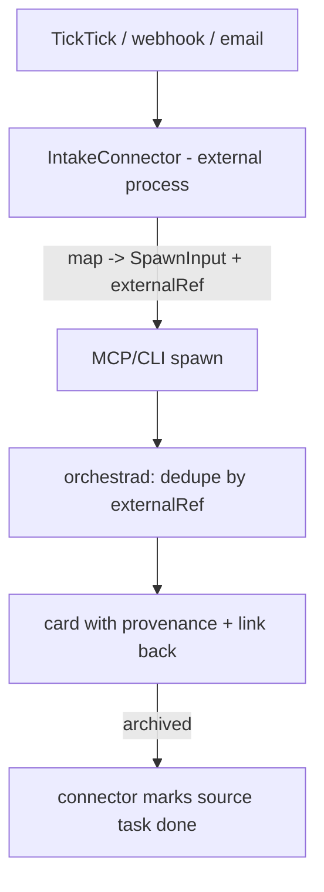

# Outside-source Intake — Design Index

> Let external sources (a todo app like **TickTick**, webhooks, email, shortcuts) create Orchestra cards —
> "send a task to work on". Architecturally this is just **another control-plane client calling `spawn`**;
> the work is a generic intake seam (mapping + idempotency + provenance) so re-delivery is safe and the
> daemon stays network-free. Part of the [[extensibility-roadmap/index|extensibility roadmap]] (axis 8).
> Leans on [[../agent-integration/index|agent-integration]] (registry single source) +
> [[../non-git-cards-search/index|non-git-cards]] (a source task with no repo → a freeform card).

## Status vs `main` (2026-06-29)

- **The freeform substrate this axis leans on is now SHIPPED** (axis 4 / PR2–PR4). `Task.worktree` became
  `Task.cwd` + `Task.origin` (`enum CardOrigin { worktree, scratch, borrowed }`), plus `Task.access`
  (`readWrite`/`readOnly`), and **`SpawnInput` grew `cwd`, `access`, and `scratch`** (`Model.swift:484–520`).
  So a no-repo intake task no longer needs a future "freeform kind" — an intake source can already create a
  **scratch** card (`scratch: true`, the default for repo-less items) or a **borrowed** card (`cwd` into an
  existing dir), as well as a worktree card. Read this axis's "freeform card" as `origin != .worktree`.
- **Otherwise this axis is unchanged**: the control-client-as-transport intake model, `externalRef` +
  daemon dedupe, and the external connector posture are all still **planned/unbuilt** as written.
- **Synthesis notes:** [[stacked-branches-and-guardian-handoff]] and [[context-passing-topologies]] don't
  reshape intake; they only continue to grow `SpawnInput` (a future `additionalContext` seed + `base`
  start-point), which an intake mapping could populate later. No conflict with this axis's gate decisions.

## Layers

| Layer | Document | Status |
|-------|----------|--------|
| 1 — Initial design | [[01-design]] | approved |
| 2 — Contract | [[02-contract]] | approved |
| 3 — Implementation | [[03-implementation]] | not started (design-only pass) |
| 3 — Tests | [[04-tests]] | not started (design-only pass) |

> Design-only pass: L1+L2 approved 2026-06-26. External connector (daemon network-free); no-repo →
> freeform card; done write-back in v1; TickTick reference connector.

## Current picture

## Open questions (rolled up)

_Resolved at the 2026-06-26 gate:_ external connector (daemon network-free) · no-repo task → freeform
card · done write-back in v1.
