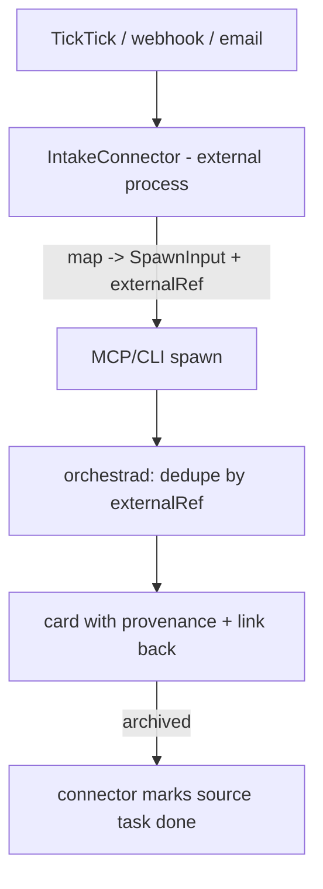

# Outside-source Intake — Design Index

> Let external sources (a todo app like **TickTick**, webhooks, email, shortcuts) create Orchestra cards —
> "send a task to work on". Architecturally this is just **another control-plane client calling `spawn`**;
> the work is a generic intake seam (mapping + idempotency + provenance) so re-delivery is safe and the
> daemon stays network-free. Part of the [[extensibility-roadmap/index|extensibility roadmap]] (axis 8).
> Leans on [[../agent-integration/index|agent-integration]] (registry single source) +
> [[../non-git-cards-search/index|non-git-cards]] (a source task with no repo → a freeform card).

## Layers

| Layer | Document | Status |
|-------|----------|--------|
| 1 — Initial design | [[01-design]] | approved |
| 2 — Contract | [[02-contract]] | approved |
| 3 — Implementation | [[03-implementation]] | not started (design-only pass) |
| 3 — Tests | [[04-tests]] | not started (design-only pass) |

> Design-only pass: L1+L2 approved 2026-06-26. External connector (daemon network-free); no-repo →
> freeform card; done write-back in v1; TickTick reference connector.

## Current picture

## Open questions (rolled up)

_Resolved at the 2026-06-26 gate:_ external connector (daemon network-free) · no-repo task → freeform
card · done write-back in v1.
