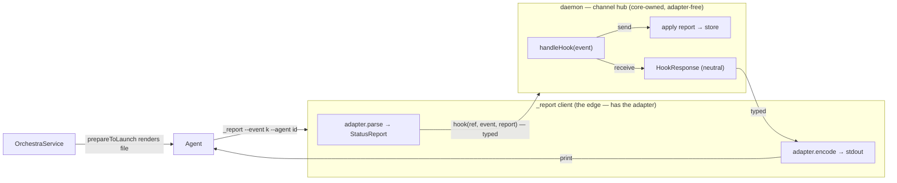
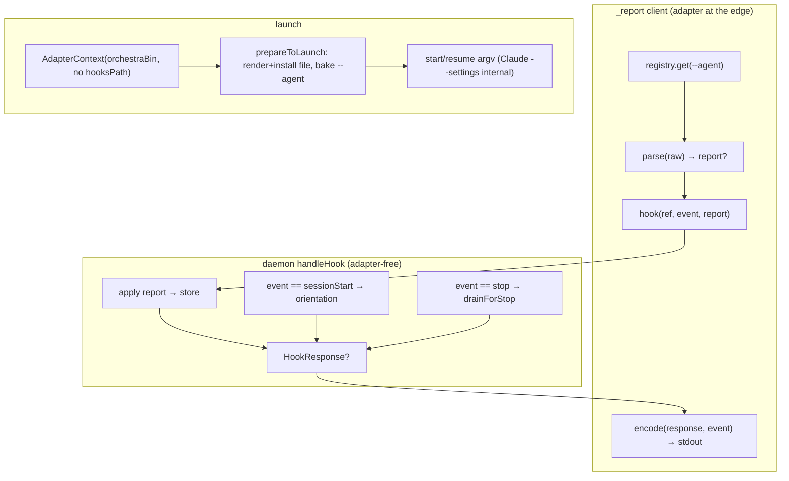

# Layer 1 — Initial Design: First-class agent hooks

> The **what**, not the how. "First-class" means the hook **channel** becomes a concept core owns
> end-to-end — a shared event vocabulary dispatched in one place — while each adapter owns only its
> native *format* at the edges. Nothing user-facing changes; this is a structural move.

## Purpose & problem

Column-aware SessionStart orientation (commit `c610127`) wired hooks for a *second* agent (Codex) and
exposed that hooks aren't first-class. The deeper issue: **hooks are the primary core↔agent
communication channel, yet that channel is modeled nowhere.** It's a scatter of client-side CLI logic,
per-use-case daemon RPCs, a hardcoded adapter parse, and a bundled template — and the shared launch
struct carries one agent's vocabulary (`hooksPath`).

### Hooks are a bidirectional channel

| Direction | What flows | Concrete hook |
|-----------|-----------|---------------|
| **Send** (agent→core) | telemetry: activity, turn boundaries, session id, context % | lifecycle hooks → `orchestra _report` → daemon → store |
| **Receive** (core→agent) | orientation (column/access/self-id); inbox-drain continuation | the hook's **stdout**, fed back into the agent (`additionalContext`, `decision:block`) |

"First-class" therefore means: **core owns the channel** — a `HookEvent` vocabulary and the dispatch
for both directions, in one place (the daemon) — and **each adapter owns only format**: `parse` raw
telemetry in, `encode` a response out, and render its native hook file.

### The organizing principle: convert at the edge, dispatch in core

Raw agent-shaped bytes must never reach core logic. The adapter is the anti-corruption boundary and
it runs at the **edge** — inside the `_report` client, right where the agent fires the hook. The
client normalizes with the adapter and sends **typed, agent-neutral** data to the daemon; the wire
never carries raw. The daemon's hook logic is therefore **adapter-free** — it speaks only `HookEvent`
and `HookResponse`.

## Goals / non-goals

**Goals**

- Model the channel in core: a `HookEvent` vocabulary + a `HookResponse`, dispatched once in the daemon for both directions.
- Adapter owns format only, at the edge: `parse` (telemetry in) + `sessionSource` (normalize the session source) + `encode` (response out), plus rendering its file in `prepareToLaunch`.
- Raw never crosses the wire — the `_report` client converts with its adapter and sends typed data.
- Resolve the client's adapter from a baked **`--agent <id>`** in the rendered hook command → `registry.get(agentId)`. Closes the leak-#4 `ClaudeCodeAdapter()` hardcode with no env var and no fallback.
- Unify the scattered `report`/`drain`/`sessionBrief` RPCs into one `hook` RPC (their service methods stay).
- Fold hook render+install into `prepareToLaunch`; replace `AdapterContext.hooksPath` with agent-agnostic `orchestraBin`.
- Daemon renders **no** hook files and enumerates **no** agents.
- Zero user-facing change; orientation, telemetry, and drain are byte-preserved.

**Non-goals**

- No change to hook **content** — same orientation text, same telemetry semantics, same drain payload/caps.
- No change to Codex's daemon-side `fileTail` telemetry; its hook channel stays orientation-only.
- No new `AgentCapabilities` fields/variants — the **A1 freeze holds**. "Has a hook channel for X" is already `telemetry: .hooksPush` (send) + `inboxDrain: .stopHook` (drain).
- No regenerating the file *format* from the vocabulary — templates stay the render source; their `--event` strings simply become the `HookEvent` raw values.
- No back-compat for pre-change sessions — they will be cleared, so no fallback path is designed.

## Scope

**In scope**

| Area | Change |
|------|--------|
| Core channel types | New `HookEvent` (vocabulary, `--event` raw values) + `HookResponse` (receive payload) in `OrchestraCore` |
| Daemon dispatch | One `hook` RPC + `service.handleHook(...)` for both directions; **adapter-free**. Retires the `report`/`drain`/`sessionBrief` RPC surface (their service methods stay, called by `handleHook`) |
| Adapter seam | Keep `parse` (send format, now called generically client-side); add defaulted `encode(_:for:)` (receive format). **No** `hookArgs`, **no** `installHooks` |
| Identity | Adapter bakes `--agent <id>` into its rendered hook command; client does `registry.get(agentId)` |
| Event cleanups | Collapse `orient` into `sessionStart` (Codex `parse` → nil); split `notify`→`notification`/`stop` and `tool`→`pretool`/`posttool` into distinct `--event` values — no raw-payload peeks remain |
| Install | Fold render+install into each adapter's `prepareToLaunch`; `orchestraBin` in `AdapterContext` |
| `AdapterContext` | Remove `hooksPath` (6 sites + 2 reads); add `orchestraBin` |
| Daemon `main.swift` | Delete all `HooksRenderer` calls; `onConfigChanged` save-only |
| `ReportHelper` | Client: resolve adapter → `parse` → send typed `hook` → `encode` response → print. statusline keeps a local display render |
| Docs | Backfill the undocumented Codex-hooks seam; document the channel in `docs/` + this SSOT |

**Out of scope**

- `SessionBrief`/`StopDrain` *content* + caps (the pure composers stay; only their call site consolidates under `handleHook`).
- `statusLine` display rendering — stays a client-side local render (must never wait on the network).
- `HooksRenderer` templates + bin-substitution (stays a shared utility; gains an `--agent` substitution).
- `parse`'s signature and the daemon-side `fileTail` path (Codex) — unchanged; `fileTail` normalizes at its own ingress (the daemon tail).

## Inputs & outputs

| Direction | Description | Type / shape | Notes |
|-----------|-------------|--------------|-------|
| Input | `orchestra` binary path | `String` in `AdapterContext.orchestraBin` | Agent-agnostic; replaces `hooksPath` |
| Input | Hook firing | `orchestra _report --event <kind> --agent <id>` + stdin payload | `kind` is core vocabulary; `id` selects the adapter |
| Edge (in) | Raw payload → telemetry | `adapter.parse(.hooksPush(kind,payload)) -> StatusReport?` | **Client-side**; raw dies here |
| Wire (up) | Typed hook | `hook(ref, event: HookEvent, report: StatusReport?)` | Agent-neutral; no raw |
| Core | Dispatch | `service.handleHook -> HookResponse?` | Adapter-free; applies report, computes orientation/drain |
| Wire (down) | Receive content | `HookResponse { additionalContext?, continuation? }` | Agent-neutral |
| Edge (out) | Response → stdout | `adapter.encode(resp, for: event) -> String?` | **Client-side**; native envelope (explicit via `HookEnvelope`; `nil` default) |
| Output | Rendered hook file | Claude `--settings` JSON; Codex `hooks.json` | Rendered in `prepareToLaunch`, per launch, with `--agent` baked in |

## Expected behaviour

**Hook fires:** the agent runs `orchestra _report --event <kind> --agent <id>`. The client:

1. `adapter = registry.get(id)`.
2. `report = adapter.parse(.hooksPush(kind, payload))` — normalizes the raw payload; **raw stops here**.
3. sends `hook(ref, event, report)` — the wire carries only the typed event + neutral report.
4. daemon `handleHook`: applies `report` to the store; for `sessionStart` computes orientation, for `stop` drains the inbox → an agent-neutral `HookResponse` (or none).
5. client `adapter.encode(response, for: event)` → prints the native envelope for the agent to read.

**statusline** additionally renders its display line locally *before* step 3 (never waits on the network); its telemetry rides the same `hook` call.

**Launch:** core builds `AdapterContext` (`orchestraBin`, no `hooksPath`) → `adapter.prepareToLaunch`
renders + installs the hook file (baking `--agent`) and does the rest of launch prep → `adapter.start/resume`
builds argv (Claude still emits its own `--settings` internally).

**No identity branching anywhere.** The daemon dispatches on `HookEvent`; the client selects the adapter
by `--agent`. Codex's `parse` returns nil for `hooksPush` (its telemetry is `fileTail`), so `sessionStart`
from Codex carries no report but still gets orientation — capability/polymorphism, never `if agentId`.

## Complexity & risks

| Risk | Severity | Mitigation |
|------|----------|------------|
| Bigger than a plumbing tidy — new core types + a unified RPC + reworked client | **Med-High** | Behaviour-preserving; land behind identical observable outputs; strong round-trip tests |
| Unified `hook` RPC changes the internal `orchestra`↔daemon wire | Med | Ships in one build; no pre-change-session support needed (cleared), so no dual-protocol window |
| statusline's no-network-wait invariant | Med | Keep the display render client-side + local; only its telemetry rides the channel |
| Claude overlay merge reads the rendered base | Low | Render at the top of `prepareToLaunch`, before the merge — internal ordering |
| Recovery/resume tests flake under full-suite parallel load | Low | Verify in isolation + `scripts/orch-test.sh` |
| A1 capability freeze | Low | No caps touched; one additive defaulted member (`encode`) |

## Diagrams

### Bird's-eye (the channel)

### Detailed (both directions + launch)

## Decisions made

| Decision | Why | Rejected |
|----------|-----|----------|
| Model the hook **channel** in core (`HookEvent` + `HookResponse` + one dispatch) | Hooks are the dominant core↔agent comms path; first-class means the channel is a core concept | Plumbing-only tidy — leaves the channel invisible |
| Split ownership: core owns **protocol/dispatch**, adapter owns **format** | Core dispatches on `HookEvent` (no identity branch); parse/encode/render are genuinely agent-specific | A `hookDelivery` capability core switches on — the "core enumerates agents" anti-pattern |
| **Convert at the edge** (client), send typed; daemon is adapter-free | Raw never reaches core (or even the wire); symmetric parse-in/encode-out at the true edge | Send raw to the daemon and normalize there — raw crosses into core territory |
| Identity via baked **`--agent <id>`** → `registry.get` | Adapter knows its own id at render; no env var, and pre-change sessions are cleared so no fallback | `ORCHESTRA_AGENT_ID` env / daemon round-trip — needless given cleared sessions |
| Supersede the earlier "move parse to the daemon" call | That existed only to dodge the fallback, now removed; client-side normalize is cleaner | — |
| Collapse `orient` into `sessionStart`; split `notify`/`stop` | The `--event` kind + `parse`-returns-nil handle the differences; removes the last raw-payload peeks | Keep `orient` special-case + `hook_event_name` sniffing |
| Fold install into `prepareToLaunch`; `orchestraBin` in ctx; drop `hookArgs` | Hook install is ordinary launch-prep (Codex already does it); core never calls `hookArgs` | Named `installHooks` + `hookArgs` protocol members — ceremony |
| Hooks are **not** a new capability | A capability is core's decision variable; parse/encode/render are adapter side-effects. Channel-presence already lives in `telemetry`/`inboxDrain` | A `hasHooks`/`hookDelivery` capability |

## Open questions — need your call

- [x] `encode` default: **resolved to `nil`** (fail-safe). Claude & Codex implement it explicitly via a shared `HookEnvelope` helper — no implicit inheritance of Claude's shape (A1 "no silent inheritance"). See [[02-contract]].
- [ ] `HookEvent` exact case set + whether `parse` stays as-is or is lightly renamed for the new framing (leaning: keep `parse` unchanged) — Layer 2.
