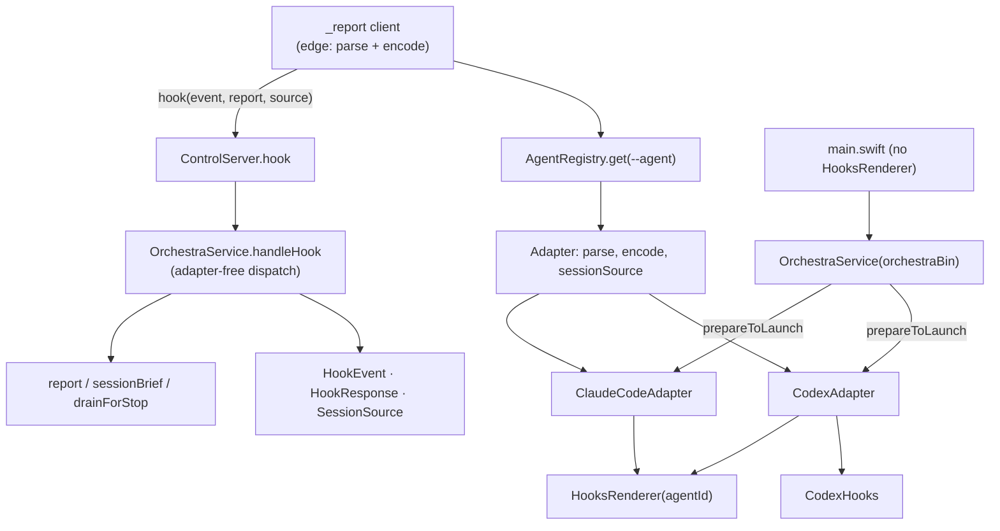
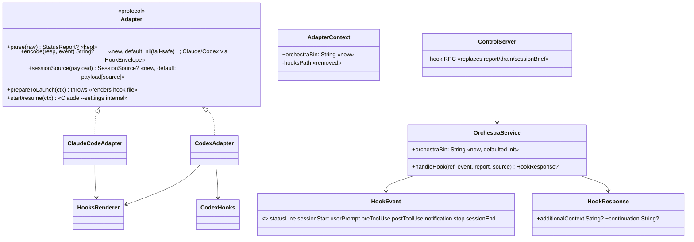

# Layer 2 — Contract: First-class agent hooks

> **Which interfaces.** The core channel types, the adapter's edge-format seam, the unified `hook`
> RPC + dispatch, and the per-file change contract. Mechanics/sequencing is Layer 3.

## Core channel types (new — `Sources/OrchestraCore/Control/HookChannel.swift`)

```swift
// The core-owned hook vocabulary. rawValue == the `--event` string baked into the rendered hook file.
public enum HookEvent: String, Sendable, Codable, CaseIterable {
    case statusLine   = "statusline"
    case sessionStart = "session"     // Claude "session" + Codex "orient" collapse here
    case userPrompt   = "prompt"
    case preToolUse   = "pretool"      // split out of the old shared "tool"
    case postToolUse  = "posttool"     // split out of the old shared "tool"
    case notification = "notification" // split out of the old shared "notify"
    case stop         = "stop"         // split out of the old shared "notify"
    case sessionEnd   = "sessionend"
}

// How a sessionStart fired — gates orientation (today: skip on `.compact`).
public enum SessionSource: String, Sendable, Codable {
    case startup, resume, clear, compact, other
}

// The agent-neutral receive payload core computes and the adapter encodes. Exactly one field is set.
public struct HookResponse: Sendable, Codable, Equatable {
    public var additionalContext: String?   // sessionStart → orientation
    public var continuation: String?         // stop → inbox-drain block reason
}

// The stdout envelopes Claude & Codex share today. A shared HELPER adapters may CALL — never an
// implicit default, so a divergent future agent can't silently inherit this shape (A1 philosophy).
public enum HookEnvelope {
    public static func additionalContext(_ s: String) -> String { /* {"hookSpecificOutput":{"hookEventName":"SessionStart","additionalContext":s}} */ }
    public static func block(_ reason: String) -> String { StopDrain.blockJSON(reason: reason) } // {"decision":"block","reason":…}
}
```

## Adapter seam delta (`Sources/OrchestraCore/Agents/Adapter.swift`)

Two facets are agent-specific and stay/land on the adapter as **format** work, both **defaulted** (the
A1 freeze covers `AgentCapabilities`, not the method set — additive defaulted growth is allowed):

| Member | Status | Signature | Default |
|--------|--------|-----------|---------|
| `parse` | **kept, unchanged** | `func parse(_ raw: RawTelemetry) -> StatusReport?` | `nil` (existing) |
| `encode` | **new** | `func encode(_ response: HookResponse, for event: HookEvent) -> String?` | **`nil`** (fail-safe — Claude/Codex implement explicitly) |
| `sessionSource` | **new** | `func sessionSource(_ payload: JSONValue) -> SessionSource?` | reads `payload["source"]` (fail-safe → `.other`) |

```swift
public extension Adapter {
    func encode(_ r: HookResponse, for event: HookEvent) -> String? { nil }   // fail-safe: no output
    func sessionSource(_ payload: JSONValue) -> SessionSource? {
        payload["source"]?.stringValue.flatMap(SessionSource.init(rawValue:)) ?? .other
    }
}

// Claude AND Codex implement encode explicitly (identical bodies today) via the shared helper — no
// implicit inheritance of Claude's envelope shape.
func encode(_ r: HookResponse, for event: HookEvent) -> String? {
    if let c = r.additionalContext { return HookEnvelope.additionalContext(c) }
    if let cont = r.continuation   { return HookEnvelope.block(cont) }
    return nil
}
```

- `encode` has a **`nil` default** (fail-safe, like `parse`). A divergent future agent that forgets to override gets *no* output, never silently-wrong Claude output.
- `SessionBrief.claudeSessionStartJSON` **moves** into `HookEnvelope.additionalContext` (it was always the shared shape; shed the Claude-ism and colocate with the encoder).
- **No** `hookArgs`, **no** `installHooks`. Claude keeps its private `settingsFlags` for `start`/`resume`.

### `AdapterContext` (same file, `:4-25`)

| Before | After |
|--------|-------|
| `let hooksPath: String = Config.hooksPath` | *(removed)* |
| — | `let orchestraBin: String` (agent-agnostic; every agent's hooks call it) |

`Config.hooksPath` stays as a Claude-adapter-internal constant.

## The `hook` RPC + dispatch

**Wire (client → daemon):** one method replaces `report` + `drain` + `sessionBrief`.

```
hook { ref: String, event: HookEvent, report: StatusReport?, source: SessionSource? }
  → { response: HookResponse? }
```

**Dispatch (core, adapter-free) — `OrchestraService.handleHook`:**

```swift
public func handleHook(_ ref: String, event: HookEvent,
                       report: StatusReport?, source: SessionSource?) async -> HookResponse? {
    guard let task = try? await resolveRef(ref) else { return nil }
    if let report { try? await self.report(task.id, report) }           // SEND — existing service.report
    switch event {
    case .sessionStart where source != .compact:                        // RECEIVE — skip on compact (byte-preserve)
        return await sessionBrief(task.id).map { HookResponse(additionalContext: $0, continuation: nil) }
    case .stop:
        return await drainForStop(task.id).map { HookResponse(additionalContext: nil, continuation: $0) }
    default:
        return nil
    }
}
```

`service.report`, `sessionBrief`, `drainForStop` are **unchanged** — `handleHook` just composes them.
No adapter is touched here; dispatch is on `HookEvent` only.

## Client contract (`Sources/orchestra/ReportHelper.swift`)

The `orient`/`session` branches, the client-side `parse` hardcode, the `emitSessionBrief` helper, and
the `hook_event_name == "Stop"` peek all **collapse** into one uniform flow:

```swift
let kind    = Flags(args).value("event") ?? "statusline"
let agentId = Flags(args).value("agent")                        // baked into the rendered hook command
let payload = (try? JSONValue.parse(readAllStdin())) ?? .object([:])

if kind == "statusline" { writeStdout(renderStatusLine(...)) }  // local display FIRST (never waits)

guard let taskId = env["ORCHESTRA_TASK_ID"], !taskId.isEmpty,
      let id = agentId, let adapter = try? registry.get(id),    // no fallback — pre-change sessions cleared
      let event = HookEvent(rawValue: kind) else { return }

let report = adapter.parse(.hooksPush(kind: kind, payload: payload))   // raw dies here (client edge)
let source = event == .sessionStart ? adapter.sessionSource(payload) : nil
let params = JSONValue(hook: taskId, event: event, report: report, source: source)  // typed on the wire

// statusline never yields a response — keep it a pure fire-and-forget send (50ms). Every other
// event awaits a possible HookResponse and encodes it.
if event == .statusLine {
    await boundedSend(sock: sock, params: params, budgetMs: 50)
} else if let resp = await boundedCall(sock: sock, method: "hook", params: params, budgetMs: 2000),
          let response = try? resp["response"]?.decode(HookResponse.self), let response,
          let out = adapter.encode(response, for: event) {
    writeStdout(Data(out.utf8))                                 // native envelope → agent
}
```

`registry` is constructed in-process (`AgentRegistry()`); `_report` already `import OrchestraCore`.

## Per-file change contract

| File | Change |
|------|--------|
| `Control/HookChannel.swift` | **New** — `HookEvent`, `SessionSource`, `HookResponse`, `HookEnvelope` (shared encoder helper) |
| `Agents/Adapter.swift` | `AdapterContext`: −`hooksPath`, +`orchestraBin`. Protocol +`encode` (default `nil`), +`sessionSource` (default `.other`) |
| `Agents/SessionBrief.swift` | **Remove** `claudeSessionStartJSON` (moved to `HookEnvelope.additionalContext`); keep `sentence` |
| `Agents/ClaudeCodeAdapter.swift` | `prepareToLaunch`: call `HooksRenderer.render(orchestraBin: ctx.orchestraBin, agentId: id)` at the **top** (before overlay merge). `:116` + `settingsFlags :159` read `Config.hooksPath`. `sessionInfo :210` drop `hooksPath`. `parse`: **signature unchanged**, kind cases updated (`pretool`/`posttool` ← `tool`; `notification`/`stop` ← `notify`). **Implements `encode`** via `HookEnvelope`; inherits `sessionSource` |
| `Agents/CodexAdapter.swift` | `prepareToLaunch`: `HooksRenderer.renderCodex(orchestraBin: ctx.orchestraBin, agentId: id)` then existing `CodexHooks.install`. **Implements `encode`** via `HookEnvelope` (identical body); inherits `sessionSource` |
| `Control/HooksRenderer.swift` | `render`/`renderCodex` gain `agentId:`; substitute `__AGENT_ID__`. Templates: `--agent __AGENT_ID__`; split Notification (`notification`) / Stop (`stop`) and Pre (`pretool`) / Post (`posttool`) tool-use; Codex SessionStart uses `session` not `orient` |
| `Resources/claude-hooks.json`, `codex-hooks.json` | Bake `--agent __AGENT_ID__`; distinct `--event` per hook; drop `orient` |
| `OrchestraService.swift` | `init` +`orchestraBin: String = siblingBinary("orchestra")` (stored). Add `handleHook`. `spawn` ctx `:272` −`hooksPath` +`orchestraBin`. `sessions` ctx `:515` −`hooksPath` +`orchestraBin` |
| `OrchestraService+Recovery.swift` | ctx `:64/:136/:223` −`hooksPath` +`orchestraBin` |
| `Control/ControlServer.swift` | Add `case "hook"` → `service.handleHook`. **Remove** `report`/`drain`/`sessionBrief` cases |
| `orchestra/ReportHelper.swift` | Rewrite to the uniform client flow above; delete `emitSessionBrief` + the orient/session/Stop special-cases |
| `orchestrad/main.swift` | Delete `orchestraBin` (`:10`) + both `HooksRenderer` blocks (`:14-19`); `onConfigChanged` (`:22-26`) → `ConfigStore.save` only |
| `SessionManager.swift` | **Unchanged** — identity rides `--agent`, not env |

## Interfaces unchanged

`parse` signature + the daemon `fileTail` path (Codex) · `HooksRenderer` bin-substitution + write logic ·
`CodexHooks` (install/sentinel) · `SessionBrief.sentence` + `StopDrain.compose`/`blockJSON` content ·
`service.report`/`sessionBrief`/`drainForStop` · `AgentCapabilities` · `Task` model.

## Diagrams

### Bird's-eye (module dependency)



### Detailed (class-level)



## Decisions made

| Decision | Why | Rejected |
|----------|-----|----------|
| `HookEvent.rawValue` == the `--event` string | One vocabulary shared by the template, the client, and the daemon — no drift | Separate template strings + a mapping table |
| `encode` defaults to **`nil`** (fail-safe); Claude/Codex implement it explicitly via `HookEnvelope` | A divergent future agent that forgets can't silently emit Claude's shape — matches the A1 "no silent inheritance" rule (`parse` defaults `nil` for the same reason) | A shared Claude-shaped default — fails *unsafe* for a third agent |
| `sessionSource` **defaulted, shared** (fail-safe → `.other`) | Missing field just means "always orient" (benign); both agents share the `source` shape | Require each adapter to implement — no upside |
| Keep `parse` as-is (raw → `StatusReport`) | It already is the send-direction normalizer; only its *caller* moves (client-side, generic) | Rename/merge into a new `normalize` — churns the `fileTail` path + tests for no gain |
| `handleHook` is adapter-free; composes existing service methods | Core owns dispatch on `HookEvent`; content already lives in `report`/`sessionBrief`/`drainForStop` | Re-implement content in `handleHook` |
| One `hook` RPC replaces three | The channel is one concept; the client flow is uniform | Keep three RPCs — leaves the channel scattered |
| `source` normalized at the edge into `SessionSource` | Preserves "skip orientation on compact" without core reading raw `payload["source"]` | Send raw `source` string / drop the compact skip (behaviour change) |
| `orchestraBin` in `AdapterContext`, render in `prepareToLaunch` | Agent-agnostic; the only reason for a separate `installHooks` was passing the bin, now in ctx | `installHooks(orchestraBin:)` method + core ordering rule |

## Open questions — need your call

- [x] `HookEvent` case set confirmed — `toolUse` **split** into `preToolUse` (`pretool`) / `postToolUse` (`posttool`); `parse` maps both to the same "running" `StatusReport` today.
- [x] `encode` — **`nil` fail-safe default**, Claude/Codex explicit via `HookEnvelope`; `sessionSource` — shared default. Confirmed.

## Traceability — every Layer 1 goal has a contract

| L1 goal | L2 contract |
|---------|-------------|
| Channel modeled in core | `HookEvent` + `HookResponse` + `handleHook` |
| Adapter owns format at the edge | `parse` (kept) + `encode` + `sessionSource`, all client-side |
| Raw never crosses the wire | `hook` RPC carries `HookEvent`/`StatusReport`/`SessionSource`; `parse`/`sessionSource` run in the client |
| Identity via `--agent` | `HooksRenderer` bakes `--agent __AGENT_ID__`; client `registry.get(agentId)` |
| Unify report/drain/sessionBrief | `case "hook"`; three cases removed; service methods reused |
| `orient`→`sessionStart`; split `notify` | `HookEvent` + template `--event` split |
| Fold install; drop `hookArgs`/`hooksPath` | `prepareToLaunch` renders; `AdapterContext.orchestraBin`; no new argv member |
| Daemon renders nothing | `main.swift` deletions; `onConfigChanged` save-only |
| Zero user-facing change | Non-touch list; `handleHook` byte-preserves report/orientation/drain incl. compact-skip |
| A1 freeze holds | No caps; additive defaulted `encode`/`sessionSource` |
