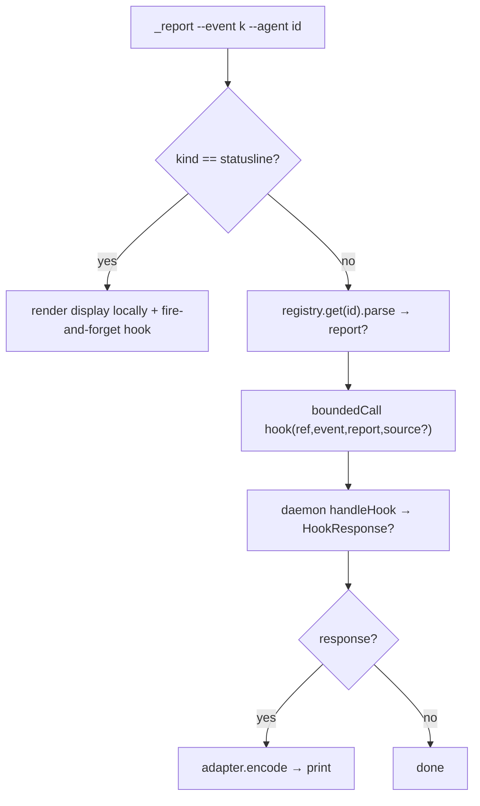
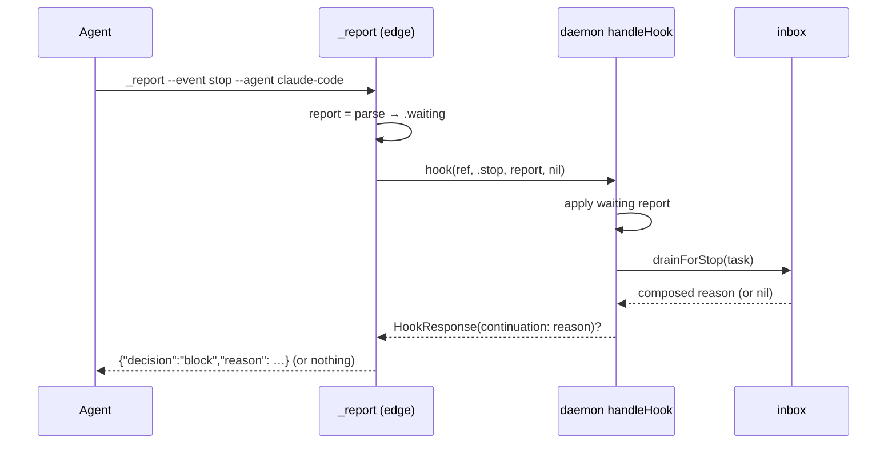

# Layer 3 — Implementation: First-class agent hooks

> The **how**. Written with [[04-tests]] and reviewed at one combined gate.

## Implementation approach (per component)

### 1. Core channel types — `Control/HookChannel.swift` (new)

`HookEvent` (String enum, `--event` raw values), `SessionSource`, `HookResponse`, and `HookEnvelope`
(the shared encoder helper) exactly as [[02-contract]]. Pure value types; `HookEnvelope.block` delegates
to `StopDrain.blockJSON`. Compiles standalone.

### 2. Envelope move + adapter seam

- **Move** `SessionBrief.claudeSessionStartJSON(_:)` into `HookEnvelope.additionalContext(_:)` (body unchanged — it was always the shared shape). `SessionBrief` keeps only `sentence`.
- Add to the `public extension Adapter` (`Adapter.swift:60`): `encode` **default `nil`** (fail-safe) and `sessionSource` default (`payload["source"]` → `.other`).
- **Claude and Codex each implement `encode` explicitly** (identical bodies) via `HookEnvelope` — no implicit inheritance of the envelope. Both inherit the `sessionSource` default.

### 3. `AdapterContext` swap + render fold (the compile-coupled block)

Removing `hooksPath` breaks every constructor, so this lands atomically:

- `AdapterContext`: delete `hooksPath` (field + init param); add `let orchestraBin: String`.
- 6 construction sites drop `hooksPath:`; the 3 **launch** sites (`OrchestraService.spawn:272`, `Recovery.resume:64`, `Recovery.restart:136`) add `orchestraBin: orchestraBin`; the 3 **query** sites (`OrchestraService.sessions:515`, `Recovery.isResumable:223`, and `ClaudeCodeAdapter.sessionInfo:210`'s sub-ctx) pass a value too (query ctxs never launch, but the field is non-optional — pass `orchestraBin` where the service has it, or `Config` fallback in the adapter sub-ctx).
- `ClaudeCodeAdapter.prepareToLaunch`: **first line** `try? HooksRenderer.render(orchestraBin: ctx.orchestraBin, agentId: id)` (before the overlay merge, which reads the base). The two `ctx.hooksPath` reads (`:116`, `:159`) → `Config.hooksPath`.
- `ClaudeCodeAdapter.parse`: update its `kind` switch to the new `--event` vocabulary — `tool`→`pretool`/`posttool`, `notify`→`notification`/`stop` (both new pairs map to the same `StatusReport` the old shared kind produced). Signature unchanged; the `RawTelemetry`/`fileTail` path is untouched.
- `CodexAdapter.prepareToLaunch`: before the existing `CodexHooks.install`, add `try? HooksRenderer.renderCodex(orchestraBin: ctx.orchestraBin, agentId: id)`.
- `HooksRenderer.render`/`renderCodex`: add `agentId:`; substitute `__AGENT_ID__` alongside `__ORCHESTRA_BIN__`.
- Templates (`Resources/claude-hooks.json`, `codex-hooks.json`): add `--agent __AGENT_ID__` to every command; give Notification/Stop and Pre/PostToolUse **distinct** `--event` values (`notification`/`stop`, `pretool`/`posttool`); Codex SessionStart → `--event session` (drop `orient`).

### 4. `OrchestraService` — `orchestraBin` + `handleHook`

- `init`: add `orchestraBin: String = siblingBinary("orchestra")`; store `let orchestraBin`. (`siblingBinary` is process-relative → correct inside `orchestrad`; injectable for tests.)
- Add `handleHook(_:event:report:source:)` per [[02-contract]] — composes existing `report` / `sessionBrief` / `drainForStop`. Adapter-free.

### 5. `ControlServer` — unify the RPC

- Add `case "hook"`: decode `{ref, event, report?, source?}` → `service.handleHook` → `{response: HookResponse?}`.
- **Remove** `case "report"`, `case "drain"`, `case "sessionBrief"`.

### 6. `ReportHelper` — thin edge client

Rewrite `run` to the uniform flow ([[02-contract]]): resolve adapter by `--agent`; `parse` payload;
statusline renders locally + sends fire-and-forget; every other event `boundedCall`s `hook` and
`encode`s any response. Delete `emitSessionBrief` and the orient/session/Stop special-cases.

### 7. `orchestrad/main.swift`

Delete `let orchestraBin` (`:10`) and both startup `HooksRenderer` blocks (`:14-19`); `onConfigChanged`
(`:22-26`) keeps only `try? ConfigStore.save(cfg)`.

## Edge cases & error handling

Everything is best-effort — a hook must never fail the agent (the process always exits 0).

- **Unknown / missing `--agent`** → `registry.get` throws → client returns (no report, no crash). Pre-change sessions are cleared, so this is the genuine "shouldn't happen" path.
- **`sessionStart` + `source == .compact`** → `handleHook` returns nil → no orientation re-injected (byte-preserves today's skip).
- **Codex `sessionStart`** → `parse` returns nil (Codex telemetry is `fileTail`) → no report, but `handleHook` still returns orientation → Codex's `encode` (its explicit `HookEnvelope` impl) emits the `additionalContext` envelope. Preserves Codex orient.
- **`stop`** → `parse` yields the `waiting` report (applied) **and** `handleHook` drains → `continuation` → client `encode`s the `decision:block`. Preserves the F3 drain + the waiting report.
- **Empty `HookResponse`** (blank brief / empty inbox) → `encode` returns nil → nothing printed (preserves "no injection when nothing to say").
- **`boundedCall` timeout** → no response printed; statusline display already rendered. Graceful.
- **statusline** → fire-and-forget send (it never yields a response), keeping the 50 ms path a pure send.

## Sequencing / build order

1. `HookChannel.swift` (core types) — isolated, compiles alone.
2. `SessionBrief` rename + adapter `encode`/`sessionSource` defaults.
3. **Atomic block:** `AdapterContext` swap + all 8 ctx sites + adapters' `prepareToLaunch` render + `HooksRenderer` `agentId` + templates. (Compiler-guided; lands together.)
4. `OrchestraService.orchestraBin` + `handleHook`.
5. `ControlServer`: add `hook`, remove the three.
6. `ReportHelper` rewrite.
7. `main.swift` deletions.
8. Tests ([[04-tests]]) — update in lockstep with 3–7.
9. Docs sync (DoD) — `docs/` chapters 02/04/06/09 + backfill the Codex-hooks/channel seam in this SSOT.

## Diagrams

### Bird's-eye



### Detailed (sequence — sessionStart, both directions)

```mermaid
sequenceDiagram
    participant Ag as Agent
    participant Cl as _report (edge)
    participant Rg as AgentRegistry
    participant Dm as daemon handleHook
    participant St as store/inbox
    Ag->>Cl: _report --event session --agent claude-code (+payload)
    Cl->>Rg: get("claude-code")
    Rg-->>Cl: adapter
    Cl->>Cl: report = adapter.parse(payload); source = adapter.sessionSource(payload)
    Cl->>Dm: hook(ref, .sessionStart, report, source)
    Dm->>St: apply report (waiting/clear)
    Dm->>St: sessionBrief(task) [if source != .compact]
    St-->>Dm: orientation string
    Dm-->>Cl: HookResponse(additionalContext: orientation)
    Cl->>Cl: adapter.encode(resp, .sessionStart)
    Cl-->>Ag: {"hookSpecificOutput":{"additionalContext": …}}
```

### Detailed (sequence — stop / drain)



## Traceability → Layer 2 contracts

| L2 contract | Implemented by |
|-------------|----------------|
| `HookEvent`/`HookResponse`/`SessionSource` | Step 1 (`HookChannel.swift`) |
| `encode` (explicit via `HookEnvelope`) + `sessionSource` default | Step 2 (`Adapter` extension + `HookEnvelope` move) |
| `AdapterContext.orchestraBin` (−`hooksPath`) | Step 3 (atomic block) |
| `prepareToLaunch` renders the file | Step 3 (both adapters) |
| `HooksRenderer(agentId:)` + template `--agent`/event splits | Step 3 |
| `handleHook` (adapter-free dispatch) | Step 4 |
| `hook` RPC replaces three | Step 5 (`ControlServer`) |
| Thin edge client | Step 6 (`ReportHelper`) |
| Daemon renders nothing | Step 7 (`main.swift`) |

## Concerns / decisions for review

- The atomic block (step 3) is the one large compile-coupled change; everything else is localized. Reviewer should focus there.
- `statusline` stays fire-and-forget (send, not call) to keep the 50 ms path a pure send — the one place the uniform "call `hook`" flow bends.
- Codex `renderCodex` now bakes `--event session`; confirm Codex 0.135+ accepts the `session` matcher name we choose (the SessionStart matcher `startup|resume` is unchanged; only the `_report` arg changes).

## Open questions — resolved / verify-at-implementation

- [x] `encode` default → **`nil`** (fail-safe); Claude/Codex implement via `HookEnvelope`. Client tests → isolated-daemon smoke only.
- [ ] *(verify at impl)* Query-ctx `orchestraBin`: the adapter's internal `sessionInfo` sub-ctx has no service in scope → default it to `siblingBinary("orchestra")` (it never launches).
- [ ] *(verify at impl)* Codex's SessionStart hook payload: if it carries no `source` field, `sessionSource → .other` (Codex always orients, never compact-skips — benign).
