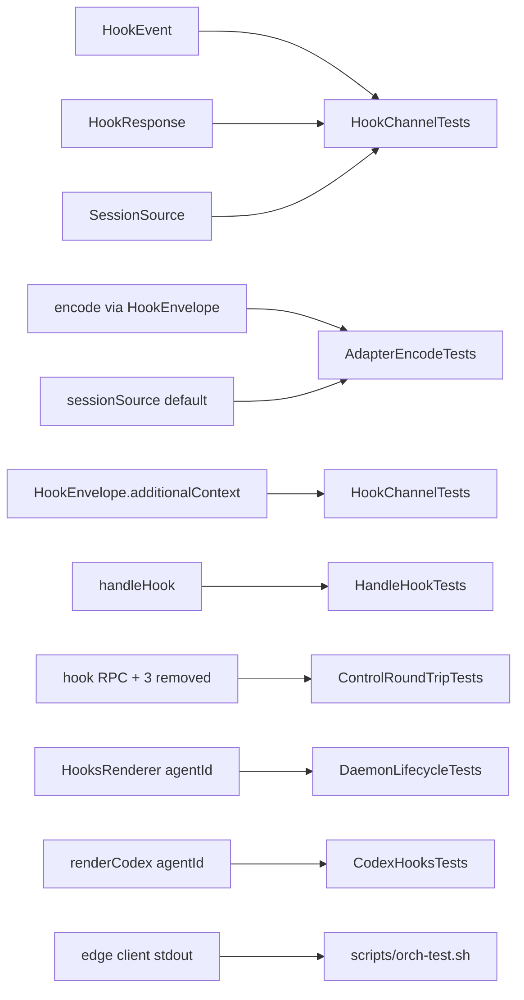

# Layer 4 — Test Design: First-class agent hooks

> Written with [[03-implementation]], one combined gate. Completed before any code.

## Test strategy & philosophy

This is a **behaviour-preserving refactor**, so the dominant test question is *"does the same
orientation / telemetry / drain still come out?"* — not new behaviour. Three levels:

| Level | Confidence target |
|-------|-------------------|
| **Unit** (Swift Testing, in-process) | New core types + the two adapter defaults + `handleHook` compose correctly and byte-preserve today's outputs |
| **Round-trip** (control socket, in-process) | The `hook` RPC drives both directions end-to-end; the three retired RPCs are gone |
| **Integration** (isolated daemon, `scripts/orch-test.sh`) | A real `_report --event … --agent …` against a disposable daemon yields the right stdout + store state |

Deliberately **not** tested: `HooksRenderer`'s byte layout beyond the substitutions we changed;
Codex `fileTail` telemetry (untouched); the `SessionBrief.sentence`/`StopDrain.compose` *content*
(unchanged — existing tests already cover it).

## Framework / tooling

Swift Testing (`@Test`/`#expect`), matching the existing `Tests/OrchestraCoreTests/`. Run:
`swift test --filter <Suite>` for isolation; the resume/recovery suites **flake under full-suite
parallel load** — run those with `--filter` (noted in [[01-design]] risks). Integration via
`scripts/orch-test.sh` (disposable HOME + tmux socket, per the Orchestra isolated-testing memory).

## Unit tests (per contract)

| L2 contract | Test cases | Home (new/existing) |
|-------------|-----------|---------------------|
| `HookEvent` | rawValue round-trips for all 8; `"session"`→`.sessionStart`; `"pretool"`/`"posttool"` distinct; unknown→nil | `HookChannelTests` (new) |
| `SessionSource` | `"compact"`→`.compact`, `"startup"`→`.startup`, missing→`.other` | `HookChannelTests` |
| `HookResponse` | Codable round-trip; exactly-one-field shape | `HookChannelTests` |
| `encode` (Claude/Codex, via `HookEnvelope`) | `additionalContext` → `hookSpecificOutput.additionalContext` JSON == today; `continuation` → `{"decision":"block","reason":…}`; both nil → nil; **`StubAdapter` inherits the `nil` default → no output** (proves fail-safe, no silent Claude shape) | `AdapterEncodeTests` (new) |
| `sessionSource` default | reads `payload["source"]`; maps compact/startup; missing → `.other` | `AdapterEncodeTests` |
| `HookEnvelope.additionalContext` (moved from `SessionBrief`) | same JSON as the old `claudeSessionStartJSON`; newline/quote/tag escaping survives | `HookChannelTests` (moved `envelope`/`envelopeEscaping`) |
| `handleHook` | `.sessionStart` → `HookResponse.additionalContext == sessionBrief`; `.sessionStart`+`.compact` → nil; `.stop` → `continuation == drained`; telemetry event → `report` applied to store, response nil; unknown ref → nil | `HandleHookTests` (new) |
| `AdapterContext.orchestraBin` | ctx builds without `hooksPath`; `orchestraBin` threaded | compile-level + `AdapterContextTests` if present |
| `HooksRenderer(agentId:)` | `--agent claude-code` baked; `__AGENT_ID__`/`__ORCHESTRA_BIN__` fully substituted; distinct `--event stop`/`notification`/`pretool`/`posttool`; valid JSON | `DaemonLifecycleTests.hooksRender` (update) |
| `renderCodex(agentId:)` | bakes `--agent codex` + `--event session` (not `orient`); `startup|resume` matcher intact; `CodexHooks.install` no-clobber unchanged | `CodexHooksTests` (update) |

## Integration / end-to-end tests

- **Round-trip (`ControlRoundTripTests`, update):**
  - `hook(.sessionStart)` over the socket returns `response.additionalContext` == the card's live brief; reflects a `move` (live column).
  - `hook(.sessionStart, source:.compact)` returns null response.
  - `hook(.stop)` with a queued inbox returns `continuation`; empty inbox → null.
  - `hook(.postToolUse, report:)` applies the report to the store (status/ctx%).
  - The retired methods (`report`/`drain`/`sessionBrief`) return **method-not-found** (assert the surface shrank).
- **Isolated daemon smoke (`scripts/orch-test.sh`):**
  - Spawn a card; run `orchestra _report --event session --agent claude-code` with a stub SessionStart payload → assert stdout is the `additionalContext` envelope carrying the column/access/id.
  - Queue an inbox message; run `_report --event stop --agent claude-code` → assert `decision:block` stdout + the card returns to `waiting`.
  - Run `_report --event statusline …` → assert the display line prints **without** a daemon (local render) and doesn't hang.

## Edge & error cases

- Unknown `--agent` → `_report` exits 0, prints nothing, sends nothing (no crash).
- `--agent` present but daemon down → `boundedCall` times out; statusline still printed; exit 0.
- Codex `.sessionStart` → no report (parse nil), orientation still encoded via Codex's explicit `encode`.
- `HookEvent(rawValue:)` on a stale/unknown kind → client bails (guards the vocabulary).

## Fixtures / mocks / test data

- Stub hook payloads: SessionStart (`source` variants), Stop (`hook_event_name`), PostToolUse, statusline — small `JSONValue` literals (reuse `SessionBriefTests`/`ReportTests` fixtures).
- `StubAdapter` (`Tests/OrchestraCoreTests/Stubs.swift`) already implements `capabilities`; it inherits the new defaults — `encode` → `nil` (fail-safe) and `sessionSource` → `.other`. Assert both in one test (proves the seam degrades safely, no inherited Claude envelope).
- Isolated daemon fixture from `scripts/orch-test.sh`.

## Coverage map

## Traceability → L2 contracts + L3 components

| Contract / component | Covering tests |
|----------------------|----------------|
| `HookEvent`/`HookResponse`/`SessionSource` | `HookChannelTests` |
| `encode` (Claude/Codex via `HookEnvelope`) + `sessionSource` default (+ Stub inheritance) | `AdapterEncodeTests` |
| `HookEnvelope.additionalContext` (moved from `SessionBrief`) | `HookChannelTests` |
| `handleHook` dispatch (both directions, compact-skip) | `HandleHookTests` + `ControlRoundTripTests` |
| `hook` RPC replaces three | `ControlRoundTripTests` |
| `prepareToLaunch` render + `--agent` | `DaemonLifecycleTests`, `CodexHooksTests` |
| Thin edge client stdout/store | `scripts/orch-test.sh` |
| `main.swift` renders nothing | covered indirectly (spawn still orients via `prepareToLaunch`) in `orch-test.sh` |

## Decisions made

| Decision | Why | Rejected |
|----------|-----|----------|
| Lean on round-trip + isolated-daemon for the client rewrite | `ReportHelper` is a CLI entry — its pure pieces unit-test, its wiring proves out end-to-end | Mocking stdin/stdout inside a unit test — brittle |
| Assert the three RPCs are **removed** (method-not-found) | Guards against leaving dead surface | Only testing the new `hook` path |
| Reuse existing content fixtures/tests | `SessionBrief.sentence`/`StopDrain.compose` are unchanged — retest only the envelope/call-site | Rewriting content tests |

## Open questions — need your call

- [ ] Is the `scripts/orch-test.sh` smoke enough for the client rewrite, or add a dedicated `ReportHelperTests` that drives `run([...])` against a stub socket? (Leaning: extend `orch-test.sh`; add `ReportHelperTests` only if the smoke proves flaky.)
