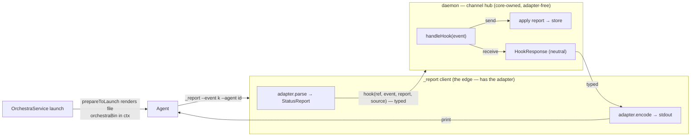

# First-class agent hooks — Design Index

> Make hook wiring an **Adapter** concern instead of a Claude-ism scattered across
> core, daemon, and adapters. Core speaks a small seam; each adapter renders and points at
> whatever hook system it uses. Aligns with the [[agent-provider-interface]] "degrade on
> capability, never on identity" rule.

## Layers

| Layer | Document | Status |
|-------|----------|--------|
| 1 — Initial design | [[01-design]] | approved (final: edge-convert channel) |
| 2 — Contract | [[02-contract]] | approved |
| 3 — Implementation | [[03-implementation]] | approved |
| 3 — Tests | [[04-tests]] | approved |

**Plan complete (2026-07-03).** All layers approved; cross-layer sweep done. Implementation is a
separate follow-up card (this session was plan-only, per the original ask).

<!-- Status values: not started · draft · in-review · approved · skipped -->

## Current picture

## Design pivot (2026-07-03)

Original scope was a 4-leak plumbing tidy (two defaulted `Adapter` members). Through the L2 gate the
scope was **deliberately widened** to the **full bidirectional hook channel**, then refined to its
cleanest form: **convert at the edge, dispatch in core.**

- Core owns the channel: `HookEvent` vocabulary + `HookResponse` + one adapter-free `handleHook` dispatch, reached by a single `hook` RPC (replaces `report`/`drain`/`sessionBrief`).
- Adapter owns format at the **edge** (in the `_report` client): `parse` in, `encode` out, `sessionSource` extract, plus rendering its file. Raw never crosses the wire.
- Identity rides a baked `--agent <id>` → `registry.get` (pre-change sessions will be cleared → no env var, no fallback). This dissolves leak #4.
- `hookArgs` dropped; install folded into `prepareToLaunch`; `hooksPath` → agent-agnostic `orchestraBin`.

## Open questions (rolled up) — all resolved

- [x] `HookEvent` set — `toolUse` **split** into `preToolUse`/`postToolUse`.
- [x] `encode` — **`nil` fail-safe default**; Claude/Codex implement via `HookEnvelope` (not a shared Claude-shaped default). `sessionSource` — shared default (fail-safe `.other`).
- [x] Client tests — isolated-daemon smoke only.
- [ ] *(verify at implementation, not blocking)* query-ctx `orchestraBin` default; Codex SessionStart `source` field presence — see [[03-implementation]].
