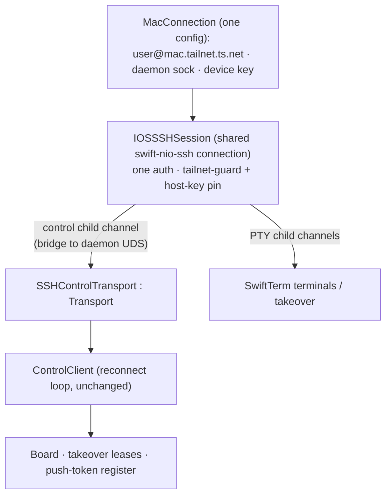

# iOS on a real phone — one setup, everything works

> Make the Orchestra iOS app usable on a **physical iPhone** against a Mac, with a **single first-launch
> setup** (one tailnet target) that lights up **every** feature — board, terminals, takeover, push — and
> a **re-setup** entry in Settings. No feature should require a second, separate setting.
>
> Realizes the [[phone-client/01-design|phone-client]] plan (SSH-forwarded UDS over Tailscale, no daemon
> change) for a real device. The `Transport` seam that plan depended on **now exists**
> (`OrchestraKit/Control/Transport.swift`); this design adds the iOS SSH transport, unifies config, and
> builds the onboarding.

## 1. Why the app doesn't run on a phone today

The board's control channel opens a **local UNIX socket** and never crosses the network:

```swift
// BoardModel.activate (iOS)
let sockPath = ConnectionSocketResolver.socketPath(for: conn)   // a LOCAL filesystem path
client = ControlClient(socketPath: sockPath, ...)
```

- **Simulator** works by *cheating*: it shares the Mac's filesystem, so `ORCH_DEV_SOCKET` points at the
  Mac's real `orchestrad.sock`.
- **Device** shares nothing with the Mac. `ConnectionSocketResolver` for a local connection falls back to
  `Config.socketPath`, which on iOS resolves *inside the app sandbox* → points at nothing. The comment says
  it outright: *"a real device needs T1's SSH-forwarded socket"* — **and that transport is not built.**

Consequences on a real phone right now: **board = Disconnected** (stale snapshot only); **terminal/takeover**
= unreachable because you reach it *through* the board; **push** = only the DEBUG local simulation exists.

## 2. The reference pattern already exists (desktop)

The macOS app already solves the identical problem for a remote Linux daemon, and it's the model to mirror:

- `SSHMaster` spawns **one** multiplexed `ssh -M` master that (a) **StreamLocal-forwards** the remote
  daemon UDS to a **local** UDS (`-L local.sock:remote.sock`) and (b) hosts a control socket that terminals
  ride — **one auth, one target, everything multiplexed** (`RemoteCommands.sshMasterArgs`).
- `ControlClient` then just opens that local socket via `UDSTransport`. `ConnectionController` owns the
  master and also exposes `remoteTerminalRoute` so terminals reuse the same master.

The phone can't fork `/usr/bin/ssh` (no `Process`, no OpenSSH on iOS). It must reproduce this with
**swift-nio-ssh** — which the app already vendors for the terminal PTY (`SSHPTYChannel`).

The two seams that make this cheap already exist:

- **`Transport` protocol** — `open()/write()/readLine()/close()`. Its own doc: *"a future WebSocket/tailnet
  transport plugs in here without touching `ControlClient`."* `ControlClient` takes a `@Sendable () ->
  Transport` factory and already has the **reconnect + resubscribe** loop.
- **swift-nio-ssh `directTCPIP`** child channels are first-class (`SSHMessages.swift`), alongside the
  session/PTY channels `SSHPTYChannel` already uses.

## 3. Target architecture

One shared, authenticated SSH connection to the Mac — the phone's `SSHMaster` equivalent — vends both the
control transport and terminal channels:



**One `MacConnection` config → one SSH session → all features.** The tailnet guard + host-key pin move to
**session establishment** (enforced once), instead of only at terminal-attach.

### 3a. Reaching the daemon UDS over SSH — the one real decision **[RESOLVED → A]**

**Verified against the vendored checkout:** swift-nio-ssh's `SSHChannelType` is a *closed* enum —
`.session`, `.directTCPIP`, `.forwardedTCPIP` only. There is **no `direct-streamlocal`** and no way to open
an arbitrary channel type; Option B is therefore **a nio-ssh fork**, not a light upgrade. That reshapes the
menu and settles the decision on the exec-bridge:

| Option | How | Verdict |
|---|---|---|
| **A. exec-bridge** ✅ **CHOSEN** | A `.session` channel execs `/usr/bin/nc -U <daemonSock>` (always present on macOS; **`socat` fallback**). Channel stdio = the NDJSON control stream. | **No daemon change, no nio-ssh fork.** Reuses the exec-session path `SSHPTYChannel` already drives. Ship in P1. |
| B. direct-streamlocal | Fork nio-ssh to add a custom `direct-streamlocal@openssh.com` child channel. | Most native, but a **forked transport dependency** to maintain. Not justified for v1; if `nc` ever proves flaky, prefer the daemon-side change (C) over a fork. |
| C. directTCPIP + daemon TCP | Daemon also binds `127.0.0.1:<port>`; phone forwards via first-class `directTCPIP`. | Needs a **daemon change** (new listener) — conflicts with "UDS-only daemon, no new surface". |

**Decision: A (exec-bridge, `nc -U` primary + `socat` fallback).** `SSHControlTransport.readLine()` gets a
small NDJSON line-buffer over inbound `SSHChannelData` (mirrors `UDSTransport`'s `LineReader`-over-fd; here we
buffer channel bytes). `write()` sends one newline-terminated frame; `open()/close()` bracket the channel.
No `ControlClient` change — only the iOS `BoardModel.activate` call site swaps to the `transport:` factory init.

## 4. Unified configuration (kills the second setting)

Collapse everything onto **one** `Connection` describing "my Mac over Tailscale":

- `sshTarget` = `user@mac.tailnet.ts.net` (or `100.64/10` IP) — tailnet-validated (reuse
  `SSHEndpoint.settingsRejectionReason`, shipped in the takeover fix).
- `remoteSocketPath` = the Mac daemon sock, **defaulted** to `~/Library/Application Support/Orchestra/orchestrad.sock`
  (user rarely edits).
- `identityFile` = the app's per-device key (already in `SSHKeyStore`, Keychain-backed) — implicit.

Then **derive, don't duplicate**:

- **`SSHEndpoint.resolve()`** returns the *active connection's* `sshTarget` (env override only for
  Simulator/dev). → **Remove the standalone `orch_ssh_target` setting** added in the takeover fix; fold it
  into the connection. *(This is the "don't make me set two things" requirement, made structural.)*
- **`ConnectionSocketResolver` / `BoardModel.activate` (iOS)** build an `SSHControlTransport` from the same
  connection instead of a bare local path.
- **Terminals** (`IOSTerminalHost`/`SSHPTYChannel`) take child channels from the shared session instead of
  dialing their own connection.
- **Push registration** (`PushCoordinator`) already flows the device token over `ControlClient` → works for
  free once the control channel is live.

## 5. Onboarding UX

**First launch** (gated on "no configured connection") — one screen, a guided checklist that ends green:

1. **Prerequisites** (with live checks where possible): Tailscale installed + logged in on **both** phone
   and Mac; **Remote Login** enabled on the Mac (System Settings → General → Sharing).
2. **Authorize this device**: show the device's SSH public key (`SSHKeyStore.authorizedKeyLine()`) with a
   **Copy** button and the exact one-liner to paste on the Mac:
   `echo '<key>' >> ~/.ssh/authorized_keys`.
3. **Enter the Mac's tailnet target**: `user@my-mac.tailnet.ts.net` — inline tailnet validation.
4. **Test connection**: establishes the SSH session + calls the `version` RPC → ✅ / actionable error
   (reuses the exact tailnet rejection reason on a bad host).
5. **Done** → persist the single `MacConnection`, mark onboarding complete, land on the board.

**Re-setup**: Settings → **"Mac connection"** row reopens the same flow (edit host/user, re-show/rotate the
key, re-test). This **replaces** the standalone SSH-target section from the takeover fix and folds the
existing Connection editor into one coherent surface — exactly one place to configure the Mac.

## 6. Change list (by component)

**New**
- `App-iOS/Terminal/IOSSSHSession.swift` — shared authenticated swift-nio-ssh connection (the phone's
  `SSHMaster`): connect (tailnet guard + host-key pin), vend control + PTY child channels, reconnect on
  foreground / tailnet change, tear down on background.
- `App-iOS/Terminal/SSHControlTransport.swift` — `Transport` conformer over an exec-bridge child channel
  (NDJSON line buffer). *(No `ControlClient` change.)*
- `App-iOS/Views/Onboarding/*` — the first-launch setup flow + "Mac connection" settings entry.

**Modified**
- `BoardModel.activate` (iOS `#if`) — build `ControlClient(transport:)` from `IOSSSHSession`, not a local path.
- `SSHEndpoint.resolve` — return the active connection's target; **remove `orch_ssh_target`** standalone key
  and the `TerminalTargetSettingsSection` (from the takeover fix), keeping the env fallback for Simulator.
- `IOSTerminalHost` / `SSHPTYChannel` — take child channels from `IOSSSHSession` (drop per-terminal connect).
- `ConnectionSocketResolver` — remote/iOS path returns/implies the SSH transport, not a filesystem path.
- Tailnet guard + `SSHHostKeyPinStore` — enforced at **session** establishment (covers control + terminals).
- App entry (`OrchestraApp`) — present onboarding when unconfigured.

**Unchanged (do not touch)**: `orchestrad` (stays UDS-only), the takeover lease/heartbeat path, the
`Transport`/`ControlClient` protocols, `TmuxAttach` recipe.

## 7. Non-code / operational + push (required for "on my phone")

> **Decision (2026-07-06): no paid Apple Developer membership.** The owner installs on a physical
> device with a **free Apple ID (Personal Team)**. Consequence: **real APNs push is out of scope** —
> free tier can't mint a `.p8` or enable the Push capability. Needs-you alerts are covered by the
> **Claude and Codex mobile apps' own notifications**, so Orchestra's own push is deprioritized. The
> P4 push plumbing below is retained as **optional / paid-only**, unblocked only if a membership is
> bought later. Board + terminals + takeover (P1–P3) do **not** need it.

### Device build lane — the free path (part of P1–P3, not P4)

To install P1–P3 on a real iPhone, add a **free-personal-team device build variant**:

| Item | Free variant (default) | Paid signed lane (optional) |
|------|------------------------|------------------------------|
| Signing | Personal Team, automatic | Apple Developer team + provisioning profile |
| Entitlements | **strip `aps-environment`**; keep `keychain-access-groups` | add `aps-environment` back for push |
| `aps-environment` present | ❌ removed — else **free signing fails** | ✅ `development`/`production` |
| Profile lifetime | **7 days** — re-deploy from Xcode weekly; no TestFlight | 1 year; TestFlight/App Store |
| Distribution | Xcode → device (cable/Wi-Fi) | TestFlight / App Store |

**Concrete change (done):** `App-iOS/OrchestraiOS.entitlements` hardcodes `aps-environment`. A **no-push
variant** now exists — `App-iOS/OrchestraiOS-nopush.entitlements` (keychain only). For a free-account
device build, sign with your personal team + `CODE_SIGN_ENTITLEMENTS=App-iOS/OrchestraiOS-nopush.entitlements`
(a device build lane wiring this is P4/owner-supplied — needs your team id). The Simulator lane
(`CODE_SIGNING_ALLOWED=NO`, aps-environment ignored) and the paid lane stay intact. Background mode
`remote-notification` is a plist declaration (no paid entitlement) — harmless to keep.

### Push provisioning — OPTIONAL (paid-only, deferred)

> Only relevant **if a paid membership is later obtained.** Retained so the work is scoped, not lost.
> The **send + receive halves are already proven**; what's missing is the transport (P1) and this
> provisioning path. "Drop in a `.p8`" is *not* enough — there's a real code gap. Broken into three parts:

| # | Gap | Fix / requirement |
|---|-----|-------------------|
| 1 | **Code gap** — no path gets `ORCH_APNS_*` into the launchd daemon | `orchestrad` reads creds via `APNsConfig.from(env:)` (`ORCH_APNS_KEY_PATH/_KEY_ID/_TEAM_ID/_TOPIC`), but the LaunchAgent plist (`Sources/OrchestraCore/Resources/com.orchestra.daemon.plist`) has **no `EnvironmentVariables`**, `DaemonLifecycle.install()` injects none, and a GUI LaunchAgent doesn't inherit shell env. **Fix (~30 lines):** `install()` + plist template inject an `EnvironmentVariables` block from the stored key path, plus **drop-point logging** (DisabledPushSender used / 0 devices / send OK\|err). Without this, a valid `.p8` on disk still yields silent no-delivery. |
| 2 | **Env-match gotcha** | `aps-environment` must match `ORCH_APNS_ENV`: dev-signed → sandbox token → daemon `ORCH_APNS_ENV=sandbox` (default); TestFlight/App Store → `production`. Mismatch → APNs `BadDeviceToken` → daemon drops the token → silent no-delivery. |
| 3 | **Hard prereqs (owner-supplied)** | Paid Apple Developer membership ($99/yr) — free tier can't create a `.p8` or enable Push. Push capability enabled on the `com.orchestra.ios` App ID. **Sending daemon must be macOS** (ES256/CryptoKit; a Linux daemon returns `.unsupportedPlatform`). |

**Already proven — do NOT re-verify in P4:**
- Daemon send-decision: 15/15 `PushNotifierTests` — running→waiting fans out exactly one push to the
  registered token with correct trigger+sound; `.off` dropped; 410/400 dead-token → unregister; ES256
  JWT sign+cache.
- iOS receive + foreground gate + backgrounded delivery: proven via `xcrun simctl push` — `died(.always)`
  fg → banner; `needsYou(.background)` fg → suppressed; `needsYou` backgrounded → banner. Bodies match
  `APNsPayload.body(for:)` verbatim.
- Registration/deep-link is correct; the token registers **over the control channel** — which is exactly
  why **P1 (this transport) is the hard prerequisite**: no token crosses the network on a device today.

> **Scoping note on the "no daemon change" non-goal:** it holds for the *transport* (P1–P2 add no
> daemon listener/RPC). P4's push plumbing (part 1) is a deliberate, ~30-line **exception** — env
> injection + logging in `DaemonLifecycle.install()`/the plist, not a new network surface.

## 8. Verification

- **Unit**: `SSHControlTransport` line-framing over synthetic channel bytes; `resolve()` derives from the
  active connection; onboarding validation reuses `settingsRejectionReason` (extend `TransportTests`).
- **Loopback e2e**: extend `scripts/t4-takeover-verify.sh` — same throwaway sshd now also serves the
  **control** channel (`nc -U` bridge) so the board goes *live* over SSH with `ORCH_SSH_ALLOW_LOOPBACK=1`,
  no device needed. This is the key "board works over SSH" proof on the Simulator.
- **Real device (manual)**: install signed build on the iPhone over Tailscale to the Mac; run onboarding;
  confirm board live, terminal attaches, takeover works, a real push arrives.

## 9. Phasing

- **P1 — Board over SSH**: `IOSSSHSession` + `SSHControlTransport` (exec-bridge) + `BoardModel.activate`
  wiring. Board goes live on a device. *(Biggest chunk; unblocks everything.)*
- **P2 — Terminals on the shared session**: `SSHPTYChannel`/`IOSTerminalHost` reuse `IOSSSHSession`;
  `resolve()` derives from the connection; **delete `orch_ssh_target`**. Takeover works on a device.
- **P3 — Onboarding + re-setup UX + free device build**: first-launch flow, "Mac connection" settings,
  prereq checks, **and the free-personal-team device build variant** (§7) so P1–P3 install on a real
  iPhone without a paid membership. This is the last phase needed for the owner's target.
- **P4 — Real push (OPTIONAL, paid-only)**: paid signing lane, re-add `aps-environment`, daemon
  `ORCH_APNS_*` env-injection + drop-logging, APNs `.p8`. **Deferred** — not being pursued (no paid
  membership; needs-you alerts come via the Claude/Codex apps). Kept scoped for later.

## 10. Decisions — **RESOLVED** (card `a52b9e`, 2026-07-06)

1. **Control bridge → A. exec-bridge, `nc -U` primary + `socat` fallback.** `direct-streamlocal` would be a
   nio-ssh fork (§3a), so it's off the v1 path. No daemon change.
2. **Connection model → extend the existing `Connection`, reuse the `.remote` kind.** iOS "my Mac" = a
   `.remote` `Connection` with a tailnet `sshTarget` + defaulted `remoteSocketPath`; the platform `#if`
   already carries "reach the daemon over SSH". No new type/editor. (`identityFile` stays unused on iOS —
   the device key lives in `SSHKeyStore`/Keychain.)
3. **Prereq detection → best-effort, never blocking.** Auto-detect where cheap (the `version` RPC on Test
   proves SSH+Remote-Login+tailnet in one shot; optionally a pre-flight TCP reachability probe). Always show
   the copy-paste `authorized_keys` line + a manual **Test** button; a failed auto-probe never blocks setup.
4. **Reconnect policy → reuse `ControlClient`'s loop + session-level backoff, grace before "Disconnected".**
   Silent retry with backoff at the session layer; reconnect eagerly on foreground; only surface
   "Disconnected" after a short grace window (fail-safe default).

### Branch base (resolved before P1)
This branch was **reset onto the takeover-fix tip** (`fix/ios-phone-takeover-ssh-target` @ `b018d50`),
inheriting the `Transport` seam, tailnet guard, host-key pinning, `SSHKeyStore`, and the `orch_ssh_target`
setting P2 removes. main's 8 newer daemon commits reconcile at final merge-to-main (they're unrelated to iOS
transport). This design doc is now tracked on the feature branch.

### Verified corrections to earlier assumptions (from the seam-confirmation pass)
- The **"real device needs the SSH-forwarded socket" comment lives in `BoardModel.activate` (iOS)**, *not* in
  `ConnectionSocketResolver`. The resolver has no device branch and returns a dead sandbox path today — the
  device fix belongs at the `activate` call site (build an `SSHControlTransport`), which may make
  `ConnectionSocketResolver` untouched for the control path.
- `TerminalTargetSettingsSection` is defined in **`App-iOS/Views/SettingsSecurity.swift`** (L9–42), not
  `SettingsTab.swift` (which only references it). Deleting it also requires reworking `SecuritySettingsSection`'s
  `host` derivation (currently `SSHEndpoint.resolve()?.host`) to re-source from the active `Connection`.
- `SSHKeyStore` is an **`enum`** (`loadOrCreateIdentity()`, `authorizedKeyLine()`); `SSHHostKeyPinStore` is a
  **`struct`**. Both key + host-key stores are Keychain-backed and already exist.
- `ControlClient` **already** exposes the designated `init(transport: @Sendable () -> Transport, …)` with the
  reconnect/resubscribe loop — the only control-path change is the iOS `BoardModel.activate` call site.
- Every terminal currently opens its **own** `ClientBootstrap` SSH connection in `SSHPTYChannel.start` (per
  channel), with the tailnet guard + host-key validation inline there. P2's fold = establish one parent SSH
  connection once (guard + pin at session establishment), then per terminal only `createChannel(.session)` +
  install `PTYChannelHandler`.
