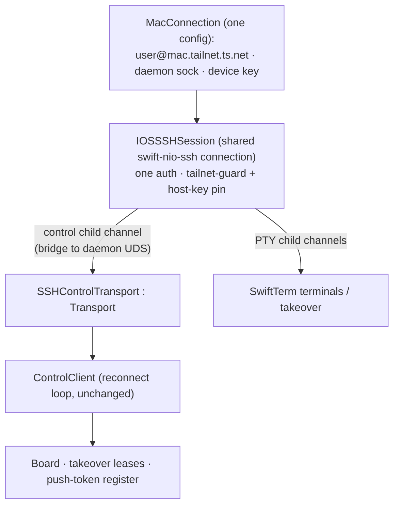

# iOS on a real phone — one setup, everything works

> Make the Orchestra iOS app usable on a **physical iPhone** against a Mac, with a **single first-launch
> setup** (one tailnet target) that lights up **every** feature — board, terminals, takeover, push — and
> a **re-setup** entry in Settings. No feature should require a second, separate setting.
>
> Realizes the [[phone-client/01-design|phone-client]] plan (SSH-forwarded UDS over Tailscale, no daemon
> change) for a real device. The `Transport` seam that plan depended on **now exists**
> (`OrchestraKit/Control/Transport.swift`); this design adds the iOS SSH transport, unifies config, and
> builds the onboarding.

## 1. Why the app doesn't run on a phone today

The board's control channel opens a **local UNIX socket** and never crosses the network:

```swift
// BoardModel.activate (iOS)
let sockPath = ConnectionSocketResolver.socketPath(for: conn)   // a LOCAL filesystem path
client = ControlClient(socketPath: sockPath, ...)
```

- **Simulator** works by *cheating*: it shares the Mac's filesystem, so `ORCH_DEV_SOCKET` points at the
  Mac's real `orchestrad.sock`.
- **Device** shares nothing with the Mac. `ConnectionSocketResolver` for a local connection falls back to
  `Config.socketPath`, which on iOS resolves *inside the app sandbox* → points at nothing. The comment says
  it outright: *"a real device needs T1's SSH-forwarded socket"* — **and that transport is not built.**

Consequences on a real phone right now: **board = Disconnected** (stale snapshot only); **terminal/takeover**
= unreachable because you reach it *through* the board; **push** = only the DEBUG local simulation exists.

## 2. The reference pattern already exists (desktop)

The macOS app already solves the identical problem for a remote Linux daemon, and it's the model to mirror:

- `SSHMaster` spawns **one** multiplexed `ssh -M` master that (a) **StreamLocal-forwards** the remote
  daemon UDS to a **local** UDS (`-L local.sock:remote.sock`) and (b) hosts a control socket that terminals
  ride — **one auth, one target, everything multiplexed** (`RemoteCommands.sshMasterArgs`).
- `ControlClient` then just opens that local socket via `UDSTransport`. `ConnectionController` owns the
  master and also exposes `remoteTerminalRoute` so terminals reuse the same master.

The phone can't fork `/usr/bin/ssh` (no `Process`, no OpenSSH on iOS). It must reproduce this with
**swift-nio-ssh** — which the app already vendors for the terminal PTY (`SSHPTYChannel`).

The two seams that make this cheap already exist:

- **`Transport` protocol** — `open()/write()/readLine()/close()`. Its own doc: *"a future WebSocket/tailnet
  transport plugs in here without touching `ControlClient`."* `ControlClient` takes a `@Sendable () ->
  Transport` factory and already has the **reconnect + resubscribe** loop.
- **swift-nio-ssh `directTCPIP`** child channels are first-class (`SSHMessages.swift`), alongside the
  session/PTY channels `SSHPTYChannel` already uses.

## 3. Target architecture

One shared, authenticated SSH connection to the Mac — the phone's `SSHMaster` equivalent — vends both the
control transport and terminal channels:



**One `MacConnection` config → one SSH session → all features.** The tailnet guard + host-key pin move to
**session establishment** (enforced once), instead of only at terminal-attach.

### 3a. Reaching the daemon UDS over SSH — the one real decision

swift-nio-ssh has `directTCPIP` but **not** `direct-streamlocal` (UDS forwarding) out of the box. Three ways
to bridge the SSH connection to the daemon's UNIX socket:

| Option | How | Verdict |
|---|---|---|
| **A. exec-bridge** *(recommended v1)* | Open a **session channel** that execs `nc -U <daemonSock>` (macOS ships `/usr/bin/nc` with `-U`; `socat` fallback). Channel stdio = the NDJSON control stream. | **No daemon change**, reuses the exec-session path `SSHPTYChannel` already has. Ship this first. |
| B. direct-streamlocal | Open a custom `direct-streamlocal@openssh.com` child channel to the daemon sock. | Cleanest/most native, but a custom channel type in swift-nio-ssh = more work. Good P2 upgrade. |
| C. directTCPIP + daemon TCP | Daemon also binds `127.0.0.1:<port>`; phone forwards via first-class `directTCPIP`. | Needs a **daemon change** (new listener) — avoid; conflicts with "UDS-only daemon, no new surface". |

Recommendation: **A now, B as a later hardening.** `SSHControlTransport.readLine()` gets a small NDJSON
line-buffer over inbound channel bytes (the `UDSTransport` uses `LineReader` over an fd; here we buffer
`SSHChannelData`). No `ControlClient` change.

## 4. Unified configuration (kills the second setting)

Collapse everything onto **one** `Connection` describing "my Mac over Tailscale":

- `sshTarget` = `user@mac.tailnet.ts.net` (or `100.64/10` IP) — tailnet-validated (reuse
  `SSHEndpoint.settingsRejectionReason`, shipped in the takeover fix).
- `remoteSocketPath` = the Mac daemon sock, **defaulted** to `~/Library/Application Support/Orchestra/orchestrad.sock`
  (user rarely edits).
- `identityFile` = the app's per-device key (already in `SSHKeyStore`, Keychain-backed) — implicit.

Then **derive, don't duplicate**:

- **`SSHEndpoint.resolve()`** returns the *active connection's* `sshTarget` (env override only for
  Simulator/dev). → **Remove the standalone `orch_ssh_target` setting** added in the takeover fix; fold it
  into the connection. *(This is the "don't make me set two things" requirement, made structural.)*
- **`ConnectionSocketResolver` / `BoardModel.activate` (iOS)** build an `SSHControlTransport` from the same
  connection instead of a bare local path.
- **Terminals** (`IOSTerminalHost`/`SSHPTYChannel`) take child channels from the shared session instead of
  dialing their own connection.
- **Push registration** (`PushCoordinator`) already flows the device token over `ControlClient` → works for
  free once the control channel is live.

## 5. Onboarding UX

**First launch** (gated on "no configured connection") — one screen, a guided checklist that ends green:

1. **Prerequisites** (with live checks where possible): Tailscale installed + logged in on **both** phone
   and Mac; **Remote Login** enabled on the Mac (System Settings → General → Sharing).
2. **Authorize this device**: show the device's SSH public key (`SSHKeyStore.authorizedKeyLine()`) with a
   **Copy** button and the exact one-liner to paste on the Mac:
   `echo '<key>' >> ~/.ssh/authorized_keys`.
3. **Enter the Mac's tailnet target**: `user@my-mac.tailnet.ts.net` — inline tailnet validation.
4. **Test connection**: establishes the SSH session + calls the `version` RPC → ✅ / actionable error
   (reuses the exact tailnet rejection reason on a bad host).
5. **Done** → persist the single `MacConnection`, mark onboarding complete, land on the board.

**Re-setup**: Settings → **"Mac connection"** row reopens the same flow (edit host/user, re-show/rotate the
key, re-test). This **replaces** the standalone SSH-target section from the takeover fix and folds the
existing Connection editor into one coherent surface — exactly one place to configure the Mac.

## 6. Change list (by component)

**New**
- `App-iOS/Terminal/IOSSSHSession.swift` — shared authenticated swift-nio-ssh connection (the phone's
  `SSHMaster`): connect (tailnet guard + host-key pin), vend control + PTY child channels, reconnect on
  foreground / tailnet change, tear down on background.
- `App-iOS/Terminal/SSHControlTransport.swift` — `Transport` conformer over an exec-bridge child channel
  (NDJSON line buffer). *(No `ControlClient` change.)*
- `App-iOS/Views/Onboarding/*` — the first-launch setup flow + "Mac connection" settings entry.

**Modified**
- `BoardModel.activate` (iOS `#if`) — build `ControlClient(transport:)` from `IOSSSHSession`, not a local path.
- `SSHEndpoint.resolve` — return the active connection's target; **remove `orch_ssh_target`** standalone key
  and the `TerminalTargetSettingsSection` (from the takeover fix), keeping the env fallback for Simulator.
- `IOSTerminalHost` / `SSHPTYChannel` — take child channels from `IOSSSHSession` (drop per-terminal connect).
- `ConnectionSocketResolver` — remote/iOS path returns/implies the SSH transport, not a filesystem path.
- Tailnet guard + `SSHHostKeyPinStore` — enforced at **session** establishment (covers control + terminals).
- App entry (`OrchestraApp`) — present onboarding when unconfigured.

**Unchanged (do not touch)**: `orchestrad` (stays UDS-only), the takeover lease/heartbeat path, the
`Transport`/`ControlClient` protocols, `TmuxAttach` recipe.

## 7. Non-code / operational (required for "on my phone")

- **Code signing**: an Apple Developer team + provisioning profile; register the device (or TestFlight). The
  build scripts currently use `CODE_SIGNING_ALLOWED=NO`/ad-hoc for the Simulator — add a signed device build
  lane (`scripts/build-ios-app.sh` device variant).
- **Entitlements**: keychain-sharing (present), add `aps-environment` for real push, background modes
  (remote-notification; consider background-fetch for reconnect).
- **APNs (real push, feature-complete)**: a `.p8` APNs auth key configured in the daemon's push sender; the
  device token already registers over the control channel. Can land as a fast-follow after board+terminal.

## 8. Verification

- **Unit**: `SSHControlTransport` line-framing over synthetic channel bytes; `resolve()` derives from the
  active connection; onboarding validation reuses `settingsRejectionReason` (extend `TransportTests`).
- **Loopback e2e**: extend `scripts/t4-takeover-verify.sh` — same throwaway sshd now also serves the
  **control** channel (`nc -U` bridge) so the board goes *live* over SSH with `ORCH_SSH_ALLOW_LOOPBACK=1`,
  no device needed. This is the key "board works over SSH" proof on the Simulator.
- **Real device (manual)**: install signed build on the iPhone over Tailscale to the Mac; run onboarding;
  confirm board live, terminal attaches, takeover works, a real push arrives.

## 9. Phasing

- **P1 — Board over SSH**: `IOSSSHSession` + `SSHControlTransport` (exec-bridge) + `BoardModel.activate`
  wiring. Board goes live on a device. *(Biggest chunk; unblocks everything.)*
- **P2 — Terminals on the shared session**: `SSHPTYChannel`/`IOSTerminalHost` reuse `IOSSSHSession`;
  `resolve()` derives from the connection; **delete `orch_ssh_target`**. Takeover works on a device.
- **P3 — Onboarding + re-setup UX**: first-launch flow, "Mac connection" settings, prereq checks.
- **P4 — Device build + real push**: signing lane, `aps-environment`, APNs `.p8`.

## 10. Open decisions (for the card owner)

1. **Control bridge**: `nc -U` (zero-install, but relies on macOS `nc`) vs bundle a tiny `socat` recipe vs
   go straight to `direct-streamlocal` (Option B). *Recommend `nc -U` for P1, B as hardening.*
2. **Connection model**: extend the existing `Connection` (add "this is my Mac over SSH" as a first-class
   local-over-tailnet kind) vs a new `MacConnection`. *Recommend extending `Connection` — reuse the desktop
   model and its editor.*
3. **Prereq detection depth**: how much can the app auto-detect (Tailscale up? Remote Login reachable?)
   before falling back to "here's the command, then press Test".
4. **Reconnect policy** across backgrounding / tailnet IP changes / sleep — reuse `ControlClient`'s loop but
   decide session-level backoff + when to surface "Disconnected" vs silently retry.
