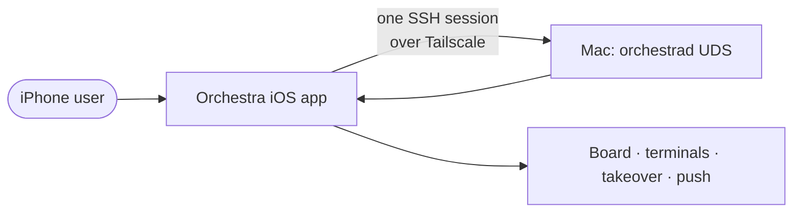
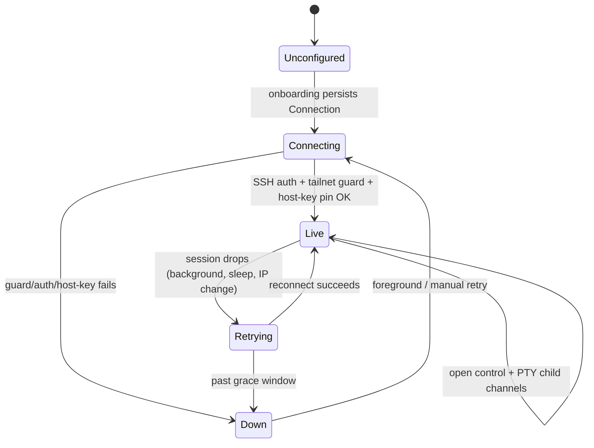

# Layer 1 — Initial Design: iOS on a real phone

> The **what**, not the how. Full spec: [[ios-real-device-onboarding-and-transport]]. This layer
> pins the goals, scope, behaviour, and the P1–P4 arc so the contract layer has a fixed target.

## Purpose & problem

The iOS app works only in the Simulator, which *cheats*: it shares the Mac's filesystem, so the
board's control channel opens the Mac's real `orchestrad.sock` directly. A physical iPhone shares
nothing — `BoardModel.activate` (iOS) resolves a socket path *inside the app sandbox* that points at
nothing. Result on a device: **board = Disconnected**; terminals and takeover unreachable (you reach
them *through* the board); push is DEBUG-simulation only.

The fix the macOS app already models: **one** authenticated SSH connection to the Mac over Tailscale
that carries everything. The phone can't fork `/usr/bin/ssh`, so it reproduces this in-process with
swift-nio-ssh (already vendored for the terminal PTY). The user requirement on top: **one setup** —
a single tailnet target — lights up every feature, with no second setting anywhere.

## Goals / non-goals

**Goals**
- **Board live on a real device** over one SSH session to the Mac.
- **Terminals + takeover** ride the *same* session (no per-terminal dial).
- **One config** — a single `Connection` ("my Mac over Tailscale") drives board, terminals, push.
- **Guided first-launch onboarding** that ends green, plus a Settings re-setup entry.
- **Real push** on device (APNs), as a fast-follow after board + terminals.

**Non-goals**
- **No `orchestrad` *transport* change** — UDS-only, no new listener/RPC (P1–P2). *(P4 push adds a
  ~30-line daemon env-injection exception — see P4 below.)*
- **No `Transport`/`ControlClient` protocol change** — reuse the existing `transport:` factory seam.
- **No nio-ssh fork** — `direct-streamlocal` is out of scope; use the exec-bridge.
- **No multi-Mac / fleet** — exactly one Mac connection per phone for v1.
- **No real APNs push (v1)** — free Apple ID has no Push capability; needs-you alerts come via the
  Claude/Codex apps. P4 push is optional/paid and deferred.

## Scope

| In scope | Out of scope |
|----------|--------------|
| `IOSSSHSession` (shared SSH connection), `SSHControlTransport` (exec-bridge) | New daemon listeners or RPCs |
| iOS `BoardModel.activate` rewire to an SSH transport | Desktop `SSHMaster`/`ConnectionController` (macOS path unchanged) |
| Fold terminals onto the shared session; delete standalone `orch_ssh_target` | Rewriting the `Transport`/`ControlClient` contracts |
| Onboarding + "Mac connection" settings; extend `Connection` (`.remote` reuse) | A new `MacConnection` type |
| Signed device build lane, `aps-environment`, APNs `.p8` (P4) | Android / non-Apple clients |

## Inputs & outputs

| Direction | Description | Type / shape | Notes |
|-----------|-------------|--------------|-------|
| Input | Tailnet SSH target | `user@mac.tailnet.ts.net` | Tailnet-validated (`settingsRejectionReason`) |
| Input | Per-device SSH identity | Ed25519 key in Keychain | `SSHKeyStore`, implicit; never leaves device |
| Input | Daemon socket path | defaulted `~/Library/Application Support/Orchestra/orchestrad.sock` | rarely edited |
| Output | Live control stream | NDJSON frames over an SSH `.session` exec channel | via `nc -U daemon.sock` |
| Output | Terminal / takeover PTYs | swift-nio-ssh `.session` child channels | from the same shared session |
| Output | Push registration | device token over `ControlClient` | rides the live control channel |

## Expected behaviour

The connection is **stateful**; the phone's session mirrors `ControlClient`'s existing
`connecting → live → retrying → down` model but at the *session* layer, so one guard + one host-key
check cover both the control channel and every terminal.

| Situation | Behaviour |
|-----------|-----------|
| First launch, no connection | Onboarding checklist; ends by persisting one `Connection`, lands on live board |
| Session established | Board streams live; terminals/takeover open child channels; push registers |
| App backgrounded → foreground | Reconnect eagerly; silent retry with backoff; brief grace before "Disconnected" |
| Tailnet IP change / Mac sleep | Session drops → retry loop; board shows "Disconnected" only past the grace window |
| Bad / non-tailnet target | Rejected at setup with the exact tailnet reason; Test never green until fixed |

## The P1–P4 arc (sequencing axis)

| Phase | Delivers | Depends on |
|-------|----------|-----------|
| **P1** | `IOSSSHSession` + `SSHControlTransport` (exec-bridge) + `activate` rewire → **board live** | — |
| **P2** | Terminals/takeover reuse the session; **delete `orch_ssh_target`**; guard+pin move to session | P1 |
| **P3** | Onboarding + "Mac connection" re-setup; prereq checks; **free-personal-team device build** (strip `aps-environment`) — installs P1–P3 on a real iPhone | P1 (P2 for terminal test) |
| **P4** *(optional, paid-only, deferred)* | Paid signed lane; re-add `aps-environment`; daemon `ORCH_APNS_*` env-injection + drop-logging; owner `.p8`. **Not pursued** — no paid membership | P1 (push rides control) |

**Already landed on the base branch** (`mobile-impl-orchestration`) — plan around, don't rebuild:
- **#4 SSH-target settings surface** (`SettingsSecurity.swift`, `SSHEndpoint.resolve` reads
  `targetDefaultsKey`) — this is exactly what **P2 folds** into the unified `Connection`.
- **#3 guarded `listDir` RPC** (`DirListing.swift`: `assertAllowed`, no `..` escape) — the **model** to
  copy if any phase needs a new real-device-safe daemon RPC.
- **#5 push send+receive** proven end-to-end (see P4 / [[ios-real-device-onboarding-and-transport]] §7).

## Complexity & risks

| Area | Risk | Mitigation |
|------|------|-----------|
| Exec-bridge framing | NDJSON line-buffering over `SSHChannelData` chunks (partial frames) | Mirror `UDSTransport`'s `LineReader`; unit-test framing over synthetic bytes |
| `nc` availability | Mac lacks/moves `/usr/bin/nc` | `socat` fallback; surface an actionable error on exec failure |
| Session ↔ ControlClient | Reconnect races between session layer and `ControlClient`'s own loop | Session owns transport liveness; `ControlClient` re-mints transport per attempt (existing) |
| Terminal fold (P2) | Regressing the working per-terminal path | Land P1 first; fold behind the same guard/pin, verified by the loopback harness |
| Free-tier device build (P3) | `aps-environment` in the single entitlements file → **free signing fails**; 7-day profile expiry | Split entitlements — no-push variant strips `aps-environment`, keeps `keychain-access-groups`; re-deploy weekly |
| Push provisioning (P4, optional) | Deferred, paid-only. If pursued: launchd daemon never sees `ORCH_APNS_*`; env mismatch drops tokens | Out of scope now; if paid: inject env in `install()`/plist + drop-logging; send/receive already proven |

## Diagrams

### Bird's-eye (context)

### Detailed (session lifecycle — stateful)

## Decisions made

| Decision | Why | Rejected |
|----------|-----|----------|
| Base branch on takeover-fix tip (reset) | Lossless (no own commits); zero conflicts vs 122-commit merge | True merge (221-file daemon conflicts now) |
| Control bridge = exec-bridge (`nc -U` + `socat` fallback) | No daemon change, no nio-ssh fork; reuses exec path | `direct-streamlocal` (nio-ssh fork); daemon TCP listener |
| Extend `Connection`, reuse `.remote` kind | Platform `#if` already means "reach daemon over SSH"; no new type | New `MacConnection`; new `.mac` kind |
| Reconnect: session backoff + grace before "Disconnected" | Fail-safe; reuse `ControlClient`'s loop | Instant "Disconnected"; manual-only retry |
| Prereq detection = best-effort, non-blocking | `version` RPC on Test proves the whole chain | Hard auto-detect gate that can block setup |
| One session vends control + PTY; guard/pin at session | One auth, one guard, one pin covers all features | Per-terminal dial (today's per-channel guard/pin) |
| No paid Apple membership → free device build; push optional | Owner won't buy; needs-you alerts via Claude/Codex apps | Paid signed lane + real APNs push (P4), deferred; third-party push (ntfy/Pushover) |

## Open questions — need your call

- [ ] None blocking. Contract-layer specifics (exact `IOSSSHSession` API surface, where the exec
      command string is built) are proposed in [[02-contract]] for review.
