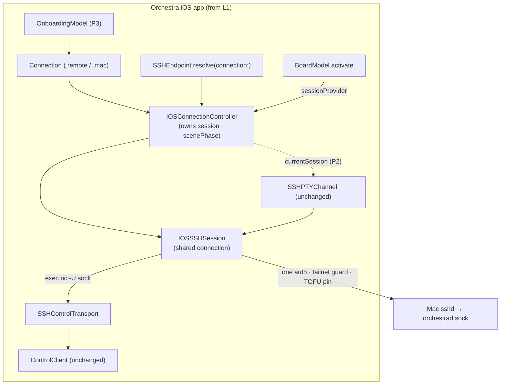
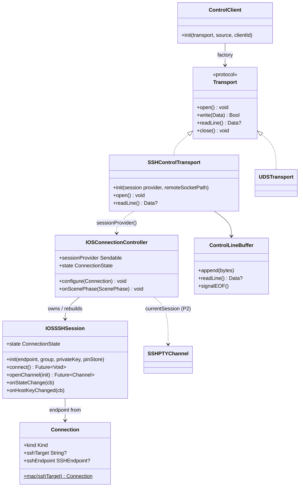

# Layer 2 — Contractual Design: iOS on a real phone

> The **interfaces**. Signatures are proposed contracts, grounded in the real seams (verbatim shapes
> confirmed against the code). Detail: [[01-design]] · full spec [[ios-real-device-onboarding-and-transport]].

## Architecture overview

One `IOSSSHSession` owns a single authenticated swift-nio-ssh connection to the Mac and **vends child
channels** to two very different consumers. The board's control path wraps a child channel in
`SSHControlTransport` (a `Transport`), which the **unchanged** `ControlClient` drives via its existing
`transport:` factory. Terminals/takeover wrap child channels in the **unchanged** `SSHPTYChannel` PTY
path. The session is the *only* place SSH auth, the tailnet guard, and TOFU host-key pinning happen —
once per connection, covering every channel.

A dedicated **`IOSConnectionController`** (the iOS analog of desktop's `ConnectionController`) **owns**
the session, keyed to the active `Connection`: it builds/rebuilds it, observes `scenePhase` to drive
foreground-reconnect once, and **vends the _current_ session** to both `BoardModel` and
`IOSTerminalHost`. `BoardModel.activate` delegates to it (mirroring desktop).

**Invariant — read `controller.currentSession` lazily; never cache a session instance.** The session is
rebuilt on reconnect / connection-switch, so a cached reference goes stale across background→foreground
(iOS suspends the app and kills the socket every time). `ControlClient` already re-mints the transport
per reconnect, so its factory closure reading the current session satisfies this for free; terminals do
the same.

**The central constraint** (confirmed): `Transport` is `Sendable` + **blocking** `readLine()`;
`TerminalByteChannel` is `@MainActor` + async callbacks. They have opposite concurrency models, so
`SSHControlTransport` is **not** a terminal channel — both are independent consumers of the session's
thread-safe `createChannel`-style API.

## Major classes / modules

| Name | Responsibility | Collaborators |
|------|----------------|---------------|
| `IOSSSHSession` *(new)* | One shared SSH connection: connect-once, tailnet guard + host-key pin at establishment, vend control/PTY child channels, state + host-key event fan-out, reconnect | `NIOSSHHandler`, `PubkeyAuthDelegate`, `PinningHostKeyDelegate`, `SSHKeyStore`, `SSHHostKeyPinStore`, `EventLoopGroup` |
| `SSHControlTransport : Transport` *(new)* | Wrap one control child channel (`exec nc -U <sock>`); blocking NDJSON `readLine()` over NIO-fed bytes | `IOSSSHSession`, `ControlClient` (via factory), `ControlLineBuffer` |
| `ControlLineBuffer` *(new, small)* | Thread-safe NDJSON line buffer fed by `channelRead`, drained by blocking `readLine()` | `SSHControlTransport` |
| `IOSConnectionController` *(new)* | Own `IOSSSHSession` keyed to the active `Connection`; observe `scenePhase` → foreground-reconnect; vend `currentSession` to board + terminals | `IOSSSHSession`, `BoardModel`, `IOSTerminalHost` |
| `Connection` *(extend)* | Add a `.mac(sshTarget:)` factory + default Mac socket path + `sshEndpoint` derivation | `SSHEndpoint`, `ConnectionStore` |
| `SSHEndpoint.resolve` *(change)* | Derive endpoint from the **active `Connection`**, not `orch_ssh_target` (P2 deletes the key) | `Connection`, `IOSConnectionController` |
| `BoardModel.activate` (iOS) *(change)* | Build `ControlClient(transport:)` whose factory reads the controller's current session; **delegate** session lifecycle to the controller | `IOSConnectionController`, `SSHControlTransport`, `ControlClient` |
| `IOSTerminalHost` *(change, P2)* | Vend PTY channels from `controller.currentSession` instead of per-terminal dial | `IOSConnectionController`, `SSHPTYChannel` |
| `OnboardingModel` + views *(new, P3)* | First-launch guided setup; persist one `Connection`; Test via session + `version` RPC | `SSHKeyStore`, `SSHEndpoint.settingsRejectionReason`, `IOSSSHSession`, `ConnectionStore` |
| Entitlements split *(new, P3)* | No-push `.entitlements` variant so free-tier device signing succeeds | `project.yml` build config |

## Function / method contracts

### `IOSSSHSession` (new — `App-iOS/Terminal/IOSSSHSession.swift`)

```swift
final class IOSSSHSession: @unchecked Sendable {
    init(endpoint: SSHEndpoint, group: EventLoopGroup,
         privateKey: NIOSSHPrivateKey, pinStore: SSHHostKeyPinStore = .init())

    var state: ConnectionState { get }                          // connecting/live/retrying/down
    func onStateChange(_ cb: @escaping @Sendable (ConnectionState) -> Void)   // multi-subscriber
    func onHostKeyChanged(_ cb: @escaping @Sendable (String) -> Void)         // multi-subscriber

    func connect() -> EventLoopFuture<Void>                     // idempotent connect-once
    func openChannel(_ init: @escaping (Channel) -> EventLoopFuture<Void>)
        -> EventLoopFuture<Channel>                            // vends a .session child channel
    func close()                                               // tears down the whole connection
}
```
- **Does:** establishes ONE `.connect()` + `NIOSSHHandler` (hoisting the first half of `SSHPTYChannel.start`); enforces the tailnet guard + TOFU pin at establishment; vends `.session` child channels via the handler's `createChannel` (hopped onto the parent event loop).
- **Inputs:** an `SSHEndpoint`, the **shared injected** `TerminalRuntime.group`, the device key, a pin store.
- **Outputs:** child `Channel`s; connection `state`; host-key-changed events.
- **Side-effects / errors:** connect-once via internal state/refcount; on drop → `.retrying` with backoff, re-establish; `HostKeyChangedError` / auth failure surface as `.down` + fan-out. **`close()` only when the last consumer leaves** (board + terminals share it).
- **Reuses:** `PubkeyAuthDelegate`, `PinningHostKeyDelegate`, `ChannelBox` write path, `HostKeyGate` — all lifted verbatim from `SSHPTYChannel.swift`, but the host-key event goes to the session's fan-out, not a single terminal `bridge`.

### `SSHControlTransport` (new — `App-iOS/Terminal/SSHControlTransport.swift`)

```swift
final class SSHControlTransport: Transport, @unchecked Sendable {
    // Provider (not an instance) — reads the CURRENT session per (re)open; enforces "never cache".
    init(session: @escaping @Sendable () -> IOSSSHSession?, remoteSocketPath: String)
    func open() throws            // guard let s = session() else throw; s.connect().wait(); openChannel → exec nc -U <sock>
    func write(_ data: Data) -> Bool
    func readLine() -> Data?
    func close()                  // close THIS control channel only — never the shared session
}
```
- **Does:** opens a non-PTY `.session` child that execs the control bridge (`nc -U <sock>`, `socat` fallback), yielding a raw NDJSON byte stream over stdio.
- **`open()`:** synchronous (called **off the main actor** by `ControlClient.openOnce`); reads `session()` fresh each time (the controller's thread-safe accessor), then `future.wait()` is safe. Throws if no session or it can't establish → `ControlClient` retries.
- **`write`:** `writeAndFlush(SSHChannelData(type:.channel, data:.byteBuffer))` on the channel loop; `false` when broken. **`readLine()`:** blocks on `ControlLineBuffer` for the next line (minus `\n`), `nil` on EOF/`channelInactive`. Only `.channel` (stdout) bytes count; `.stdErr` is diagnostic.
- **Lifecycle:** `ControlClient` re-mints the transport per reconnect (factory confirmed re-invoked), so each instance owns one exec channel; on EOF → `nil` → `ControlClient` reconnects → new transport → new channel on the **same** session.
- **Command shape (L3):** a login-shell wrapper (`sh -lc 'exec nc -U "$S" || exec socat - UNIX-CONNECT:"$S"'`) so `~` expands on the Mac and `socat` falls back. Exact string is Layer-3 mechanics.

### `Connection` extension (change — `Sources/OrchestraKit/Connection.swift`)

```swift
extension Connection {
    static let defaultMacSocketPath = "~/Library/Application Support/Orchestra/orchestrad.sock"
    static func mac(sshTarget: String, name: String = "My Mac",
                    remoteSocketPath: String = defaultMacSocketPath) -> Connection   // kind: .remote
    var sshEndpoint: SSHEndpoint? { get }   // SSHEndpoint(target: sshTarget)
}
```
- Reuses `.remote` kind (decision from L1). `identityFile` stays nil on iOS — the key is implicit via `SSHKeyStore`. `~` expands remotely inside the exec shell.

### `SSHEndpoint.resolve` (change — `App-iOS/Terminal/SSHEndpoint.swift`)

```swift
// Target end-state (P2): derive from the active connection; remove orch_ssh_target.
static func resolve(connection: Connection?,
                    env: [String: String] = ProcessInfo.processInfo.environment) -> SSHEndpoint?
```
- **P1:** the board derives its endpoint from `connection.sshEndpoint` directly; the old `resolve(env:defaults:)` (reading `orch_ssh_target`) stays for terminals **transiently**.
- **P2:** terminals switch to `resolve(connection:)`; **delete `targetDefaultsKey`/`orch_ssh_target`** and `TerminalTargetSettingsSection`; keep the tailnet guard + the DEBUG loopback allowance (`ORCH_SSH_ALLOW_LOOPBACK`).

### `IOSConnectionController` (new — `App-iOS/Terminal/IOSConnectionController.swift`)

```swift
@MainActor
final class IOSConnectionController: ObservableObject {
    init(group: EventLoopGroup = TerminalRuntime.group)
    @Published private(set) var state: ConnectionState

    func configure(_ conn: Connection)      // (re)build IOSSSHSession for conn.sshEndpoint; tear down old
    func onScenePhase(_ phase: ScenePhase)  // .active → reconnect if down; .background → note suspension
    func teardown()                         // connection removed / non-remote → drop session

    // Thread-safe accessor for off-main consumers (the ControlClient factory). Backed by a
    // lock-guarded box the controller updates on the main actor.
    var sessionProvider: @Sendable () -> IOSSSHSession? { get }
}
```
- **Does:** the single owner of `IOSSSHSession` for the active connection — the iOS analog of desktop
  `ConnectionController`. Rebuilds the session on connection-switch, observes `scenePhase` to reconnect
  once on foreground, and exposes `sessionProvider` (a `@Sendable` closure over a lock-guarded box) so
  the control factory + terminals read the **current** session without caching it.
- **Owned by** `BoardModel` (or injected alongside it) and shared into the environment for
  `IOSTerminalHost` (P2). `state` mirrors the session for the board's "Disconnected" UI.

### `BoardModel.activate` (iOS) (change — `Sources/OrchestraUI/BoardModel.swift`)

```swift
// #if !os(macOS) branch — delegates session lifecycle to the controller
public func activate(_ conn: Connection) async {
    client.close()
    if conn.kind == .remote, conn.sshEndpoint != nil {
        controller.configure(conn)                                   // controller owns/rebuilds the session
        let provider = controller.sessionProvider                    // capture the PROVIDER, not a session
        let sock = conn.remoteSocketPath ?? Connection.defaultMacSocketPath
        client = ControlClient(transport: {
            SSHControlTransport(session: provider, remoteSocketPath: sock)
        }, source: .app, clientId: clientId)
    } else {
        let sock = ConnectionSocketResolver.socketPath(for: conn)    // Simulator / ORCH_DEV_SOCKET path
        client = ControlClient(socketPath: sock, source: .app, clientId: clientId)
    }
    wireState(); streamStarted = false; await start()
}
```
- **Delegates** session lifecycle to `controller`; captures `sessionProvider` (stable) in the factory, so
  reconnects read the current session. `wireState()`/`clientId` unchanged; the Simulator/dev path is
  preserved via `ConnectionSocketResolver`.

### Onboarding (new, P3 — `App-iOS/Views/Onboarding/*`)

`OnboardingModel`: steps = prereqs → authorize device (`SSHKeyStore.authorizedKeyLine()` + copy) → enter
target (`settingsRejectionReason` inline) → **Test** (`IOSSSHSession.connect()` + `version` RPC) → persist
`Connection.mac(sshTarget:)`. Gate at launch on "no configured connection" (none exists today —
`OrchestraApp` always activates). Settings "Mac connection" row reopens the flow, **replacing**
`TerminalTargetSettingsSection`; `SecuritySettingsSection` re-sources `host` from the active connection.

## Library / framework decisions

| Decision | Choice | Rationale | Alternatives considered |
|----------|--------|-----------|-------------------------|
| SSH stack | swift-nio-ssh (`NIOSSH`, already vendored) | Reused from `SSHPTYChannel`; `createChannel` supports N child channels per handler | Fork for `direct-streamlocal` (rejected, L1) |
| UDS reach | exec `nc -U` (`.session` + `ExecRequest`, no PTY) | No daemon change; `directTCPIP` can't reach a UNIX socket | `directTCPIP`+daemon TCP; nio-ssh fork |
| Blocking `readLine` over async NIO | `ControlLineBuffer` (lock + condvar), fed by `channelRead`, drained by `readLine()` | `Transport.readLine()` is synchronous; NIO delivers async on the loop | `LineReader` (fd-only, doesn't fit a NIO channel) |
| Event loop | Shared injected `TerminalRuntime.group` (1-thread MTELG) | Session + control + PTYs share one loop; no new threads | Per-session group (more threads) |
| Session ownership | Dedicated `IOSConnectionController` owns it | Faithful desktop `ConnectionController` mirror; one place for `scenePhase`/reconnect; vends current session | `BoardModel`-owned (conflates board UI + SSH lifecycle; diverges from desktop) |
| Consumers read session via `@Sendable` provider | Off-main `ControlClient` factory can't touch `@MainActor` controller; box enforces "never cache" | Structural, not convention | Pass a session instance (goes stale on reconnect) |

## Diagrams

### Bird's-eye (components) — opening the L1 "iOS app" box



### Detailed (classes)



## Traceability → Layer 1

| L1 goal | Covered by |
|---------|-----------|
| Board live on device over one SSH session | `IOSSSHSession` + `SSHControlTransport` + `BoardModel.activate` rewire |
| Terminals + takeover ride the same session | `IOSSSHSession.openChannel` vended to `IOSTerminalHost` (P2) |
| One config drives everything | `Connection.mac(sshTarget:)` + `SSHEndpoint.resolve(connection:)`; delete `orch_ssh_target` |
| Guided onboarding + Settings re-setup | `OnboardingModel` + views; replace `TerminalTargetSettingsSection` |
| Free-tier device install | Entitlements split (no-push variant) via `project.yml` |
| Real push (optional/deferred) | Out of P1–P3 scope; parked in [[01-design]] P4 |
| No daemon/transport change | exec-bridge; `ControlClient`/`Transport` unchanged; `orchestrad` untouched |
| Guard + pin enforced once | Moved into `IOSSSHSession` establishment (was per-terminal) |

## Decisions made

| Decision | Why | Rejected |
|----------|-----|----------|
| `SSHControlTransport` separate from `TerminalByteChannel` | Opposite concurrency models (Sendable+blocking vs @MainActor+async) | One type conforming to both |
| Session vends child channels; consumers own handlers | `createChannel` is N-per-handler; keeps PTY path intact | Session owning terminal logic |
| `ControlLineBuffer` (lock+condvar) for blocking readLine | Bridge NIO async delivery to sync `Transport` | Reuse fd-based `LineReader` (doesn't fit) |
| Dedicated `IOSConnectionController` owns the session | Faithful desktop mirror; one home for `scenePhase`/reconnect; no board/SSH conflation | `BoardModel`-owned (in-process, no orphan-process benefit on iOS; stale-ref risk) |
| Consumers read session via `@Sendable` provider (never cache) | Session rebuilds on reconnect/switch; off-main factory needs thread-safe read | Capture a session instance (goes stale across background→foreground) |
| Host-key/state as multi-subscriber fan-out on the session | One connection, many consumers (was one terminal `bridge`) | Per-consumer delegate |
| P1 board-only; terminals fold in P2 | Smaller P1, board unblocks everything | Migrate terminals in P1 too |

## Refinement during implementation (2026-07-06)

**Module boundary:** `BoardModel` (OrchestraUI) has **no NIOSSH dependency** — the SSH types live in
`App-iOS`. So `BoardModel.activate` cannot directly build `SSHControlTransport`/`IOSConnectionController`.
Resolved by **dependency inversion**:

- New seam in OrchestraKit: `@MainActor protocol RemoteControlTransportProvider { func controlTransportFactory(for: Connection) -> (@Sendable () -> Transport)? }`.
- `IOSConnectionController` (App-iOS) **conforms** to it; `configure`s the session and returns the factory.
- **`OrchestraApp` (App-iOS) owns** the controller as a `@StateObject`, injects it into `BoardModel`
  (as the provider), and wires `scenePhase` → `controller.onScenePhase`.
- `BoardModel.activate`: `if let factory = provider?.controlTransportFactory(for: conn) { ControlClient(transport: factory) } else { …socketPath… }`.

This *refines* "BoardModel owns the session" → **OrchestraApp owns the controller; BoardModel consumes it
via the provider seam.** Ownership/lifecycle semantics are unchanged (controller still owns the session,
lazy provider, `scenePhase` reconnect); only the wiring point moves to respect the module graph.

## Open questions — need your call

- [ ] None blocking. Session ownership resolved → dedicated `IOSConnectionController` (see Decisions).
      Remaining specifics (exact exec-command wrapper, `ControlLineBuffer` blocking mechanics,
      `scenePhase` wiring point) are Layer-3 mechanics.
